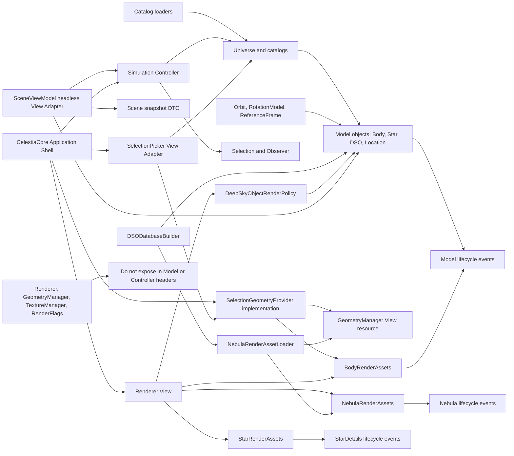
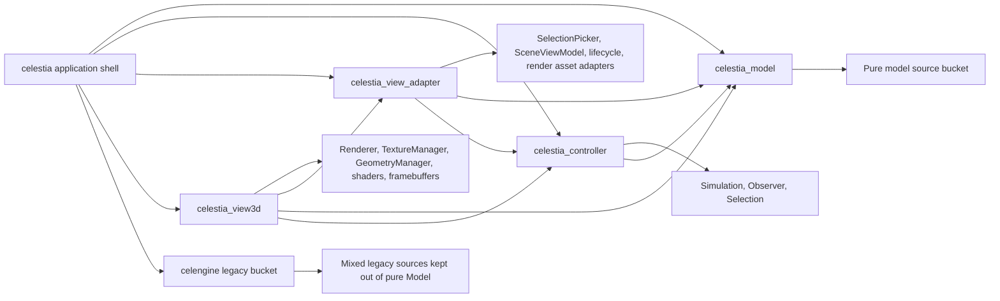
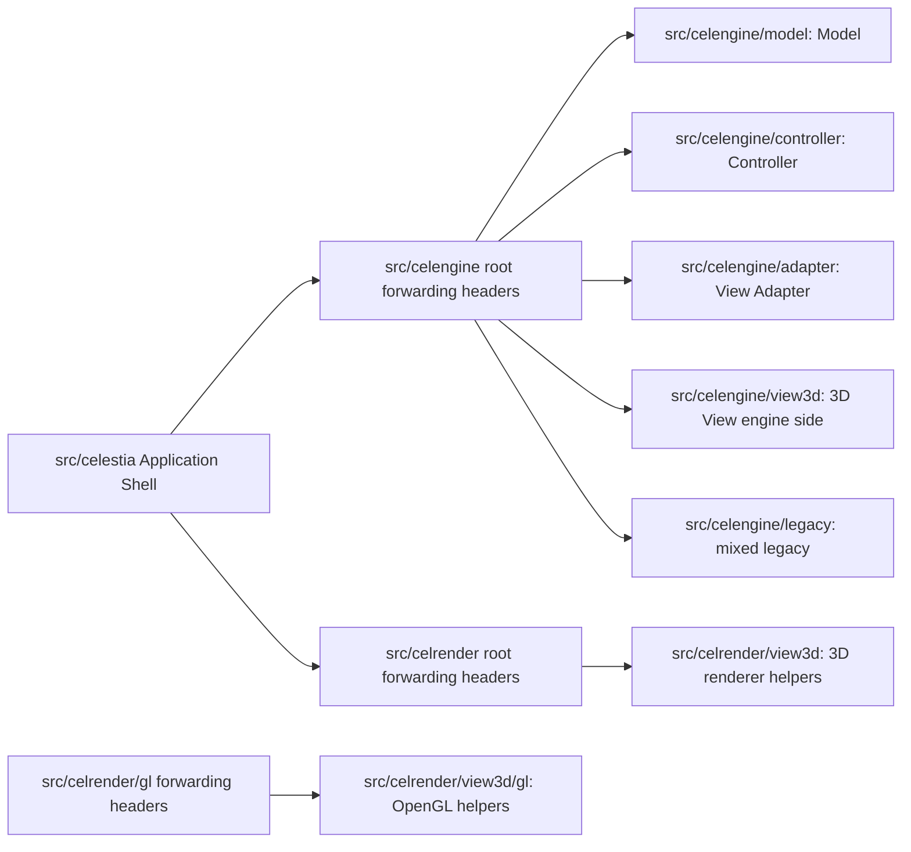
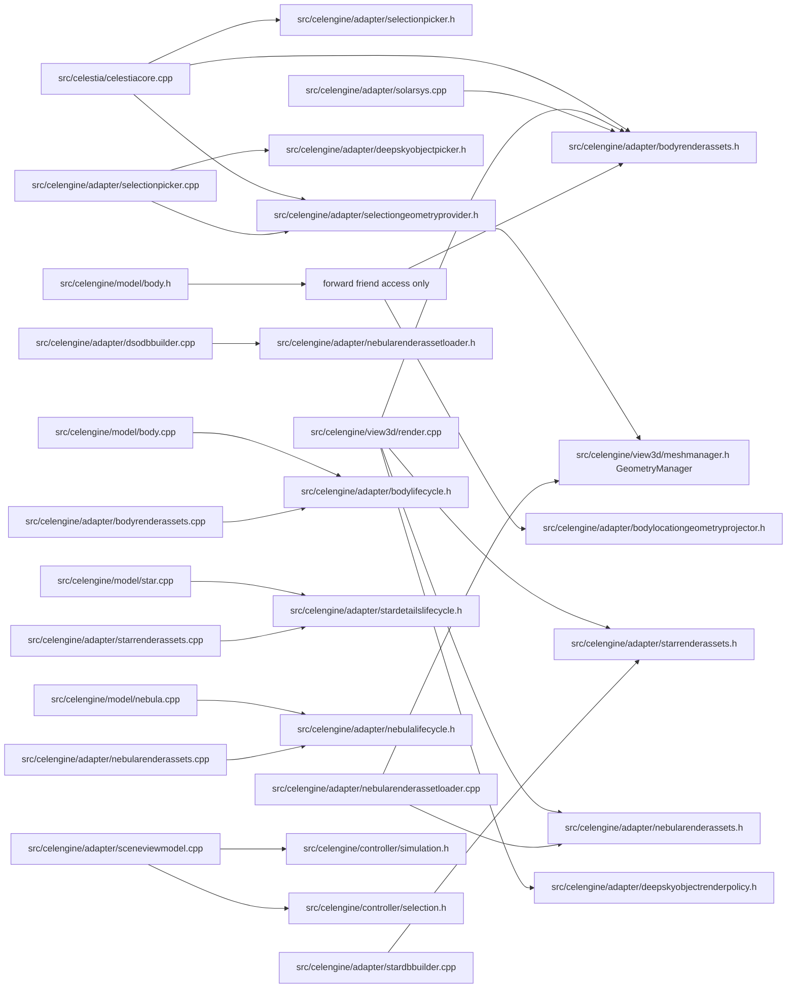
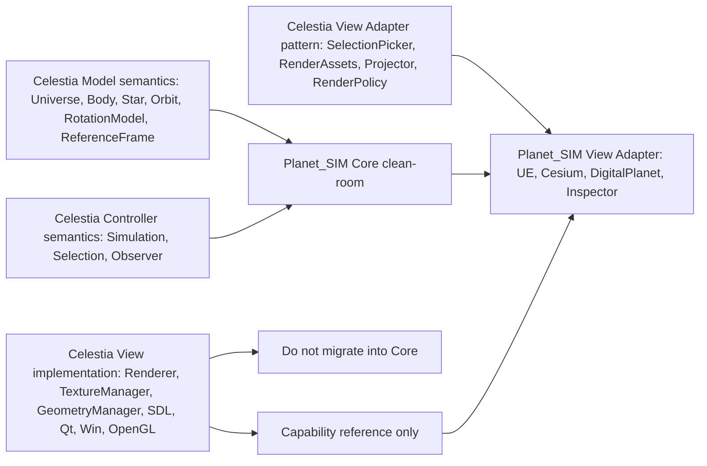

# Celestia 标准 MVC 解耦与迁移映射说明

## 1. 文档目的

本文记录 Celestia 本仓库 Step 1、Step 2、Step 3、Step 4 的 MVC 解耦结果，并为后续迁移提供类来源、依赖证据和剥离边界。Step 1 的完成口径是 Celestia 源码内完成 Model / Controller / View 边界收缩、构建出可运行程序、全量测试通过；Step 2 的完成口径是在 Celestia 本仓库内继续剥离 Model 实现层与具体 View Adapter / 渲染资产的耦合；Step 3 的完成口径是通过 CMake object target、source ownership bucket 和边界测试固化进程内 MVC 的物理构建边界；Step 4 的完成口径是把 Step3 ownership bucket 落入真实源码目录，并保留 public include forwarding header 兼容。后续 Planet_SIM clean-room 迁移基于 Step1 / Step2 / Step3 / Step4 形成的边界另行启动，不再称为 Step2、Step3 或 Step4。

## 2. Celestia 源码参考快照

当前实现分支为 `codex/celestia-mvc-step3`，工作区为 `D:/WorkSpace/Codex/CeleNew/.worktrees/celestia-mvc-step1`。工作区目录名沿用 Step1 创建时的名称，但当前分支已承载 Step3 / Step4 代码。参考主链为：

```text
Catalog loaders
-> Universe
-> StarDatabase / SolarSystemCatalog / DSODatabase
-> SolarSystem / PlanetarySystem
-> Body / Star / DeepSkyObject / Location
-> Timeline / Orbit / RotationModel / ReferenceFrame
-> Simulation / Observer / Selection
-> View Adapter
-> Renderer
```

## 3. MVC 解耦规则

| 层 | 规则 |
| --- | --- |
| Model | 保存天体、目录、轨道、姿态、层级、可选特征和查找语义；模型头文件不暴露 `Renderer`、`RenderFlags`、`GeometryManager` 或主渲染资产句柄 |
| Controller | 负责时间、观察者、选择、导航和运行态状态推进；不转发渲染，不持有拾取所需的 View 资源 |
| View Adapter | 在模型数据和 View 资源之间做转换，例如拾取、渲染资产读取、位置几何投影和渲染标志策略 |
| View | `Renderer`、`TextureManager`、`GeometryManager`、OpenGL、SDL/Win/Qt 前端、贴图和网格加载 |
| Application Shell | `CelestiaCore` 编排输入、模拟、渲染和 View Adapter，不作为 Planet_SIM Core 直接迁移对象 |

### 3.1 分层依赖总图

下图中的箭头表示 Step 1 后允许保留的编译依赖或运行时编排方向。Model / Controller 的 public header 不得反向暴露 View 资源；需要 View 资源的行为统一落在 View Adapter 或 Application Shell。



### 3.2 Step3 构建 target 依赖图

下图表达 Step3 后由 CMake 固化的物理构建边界。它不表示 M / C / V 已经是独立 OS 进程；它表示当前仓库内进程内 MVC 的 source bucket 和 object target 已可审查、可测试。



Step3 的关键取舍是：`solarsys.*`、`stardbbuilder.*`、`dsodbbuilder.*` 仍承担模型加载与渲染资源绑定的混合职责，因此归入 `celestia_view_adapter`；`galaxy.*`、`globular.*`、`marker.*` 仍有渲染状态或渲染方法，因此暂留 `CELESTIA_LEGACY_ENGINE_SOURCES`，避免污染纯 `celestia_model` target。目录搬迁已在 Step4 落地。

### 3.2.1 Step4 源码目录物理重组边界

Step4 已解决源码目录落点问题，不改变 Step3 已固化的 target ownership，也不引入 M / C / V 独立进程。进程边界、IPC / RPC 和消息协议统一保留为 Step5。

Step4 的搬迁对象限定为：

| 目录 | Step4 处理方式 | 目标 |
| --- | --- | --- |
| `src/celengine` | 按 Step3 source bucket 拆成 `model` / `controller` / `adapter` / `view3d` / `legacy` 子目录 | 让混杂的核心运行时源码在物理目录上反映 MVC ownership |
| `src/celrender` | 将 renderer helper 移入 `view3d` 子目录，OpenGL helper 移入 `view3d/gl` | 让 3D View helper 不再表现为无归属的大桶 |

Step4 不搬迁以下目录：

| 目录 | 原因 |
| --- | --- |
| `src/celestia` | Application Shell 和 SDL / Qt / Win32 前端入口，负责运行时编排，不是 Model 目录 |
| `src/celmath`、`src/celastro`、`src/celephem` | 数学、天文计算和星历支撑库，可被 Model 消费，但不属于本次 Celestia MVC 目录重组对象 |
| `src/celimage`、`src/celmodel`、`src/cel3ds`、`src/celttf` | 资源、模型、字体相关支撑库，后续可单独审查，不与 Step4 混做 |
| `src/celutil`、`src/celcompat`、`src/celscript`、`src/tools` | 通用工具、兼容层、脚本集成和离线工具，不纳入 Step4 |

Step4 的 public include 兼容策略是：真实实现头进入分层目录，`src/celengine`、`src/celrender` 和 `src/celrender/gl` 根路径保留轻量 forwarding header。例如 `src/celengine/model/body.h` 是真实 Model 头，`src/celengine/body.h` 只保留 `#include "model/body.h"`；`src/celrender/view3d/ringrenderer.h` 是真实 View3D helper 头，`src/celrender/ringrenderer.h` 只保留 `#include "view3d/ringrenderer.h"`。这样可以避免在同一个阶段同时修改全仓 public include API。

### 3.2.2 Step4 物理目录关系图

下图表达 Step4 后的源码物理落点。根目录 forwarding header 只服务兼容，不再承载真实 `.cpp` 实现。



### 3.3 核心类依赖变化图

本图只表达本次 Step 1 拆除和迁出的关键依赖，不等同于完整 C++ include graph。`Before` 节点表示原始混杂点，`After` 节点表示更新后的边界落点。

```mermaid
graph TB
    OldSimulation["Before Simulation"] --> OldRenderer["Renderer, RenderFlags, pickObject"]
    OldUniverse["Before Universe"] --> OldPicking["GeometryManager, pickPlanet, pickStar, pickDeepSkyObject"]
    OldBody["Before Body"] --> OldBodyAssets["GeometryHandle, Surface, alternate surface, ring texture"]
    OldStar["Before Star and StarDetails"] --> OldStarAssets["TextureHandle, GeometryHandle, StarTextureSet"]
    OldDso["Before DeepSkyObject subclasses"] --> OldDsoView["RenderFlags, RenderLabels, pick, GeometryHandle"]

    NewSimulation["After Simulation"] --> ControllerState["time, selection, observer, tracking"]
    NewUniverse["After Universe"] --> Catalogs["StarDatabase, SolarSystemCatalog, DSODatabase"]
    NewSceneViewModel["After SceneViewModel"] --> NewSimulation
    NewSceneViewModel --> Snapshot["renderer-free scene snapshot"]

    NewCelestiaCore["After CelestiaCore"] --> NewRenderer["Renderer"]
    NewCelestiaCore --> NewSelectionPicker["SelectionPicker"]
    NewCelestiaCore --> Provider["SelectionGeometryProvider implementation"]
    NewSelectionPicker --> NewUniverse
    NewSelectionPicker --> Provider
    Provider --> NewGeometryManager["GeometryManager"]
    Provider --> BodyAdapter["BodyRenderAssets"]

    NewBody["Body"] --> BodyLifecycle["BodyLifecycleEvents"]
    BodyAdapter --> BodyLifecycle
    NewStar["Star and StarDetails"] --> StarLifecycle["StarDetailsLifecycleEvents"]
    StarAdapter["StarRenderAssets"] --> StarLifecycle
    NewNebula["Nebula"] --> NebulaLifecycle["NebulaLifecycleEvents"]
    NebulaAdapter["NebulaRenderAssets"] --> NebulaLifecycle
    NebulaLoader["NebulaRenderAssetLoader"] --> NebulaAdapter
    NebulaLoader --> NewGeometryManager

    DsoPolicy["DeepSkyObjectRenderPolicy"] --> NewDso["DeepSkyObject"]
    DsoPicker["DeepSkyObjectPicker"] --> NewDso
    DsoBuilder["DSODatabaseBuilder"] --> NewDso
    DsoBuilder --> NebulaLoader
```



### 3.4 文件依赖落点图

下图用于审查“新增文件是否真的承接了原先散落在 Model / Controller 中的 View 依赖”。箭头表示 include 或直接调用方向；`forward friend access only` 节点表示 header 中只保留前向声明或友元入口，不暴露具体 View 资源类型。



### 3.4 接口关系与迁移边界图

后续 Planet_SIM clean-room 迁移只能迁移 Core 语义和接口关系，不能把 Celestia 的 GPL 实现代码、OpenGL 渲染管线或平台前端搬进 Planet_SIM。View Adapter 的价值是提供边界模式，而不是作为 Planet_SIM Core 类型直接复制。Step2 在 Celestia 本仓库内先把这些边界继续做实。



| 接口边界 | 允许迁移 | 不允许迁移 |
| --- | --- | --- |
| Core Model | 对象关系、目录聚合、路径查找、轨道/姿态查询语义 | `GeometryManager`、`TextureHandle`、OpenGL 资源句柄 |
| Core Controller | 时间推进、选择、观察者、跟踪状态语义 | `Renderer` 转发、screen-space picking、平台输入事件 |
| View Adapter | 资源访问模式、拾取适配模式、Core 输出到 View 的转换模式 | 作为 Core 类型直接复制，或让 Adapter 反向污染 Core header |
| View | 只作为能力和验证参考 | 渲染管线、窗口系统、shader、buffer、具体 GPL 实现代码 |

## 4. Model 层类表

| Celestia 类 | Source files | Planet_SIM target | 迁移级别 |
| --- | --- | --- | --- |
| `Universe` | `src/celengine/model/universe.h/.cpp` | `FCelestialUniverse` | 接口语义和对象聚合 clean-room 迁移 |
| `StarDatabase` / `StarCatalog` | `src/celengine/model/stardb.h/.cpp` | `FCelestialStarCatalog` | 目录语义迁移 |
| `SolarSystemCatalog` / `SolarSystem` / `PlanetarySystem` | `src/celengine/adapter/solarsys.h/.cpp`, `src/celengine/model/body.h/.cpp` | `FCelestialSolarSystem`, `FCelestialPlanetarySystem` | 层级和查找语义迁移 |
| `Body` | `src/celengine/model/body.h/.cpp` | `FCelestialBody` | 物理、分类、轨道姿态查询语义迁移 |
| `Star` / `StarDetails` | `src/celengine/model/star.h/.cpp` | `FCelestialStar` | 光度、谱型、轨道关系语义迁移 |
| `Location` | `src/celengine/model/location.h/.cpp` | `FCelestialLocation` | 表面位置语义迁移 |
| `Timeline` / `TimelinePhase` | `src/celengine/model/timeline.h/.cpp`, `src/celengine/model/timelinephase.h/.cpp` | `FCelestialTimeline`, `FCelestialTimelinePhase` | 时间段状态源语义迁移 |
| `Orbit` | `src/celephem/orbit.h/.cpp` | `ICelestialOrbit` | 接口语义迁移 |
| `RotationModel` | `src/celephem/rotation.h/.cpp` | `ICelestialRotationModel` | 接口语义迁移 |
| `ReferenceFrame` | `src/celengine/model/frame.h/.cpp` | `ICelestialReferenceFrame` | 坐标 frame 语义迁移 |
| `BodyFeaturesManager` | `src/celengine/model/body.h/.cpp` | `FCelestialBodyFeatureStore` | 可选特征外挂模式迁移 |

## 5. Controller 层类表

| Celestia 类 | Source files | Planet_SIM target | 迁移级别 |
| --- | --- | --- | --- |
| `Simulation` | `src/celengine/controller/simulation.h/.cpp` | `FCelestialSimulation` | 时间、选择、观察者和跟踪状态 clean-room 迁移 |
| `Selection` | `src/celengine/controller/selection.h/.cpp` | `FCelestialSelection` | 选择 union 语义迁移 |
| `Observer` / `ObserverFrame` | `src/celengine/controller/observer.h/.cpp` | `FCelestialObserver`, `FCelestialObserverFrame` | 观察者状态和参考 frame 语义迁移 |
| `CatalogLoader` | `src/celestia/catalogloader.h/.cpp` | `FCelestialCatalogLoader` | 数据加载流程参考 |
| `StarDatabaseBuilder` / SSO loaders | `src/celengine/adapter/stardbbuilder.*`, `src/celengine/adapter/solarsys.*`, `src/celestia/load*.cpp` | `FCelestialCatalogBuilder` | 构建流程参考 |

## 6. View 层类表

| Celestia 类 | 处理 |
| --- | --- |
| `Renderer` | 不迁移到 Core；只作为 Planet_SIM View Adapter 的能力参考 |
| `TextureManager` | 不迁移到 Core；UE 侧由资产系统或材质系统承接 |
| `GeometryManager` | 不迁移到 Core；UE / Cesium / DigitalPlanet 侧承接网格与拾取资源 |
| `RenderFlags` / `RenderLabels` | 不进入 Core；只在 View Adapter 层映射 |
| SDL / Win / Qt 前端 | 不迁移 UI 事件和窗口系统 |

## 7. Mixed 类拆分表

| Mixed 点 | 已落地拆分 |
| --- | --- |
| `Universe` 持有 `GeometryManager` 并实现拾取 | 拆出 `SelectionPicker`，`Universe` 头文件移除 `GeometryManager`、`RenderFlags` 和 `pick*` |
| `Simulation` 转发渲染和拾取 | 删除 `render` / `pickObject`，由 `CelestiaCore` 编排 `Renderer` 与 `SelectionPicker` |
| `BodyFeaturesManager::computeLocations` 依赖几何管理器 | 拆出 `BodyLocationGeometryProjector` |
| `Body` 暴露主几何、主表面、alternate surface 和 rings 纹理资产 | Step1 拆出 `BodyRenderAssets`；Step2 进一步让 `body.cpp` 只发出 `BodyLifecycleEvents`，资产清理和默认状态重置由 sidecar 注册回调承接 |
| `Star` / `StarDetails` 暴露纹理和网格句柄 | Step1 拆出 `StarRenderAssets`；Step2 通过 `StarDetailsLifecycleEvents` 保留默认纹理、clone、copy-on-write 语义，并移除 `star.h` 对 `StarRenderAssets` 的 friend/forward 依赖 |
| `Nebula` 暴露网格句柄 | Step1 拆出 `NebulaRenderAssets`；Step2 拆出 `NebulaLifecycleEvents` 和 `NebulaRenderAssetLoader`，让 DSO / Nebula 只处理模型语义，mesh / geometry 资产加载由 builder 编排到 View Adapter |
| `DeepSkyObject` 子类暴露 render mask 和拾取 | 拆出 `DeepSkyObjectRenderPolicy` 与 `DeepSkyObjectPicker` |
| `SelectionPicker` 直接绑定 `GeometryManager` | Step2 改为依赖 `SelectionGeometryProvider`，具体 `GeometryManager + BodyRenderAssets` 实现留在 `CelestiaCore` application shell |
| 只有 Renderer 能消费 Simulation / Model 输出 | Step2 新增 `SceneViewModel`，用 renderer-free snapshot 证明 headless/test View Adapter 可以消费同一套 Model / Simulation 输出 |

## 8. Planet_SIM 迁移类表

| Planet_SIM 类型 | Celestia 来源 | Core 边界 |
| --- | --- | --- |
| `FCelestialUniverse` | `Universe` | 聚合目录、路径查找、对象查找 |
| `FCelestialBody` | `Body` | 物理量、分类、父子关系、位置姿态查询 |
| `FCelestialStar` | `Star` / `StarDetails` | 星体光度、谱型、轨道关系 |
| `FCelestialSelection` | `Selection` | Body / Star / Location 等选择语义 |
| `FCelestialSimulation` | `Simulation` | 时间推进、当前选择、观察者、跟踪 |
| `ICelestialOrbit` | `Orbit` | `positionAtTime` / `velocityAtTime` 语义 |
| `ICelestialRotationModel` | `RotationModel` | 自转姿态和角速度语义 |
| `ICelestialReferenceFrame` | `ReferenceFrame` / `ObserverFrame` | 坐标转换和参考对象语义 |

## 9. 不迁移能力表

| 能力 | 原因 |
| --- | --- |
| `Renderer` 渲染管线 | 属于 View，不进入 Planet_SIM Core |
| `TextureManager` / `GeometryManager` | 属于资源和渲染资产管理，由 UE 资产系统或 View Adapter 承接 |
| `RenderFlags` / `RenderLabels` | 属于显示策略，由 View Adapter 转换 |
| SDL / Win / Qt 窗口事件 | 平台 UI，不进入 Core |
| OpenGL shader、buffer、framebuffer | View 实现细节 |

## 10. 命名一致性规则

| Celestia 命名 | Planet_SIM 命名 |
| --- | --- |
| `Universe` | `FCelestialUniverse` |
| `Body` | `FCelestialBody` |
| `Star` | `FCelestialStar` |
| `Selection` | `FCelestialSelection` |
| `Simulation` | `FCelestialSimulation` |
| `Orbit` | `ICelestialOrbit` |
| `RotationModel` | `ICelestialRotationModel` |
| `ReferenceFrame` | `ICelestialReferenceFrame` |

## 11. 许可证与 clean-room 执行规则

Celestia 源码用于架构和语义参考。迁移到 Planet_SIM 时不得逐字搬运 GPL 实现代码；只迁移接口语义、对象关系、状态机和测试可验证行为。UE 插件内核使用新的类型、命名空间和实现，并用自动化测试证明语义等价。

## 12. 对后续代码实现的强制门槛

1. Core 头文件不得引用 `AActor`、`UWorld`、Cesium、DigitalPlanet、`UMaterial` 或 `UStaticMesh`。
2. `FCelestialUniverse` 必须能由 catalog entries 构建长期存在的对象图。
3. `FCelestialUniverse::FindPath("Sol/Earth")` 必须返回 Body selection。
4. `FCelestialSimulation` 必须能设置选择、推进时间、跟踪对象并构建快照。
5. View Adapter 可以消费 Core 输出，但不得反向污染 Core 模型。
6. 每个迁移类必须有对应 Celestia 来源和自动化测试。

## 13. Step 1 代码验收记录

本仓库已新增 `test/unit/mvc_boundary_test.cpp`，覆盖：

- `Simulation` 头文件不暴露 `Renderer`、`RenderFlags`、`render`、`pickObject`
- `Universe` 头文件不暴露 `GeometryManager`、`RenderFlags`、`pick*`
- `BodyFeaturesManager` 头文件不暴露 `GeometryManager` 和 `computeLocations`
- `Body` 头文件不暴露主几何、主表面、alternate surface、ring texture、`TextureHandle` 和 `meshmanager.h`
- `Star` 头文件不暴露纹理、网格和 `meshmanager.h`
- DeepSkyObject 模型头文件不暴露 `RenderFlags`、`RenderLabels`、render mask、拾取、`Renderer` 或 `GeometryHandle`

验证结果：

```text
build-mvc-baseline-rel: cmake --build --parallel 8 passed
build-mvc-baseline-rel: ctest --output-on-failure passed, 42/42
build-mvc-sdl-rel: cmake --build --parallel 8 passed
build-mvc-sdl-rel: ctest --output-on-failure passed, 42/42
build-mvc-sdl-rel/src/celestia/sdl/celestia-sdl.exe built and entered the SDL run loop with a minimal runtime catalog
```

## 14. Step 2 代码验收记录

本仓库已新增 `test/unit/mvc_step2_contract_test.cpp`，覆盖：

- `body.cpp`、`star.cpp`、`nebula.cpp` 不调用 `BodyRenderAssets::`、`StarRenderAssets::`、`NebulaRenderAssets::`
- 上述 Model 实现文件不 include `bodyrenderassets.h`、`starrenderassets.h`、`nebularenderassets.h`、`meshmanager.h` 或 `render.h`
- `star.h` 不 forward declare / friend `StarRenderAssets`
- `DeepSkyObject` / `Nebula` 模型 API 不接收 `GeometryPaths`
- `SelectionPicker` 不直接暴露 `GeometryManager&` / `GeometryManager*`
- `SceneViewModel` 不依赖 `Renderer`、`GeometryManager` 或 `TextureManager`

Step2 新增或关键变更文件：

```text
src/celengine/adapter/bodylifecycle.h/.cpp
src/celengine/adapter/stardetailslifecycle.h/.cpp
src/celengine/adapter/nebulalifecycle.h/.cpp
src/celengine/adapter/nebularenderassetloader.h/.cpp
src/celengine/adapter/selectiongeometryprovider.h
src/celengine/adapter/sceneviewmodel.h/.cpp
test/unit/mvc_step2_contract_test.cpp
```

验证结果：

```text
build-mvc-baseline-rel: build passed
build-mvc-baseline-rel: ctest --output-on-failure passed, 47/47
build-mvc-sdl-rel: build passed
build-mvc-sdl-rel: ctest --output-on-failure passed, 47/47
build-mvc-sdl-rel/src/celestia/sdl/celestia-sdl.exe entered the SDL run loop for 6 seconds with build-mvc-sdl-rel/run-minimal and was stopped
```

## 15. 详细类映射卡

### Celestia class: `CelestiaCore`

Source files:

```text
src/celestia/celestiacore.h
src/celestia/celestiacore.cpp
```

MVC role: Application Shell。

Keep in Planet_SIM Core: 不直接迁移；仅参考应用层如何编排 catalog、simulation、selection、observer 与 renderer。

Strip from Planet_SIM Core: UI 事件、前端窗口、OpenGL/SDL/Qt/Win 细节、`Renderer` 生命周期。

Planet_SIM target: View Adapter / Editor Shell 参考，不是 Core 类型。

Migration level: 编排语义参考。

Validation: Celestia 内由 `CelestiaCore` 直接编排 `Renderer` 与 `SelectionPicker`，不再要求 `Simulation` 转发渲染或拾取。

### Celestia class: `Universe`

Source files:

```text
src/celengine/model/universe.h
src/celengine/model/universe.cpp
```

MVC role: Model aggregate。

Keep in Planet_SIM Core: 星表、太阳系目录、DSO 目录、对象查找、路径查找、selection resolving support。

Strip from Planet_SIM Core: `GeometryManager` ownership、`RenderFlags`、renderer-specific picking implementation、close-star picking cache。

Planet_SIM target: `FCelestialUniverse`。

Migration level: Interface and structure migration, clean-room implementation。

Validation: `Universe` 头文件不暴露 `GeometryManager`、`RenderFlags` 或 `pick*`，拾取已迁入 `SelectionPicker`。

### Celestia class: `Body`

Source files:

```text
src/celengine/model/body.h
src/celengine/model/body.cpp
```

MVC role: Model with former render assets。

Keep in Planet_SIM Core: 物理量、分类、父子关系、轨道姿态查询、可点击/可见运行态语义、生命周期区间。

Strip from Planet_SIM Core: primary geometry、primary surface、alternate surface、rings texture、mesh manager dependency、location mesh projection。

Planet_SIM target: `FCelestialBody`。

Migration level: Interface semantics migration, clean-room implementation。

Validation: `Body` 头文件不暴露 `meshmanager.h`、`GeometryHandle` 主字段、`TextureHandle`、primary `Surface` 字段或 alternate surface API；`body.cpp` 不再 include / call `BodyRenderAssets`，只发出 `BodyLifecycleEvents`，渲染资产由 `BodyRenderAssets` 注册生命周期回调承接。

### Celestia class: `Star` / `StarDetails`

Source files:

```text
src/celengine/model/star.h
src/celengine/model/star.cpp
```

MVC role: Model with former render assets。

Keep in Planet_SIM Core: 光度、半径、温度、谱型、轨道、可见运行态语义。

Strip from Planet_SIM Core: texture、mesh geometry、star texture set。

Planet_SIM target: `FCelestialStar`。

Migration level: Interface semantics migration, clean-room implementation。

Validation: `Star` 头文件不暴露 `TextureHandle`、`GeometryHandle`、`StarTextureSet` 或 texture/geometry getter/setter，并且不再 forward declare / friend `StarRenderAssets`；`star.cpp` 通过 `StarDetailsLifecycleEvents` 保留默认纹理、clone、copy-on-write 语义。

### Celestia class: `DeepSkyObject` / `Galaxy` / `Globular` / `Nebula` / `OpenCluster`

Source files:

```text
src/celengine/model/deepskyobj.h/.cpp
src/celengine/legacy/galaxy.h/.cpp
src/celengine/legacy/globular.h/.cpp
src/celengine/model/nebula.h/.cpp
src/celengine/model/opencluster.h/.cpp
```

MVC role: Model with former render policy and picking methods。

Keep in Planet_SIM Core: 名称、位置、半径、绝对星等、点击/可见运行态语义、对象类型。

Strip from Planet_SIM Core: render mask、label mask、renderer picking、nebula geometry handle。

Planet_SIM target: 当前迁移优先级低；如迁移，进入 `FCelestialDeepSkyObject` 族。

Migration level: Optional semantic migration, clean-room implementation。

Validation: DSO 模型头文件不暴露 `RenderFlags`、`RenderLabels`、`pick` 或 `GeometryHandle`，策略和拾取分别迁入 `DeepSkyObjectRenderPolicy` / `DeepSkyObjectPicker`；Step2 后 `DeepSkyObject::load` / `Nebula::loadDetails` 不接收 `GeometryPaths`，Nebula mesh 资产由 `NebulaRenderAssetLoader` 在 `DSODatabaseBuilder` 中单独加载。

### Celestia class: `Simulation`

Source files:

```text
src/celengine/controller/simulation.h
src/celengine/controller/simulation.cpp
```

MVC role: Controller。

Keep in Planet_SIM Core: 时间推进、选择、观察者、跟踪、暂停和速度控制。

Strip from Planet_SIM Core: `Renderer` 转发、`RenderFlags`、screen-space picking。

Planet_SIM target: `FCelestialSimulation`。

Migration level: Controller semantics migration, clean-room implementation。

Validation: `Simulation` 头文件不暴露 `Renderer`、`RenderFlags`、`render` 或 `pickObject`；`SceneViewModel` 可以在不依赖 `Renderer`、`GeometryManager` 或 `TextureManager` 的情况下消费 `Simulation` 当前选择并生成 scene snapshot。

### Celestia class: `Selection` / `Observer` / `ObserverFrame`

Source files:

```text
src/celengine/controller/selection.h/.cpp
src/celengine/controller/observer.h/.cpp
src/celengine/model/frame.h/.cpp
```

MVC role: Controller state and frame model。

Keep in Planet_SIM Core: typed selection、observer state、tracking/chase/follow semantics、reference-frame transform semantics。

Strip from Planet_SIM Core: UI command wiring and renderer state。

Planet_SIM target: `FCelestialSelection`、`FCelestialObserver`、`ICelestialReferenceFrame`。

Migration level: Interface semantics migration, clean-room implementation。

Validation: 后续 Planet_SIM 迁移中 `FCelestialSimulation` 必须能设置选择、跟踪对象并由 observer frame 构建快照；Step 2 已用 `SceneViewModel` 在 Celestia 仓库内证明 renderer-free snapshot 消费路径。

### Celestia class group: catalogs and hierarchy

Source files:

```text
src/celengine/model/stardb.h/.cpp
src/celengine/adapter/stardbbuilder.h/.cpp
src/celengine/adapter/solarsys.h/.cpp
src/celengine/model/timeline.h/.cpp
src/celengine/model/timelinephase.h/.cpp
src/celengine/model/location.h/.cpp
```

MVC role: Model plus catalog-building controller。

Keep in Planet_SIM Core: star catalog aggregation、solar-system hierarchy、timeline phases、location semantics、catalog entry to object graph build flow。

Strip from Planet_SIM Core: Celestia file syntax coupling、texture and mesh resolution、frontend-specific categories。

Planet_SIM target: `FCelestialStarCatalog`、`FCelestialSolarSystem`、`FCelestialPlanetarySystem`、`FCelestialTimeline`、`FCelestialLocation`、`FCelestialCatalogLoader`。

Migration level: Structure and behavior migration, clean-room implementation。

Validation: 后续 Planet_SIM 迁移中 `FCelestialUniverse` 必须能由 catalog entries 构建对象图并解析 `FindPath("Sol/Earth")`。

### Celestia class group: dynamics

Source files:

```text
src/celephem/orbit.h/.cpp
src/celephem/rotation.h/.cpp
src/celengine/model/frame.h/.cpp
```

MVC role: Model service interfaces。

Keep in Planet_SIM Core: position/velocity query、rotation query、reference-frame transform semantics。

Strip from Planet_SIM Core: Celestia implementation代码和 GPL 具体算法复制。

Planet_SIM target: `ICelestialOrbit`、`ICelestialRotationModel`、`ICelestialReferenceFrame`。

Migration level: Interface semantics migration only。

Validation: 后续 Planet_SIM 迁移使用 UE 自动化测试证明 fixed、sampled 或 simple analytic implementation 的确定性。

### Celestia class group: View and View Adapter

Source files:

```text
src/celengine/view3d/render.h/.cpp
src/celengine/view3d/texmanager.h/.cpp
src/celengine/view3d/meshmanager.h/.cpp
src/celengine/adapter/selectionpicker.h/.cpp
src/celengine/adapter/selectiongeometryprovider.h
src/celengine/adapter/bodyrenderassets.h/.cpp
src/celengine/adapter/starrenderassets.h/.cpp
src/celengine/adapter/nebularenderassets.h/.cpp
src/celengine/adapter/bodylifecycle.h/.cpp
src/celengine/adapter/stardetailslifecycle.h/.cpp
src/celengine/adapter/nebulalifecycle.h/.cpp
src/celengine/adapter/nebularenderassetloader.h/.cpp
src/celengine/adapter/sceneviewmodel.h/.cpp
src/celengine/adapter/bodylocationgeometryprojector.h/.cpp
src/celengine/adapter/deepskyobjectrenderpolicy.h/.cpp
```

MVC role: View or View Adapter。

Keep in Planet_SIM Core: 不进入 Core；仅保留 Adapter 边界模式供 UE 侧实现参考。

Strip from Planet_SIM Core: OpenGL rendering、texture manager、geometry manager、render flags、label flags、SDL/Qt/Win frontend。

Planet_SIM target: UE/Cesium/DigitalPlanet/Inspector adapter layer。

Migration level: Boundary pattern only。

Validation: Model / Controller 头文件不反向包含上述 View 资源；Model 实现层通过 lifecycle 事件暴露语义变化，具体 View Adapter / render assets 通过回调、provider 或 asset loader 消费；`SceneViewModel` 证明非 Renderer View 也能消费同一套 Model / Simulation 输出。
