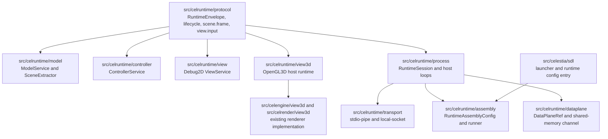
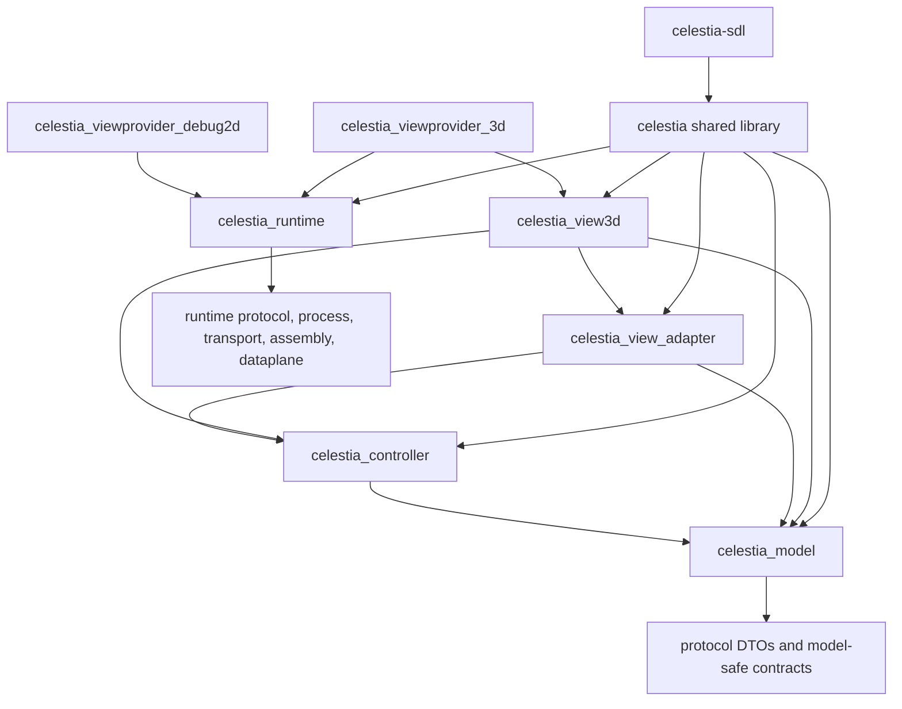
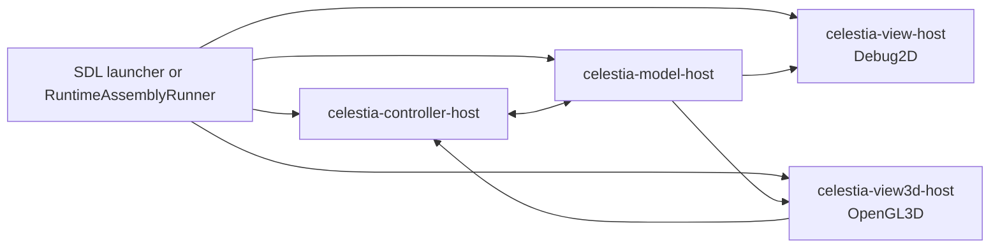
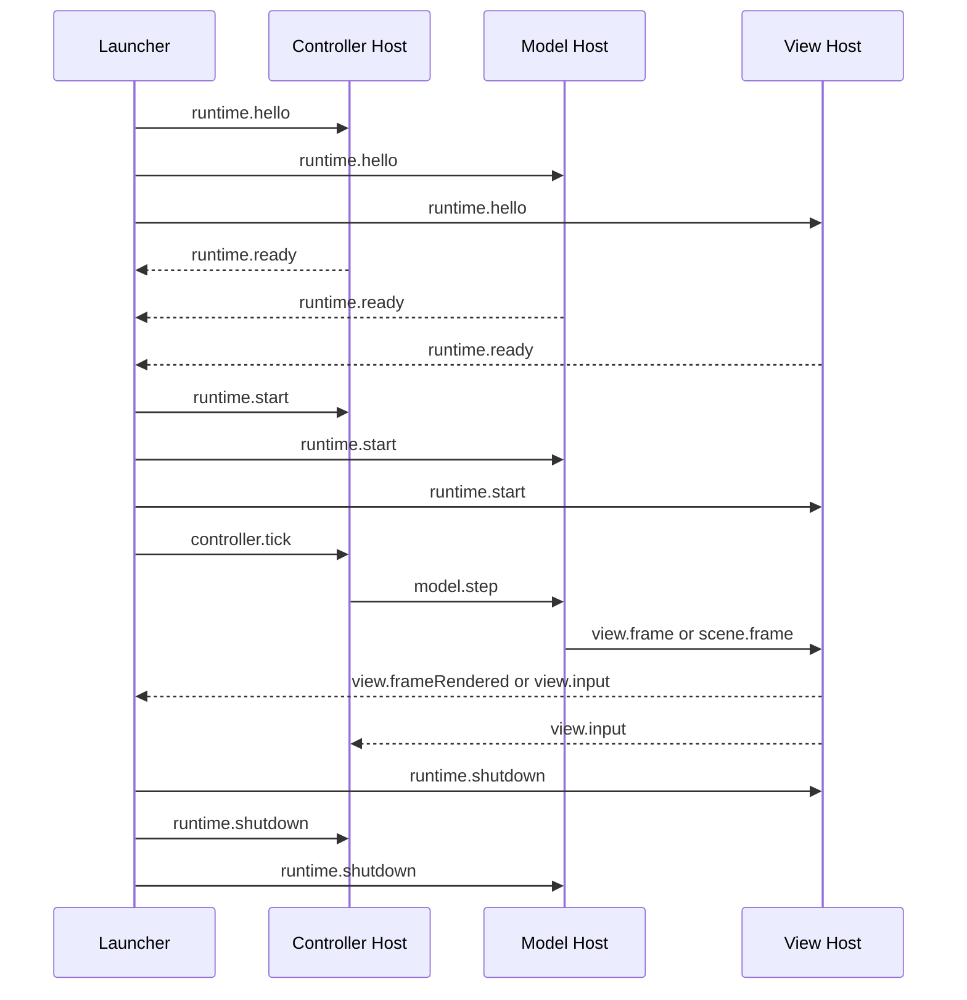
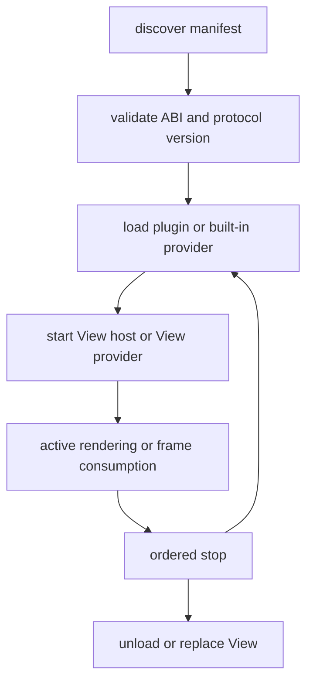
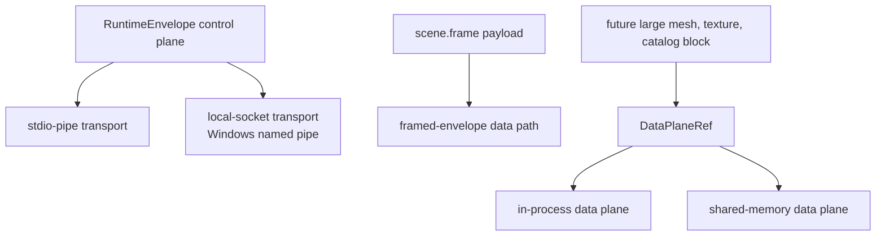
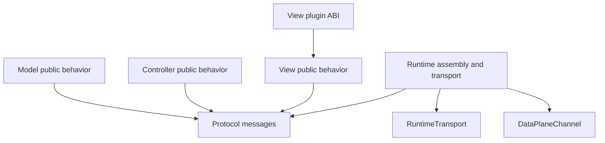

# Celestia Standard MVC Final Architecture

Date: 2026-06-25

This document records the final MVC architecture reached by Step8 through Step11 in this repository. It supersedes the earlier migration-only wording in the Step5/Step6 documents where those documents describe temporary file-script fallback paths.

## Source Ownership



## CMake Target Direction



Current CMake closure is conservative: historical Celestia in-process rendering still flows through the `celestia` shared library. The new cross-process runtime path is isolated under `celestia_runtime` and no longer depends on the removed Step6 file-script fallback.

## Runtime Process Topology



The launcher selects exactly one active View host at a time. Ordered View switch stops the current View host before starting the replacement View host while keeping Model and Controller alive.

## IPC Message Flow



## View Plugin Lifecycle



The current hot-swap guarantee is ordered stop/start. It is not a promise of frame-perfect replacement at an arbitrary point in the render loop.

## Transport And Data Plane



Step11 preserves the control-plane protocol as the stable boundary. Shared memory exists as a tested data-plane channel, but not every `scene.frame` payload is automatically moved through shared memory yet.

## Interface Ownership



Forbidden directions after Step11:

```text
Protocol -> Renderer/OpenGL/SDL
Protocol -> concrete transport implementation
RuntimeSession -> file-script stdio fallback
SDL launcher -> Step6 stdio-files fallback
Model runtime -> concrete View host internals
View runtime -> concrete Model internals
```

## Final Capability Matrix

| Capability | Status | Evidence |
| --- | --- | --- |
| M / C / V local supervised host processes | Implemented | RuntimeSession, ProcessSupervisor, full CTest |
| 2D Debug View process | Implemented | `runtime-2d-stdio.yaml`, `runtime-2d-local-socket.yaml` |
| 3D OpenGL View process | Implemented | `runtime-3d-stdio.yaml`, `runtime-3d-local-socket.yaml`, Step8/Step10 screenshots |
| Ordered 2D -> 3D View switch | Implemented | `runtime-switch-2d-to-3d-local-socket.yaml` |
| Ordered 3D -> 2D View switch | Implemented | `runtime-switch-3d-to-2d-local-socket.yaml`, Step11 runtime acceptance test |
| View plugin ABI and manifest registry | Implemented | Step9 tests and built-in manifests |
| Runtime assembly config | Implemented | Step10 config loader, examples, RuntimeAssemblyRunner |
| stdio-pipe transport | Implemented | Step7/Step10 tests |
| local-socket transport | Implemented | Windows named-pipe local transport tests and smokes |
| shared-memory data plane | Minimal tested channel | DataPlaneRef and SharedMemoryDataPlane tests |
| Step6 file-script fallback | Removed in Step11 | `scan_mvc_dependencies.ps1` and Step11 tests |
| Root forwarding headers | Removed before Step11, still scanned | `mvc_step5_forwarding_header_removal_test.cpp` |

## Remaining Boundaries

```text
Still true:
  - The existing in-process Celestia renderer remains available through the
    original application shell.
  - Some historical Celestia modules still keep names such as legacy or compat
    because they are product compatibility modules, not MVC migration shims.
  - local-socket means same-machine IPC; it is not TCP or cross-machine runtime.

Not true yet:
  - every render resource is transferred through shared memory by default.
  - arbitrary third-party transport plugins are frozen as a public ecosystem.
  - OpenGL3D cross-process rendering has full historical renderer parity.
```
