# Celestia当前源码结构与Model类分析

更新时间: 2026-07-02

本文定位: 这是一份源码结构分析文档，用来回答当前 Celestia 源码中 Model、Controller、View3D、运行时服务层分别由哪些源码实体组成，它们如何创建、持有、调用和销毁。本文不是验收方案，也不是迁移计划；后续验收和迁移必须以这里的源码事实为基础继续展开。

## 1. 文档方法与参考模板

本章先定义本文采用的分析方法。这样做的目的，是避免把源码事实、个人抽象、运行时流程和 MVC 判断混在一起。

### 1.1 参考的通用文档结构

本文结构参考以下公开架构文档方法，但不会机械套用:

| 来源 | 本文采用的要点 |
| --- | --- |
| [arc42 Building Block View](https://docs.arc42.org/section-5/) | 用静态结构视图描述模块、类、接口、源码位置和职责 |
| [arc42 Runtime View](https://docs.arc42.org/section-6/) | 用运行时视图描述关键场景、创建链、调用链和生命周期 |
| [C4 model](https://c4model.com/) | 分层表达系统、容器、组件、代码，不用一张大图表达所有关系 |
| [C4 notation](https://c4model.com/diagrams/notation) | 图必须有清晰图例，箭头语义必须能解释 |
| [SEI Views and Beyond](https://www.sei.cmu.edu/library/views-and-beyond-collection/) | 用不同视图回答不同问题，例如模块视图、运行连接视图、分配视图 |

本文不直接采用某个模板的完整章节，而是把它们转成适合本项目的四类视图:

1. 静态源码视图: 源码目录、CMake 目标、类、头文件、实现文件。
2. 启动编排视图: 应用层函数和运行时后端如何创建、填充并移交核心对象。
3. 内存对象图视图: 运行期对象之间是拥有、引用、索引还是包装。
4. MVC 边界视图: 当前对象更接近 Model、Controller、View3D、Adapter、Runtime，还是混合点。

### 1.2 本文的读者和关注点

本文面向后续 MVC 解耦实施者和评审者。读者需要能回答:

- 一个对象是否是真实源码类，还是本文为了分析引入的分组。
- 一个对象在哪里创建，读取哪些数据，最终放到哪里。
- 一个对象在内存中是什么形态，是 `unique_ptr` 持有、裸指针引用、索引容器，还是全局 manager。
- 一个图里的箭头到底表示创建、持有、索引、引用、调用、包装还是消费。
- 一个对象当前更接近 Model、Controller、View3D、Adapter 还是 Runtime。
- 后续如果移动该对象，最可能破坏哪些调用链和生命周期。

## 2. 术语表与图例规范

本章把中文术语、英文名、源码实体和分析性质先绑定起来。凡是本文自定义的分析分组，都会明确说明它不是源码类名。

### 2.1 术语表

| 中文术语 | 英文/源码名 | 类型 | 说明 |
| --- | --- | --- | --- |
| 启动编排层 | Bootstrap / initialization orchestration | 本文分析概念 | 指 `CelestiaCore::initSimulation` 和 `RealModelBackend::load` 这种负责创建、加载、注入、移交对象的流程；当前没有一个独立源码类完整承载该抽象 |
| 应用初始化函数 | `CelestiaCore::initSimulation` | 源码函数 | 单 exe 路径中创建并填充 `Universe`、创建 `Simulation` 的应用层函数；它不是 `Simulation` 对象 |
| 运行时后端加载函数 | `RealModelBackend::load` | 源码函数 | runtime Model 后端中复用真实加载链创建 `Universe` 和 `Simulation` 的函数 |
| 仿真会话 | `Simulation` | 源码类 | 运行后的会话根对象，持有 `Universe`，管理时间、观察者、选择和导航 |
| 宇宙对象入口 | `Universe` | 源码类 | 当前运行期对象图的 Model 聚合入口，位于 `src/celengine/model/universe.*` |
| 观察者 | `Observer` | 源码类 | 当前视点位置、姿态、速度、旅行动作、跟随/锁定/跳转等状态 |
| 观察者参考系 | `ObserverFrame` | 源码类 | Controller 侧对 `ReferenceFrame` 的受限包装，保存坐标系统、参考对象、目标对象 |
| 恒星目录 | `StarDatabase` | 源码类 | 恒星内存目录和空间索引，位于 `src/celengine/model/stardb.*` |
| 恒星对象 | `Star` | 源码类 | 单个恒星的运行期对象，位于 `src/celengine/model/star.h` |
| 深空对象目录 | `DSODatabase` | 源码类 | 深空对象内存目录和空间索引，位于 `src/celengine/model/dsodb.*` |
| 深空对象 | `DeepSkyObject` | 源码类 | 深空对象基类，位于 `src/celengine/model/deepskyobj.*` |
| 太阳系目录 | `SolarSystemCatalog` | 源码类型别名 | `unordered_map<AstroCatalog::IndexNumber, unique_ptr<SolarSystem>>`，定义在 `src/celengine/adapter/solarsys.h` |
| 太阳系对象 | `SolarSystem` | 源码类 | 某颗恒星对应的系统对象，持有顶层 `PlanetarySystem` 和 `FrameTree` |
| 行星系统容器 | `PlanetarySystem` | 源码类 | 管理某层级下的 `Body` 列表，定义在 `src/celengine/model/body.*` |
| 太阳系内天体 | `Body` | 源码类 | 行星、卫星、小天体、参考点、地表对象等，定义在 `src/celengine/model/body.*` |
| 地点对象 | `Location` | 源码类 | 依附于 `Body` 的地点/位置对象，不与 `Star`、`Body`、`DSO` 处在同一所有权层级 |
| 选择引用 | `Selection` | 源码类 | 对不同对象指针的包装引用，位于 `src/celengine/controller/selection.*` |
| 时间线 | `Timeline` | 源码类 | 管理 `Body` 在不同时间段的阶段数据 |
| 时间线阶段 | `TimelinePhase` | 源码类 | 某个时间段内的父对象、轨道、参考系、自转模型 |
| 参考系 | `ReferenceFrame` | 源码类族 | 坐标系抽象及其派生类 |
| 参考系树 | `FrameTree` | 源码类 | 管理参考系层级 |
| 特征管理器 | `BodyFeaturesManager` | 源码类 | 以 `Body*` 为 key 保存 atmosphere、rings、locations、reference marks、颜色等扩展数据 |

### 2.2 图例规范

本文后续图中的箭头必须标注语义。默认不使用无标签箭头。

| 箭头标签 | 含义 | 典型源码形态 |
| --- | --- | --- |
| `creates` | 创建对象 | `std::make_unique<T>()`、构造函数、builder 构建 |
| `owns` | 拥有并负责生命周期 | `unique_ptr`、值成员、容器持有 `unique_ptr` |
| `references` | 非拥有引用 | 裸指针、引用、弱关系 |
| `indexes` | 索引或按 key 查找 | map、octree、目录号索引、名称库 |
| `sets` | 注入到目标对象 | setter 接收 `unique_ptr` 或赋值 |
| `reads` | 读取目标对象 | getter、遍历、渲染消费、查询 |
| `wraps` | 包装目标对象引用 | `Selection` 包装不同类型对象指针 |
| `outputs` | 输出协议或场景数据 | runtime extractor、service 输出 |

### 2.3 图类型规范

本文区分三种图，不混用:

| 图类型 | 节点允许内容 | 回答的问题 |
| --- | --- | --- |
| 静态结构图 | 目录、模块、类、对象、容器 | 源码或内存对象之间是什么关系 |
| 运行时序列图 | 函数、对象、服务、builder | 谁先调用谁，谁创建谁，创建顺序是什么 |
| 所有权对象图 | 运行期对象和容器 | 谁拥有谁，谁只是引用谁 |

如果一个图同时出现函数节点和对象节点，它必须明确标为“运行时创建图”或“序列图”，不能伪装成对象所有权图。

## 3. 文档总体结构

本章说明本文后续章节如何组织。每个核心对象章节都按同一模板写，避免不同章节结构随意变化。

### 3.1 章节顺序原则

本文章节顺序是一种源码分析视角，不是已经确认的目标架构。它用于把当前源码事实讲清楚，后续是否按这些视角抽象正式架构层，需要另行设计和验证。

本文暂按“启动编排视角 -> 运行会话根对象 -> Model 聚合入口 -> 关键运行状态 -> 对象目录和对象族 -> 横切管理器 -> View/Runtime 消费侧”展开。

采用这个顺序的原因是:

- 先讲启动编排视角，因为 `Universe`、`StarDatabase`、`DSODatabase`、`SolarSystemCatalog`、`Simulation` 的创建和移交都发生在这条流程中；但这不表示当前源码已经有一个独立的启动编排层。
- 再讲 `Simulation`，因为初始化完成后它是运行会话根对象，尤其负责时间推进、观察者、选择和运行控制。
- 再讲 `Universe`，因为它是被 `Simulation` 持有的 Model 聚合入口，负责对象目录和查找。
- `Observer`、`Timeline`、`ReferenceFrame` 分开讲，避免把 Controller 状态、对象时间规则和坐标计算能力混成一个笼统章节。
- `BodyFeaturesManager` 不放在核心所有权对象图中，它是以 `Body*` 为 key 的横切管理器，单独成章。

### 3.2 核心对象章节统一模板

每个核心对象或类组章节尽量按以下顺序组织:

1. 定义与系统定位: 它是什么，在系统里处于什么位置。
2. 源码映射: 头文件、实现文件、相关 builder、加载入口。
3. 创建链和输入数据: 谁创建它，读取什么数据，是否由 builder 构建。
4. 内存形态和关键成员: 主要字段、容器、索引、指针类型。
5. 所有权和生命周期: 谁持有，何时销毁，是否全局。
6. 主要调用者/消费者: 谁创建、读取、修改或消费它。
7. 关系图: 只画有明确标签的创建、持有、索引、引用、包装、消费关系。
8. 当前 MVC 归属判断: Model / Controller / View3D / Adapter / Runtime / 混合。
9. 后续复审问题: 迁移或解耦前仍需确认的点。

## 4. 总览视图

本章只给出当前源码的总体视图，不在这里解释所有细节。详细解释放到后续对象章节。

### 4.1 静态源码视图

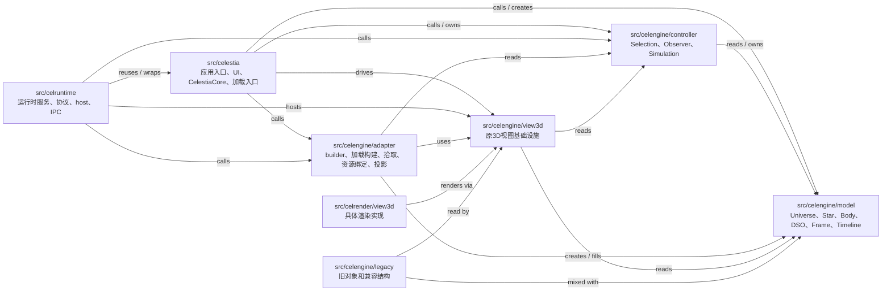

当前事实判断:

- 目录拆分已经存在，但边界不是干净的 MVC。
- `model` 目录里仍 include `controller`、`adapter`、`legacy`。
- `controller` 目录里的 `Simulation` 持有 `Universe`，并且 include 了 View3D 和 legacy 头文件。
- `adapter` 同时有加载构建职责和 View3D 适配职责，不能整体归类。

### 4.2 运行时创建序列

这是运行时序列图，节点可以是函数、builder 和对象。它回答“谁先调用谁，谁创建谁”。

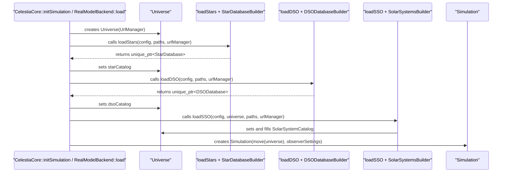

关键澄清:

- `initSimulation` 是 `CelestiaCore` 的初始化函数名，不是 `Simulation` 对象。
- 实际创建顺序是先有 `Universe`，再有 `Simulation`。
- `Simulation` 构造时接收的是已经加载并填充过的 `Universe`。
- 程序运行起来以后，`Simulation` 成为持有 `Universe` 的会话根对象。

### 4.3 核心运行期所有权对象图

这是核心对象所有权图，节点只放 `Simulation` 到主要 Model 对象树的运行期对象或容器，不放函数，也不放横切管理器。

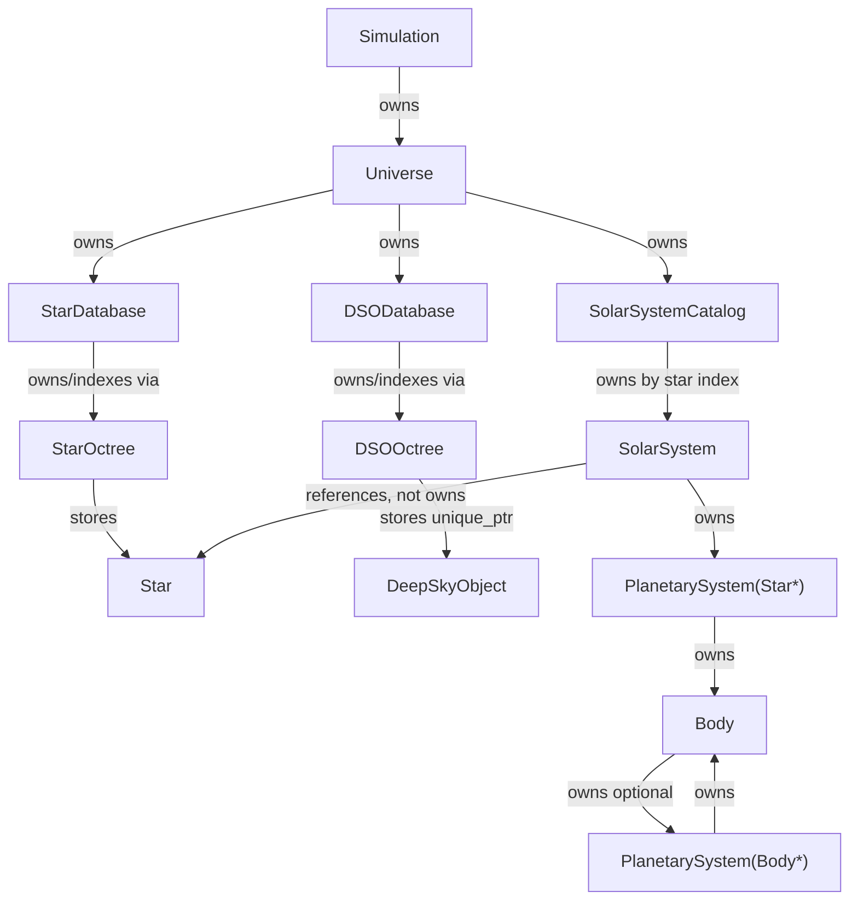

注意:

- 这张图不放 `Selection`，因为 `Selection` 是运行状态和调用参数中使用的引用包装，不是核心对象树所有者。
- 这张图不放 `BodyFeaturesManager`，因为它是以 `Body*` 为 key 的横切管理器，不属于 `Universe -> SolarSystemCatalog -> Body` 的核心所有权树。
- `SolarSystem --> Star` 是非拥有引用，不是 `SolarSystem` 拥有恒星对象。
- `StarDatabase --> Star` 表示通过 `StarOctree` 存储/索引 `Star`，不是继承关系。

## 5. 启动编排层

本章定义当前源码中“创建并移交核心对象”的编排职责。它解释为什么 `Universe` 的生成不由 `Simulation` 管理，以及为什么当前没有一个独立类完整表达这个职责。

### 5.1 定义与系统定位

启动编排层是本文分析概念，不是当前源码中的单个类。它指单 exe 路径和 runtime 路径中负责完成以下动作的流程:

1. 读取配置和路径。
2. 创建空 `Universe`。
3. 调用加载函数和 builder 构建 `StarDatabase`、`DSODatabase`、`SolarSystemCatalog`。
4. 把这些目录对象注入 `Universe`。
5. 创建 `Simulation` 并把已填充的 `Universe` 移交给它。

当前源码没有一个名为 `Bootstrap` 或 `SimulationFactory` 的类统一承载这些职责。单 exe 路径主要由 `CelestiaCore::initSimulation` 编排；runtime Model 后端路径主要由 `RealModelBackend::load` 编排。

### 5.2 源码映射

| 路径 | 编排入口 | 作用 |
| --- | --- | --- |
| 单 exe | `src/celestia/celestiacore.cpp` 中 `CelestiaCore::initSimulation` | 创建和填充 `Universe`，创建 `Simulation` |
| runtime Model 后端 | `src/celruntime/model/realmodelbackend.cpp` 中 `RealModelBackend::load` | 用真实加载链创建 `Universe` 和 `Simulation` |
| 加载函数 | `loadStars`、`loadDSO`、`loadSSO` | 从配置和数据文件构建 Model 对象目录 |

### 5.3 创建阶段与运行阶段的生命周期责任

| 阶段 | 责任方 | 生命周期含义 |
| --- | --- | --- |
| 创建/加载阶段 | `CelestiaCore::initSimulation` 或 `RealModelBackend::load` 中的局部流程 | 临时持有 `unique_ptr<Universe>`，负责调用加载函数填充对象图 |
| 移交阶段 | `Simulation(std::move(universe), observerSettings)` | `Universe` 的所有权从局部变量转移给 `Simulation` |
| 运行阶段 | `Simulation::universe` | `Simulation` 通过 `unique_ptr<Universe>` 管理 `Universe` 和其下对象目录的生命周期 |
| 销毁阶段 | `Simulation` 析构 | `unique_ptr<Universe>` 递归释放 `StarDatabase`、`DSODatabase`、`SolarSystemCatalog` 等对象 |

因此，`Simulation` 不负责生成 `Universe`，但负责运行阶段持有和销毁 `Universe`。`CelestiaCore` 负责编排生成过程，但运行后不再拥有 `Universe`。

### 5.4 主要调用者/消费者

| 调用者/消费者 | 使用方式 |
| --- | --- |
| 平台入口 | Qt/Win32/SDL 等入口调用 `CelestiaCore::initSimulation` |
| `CelestiaCore` | 单 exe 路径下的初始化编排者 |
| `RealModelBackend` | runtime Model 后端路径下的初始化编排者 |
| `Simulation` | 接收已填充的 `Universe` 并进入运行阶段 |

### 5.5 当前 MVC 归属判断

启动编排层不属于纯 Model、纯 Controller 或纯 View。它是应用/运行时层的装配逻辑。后续如果要让创建链更清晰，可以考虑抽象成独立的 Model bootstrap/factory，但本文只记录当前源码事实。

## 6. Simulation

本章先定义 `Simulation` 是什么、在系统中处于什么位置、包含什么，再说明它和 `CelestiaCore::initSimulation` 的区别。

### 6.1 定义与系统定位

`Simulation` 是源码类，当前位于 `src/celengine/controller`。它是程序初始化完成后的运行会话根对象。

它在系统中的定位:

- 向下持有 `Universe`，也就是当前 Model 对象图入口。
- 向内保存当前选择、观察者、时间、暂停和速度状态。
- 向上为应用层、View3D、runtime 后端提供会话状态和控制行为。
- 它不是应用初始化函数，也不是第一个被创建的对象。

### 6.2 源码映射

| 项 | 路径 |
| --- | --- |
| 头文件 | `src/celengine/controller/simulation.h` |
| 实现文件 | `src/celengine/controller/simulation.cpp` |
| 单 exe 创建入口 | `CelestiaCore::initSimulation` |
| runtime 创建入口 | `RealModelBackend::load` |
| 主要关联 | `Universe`、`Observer`、`Selection`、`ObserverFrame`、`Timeline`、`ReferenceFrame` |

### 6.3 与 `CelestiaCore::initSimulation` 的区别

| 名称 | 类型 | 职责 | 生命周期 |
| --- | --- | --- | --- |
| `CelestiaCore::initSimulation` | 应用层函数 | 执行初始化流程，创建并填充 `Universe`，最后创建 `Simulation` | 函数调用结束后退出 |
| `Simulation` | 运行期对象 | 持有 `Universe` 并管理当前会话状态 | 程序运行期间持续存在 |

`initSimulation` 名字里的 `Simulation` 是“初始化仿真系统”的意思，不表示 `Simulation` 对象先存在。

### 6.4 创建链和输入数据

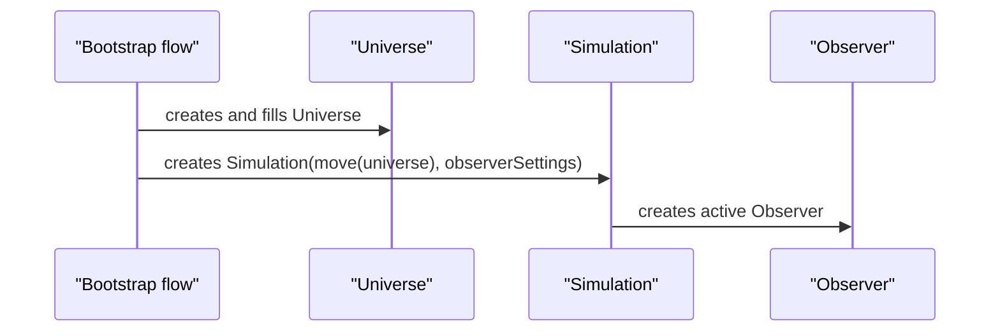

时间顺序是 `Universe` 先创建并填充，`Simulation` 后创建。运行结构是 `Simulation` 创建后拥有 `Universe`，成为运行会话根对象。

### 6.5 内存形态和关键成员

| 成员 | 类型 | 含义 |
| --- | --- | --- |
| `universe` | `std::unique_ptr<Universe>` | 持有 Model 聚合入口 |
| `selection` | `Selection` | 当前选择引用 |
| `activeObserver` | `Observer*` | 当前观察者 |
| `observers` | `std::vector<Observer*>` | 观察者列表 |
| `realTime` | `double` | Simulation 对象创建后经过的真实秒数 |
| `timeScale` | `double` | 仿真时间相对真实时间的缩放 |
| `storedTimeScale` | `double` | 暂停前保存的时间缩放 |
| `syncTime` | `bool` | 设置时间时是否同步所有 observer |
| `pauseState` | `bool` | 暂停状态 |
| `faintestVisible` | `float` | 最暗可见星等阈值 |
| `closestSolarSystem` | `optional<SolarSystem*>` | 最近太阳系缓存，非拥有引用 |

### 6.6 仿真时间管理

`Simulation` 管理的是运行会话的时间推进入口，但当前源码中“当前儒略日时间”实际保存在 observer 侧。

源码事实:

- `Simulation::getTime()` 返回 `activeObserver->getTime()`。
- `Simulation::setTime(jd)` 在 `syncTime` 为 true 时给所有 observers 设置同一个 Julian date，否则只设置 active observer。
- `Simulation::update(dt)` 先推进自己的 `realTime`，再对每个 observer 调用 `observer->update(dt, timeScale)`。
- `Observer::update(dt, timeScale)` 推进 `Observer::realTime`，并用 `(dt / 86400.0) * timeScale` 推进 `Observer::simTime`。

因此，必须区分三种时间概念:

| 概念 | 当前源码位置 | 含义 |
| --- | --- | --- |
| `Simulation::realTime` | `Simulation` | 当前仿真会话对象存在以来经过的真实秒数 |
| `Observer::realTime` | `Observer` | 当前观察者内部旅行动画、速度变化等使用的真实时间 |
| `Observer::simTime` | `Observer` | 当前仿真时刻，Julian date / TDB，`Simulation::getTime()` 从这里取得 |

`Timeline` 不是全局时间管理器。`Timeline` 是某个 `Body` 的时间阶段规则集合。渲染或导航时，会用当前仿真时刻去查询某个 `Body` 的 `TimelinePhase`。

### 6.7 所有权和生命周期

| 对象 | 所有权 |
| --- | --- |
| `Universe` | `Simulation` 通过 `unique_ptr` 拥有，运行阶段负责生命周期 |
| `Observer` | `Simulation` 手动创建，析构时删除 |
| `Selection` | 值成员，保存当前选择引用 |
| `SolarSystem*` 缓存 | 非拥有引用 |

### 6.8 主要调用者/消费者

| 调用者/消费者 | 使用方式 |
| --- | --- |
| `CelestiaCore` | 创建并持有 `Simulation` |
| 应用 UI / 输入层 | 调用选择、跳转、时间、导航接口 |
| 原 View3D | 读取当前时间、观察者、选择、Universe |
| Runtime Model 后端 | 更新仿真并抽取场景状态 |
| Controller host | 多进程控制路径下驱动会话状态 |

### 6.9 当前 MVC 归属判断

`Simulation` 应暂定为 Controller 运行核心，但它是当前拆分中的高风险混合点:

- 它拥有 `Universe`，所以 Model 生命周期目前由 Controller 类托管。
- 它的头文件 include `view3d/texture.h`，说明 Controller 仍有 View3D 依赖。
- 它 include legacy 深空对象相关头文件，说明历史边界未清理。

后续如果要严格分层，可能需要把“仿真数据状态”和“控制行为 facade”拆开。但这属于后续设计决策，本文只记录当前事实。

## 7. Observer / ObserverFrame

本章单独说明观察者相关对象。它们属于 Controller 运行状态，不能和 Model 计算类混在一个笼统章节里。

### 7.1 定义与系统定位

`Observer` 是观察者对象，保存视点位置、姿态、速度、视场、旅行动作、跟踪对象和当前 `ObserverFrame`。它是 `Simulation` 管理的运行状态。

`ObserverFrame` 是观察者参考系对象。源码注释说明它是对 `ReferenceFrame` 的包装，并增加一组受限的、适合观察者使用的注解数据。它保存:

- `CoordinateSystem`
- `shared_ptr<const ReferenceFrame>`
- `Selection m_refObject`
- `Selection m_targetObject`

### 7.2 源码映射

| 项 | 路径 |
| --- | --- |
| `Observer` 声明 | `src/celengine/controller/observer.h` |
| `Observer` 实现 | `src/celengine/controller/observer.cpp` |
| `ObserverFrame` 声明 | `src/celengine/controller/observer.h` |
| `ObserverFrame` 实现 | `src/celengine/controller/observer.cpp` |
| 主要持有者 | `Simulation` |

### 7.3 创建链和输入数据

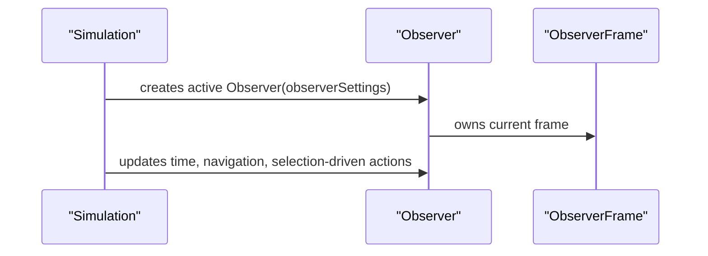

### 7.4 内存形态和关键成员

| 对象 | 关键内容 |
| --- | --- |
| `Observer` | 位置、姿态、速度、角速度、FOV、zoom、mode、tracked object、journey params、current frame |
| `ObserverFrame` | 坐标系统、`ReferenceFrame` 指针、参考对象 `Selection`、目标对象 `Selection` |

### 7.5 所有权和生命周期

| 对象 | 所有权 |
| --- | --- |
| `Observer` | `Simulation` 创建并删除 |
| `ObserverFrame` | `Observer` 保存当前 frame，使用 shared pointer 类型 |
| `ReferenceFrame` | `ObserverFrame` 引用/共享，不拥有底层 Model 对象 |

### 7.6 主要调用者/消费者

| 调用者/消费者 | 使用方式 |
| --- | --- |
| `Simulation` | 创建、更新、切换 active observer |
| 应用输入层 | 触发旋转、跳转、跟随、锁定 |
| 原 View3D | 读取观察者位置和姿态进行渲染 |
| `ReferenceFrame` / `Timeline` 相关 Model 计算 | 为观察者参考系转换提供计算数据 |

### 7.7 当前 MVC 归属判断

`Observer` 和 `ObserverFrame` 属于 Controller 运行状态。它们依赖 `Selection` 和 `ReferenceFrame`，说明 Controller 与 Model 计算对象之间存在紧密连接。

## 8. Timeline / TimelinePhase

本章单独说明时间线对象。它们属于 Model 计算能力，用于描述 `Body` 在不同时间段的状态。

### 8.1 定义与系统定位

`Timeline` 是 `Body` 的时间阶段集合。它管理一组 `TimelinePhase`，并提供 `findPhase(t)`、`startTime()`、`endTime()`、`includes(t)` 等查询。

`TimelinePhase` 描述某个时间段内的父对象、轨道、参考系、自转模型和 frame tree 关系。它决定一个 `Body` 在给定时间如何定位和定向。

不是每个 Celestia 对象都有 `Timeline`。当前明确看到的是 `Body` 持有 `unique_ptr<Timeline>`；`Star`、`DeepSkyObject` 不是通过同一套 `Body::Timeline` 管理。

`Timeline` 也不是全局仿真时钟。全局当前仿真时刻由 `Simulation` 通过 active `Observer` 获取和推进；`Timeline` 接收这个时间值，回答“这个 Body 在这个时间处于哪个阶段”。

### 8.2 源码映射

| 项 | 路径 |
| --- | --- |
| `Timeline` | `src/celengine/model/timeline.h`, `src/celengine/model/timeline.cpp` |
| `TimelinePhase` | `src/celengine/model/timelinephase.h`, `src/celengine/model/timelinephase.cpp` |
| 持有者 | `Body::timeline` |
| 构建者 | `SolarSystemsBuilder` |

### 8.3 创建链和输入数据

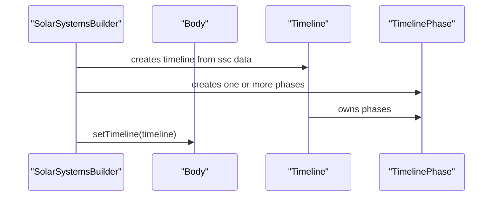

### 8.4 内存形态和关键成员

| 对象 | 关键内容 |
| --- | --- |
| `Timeline` | `vector<unique_ptr<TimelinePhase>> phases` |
| `TimelinePhase` | 时间范围、父对象、轨道、body frame、orbit frame、`FrameTree` 关联 |

### 8.5 所有权和生命周期

| 对象 | 所有权 |
| --- | --- |
| `Timeline` | `Body` 通过 `unique_ptr<Timeline>` 拥有 |
| `TimelinePhase` | `Timeline` 通过 `unique_ptr` 列表拥有 |
| `FrameTree` | phase 与 frame tree 建立关系，具体所有权需结合 `TimelinePhase` / `FrameTree` 源码继续细化 |

运行时关系:

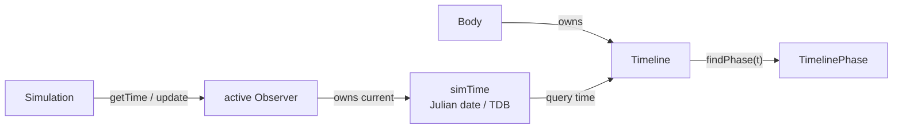

这里的统一管理概念是 `Simulation/Observer` 管当前仿真时刻，`Body::Timeline` 管对象自己的时间阶段规则。二者不是同一类对象。

### 8.6 主要调用者/消费者

| 调用者/消费者 | 使用方式 |
| --- | --- |
| `Body` | 用 timeline 计算给定时间的位置、姿态、速度、存在区间 |
| `Selection` | `frameParent(t)` 等路径会查询 body timeline phase |
| `Observer` / `ObserverFrame` | 跳转、跟随、锁定时使用对象在某时间的 frame 信息 |
| View3D | 渲染时按时间读取 `Body` 状态，间接消费 timeline |

### 8.7 当前 MVC 归属判断

`Timeline` 和 `TimelinePhase` 属于 Model 计算核心。它们服务 Controller 和 View3D，但不应归为 Controller 或 View。

## 9. ReferenceFrame / FrameTree

本章单独说明参考系对象。它们属于坐标计算核心，和 `ObserverFrame` 不是同一个层次。

### 9.1 定义与系统定位

`ReferenceFrame` 是模型层参考系抽象类，不是一个简单枚举，也不是只代表“某个坐标系名称”。它表示一套可以在给定时间计算方向、角速度和惯性性质的坐标系对象。

`FrameTree` 管理参考系层级，用于把对象、阶段和参考系组织成可计算的树。

`ObserverFrame` 是 Controller 侧对 `ReferenceFrame` 的受限包装。它不是 `ReferenceFrame` 的替代品。

从源码实现看，`ReferenceFrame` 至少包含以下关键接口:

| 接口 | 含义 |
| --- | --- |
| `getOrientation(double tjd)` | 给定时间，返回该参考系相对基准方向的姿态 |
| `getAngularVelocity(double tdb)` | 给定时间，返回角速度 |
| `isInertial()` | 判断是否惯性参考系 |
| `visitChildren(FrameVisitor&)` | 遍历该参考系依赖的对象或子参考系 |

因此，它既是类，也是运行时可创建和共享的对象。不同具体参考系通过不同派生类或 key 创建。

### 9.2 源码映射

| 项 | 路径 |
| --- | --- |
| `ReferenceFrame` | `src/celengine/model/frame.h`, `src/celengine/model/frame.cpp` |
| `BodyFixedFrame` | `src/celengine/model/frame.h`, `src/celengine/model/frame.cpp` |
| `BodyMeanEquatorFrame` | `src/celengine/model/frame.h`, `src/celengine/model/frame.cpp` |
| `TwoVectorFrame` | `src/celengine/model/frame.h`, `src/celengine/model/frame.cpp` |
| `FrameCache` / `FrameKey` | `src/celengine/model/frame.h`, `src/celengine/model/frame.cpp` |
| `FrameTree` | `src/celengine/model/frametree.h`, `src/celengine/model/frametree.cpp` |
| 使用者 | `TimelinePhase`、`Body`、`ObserverFrame`、View3D |

### 9.3 具体参考系类型

| 类型 | 源码身份 | 含义 |
| --- | --- | --- |
| `BodyFixedFrame` | `ReferenceFrame` 派生类 | 跟随目标天体自转的体固参考系，接近“地固系/体固系”概念 |
| `BodyMeanEquatorFrame` | `ReferenceFrame` 派生类 | 目标天体平均赤道相关参考系，可用于赤道/惯性判断 |
| `TwoVectorFrame` | `CachingFrame` 派生类 | 由两组向量定义参考系，例如相对位置、相对速度方向 |
| `SimpleFrameKey::J2000Ecliptic` / `J2000Equator` | frame key | 基础 J2000 黄道/赤道参考系 |
| `FrameCache` | 缓存/创建器 | 根据 `FrameKey` 创建并缓存 `ReferenceFrame` 实例 |

`ObserverFrame::CoordinateSystem` 是另一层概念。它位于 Controller，用于表达观察者当前使用哪种受限坐标系统，例如 `Universal`、`Ecliptical`、`Equatorial`、`BodyFixed`、`PhaseLock`、`Chase`。其中某些模式会临时创建或使用 `BodyFixedFrame`、`BodyMeanEquatorFrame`、`TwoVectorFrame` 等 Model 侧参考系。

### 9.4 运行关系图

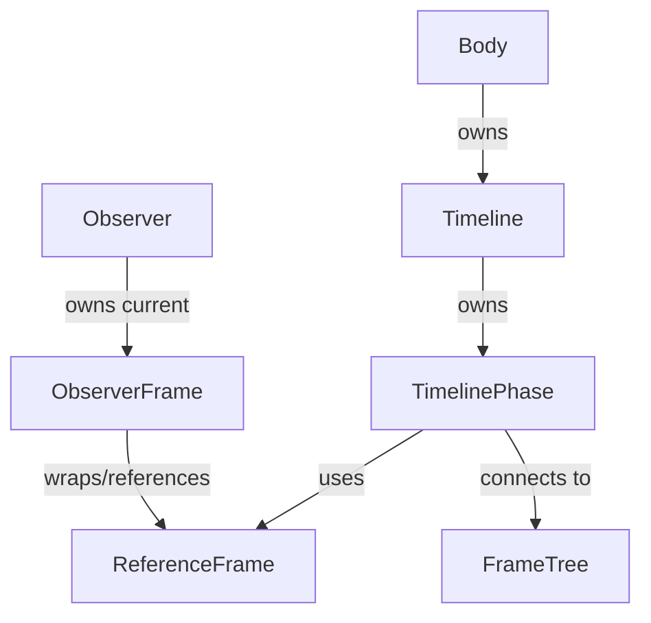

### 9.5 所有权和生命周期

| 对象 | 所有权 |
| --- | --- |
| `ReferenceFrame` | 常通过 shared pointer 或 frame cache 相关机制共享，具体缓存生命周期需要进一步细化 |
| `FrameTree` | 可由 `SolarSystem` 或 `Body` 持有 |
| `ObserverFrame` | Controller 侧保存当前观察者参考系状态 |

`TimelinePhase` 使用 `ReferenceFrame` 不是只调用一个坐标系工具函数，而是关联一套参考系对象或 frame id，用它来计算某个时间点下的位置、姿态、角速度和坐标转换。`Body` 的位置/姿态接口会经由 `Timeline` 和 `TimelinePhase` 找到对应参考系。

### 9.6 主要调用者/消费者

| 调用者/消费者 | 使用方式 |
| --- | --- |
| `TimelinePhase` | 保存/使用轨道和 body frame |
| `Body` | 计算位置、姿态、速度、坐标转换 |
| `ObserverFrame` | 把观察者坐标系统限制在可表示的一组参考系中 |
| View3D | 渲染时使用坐标转换结果 |

### 9.7 当前 MVC 归属判断

`ReferenceFrame` 和 `FrameTree` 属于 Model 计算能力。它们与 `Selection`、`ObserverFrame` 有接口连接，说明边界需要复审，但不能因为被 Controller 使用就归到 Controller。

## 10. Universe

本章定义 `Universe` 是什么、它在系统中的定位、它持有哪些对象目录，以及它如何被启动编排层填充并移交给 `Simulation`。

### 10.1 定义与系统定位

`Universe` 是源码类，不是本文自造概念。它是当前运行期宇宙对象图的 Model 聚合入口。

它不表示:

- 外部数据库。
- 原始配置文件。
- 纯数据传输对象。
- View3D 场景对象。
- Controller 当前状态。

它表示:

- 已加载进内存的对象目录。
- 跨对象查找、补全、标记、URL 查询入口。
- 被 `Simulation` 持有和使用的对象图入口。

### 10.2 源码映射

| 项 | 路径 |
| --- | --- |
| 头文件 | `src/celengine/model/universe.h` |
| 实现文件 | `src/celengine/model/universe.cpp` |
| 单 exe 创建入口 | `CelestiaCore::initSimulation` |
| runtime 创建入口 | `RealModelBackend::load` |
| 相关加载函数 | `loadStars`、`loadDSO`、`loadSSO` |

### 10.3 创建链和输入数据

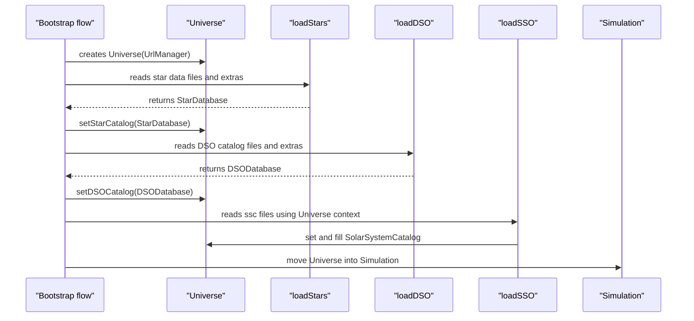

### 10.4 内存形态和关键成员

| 成员 | 类型 | 含义 | 与对象的关系 |
| --- | --- | --- | --- |
| `starCatalog` | `std::unique_ptr<StarDatabase>` | 恒星目录对象 | `Universe` 拥有 `StarDatabase`；`StarDatabase` 通过 `StarOctree` 存储/索引 `Star` |
| `dsoCatalog` | `std::unique_ptr<DSODatabase>` | 深空对象目录 | `Universe` 拥有 `DSODatabase`；`DSODatabase` 通过 `DSOOctree` 存储/索引 `DeepSkyObject` |
| `solarSystemCatalog` | `std::unique_ptr<SolarSystemCatalog>` | 太阳系目录 | `Universe` 拥有以恒星目录号为 key 的 `SolarSystem` map |
| `asterisms` | `std::unique_ptr<AsterismList>` | 星群/星座线数据 | 依赖恒星目录 |
| `boundaries` | `std::unique_ptr<ConstellationBoundaries>` | 星座边界 | 用于查找和显示 |
| `urlManager` | `std::unique_ptr<UrlManager>` | URL 管理 | 加载和对象信息查询使用 |
| `markers` | `MarkerList` | 标记列表 | 以对象引用标记目标 |

### 10.5 所有权和生命周期

| 阶段 | 状态 |
| --- | --- |
| 创建前 | 配置、路径、加载器存在，但 `Universe` 尚未存在 |
| 构造后 | `Universe` 持有 `UrlManager`，其它目录可能尚未设置 |
| 加载中 | `loadStars`、`loadDSO`、`loadSSO` 将目录和对象图逐步注入 |
| 加载完成 | `Universe` 持有完整对象目录，被 move 到 `Simulation` |
| 运行中 | `Simulation` 通过 `getUniverse` 访问；View3D、Controller、Runtime 间接读取 |
| 销毁 | `Simulation` 销毁时，`unique_ptr<Universe>` 销毁，目录对象递归释放 |

### 10.6 主要调用者/消费者

| 调用者/消费者 | 使用方式 |
| --- | --- |
| 启动编排层 | 创建并注入目录对象 |
| `Simulation` | 持有并调用对象查找、补全、太阳系查找 |
| 原 View3D | 通过 `Simulation` / `Universe` 读取恒星、深空对象、太阳系对象 |
| 应用 UI | 查询对象、URL、标记、信息面板 |
| Runtime Model 后端 | 用真实 `Universe` 和 `Simulation` 抽取场景输出 |

### 10.7 当前 MVC 归属判断

`Universe` 的核心职责属于 Model。但它当前并不干净:

- 它在接口层依赖 `Selection`。
- 它依赖定义在 adapter 目录中的 `SolarSystemCatalog`。
- 它 include legacy 标记结构。

后续不能直接宣布 `Universe` 已经完全解耦。

## 11. Selection 与对象引用

本章定义 `Selection` 在系统里的定位、谁持有它、谁把它当参数使用，以及它是否能直接在系统中调用。

### 11.1 定义与系统定位

`Selection` 是源码类。它是对象引用包装器，可以理解为 typed handle，不是天体对象，不是地点所有者，不是数据管理器，也不是数据索引。

`Selection` 自身不提供“从全局对象集合中查找对象”的能力。查找能力主要在 `Universe`、`StarDatabase`、`DSODatabase`、`SolarSystemCatalog`、`PlanetarySystem` 等对象和目录中。`Selection` 表示的是查找或拾取之后得到的“某个对象引用”。

`Universe` 和 `Selection` 的区别:

| 对象 | 管什么 | 不管什么 |
| --- | --- | --- |
| `Universe` | 对象目录、对象图、跨对象查找、补全、标记、URL 查询 | 当前观察者视角、当前导航状态、当前选择的运行控制 |
| `Selection` | 一个已知对象的类型和指针引用 | 对象生命周期、对象目录、全局查找索引、观察者视角 |

观察者视角不放在 `Universe` 里，而是在 `Simulation`、`Observer`、`ObserverFrame` 中。`Universe` 管实体对象图，`Simulation/Observer` 管当前怎么看、看向哪里、以什么时间和参考系观察。

它可以包装:

- `Star*`
- `Body*`
- `DeepSkyObject*`
- `Location*`

这里的“包装”不是拥有。`Selection` 不创建这些对象，也不负责释放这些对象。

### 11.2 源码映射

| 项 | 路径 |
| --- | --- |
| 头文件 | `src/celengine/controller/selection.h` |
| 实现文件 | `src/celengine/controller/selection.cpp` |
| 主要使用者 | `Simulation`、`Universe`、`ObserverFrame`、拾取、标记、UI、View3D |

### 11.3 所有权和生命周期

`Selection` 是轻量值对象。它不拥有目标对象，也不控制目标对象生命周期。它可以作为成员保存，也可以作为函数参数临时传递。

| 持有者/使用者 | 关系 |
| --- | --- |
| `Simulation::selection` | 当前选择状态，值成员 |
| `Simulation` API | 设置、读取当前选择，导航时使用 |
| `ObserverFrame` | 用作参考对象或目标对象 |
| `Universe` API | 作为查询、标记、URL、上下文参数 |
| View3D / UI / Picker | 生成或消费临时 `Selection`，用于拾取和显示 |

### 11.4 关系图

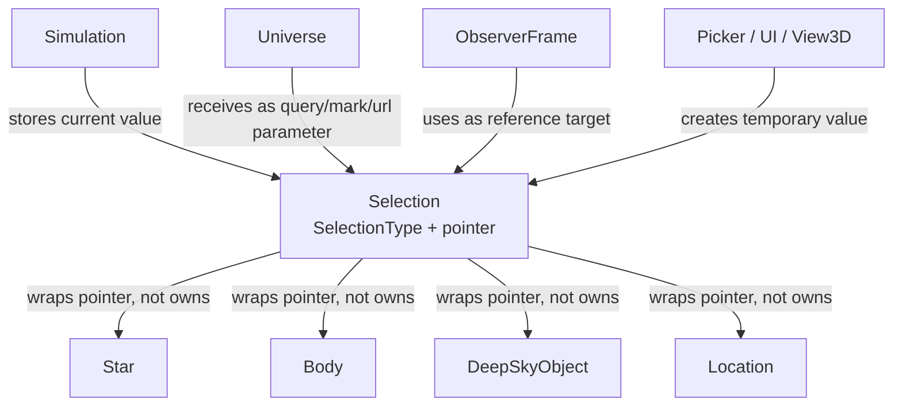

### 11.5 主要调用者/消费者

| 调用者/消费者 | 使用方式 |
| --- | --- |
| `Simulation` | 保存当前选择并驱动导航行为 |
| `Observer` / `ObserverFrame` | 用作参考对象、目标对象、跟踪对象 |
| `Universe` | 用作查找、标记、URL 查询参数 |
| View3D / Picker / UI | 生成或消费选择结果 |

### 11.6 当前 MVC 归属判断

`Selection` 当前位于 Controller。它的主要状态性使用发生在 `Simulation` 中，即“当前选中了谁”。

但 `Universe` 的接口也接收 `Selection` 参数，所以源码层面存在 Model 对 Controller 类型的依赖。这里的“被 Model 使用”只表示类型和接口依赖，不表示 Model 会因为当前选择变化而改变核心对象图。

## 12. StarDatabase 与 Star

本章定义恒星目录和恒星对象，并说明恒星数据如何从文件进入内存。

### 12.1 定义与系统定位

`Star` 是单个恒星对象。`StarDatabase` 是恒星目录和索引容器。二者都是源码类。

`Universe::starCatalog` 是 `Universe` 中持有 `StarDatabase` 的字段，不是 `Star` 对象，也不是普通数组。

### 12.2 源码映射

| 项 | 路径 |
| --- | --- |
| `Star` | `src/celengine/model/star.h` |
| `StarDatabase` | `src/celengine/model/stardb.h`, `src/celengine/model/stardb.cpp` |
| `StarOctree` | `src/celengine/model/staroctree.h`, `src/celengine/model/staroctree.cpp` |
| builder | `src/celengine/adapter/stardbbuilder.h`, `src/celengine/adapter/stardbbuilder.cpp` |
| 加载入口 | `src/celestia/loadstars.h`, `src/celestia/loadstars.cpp` |

### 12.3 创建链和输入数据

这是运行时序列图，不是对象所有权图。

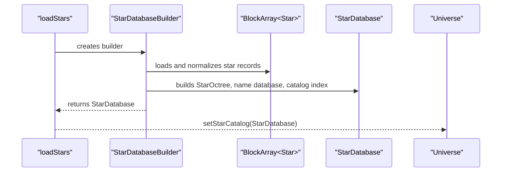

### 12.4 内存形态和关键成员

| 对象 | 内存形态 |
| --- | --- |
| `Universe::starCatalog` | `unique_ptr<StarDatabase>`，表示 Universe 拥有恒星目录 |
| `StarDatabase` | 持有 `StarOctree`、`StarNameDatabase`、目录号索引 |
| `StarOctree` | `StaticOctree<Star, float>` |
| `Star` | 存储在 octree 内，可通过目录和索引查询 |

`Universe::starCatalog -> StarDatabase -> StarOctree -> Star` 是目录和存储链，不是继承链。

### 12.5 所有权和生命周期

| 阶段 | 状态 |
| --- | --- |
| 加载前 | 恒星文件仍是外部数据 |
| builder 阶段 | `StarDatabaseBuilder` 读取并整理恒星数据 |
| finish 阶段 | 构建 `StarOctree`、名称库和索引 |
| 注入阶段 | `StarDatabase` 通过 `Universe::setStarCatalog` 进入 `Universe` |
| 运行阶段 | View3D、查找、补全、太阳系加载等读取恒星目录 |
| 销毁阶段 | `Universe` 销毁时释放 `StarDatabase` |

### 12.6 主要调用者/消费者

| 调用者/消费者 | 使用方式 |
| --- | --- |
| `Universe` | 持有恒星目录，提供查询入口 |
| `SolarSystemsBuilder` | 按恒星创建或查找太阳系对象 |
| 原 View3D | 渲染恒星、标签、可见星点 |
| UI / 搜索 | 名称查询、补全、选择 |

### 12.7 当前 MVC 归属判断

`Star` 和 `StarDatabase` 的核心职责属于 Model。`StarDatabaseBuilder` 当前在 adapter 目录，但职责是加载构建，不能简单归为 View。

## 13. DSODatabase 与 DeepSkyObject

本章定义深空对象目录和深空对象，并说明它与恒星目录相似但不是同一对象类型体系。

### 13.1 定义与系统定位

`DeepSkyObject` 是深空对象基类，`Nebula`、`OpenCluster`、`Galaxy`、`Globular` 等继承它。`DSODatabase` 是深空对象目录和索引容器。

`DSODatabase` 和 `StarDatabase` 可以有共同容器逻辑，但这不表示 `DeepSkyObject` 和 `Star` 在对象层有共同基类。

### 13.2 源码映射

| 项 | 路径 |
| --- | --- |
| `DeepSkyObject` | `src/celengine/model/deepskyobj.h`, `src/celengine/model/deepskyobj.cpp` |
| `DSODatabase` | `src/celengine/model/dsodb.h`, `src/celengine/model/dsodb.cpp` |
| `DSOOctree` | `src/celengine/model/dsooctree.h`, `src/celengine/model/dsooctree.cpp` |
| builder | `src/celengine/adapter/dsodbbuilder.h`, `src/celengine/adapter/dsodbbuilder.cpp` |
| 加载入口 | `src/celestia/loaddso.h`, `src/celestia/loaddso.cpp` |
| 旧实现 | `src/celengine/legacy/galaxy.*`, `src/celengine/legacy/globular.*` |

### 13.3 创建链和输入数据

这是运行时序列图，不是对象所有权图。

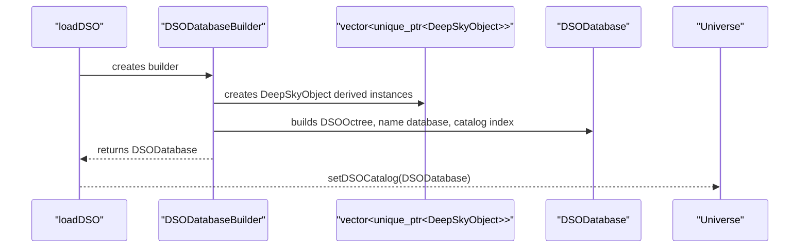

### 13.4 内存形态和关键成员

| 对象 | 内存形态 |
| --- | --- |
| `DSODatabase` | 持有 `DSOOctree`、名称库、目录号索引、平均绝对星等 |
| `DSOOctree` | `StaticOctree<std::unique_ptr<DeepSkyObject>, double>` |
| `DeepSkyObject` 派生对象 | 通过 `unique_ptr` 存在于 octree 中 |

### 13.5 所有权和生命周期

| 阶段 | 状态 |
| --- | --- |
| 加载前 | 深空对象仍是目录文件中的描述 |
| builder 阶段 | builder 创建 `DeepSkyObject` 派生对象集合 |
| finish 阶段 | 构建 octree、名称库、目录号索引 |
| 注入阶段 | `DSODatabase` 通过 `Universe::setDSOCatalog` 进入 `Universe` |
| 运行阶段 | 查找、渲染、拾取消费深空对象 |
| 销毁阶段 | `Universe` 销毁时释放 `DSODatabase` |

### 13.6 主要调用者/消费者

| 调用者/消费者 | 使用方式 |
| --- | --- |
| `Universe` | 持有深空对象目录，提供查询入口 |
| 原 View3D | 渲染深空对象和标签 |
| Picker / UI | 选择、查找、信息显示 |
| Runtime Model 后端 | 抽取场景输出时读取深空对象 |

### 13.7 当前 MVC 归属判断

`DeepSkyObject` 和 `DSODatabase` 的核心职责属于 Model。`Galaxy`、`Globular` 仍在 legacy 目录，说明源码位置不是最终归属的可靠依据。

## 14. SolarSystemCatalog / SolarSystem / PlanetarySystem / Body

本章定义太阳系内对象链，说明 `Star` 和 `Body` 如何关联，`SolarSystem` 对 `Star` 的箭头到底是什么意思。

### 14.1 定义与系统定位

这些是源码类或类型别名，不是本文自造的单一模型。

它们共同构成太阳系内对象的所有权链:

- `SolarSystemCatalog` 按恒星目录号索引 `SolarSystem`。
- `SolarSystem` 表示某颗恒星对应的系统，非拥有引用 `Star*`。
- `PlanetarySystem` 管理某一层级下的 `Body`。
- `Body` 表示太阳系内天体或参考对象，并可拥有子 `PlanetarySystem`。

### 14.2 源码映射

| 项 | 路径 |
| --- | --- |
| `SolarSystem` | `src/celengine/adapter/solarsys.h`, `src/celengine/adapter/solarsys.cpp` |
| `SolarSystemCatalog` | `src/celengine/adapter/solarsys.h` |
| `SolarSystemsBuilder` | `src/celengine/adapter/solarsys.h`, `src/celengine/adapter/solarsys.cpp` |
| `PlanetarySystem` | `src/celengine/model/body.h`, `src/celengine/model/body.cpp` |
| `Body` | `src/celengine/model/body.h`, `src/celengine/model/body.cpp` |
| 加载入口 | `src/celestia/loadsso.h`, `src/celestia/loadsso.cpp` |

### 14.3 运行时创建序列

这是运行时序列图，允许出现函数、builder 和对象。它不表示对象所有权。

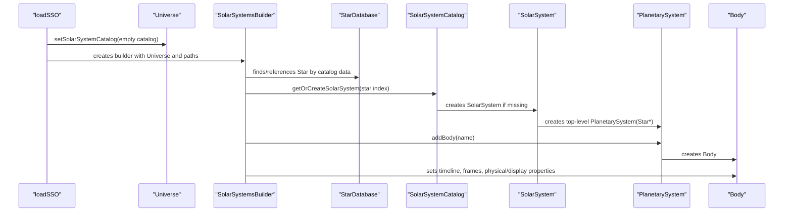

### 14.4 运行期所有权对象图

这是对象所有权图，只放对象和容器。

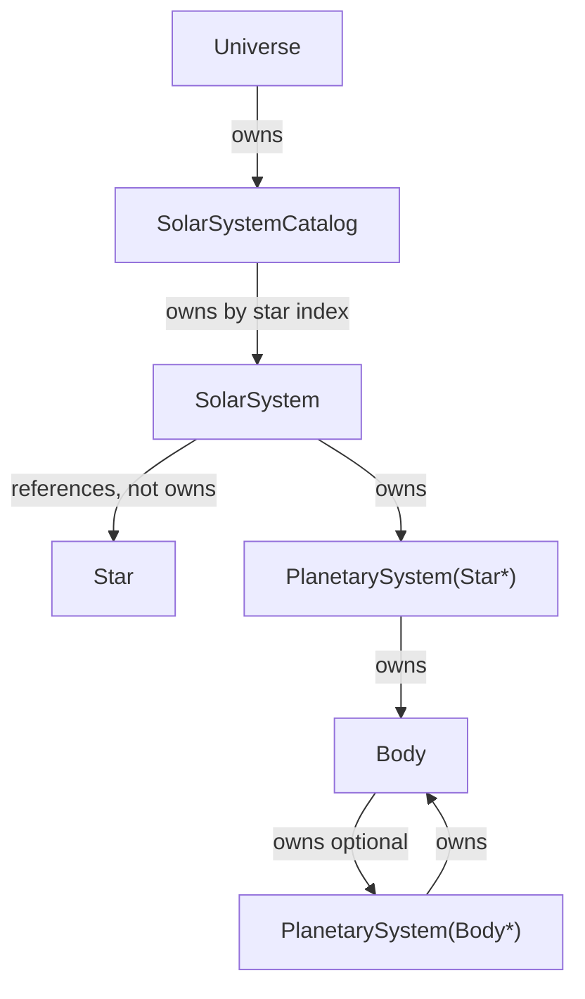

### 14.5 关系解释

| 关系 | 准确含义 |
| --- | --- |
| `SolarSystemCatalog owns SolarSystem` | `SolarSystemCatalog` value 是 `unique_ptr<SolarSystem>` |
| `SolarSystem references Star` | `SolarSystem` 保存 `Star*`，不拥有 `Star`，恒星对象仍由 `StarDatabase` 存储/索引 |
| `SolarSystem owns PlanetarySystem` | `SolarSystem` 构造时创建顶层 `PlanetarySystem(Star*)` |
| `PlanetarySystem owns Body` | `PlanetarySystem::satellites` 是 `vector<unique_ptr<Body>>` |
| `Body owns child PlanetarySystem` | `Body` 可通过 `getOrCreateSatellites` 创建子系统 |

### 14.6 内存形态和关键成员

| 对象 | 关键成员 |
| --- | --- |
| `SolarSystemCatalog` | `unordered_map<AstroCatalog::IndexNumber, unique_ptr<SolarSystem>>` |
| `SolarSystem` | `Star* star`, `unique_ptr<PlanetarySystem> planets`, `unique_ptr<FrameTree> frameTree` |
| `PlanetarySystem` | `Star* star`, `Body* primary`, `vector<unique_ptr<Body>> satellites`, 名称索引 |
| `Body` | 名称、所属 `PlanetarySystem*`、子 `PlanetarySystem`、`Timeline`、`FrameTree`、物理属性、分类、可见性状态 |

### 14.7 所有权和生命周期

| 阶段 | 状态 |
| --- | --- |
| 加载前 | `.ssc` 文件和 extras 中是文本描述 |
| `loadSSO` | 创建并设置 `SolarSystemCatalog` |
| builder 解析 | 查找恒星，按恒星创建或复用 `SolarSystem` |
| `SolarSystem` 构造 | 持有顶层 `PlanetarySystem` 和 `FrameTree`，引用 `Star*` |
| `createBody` | 创建 `Body`，设置属性、时间线、特征 |
| 运行中 | `Universe`、`Simulation`、View3D、UI、脚本读取 |
| 销毁 | `Universe -> SolarSystemCatalog -> SolarSystem -> PlanetarySystem -> Body` 递归释放 |

### 14.8 主要调用者/消费者

| 调用者/消费者 | 使用方式 |
| --- | --- |
| `loadSSO` / `SolarSystemsBuilder` | 创建和填充太阳系对象链 |
| `Universe` | 持有 `SolarSystemCatalog` 并提供查找 |
| `Simulation` | 查询最近太阳系、选择和导航时使用 |
| 原 View3D | 渲染行星、卫星、小天体、轨道等 |
| UI / 脚本 | 对象查找、信息显示、导航 |

### 14.9 当前 MVC 归属判断

`PlanetarySystem` 和 `Body` 的核心职责属于 Model。`SolarSystem` 和 `SolarSystemCatalog` 从职责看也是 Model 对象图的一部分，但源码位置在 `adapter`，这是一个边界不清问题。

`SolarSystemsBuilder` 属于加载构建层，不是 View。它现在在 adapter 目录合理性需要复审。

## 15. BodyFeaturesManager

本章定义 `BodyFeaturesManager` 管理的扩展特征，并说明它为什么是 Model 对象和渲染输入之间的耦合点。

### 15.1 定义与系统定位

`BodyFeaturesManager` 是源码类，通过全局函数返回进程内全局实例。它不是每个 `Body` 内部的一个字段，也不是 `Universe -> Body` 核心所有权树的一部分。

它是横切管理器: 以 `Body*` 为 key，为 `Body` 关联可选扩展特征。

可以把它理解为 `Body` 的 side table。`Body` 自身保存名称、分类、半径、质量、时间线、frame tree 等核心字段；`BodyFeaturesManager` 在 `Body` 外部保存一些可选特征或显示相关补充数据。

它确实位于模型数据和渲染输入之间:

- atmosphere、rings 既像天体属性，也会被 View3D 直接用于渲染。
- locations 参与对象查找、信息显示和地表位置显示。
- reference marks、orbit color、comet tail color 明显接近显示/标注。

所以它不是纯粹的数据层对象，也不是纯粹渲染器对象，而是当前源码里 Model 与 View3D 没有完全分开的证据之一。

### 15.2 源码映射

| 项 | 路径 |
| --- | --- |
| 声明 | `src/celengine/model/body.h` |
| 实现 | `src/celengine/model/body.cpp` |
| 获取入口 | `GetBodyFeaturesManager()` |
| 主要消费者 | `solarsys.cpp`、`universe.cpp`、`render.cpp`、UI 信息面板、拾取/投影相关类 |

需要和 `BodyRenderAssets` 区分:

| 对象 | 位置 | 主要内容 |
| --- | --- | --- |
| `BodyFeaturesManager` | `src/celengine/model/body.*` | atmosphere、rings、locations、reference marks、颜色等可选特征 |
| `BodyRenderAssets` | `src/celengine/adapter/bodyrenderassets.*` | geometry handle、surface、alternate surface、ring texture、geometry orientation/scale 等渲染资源绑定 |

两者都以 `Body` 或其关联对象为 key，都被 View3D 读取，因此共同构成 `Body` 到渲染层之间的耦合区。

### 15.3 内存形态和关键成员

| 成员类别 | 形态 |
| --- | --- |
| atmosphere | `unordered_map<const Body*, unique_ptr<Atmosphere>>` |
| rings | `unordered_map<const Body*, unique_ptr<RingSystem>>` |
| locations | `unordered_map<const Body*, BodyLocations>` |
| reference marks | `unordered_multimap<const Body*, unique_ptr<ReferenceMark>>` |
| orbit colors | `unordered_map<const Body*, Color>` |
| comet tail colors | `unordered_map<const Body*, Color>` |

### 15.4 横切关系图

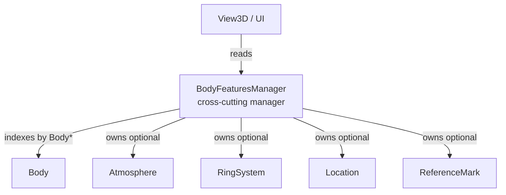

### 15.5 主要调用者/消费者

| 调用者/消费者 | 使用方式 |
| --- | --- |
| `SolarSystemsBuilder` | 加载阶段设置 atmosphere、rings、locations、reference marks、颜色等 |
| `Universe` | 查找 location、marker 等路径可能读取 |
| 原 View3D | 渲染 atmosphere、rings、reference marks、locations、颜色 |
| UI 信息面板 | 显示地点和扩展属性 |

### 15.6 当前 MVC 归属判断

这是混合点:

- `Location` 更接近模型/信息对象，但也被 View 和 picking 使用。
- `ReferenceMark`、orbit color、comet tail color 更接近显示标注或渲染输入。
- atmosphere、rings 既像天体属性，也像渲染输入。

后续不能整体移动或整体保留，必须逐字段分类。

## 16. Adapter

本章定义 `src/celengine/adapter` 当前为什么不能整体归为“连接层”或“View 层”。

### 16.1 定义与系统定位

`adapter` 是源码目录，不是单一职责层。它同时包含加载构建、资源绑定、拾取、几何投影和渲染策略。

### 16.2 源码映射和分类

| 分类 | 代表文件 | 当前判断 |
| --- | --- | --- |
| 加载构建 | `stardbbuilder.*`, `dsodbbuilder.*`, `solarsys.*` | 从外部数据构建 Model 对象图 |
| 资源绑定 | `bodyrenderassets.*`, `starrenderassets.*` | Model 对象到渲染资源状态的绑定 |
| 拾取 | `selectionpicker.*`, `deepskyobjectpicker.*` | Controller/View/Model 交界 |
| 几何投影 | `bodylocationgeometryprojector.*`, `sceneviewmodel.*` | 把 Model 对象转换成 View 可用几何/场景数据 |
| 渲染策略 | `deepskyobjectrenderpolicy.*` | View3D 策略倾向明显 |

### 16.3 主要调用者/消费者

| 调用者/消费者 | 使用方式 |
| --- | --- |
| 启动编排层 | 调用 builder 构建 Model 对象目录 |
| Model 对象 | 部分 adapter 类型创建或填充 Model 对象 |
| View3D | 使用资源绑定、投影、拾取、渲染策略 |
| Runtime | 部分 scene extraction / view model 路径可能复用 adapter |

### 16.4 当前 MVC 归属判断

`adapter` 是混合目录:

- builder 类更接近加载构建层。
- render assets 更接近 View3D 资源绑定。
- picker 和 projector 是跨 Model / Controller / View 的适配逻辑。

后续拆分时应按类分类，不能按目录整体移动。

## 17. 原 View3D

本章定义当前原 View3D 为什么不是一个已经平权的模板 View，并解释它为什么分散在多个目录和组件中。

### 17.1 定义与系统定位

原 View3D 是当前单 exe 渲染体验的主要实现路径，但它不是一个已经封装好的独立 View 组件。它分散在 `src/celengine/view3d`、`src/celrender/view3d`、部分 `adapter`、部分 `legacy` 和应用层调用中。

它分散的主要原因不是“目标设计上应该分散”，而是当前源码历史形态和职责混合造成的:

1. 原 Celestia 是单体式应用演化出来的，View3D 很早就直接读取 `Simulation`、`Universe`、`Observer`、`Body`、`StarDatabase`、`DSODatabase` 等对象。
2. 后来的 CMake 目标拆分把代码分成 `celestia_model`、`celestia_controller`、`celestia_view_adapter`、`celestia_view3d`、`celrender` 等对象目标，但这主要是编译组织拆分，不等于运行职责已经完全归位。
3. View3D 不是只有 OpenGL draw call。它还需要纹理、网格、星点/深空对象渲染策略、body geometry、surface、ring texture、picking、location projection、reference marks、UI 状态等辅助能力。这些能力分别落在 view3d、celrender、adapter、legacy、celestia 应用层中。
4. `BodyFeaturesManager` 和 `BodyRenderAssets` 这类对象把 `Body` 的模型属性、扩展特征和渲染资源绑定在一起，使 View3D 不能简单被看成“只消费一份场景输出”的独立前端。

### 17.2 源码映射

| 目录 | 当前角色 |
| --- | --- |
| `src/celengine/view3d` | 原 3D 视图基础设施、渲染上下文、纹理、网格、光照、对象渲染辅助 |
| `src/celrender/view3d` | 具体渲染实现 |
| `src/celengine/adapter` | 部分资源绑定、拾取、投影、渲染策略 |
| `src/celengine/legacy` | 部分仍参与对象和渲染的旧结构 |
| `src/celestia` | 应用层直接驱动渲染和 UI 状态 |

更细地看:

| 位置 | 更具体的职责 |
| --- | --- |
| `src/celengine/view3d` | mesh/texture manager、render context、render list、star/dso/body 渲染辅助、选择命中相关基础 |
| `src/celrender/view3d` | 渲染器实现和 OpenGL 相关绘制逻辑 |
| `src/celengine/adapter/bodyrenderassets.*` | 将 `Body` 关联到 geometry、surface、alternate surface、ring texture 等渲染资源 |
| `src/celengine/adapter/*picker*` / `*projector*` | 把模型对象转换成可拾取或可投影的 View 几何信息 |
| `src/celestia/celestiacore.*` | 应用层持有 `Simulation`，处理输入、UI、渲染驱动、reference marks 切换等 |
| `src/celengine/legacy` | 保留部分仍被对象体系和渲染读取的旧类型 |

### 17.3 当前对象消费方式

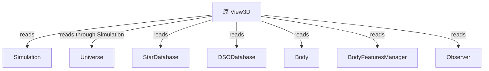

### 17.4 主要调用者/消费者

| 调用者/消费者 | 使用方式 |
| --- | --- |
| 应用层 | 驱动渲染循环和 UI 状态 |
| View3D renderer | 消费 `Simulation`、`Universe`、`Observer` 和 Model 对象 |
| Adapter | 提供资源绑定、投影、拾取能力 |
| Runtime View3D host | 后续需要对齐原 View3D 能力 |

### 17.5 当前 MVC 归属判断

当前原 View3D 大量直接消费 Model 和 Controller 对象，并没有完全通过一份独立场景数据输入。因此后续“模板 View”工作不能从视觉效果反推，而要从这些真实依赖链开始整理。

后续 View3D 深入分析至少要回答:

1. 哪些文件是 View3D 私有能力，可以进入未来 `view3d_legacy` 模板 View。
2. 哪些能力应成为多个 View 共用的 provider 或 adapter。
3. 哪些能力其实是 Model 计算或数据构建，不应被移动到 View。
4. `BodyFeaturesManager`、`BodyRenderAssets`、Texture/Mesh managers 分别怎样把模型对象和渲染资源连接起来。
5. 原 View3D 当前从 `Simulation`、`Universe`、`Observer`、`Body`、`StarDatabase`、`DSODatabase` 读取哪些数据，未来这些数据应通过什么输入规范交给 View。

## 18. Runtime 服务层

本章定义 `src/celruntime` 是什么，以及它和真实 Model 的关系是什么。

### 18.1 定义与系统定位

`src/celruntime` 是运行时服务和进程化外壳，不是核心 Model 本体。它提供协议、host、传输、IPC 和服务封装。

### 18.2 源码映射

| 子目录 | 当前角色 |
| --- | --- |
| `model` | `ModelService`、`SimulationBackend`、`RealModelBackend`、`SceneExtractor` |
| `controller` | Controller host 和服务 |
| `view` | View host/service |
| `view3d` | View3D host 和运行时场景 |
| `protocol` | 运行时消息结构 |
| `process` / `transport` / `ipc` / `dataplane` | 进程、传输、IPC、数据通道 |

### 18.3 当前创建链

`RealModelBackend` 创建真实 `Universe` 和真实 `Simulation`，并不是另起一套假模型。它的问题主要在于:

- 输出协议是否覆盖原 View3D 所需能力仍需验证。
- View host 能否复现原 View3D 能力仍未完成。
- Model、Controller、View 的源码边界仍未完全干净。

### 18.4 主要调用者/消费者

| 调用者/消费者 | 使用方式 |
| --- | --- |
| 多进程 host | 启动 model/controller/view 服务 |
| `RealModelBackend` | 复用真实加载链创建核心对象 |
| `SceneExtractor` | 从真实 `Simulation` 抽取场景输出 |
| View host | 消费运行时场景数据 |

### 18.5 当前 MVC 归属判断

`src/celruntime` 可以成为后续验证和多进程解耦的基础能力，但不能用它的存在证明 MVC 已经完成。

## 19. 当前边界问题清单

本章集中列出当前已经确认的边界问题。

| 编号 | 问题 | 证据 | 风险 |
| --- | --- | --- | --- |
| B1 | Model 头文件依赖 Controller 类型 | `universe.h` include `controller/selection.h` | Model 层不独立；但这不等于 Model 保存当前选择状态 |
| B2 | Controller 依赖 View3D | `simulation.h` include `view3d/texture.h` | Controller 层不独立 |
| B3 | `SolarSystem` 职责像 Model，但位于 adapter | `solarsys.h` 定义 `SolarSystem` 和 `SolarSystemCatalog` | 目录和职责不一致 |
| B4 | `BodyFeaturesManager` 混合模型属性和显示属性 | atmosphere、rings、locations、reference marks、颜色均在同一 manager | 拆分时容易误删或错放 |
| B5 | 原 View3D 直接消费 Model / Controller | render、picker、UI 路径直接读取对象 | 无法把 View 当成普通可替换组件 |
| B6 | legacy 类仍参与 Model 和 View | `Galaxy`、`Globular` 等仍被使用 | 不能简单按目录清理 |
| B7 | runtime 能创建真实 Model，但输出覆盖度未证明 | `RealModelBackend` 复用真实加载链 | 三进程 View 能力可能缺失 |
| B8 | 启动编排职责没有独立抽象 | `CelestiaCore::initSimulation` 和 `RealModelBackend::load` 各自编排创建链 | 未来单 exe 和 runtime 路径可能重复或偏离 |

## 20. 后续分析和验收的影响

基于本文，后续不能再用“目录已拆”或“台账清零”作为充分验收条件。至少要同时看:

1. 静态源码依赖是否单向。
2. 启动编排层是否清晰且单 exe / runtime 路径一致。
3. 运行时创建链是否完整。
4. 内存对象所有权是否清楚。
5. 每个对象是否能按统一模板说明。
6. 图中的每条关系是否有明确语义。
7. View3D 是否通过明确输入读取 Model / Controller，而不是散乱直接访问。
8. 回归脚本是否覆盖恒星、深空对象、太阳系内对象、选择、观察者、时间推进和多截图场景。

## 附录 A. 源码实体与分析分组对照

| 分组名 | 是否源码实体 | 包含源码实体 | 使用注意 |
| --- | --- | --- | --- |
| 启动编排层 | 否 | `CelestiaCore::initSimulation`, `RealModelBackend::load`, 加载函数 | 当前没有单独源码类完整承载 |
| Simulation | 是 | `Simulation` | 运行会话根对象，但实际创建晚于 `Universe` |
| Observer / ObserverFrame | 是 | `Observer`, `ObserverFrame` | Controller 运行状态 |
| Timeline / TimelinePhase | 是 | `Timeline`, `TimelinePhase` | Model 时间阶段计算对象 |
| ReferenceFrame / FrameTree | 是 | `ReferenceFrame`, `FrameTree` | Model 坐标计算对象 |
| Universe | 是 | `Universe` | Model 聚合入口，被 `Simulation` 拥有 |
| Selection | 是 | `Selection` | 对象引用包装，不是天体对象，不是对象所有者 |
| StarDatabase / Star | 是 | `StarDatabase`, `Star`, `StarOctree`, builder | 表示恒星目录和恒星对象链 |
| DSODatabase / DeepSkyObject | 是 | `DSODatabase`, `DeepSkyObject`, `DSOOctree`, builder | 表示深空对象目录和对象链 |
| SolarSystem / Body 结构 | 是 | `SolarSystemCatalog`, `SolarSystem`, `PlanetarySystem`, `Body` | 不是一个源码类，是多个源码实体组成的对象链 |
| BodyFeaturesManager | 是 | `BodyFeaturesManager` 及其管理的数据 | 横切管理器，混合属性必须逐项判断 |
| Adapter | 目录分组 | `src/celengine/adapter/*` | 目录内职责混合，不可整体归类 |
| 原 View3D | 目录和职责分组 | `src/celengine/view3d`, `src/celrender/view3d`, 部分 adapter/legacy | 不是平权模板 View |
