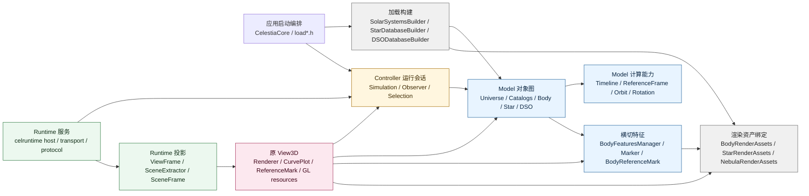
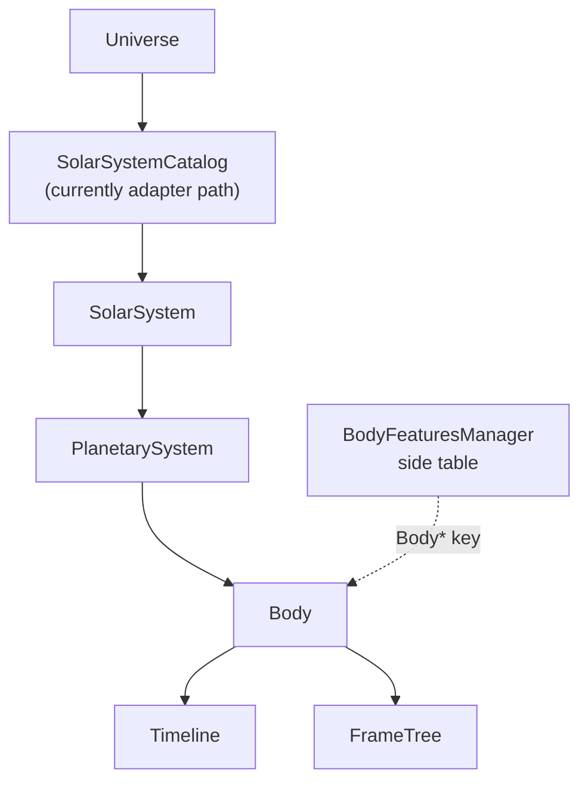

# Celestia 当前源码结构与 Model 类族分析第二版

记录时间: 2026-07-03

本文定位: 本文是 `02-09-Celestia当前源码结构与Model类族分析.md` 的第二版分析文档。第一版不覆盖、不删除，作为原始分析过程和用户评审意见吸收过程的记录保留。第二版在第一版基础上，引入 Step20A-D 的源码治理证据、`02-10` 的实体归属矩阵和 `02-11` 的 Runtime Model 输出分层说明，重新整理 Celestia 当前源码结构、Model 类族、交界对象和剩余边界债务。

本文不是最终架构定案，也不表示 Model 层已经完全解耦。

## 1. 版本关系

| 版本 | 文件 | 定位 | 保留原因 |
| --- | --- | --- | --- |
| 第一版 | `DOC/CODEX_DOC/02_设计说明/02-09-Celestia当前源码结构与Model类族分析.md` | 首轮源码结构和 Model 类族分析 | 保留分析方法演进、用户批注吸收过程、第一轮概念纠偏记录 |
| 第二版 | `DOC/CODEX_DOC/02_设计说明/02-12-Celestia当前源码结构与Model类族分析第二版.md` | Step20 后的结构重划分和类族再分析 | 在第一版基础上纳入边界治理后的源码事实，重新区分类族、职责和剩余债务 |

第二版不替代第一版的历史价值。第一版更像“从源码中建立观察框架”；第二版更像“在源码治理后建立更稳定的边界地图”。

## 2. 第二版相对第一版的改进记录

| 第一版中的问题或不足 | Step20 后的新证据 | 第二版如何改进 |
| --- | --- | --- |
| `Model`、`Controller`、`Adapter`、`Runtime` 的分组已经有了，但部分分组仍偏概念化 | Step20A 建立了实体归属矩阵，Step20B-D 对低风险 include、生命周期事件、OrbitSampler、ReferenceMark、Marker 做了源码治理 | 第二版按“核心对象图、计算能力、运行会话状态、横切特征、渲染资产绑定、加载构建、Runtime 投影”重新分层 |
| `BodyFeaturesManager` 被识别为横切管理器，但字段级归属还不够清楚 | `ReferenceMark` 已拆为 Model 侧 `BodyReferenceMark` 和 View3D 侧 `ReferenceMark` | 第二版把 `BodyFeaturesManager` 分成核心扩展事实、显示输入、View3D 表现三类 |
| `ReferenceMark` / `MarkerRepresentation` 曾被整体看成混合点 | `Marker` / `MarkerRepresentation` 已移入 Model，并去掉 renderer 绘制方法；`ReferenceMark` 变为 View3D 派生表现类 | 第二版明确区分“标记语义/表现参数”和“具体绘制实现” |
| `OrbitSampler` 与 View3D 曲线对象的关系只是问题描述 | `OrbitSampler` 已改为输出 `OrbitSample`，View3D 在 `render.cpp` 中转换为 `CurvePlotSample` | 第二版把“Model 采样”和“View 曲线绘制”分成两个类族 |
| Adapter 被整体描述为交界层 | Step20 后仍剩 `adapter->view` 12 项，且 `SceneViewModel` 仍产生 `adapter->runtime` 债务 | 第二版把 Adapter 拆成加载构建、渲染资产绑定、拾取、几何投影、Runtime 投影五类 |
| Runtime Model 输出容易被误认为已经是纯 Model 快照 | `ViewFrame` 仍同时承担 backend snapshot、view.frame payload、SceneExtractor 输入三种角色 | 第二版明确 `ViewFrame` 是历史形成的 runtime 投影结构，不是最终 ModelSnapshot |
| 边界问题清单是静态问题列表 | Step20 扫描基线从 88 项降到 64 项，且 `model->view` / `model-view-symbol` 清零 | 第二版把边界问题改成“已治理、剩余债务、下一阶段入口”三类 |

## 3. 分析方法

第二版使用三层证据:

| 证据层 | 内容 | 作用 |
| --- | --- | --- |
| 源码事实 | `src/celengine/model`、`controller`、`adapter`、`view3d`、`src/celruntime/model` 的类、include、消费者 | 确认对象实际做什么、谁持有、谁读取、谁调用 |
| 治理证据 | Step20B-D 已完成的代码变更和扫描结果 | 判断哪些边界已经被源码验证，哪些只是分析结论 |
| 输出分层证据 | `ViewFrame`、`SceneFrame`、`SceneExtractor`、`ModelService`、`RealModelBackend` | 判断 runtime 输出到底是 Model 事实、Scene 投影，还是跨进程消息 |

本文不采用“目录名等于层次归属”的判断方法。Celestia 是长期演化的单体式系统，目录位置只能作为线索，不能直接作为 MVC 归属结论。

## 4. 第二版总览图



图中最重要的事实是: 原 View3D 不是只消费一份独立场景输出的普通 View。它仍直接读取 `Simulation`、`Universe`、`BodyFeaturesManager` 和渲染资产绑定对象。这就是后续模板 View 迁移不能先于边界治理的原因。

## 5. 第二版类族划分

第二版把源码实体分成九个类族。

| 类族 | 代表实体 | 当前归属判断 | 后续治理方向 |
| --- | --- | --- | --- |
| 启动编排类族 | `CelestiaCore::initSimulation`、`loadStars`、`loadSSO`、`loadDSO`、`RealModelBackend::load` | 应用/Runtime 编排，不是 Model 本体 | 后续统一加载编排入口，避免单 exe 和 runtime 路径发散 |
| 运行会话类族 | `Simulation`、`Observer`、`ObserverFrame`、`Selection` | Controller 运行状态，引用 Model 对象 | 清理 View3D 残留依赖，避免把当前选择/观察者误归为纯 Model |
| Model 对象图类族 | `Universe`、`StarDatabase`、`DSODatabase`、`SolarSystemCatalog`、`SolarSystem`、`PlanetarySystem`、`Body`、`Location` | Model 核心对象图 | 继续处理 `Universe -> solarsys.h` 的 adapter 位置债务 |
| Model 计算类族 | `Timeline`、`TimelinePhase`、`ReferenceFrame`、`FrameTree`、`Orbit`、`RotationModel`、`OrbitSampler` | Model 计算能力 | 保留计算能力，输出只暴露采样事实，不暴露 View 曲线对象 |
| 横切特征类族 | `BodyFeaturesManager`、`BodyReferenceMark`、`Marker`、`MarkerRepresentation`、`MarkerList` | Model 事实和显示输入的混合区，Step20 后已部分收敛 | 按字段继续区分 Model 事实、表现参数、View3D 私有绘制 |
| 生命周期事件类族 | `BodyLifecycleEvents`、`StarDetailsLifecycleEvents`、`NebulaLifecycleEvents` | Model 侧生命周期事实，Adapter 订阅 | 已从 adapter 迁入 model；后续观察是否需要更中立的 core/event 位置 |
| Adapter 加载构建类族 | `SolarSystemsBuilder`、`StarDatabaseBuilder`、`DSODatabaseBuilder` | 构建 Model 对象，但仍混入渲染资产绑定 | 拆成纯对象构建和渲染资产后处理 |
| Adapter View 支撑类族 | `BodyRenderAssets`、`StarRenderAssets`、`NebulaRenderAssets`、picker、projector、render policy | View/Render asset binding 或 Controller/View 交界 | 不进入 Model；后续结合 View3D 模板迁移调整目录和接口 |
| Runtime 输出类族 | `SimulationBackend`、`RealModelBackend`、`ModelService`、`ViewFrame`、`SceneExtractor`、`SceneFrame` | Runtime 服务和投影结构，不是纯 Model 本体 | 拆分 ModelSnapshot、SceneProjection、SceneFrame 三层 |

## 6. 启动编排类族

### 6.1 定义

启动编排类族负责把配置、数据路径、catalog、对象图、运行会话和渲染资源初始化串起来。它不等于 Model，也不等于 Controller。

代表路径:

```text
src/celestia/celestiacore.*
src/celestia/loadstars.*
src/celestia/loaddso.*
src/celestia/loadsso.*
src/celruntime/model/realmodelbackend.cpp
```

### 6.2 当前事实

单 exe 主路径和 Runtime RealModelBackend 都会复用真实加载链，但两者处在不同编排上下文:

```text
单 exe:
CelestiaCore::initSimulation
  -> load stars / dso / solar system
  -> create Universe
  -> create Simulation
  -> View3D 直接消费 Simulation / Universe

Runtime:
RealModelBackend::load
  -> load stars / dso / solar system
  -> create Universe
  -> create Simulation
  -> create ViewFrame projection
```

### 6.3 第二版判断

启动编排不应被塞进 Model。它的职责是装配 Model、Controller、Adapter 和 Runtime 所需的真实对象。后续如果把 `RealModelBackend` 中的应用层加载 include 全部清理掉，也不意味着加载编排消失，而是应把加载编排沉到可复用的中立初始化模块。

## 7. 运行会话类族

### 7.1 Simulation

`Simulation` 是运行会话根对象。它持有 `Universe`，管理仿真时间、观察者、选择、暂停、导航和运行状态。第一版已经指出 `Simulation` 管理全局仿真时间；第二版进一步明确它不是纯 Model 对象图，而是 Controller 运行会话。

Step20 已完成:

```text
src/celengine/controller/simulation.h
  删除无用的 view3d/texture.h include
```

当前判断:

| 维度 | 判断 |
| --- | --- |
| 是否 Model 对象图 | 否 |
| 是否 Controller 运行状态 | 是 |
| 是否仍被 View3D 直接消费 | 是 |
| 是否已完全解耦 | 否 |

### 7.2 Observer / ObserverFrame

`Observer` 保存当前视点、姿态、速度、FOV、旅行动作和跟踪关系。`ObserverFrame` 是 Controller 侧对 Model 参考系的包装，它引用 `ReferenceFrame` 语义，但不替代 `ReferenceFrame` 本身。

第二版判断:

```text
ReferenceFrame 是 Model 计算抽象。
ObserverFrame 是 Controller 运行状态包装。
Observer 是当前会话视点状态。
```

这三个概念不能合并，否则后续输出协议规范会把“坐标计算事实”和“当前用户视角状态”混在一起。

### 7.3 Selection

`Selection` 是 typed handle 或引用包装，不是对象目录，不是数据管理器，也不是天体对象所有者。它的价值在于统一引用 `Star`、`Body`、`DeepSkyObject`、`Location` 等对象。

第二版把 `Selection` 放在运行会话类族和接口污染点之间:

| 角色 | 说明 |
| --- | --- |
| 运行会话状态 | 当前选择由 `Simulation` 管理 |
| 引用包装 | 通过 typed handle 引用对象图实体 |
| 接口污染点 | `Universe` 当前仍可能暴露依赖 `Selection` 的查询接口 |

结论: `Selection` 不应被拔高为核心 Model 类族，但也不能忽略，因为它是 Controller 状态和 Model 查询接口之间的重要连接点。

## 8. Model 对象图类族

### 8.1 Universe

`Universe` 是 Model 对象图聚合入口。它持有或访问恒星目录、深空目录、太阳系目录和 marker 列表。

当前关键事实:

```text
src/celengine/model/universe.h
  仍 include <celengine/adapter/solarsys.h>
```

第二版判断:

| 项 | 判断 |
| --- | --- |
| 核心职责 | Model 对象图聚合入口 |
| 当前问题 | `SolarSystem` / `SolarSystemCatalog` 职责像 Model，但源码仍在 adapter |
| Step20 后状态 | `Marker` 已迁入 Model，但 `Universe -> solarsys.h` 仍是剩余 `model->adapter` 债务 |
| 下一阶段入口 | 把 `SolarSystem` / `SolarSystemCatalog` 与加载构建逻辑拆开 |

### 8.2 StarDatabase / Star / StarDetails

恒星类族由目录、对象、细节数据和渲染资产绑定共同构成:

| 层次 | 代表实体 | 当前判断 |
| --- | --- | --- |
| Model 对象 | `Star`、`StarDetails` | Model 核心事实和物理/光谱属性 |
| Model 目录 | `StarDatabase` | Model 对象目录 |
| 加载构建 | `StarDatabaseBuilder` | Adapter 加载构建，目前仍混入渲染资产绑定 |
| 渲染资产绑定 | `StarRenderAssets` | View/Render asset binding |
| 生命周期事件 | `StarDetailsLifecycleEvents` | Step20 后位于 Model，Adapter 订阅 |

第二版判断: `StarDetailsLifecycleEvents` 从 adapter 移入 model 后，依赖方向变为 Model 发布生命周期事实、RenderAssets 订阅刷新。这比第一版的“混合点描述”更清楚。

### 8.3 DSODatabase / DeepSkyObject

深空对象类族包括 `DeepSkyObject`、`DSODatabase`、`Galaxy`、`Globular`、`Nebula` 等实体。部分实现仍在 legacy 目录，因此不能用目录名判断归属。

第二版判断:

| 层次 | 代表实体 | 当前判断 |
| --- | --- | --- |
| Model 对象 | `DeepSkyObject`、`Nebula`、`Galaxy`、`Globular` | 深空对象事实和分类 |
| Model 目录 | `DSODatabase` | 深空对象目录 |
| 加载构建 | `DSODatabaseBuilder` | Adapter 加载构建 |
| 渲染资产绑定 | `NebulaRenderAssets` | View/Render asset binding |
| 生命周期事件 | `NebulaLifecycleEvents` | Step20 后位于 Model，Adapter 订阅 |

### 8.4 SolarSystemCatalog / SolarSystem / PlanetarySystem / Body

太阳系和天体对象族是当前最重要的 Model 对象图:



第二版判断:

| 对象 | 当前归属 | 主要问题 |
| --- | --- | --- |
| `Body` | Model 核心对象 | 通过 `BodyFeaturesManager` 连接扩展特征和显示输入 |
| `PlanetarySystem` | Model 对象图 | 归属较清楚 |
| `SolarSystem` / `SolarSystemCatalog` | 职责属于 Model，但路径在 adapter | 形成 `Universe -> adapter/solarsys.h` 债务 |
| `SolarSystemsBuilder` | 加载构建 | 与 render asset binding 混在 `solarsys.cpp` |

结论: 下一阶段不能只移动 `solarsys.h`。应先拆清 `SolarSystem` / `SolarSystemCatalog` 数据结构、`SolarSystemsBuilder` 加载逻辑、`BodyRenderAssets` 渲染资源绑定三者。

### 8.5 Star / DSO / SolarSystem 三类 catalog 横向审计

本节用于防止把 `model->adapter` 扫描结果误读为“整个 Model 解耦只剩一个问题”。当前更准确的判断是: `SolarSystem` 是唯一仍造成 `src/celengine/model` 直接 include `src/celengine/adapter` 的 catalog 类族；但 `Star` 和 DSO 类族也没有达到理想的完全解耦。

源码审计结果:

| 类族 | 核心对象位置 | Builder 位置 | RenderAssets 位置 | Model 是否直接 include Adapter | 当前判断 |
| --- | --- | --- | --- | --- | --- |
| Star | `src/celengine/model/stardb.*`, `src/celengine/model/star.*` | `src/celengine/adapter/stardbbuilder.*` | `src/celengine/adapter/starrenderassets.*` | 没有直接 include；存在 `friend class StarDatabaseBuilder` | 基本分层，但未完全解耦 |
| DSO | `src/celengine/model/dsodb.*`, `src/celengine/model/deepskyobj.*`, `src/celengine/model/nebula.*` | `src/celengine/adapter/dsodbbuilder.*` | `src/celengine/adapter/nebularenderassets.*` | 没有直接 include；存在 `friend class DSODatabaseBuilder` | 基本分层，但未完全解耦 |
| SolarSystem | `SolarSystem` / `SolarSystemCatalog` 仍定义在 `src/celengine/adapter/solarsys.h` | `SolarSystemsBuilder` 同在 `src/celengine/adapter/solarsys.h/.cpp` | `src/celengine/adapter/bodyrenderassets.*`，并在 `solarsys.cpp` 中直接触碰 geometry / texture 路径 | 有，`Universe` 直接 include `adapter/solarsys.h` | 核心对象还未从 Adapter 中拆出 |

Star 类族仍存在的非理想点:

```text
Star / StarDatabase 对 StarDatabaseBuilder 有 friend 关系。
StarDatabaseBuilder 仍位于 adapter。
StarDatabaseBuilder 仍处理 TexturePaths / StarRenderAssets。
StarRenderAssets 仍 include view3d/meshmanager.h。
StarDetails 中仍保留 KnowTexture 这类历史混合痕迹。
```

DSO 类族仍存在的非理想点:

```text
DSODatabase 对 DSODatabaseBuilder 有 friend 关系。
DSODatabaseBuilder 仍位于 adapter。
NebulaRenderAssets 仍 include view3d/meshmanager.h。
NebulaRenderAssetLoader 仍是 adapter/view 资源加载路径。
```

SolarSystem 类族与 Star/DSO 的关键差异:

```text
StarDatabase / DSODatabase 的核心 catalog 类型已经在 model 目录。
SolarSystem / SolarSystemCatalog 的核心 catalog 类型仍定义在 adapter/solarsys.h。
```

因此，`SolarSystem` 可以作为下一步的特殊切片处理，但这不是因为其他 catalog 已经完美解耦，而是因为它当前留下了最硬、最直接、最可定位的 Model 反向依赖:

```text
src/celengine/model/universe.h
  -> #include <celengine/adapter/solarsys.h>
```

Step21A 必须先产出三类 catalog 对照审计和 `solarsys.*` 内部职责拆分表，至少回答:

1. 哪些实体已经按 Model / Builder / RenderAssets 基本分层。
2. 哪些只是目录上看起来分层，实际上仍有 friend、texture、render assets、builder 混合债务。
3. 为什么本轮只把 `SolarSystem` / `SolarSystemCatalog` 作为硬依赖治理对象。
4. 哪些 Star/DSO/Builder/RenderAssets 债务明确留给后续 loading 和 render-assets 阶段处理。

## 9. Model 计算类族

### 9.1 Timeline / TimelinePhase

`Timeline` 是每个 `Body` 的时间阶段集合，不是全局仿真时间管理器。全局仿真时间由 `Simulation` 管理。

第二版固定以下判断:

```text
Simulation 管理当前运行时间。
Timeline 描述 Body 在不同时间段的阶段。
TimelinePhase 描述阶段内的 orbit、rotation、frame tree 和父对象关系。
```

### 9.2 ReferenceFrame / FrameTree

`ReferenceFrame` 是 Model 侧坐标计算抽象。`FrameTree` 管理参考系层级和阶段关系。

第二版固定以下判断:

```text
ReferenceFrame 属于 Model 计算能力。
ObserverFrame 属于 Controller 运行状态。
View3D 读取参考系结果，不意味着 ReferenceFrame 是 View。
```

### 9.3 Orbit / RotationModel / OrbitSampler

`Orbit` 和 `RotationModel` 是 Model 计算能力。`OrbitSampler` 是轨道采样适配器。

Step20 前:

```text
OrbitSampler -> CurvePlot / CurvePlotSample
```

Step20 后:

```text
OrbitSampler -> vector<OrbitSample>
View3D render.cpp -> OrbitSample -> CurvePlotSample
```

第二版判断:

| 实体 | 当前层次 |
| --- | --- |
| `Orbit` | Model 计算 |
| `RotationModel` | Model 计算 |
| `OrbitSample` | Model 采样事实 |
| `CurvePlot` / `CurvePlotSample` | View3D 曲线绘制结构 |

这是 Step20 中最清晰的一类“从业务层角度拆分”的例子: 不是按视觉效果重做轨道线，而是把已有源码里的计算输出和绘制输入分开。

## 10. 横切特征类族

### 10.1 BodyFeaturesManager

`BodyFeaturesManager` 是以 `Body*` 为 key 的 side table。它不是 `Universe -> Body` 核心所有权树的一部分，但它管理的字段会影响 Model 事实、View 表现和资源绑定。

第二版字段级分类:

| 字段/能力 | 当前含义 | 第二版归属判断 | 后续治理方式 |
| --- | --- | --- | --- |
| atmosphere | 天体大气描述，View 会消费 | Model 扩展事实 + View 消费 | 保留 Model 数据，输出时投影 |
| rings | 环系统对象，影响边界和渲染 | Model 扩展事实 + 渲染资产绑定 | Model 保留事实，RenderAssets 管资源 |
| locations | 地表地点 | Model 信息对象 | View 投影/拾取在 Adapter/View |
| geometry / surface 相关引用 | 渲染资源引用 | 渲染资产绑定 | 不进入纯 Model |
| orbit color / comet tail color | 显示参数 | 表现输入 | 后续归入 SceneProjection 或 View style |
| reference marks | 标记语义与 View3D 表现混合 | Step20 后拆为 `BodyReferenceMark` + View3D `ReferenceMark` | 继续审计哪些字段属于 Model 事实 |

### 10.2 BodyReferenceMark / ReferenceMark

Step20 后结构:

```text
src/celengine/model/bodyreferencemark.h
  BodyReferenceMark

src/celengine/view3d/referencemark.h
  ReferenceMark : public BodyReferenceMark
```

第二版判断:

| 层次 | 实体 | 职责 |
| --- | --- | --- |
| Model | `BodyReferenceMark` | 保存参考标记的模型侧基础语义和可查询状态 |
| View3D | `ReferenceMark` | 负责 View3D 的 render / opacity 等表现行为 |
| Bridge | `BodyFeaturesManager` | 以 `Body*` 关联 reference mark，但 View3D 渲染前需要类型判断 |

这不是最终完美形态，但相对第一版已经从“混合对象”推进为“Model 基类 + View3D 派生表现类”。

### 10.3 Marker / MarkerRepresentation / MarkerList

Step20 后:

```text
src/celengine/model/marker.h
src/celengine/model/marker.cpp
```

旧位置:

```text
src/celengine/legacy/marker.h
src/celengine/legacy/marker.cpp
```

第二版判断:

| 内容 | 归属 |
| --- | --- |
| 标记某个对象 | Model/Controller 语义，取决于是否表示持久对象标注还是当前会话操作 |
| symbol / size / color / label | 表现参数，但不是 renderer 代码 |
| OpenGL 绘制 marker | View3D 私有实现 |

Step20 的实际治理是删除 `MarkerRepresentation::render` 这类 renderer 方法，让 View3D 通过 `renderMarker(symbol, size, color, ...)` 使用这些表现参数。这样 `MarkerRepresentation` 仍有显示含义，但不再直接拥有绘制实现。

## 11. 生命周期事件类族

Step20 把以下生命周期事件从 adapter 迁入 model:

```text
src/celengine/model/bodylifecycle.*
src/celengine/model/stardetailslifecycle.*
src/celengine/model/nebulalifecycle.*
```

删除旧位置:

```text
src/celengine/adapter/bodylifecycle.*
src/celengine/adapter/stardetailslifecycle.*
src/celengine/adapter/nebulalifecycle.*
```

第二版判断:

| 事件类族 | 发布者 | 订阅者 | 当前方向 |
| --- | --- | --- | --- |
| `BodyLifecycleEvents` | `Body` | `BodyRenderAssets` | Model 发布生命周期事实，Adapter 订阅 |
| `StarDetailsLifecycleEvents` | `StarDetails` | `StarRenderAssets` | Model 发布生命周期事实，Adapter 订阅 |
| `NebulaLifecycleEvents` | `Nebula` | `NebulaRenderAssets` | Model 发布生命周期事实，Adapter 订阅 |

这一治理的意义不是“新增功能”，而是修正依赖方向。原来 Model 对象为了通知渲染资产刷新而 include adapter 事件头；现在事件头在 Model 侧，渲染资产绑定层订阅它。

## 12. Adapter 类族细分

第二版不再把 Adapter 当成一个单一层。

| 子类族 | 代表文件 | 当前职责 | 第二版判断 |
| --- | --- | --- | --- |
| 加载构建 | `solarsys.*`、`stardbbuilder.*`、`dsodbbuilder.*` | 从配置和数据文件构建 Model 对象图 | 应拆出纯 Model loading 部分 |
| 渲染资产绑定 | `bodyrenderassets.*`、`starrenderassets.*`、`nebularenderassets.*` | 管理 mesh、texture、geometry 等资源绑定 | 属于 View/Render data-plane，不进 Model |
| 拾取 | `selectionpicker.*`、`deepskyobjectpicker.*` | 从 View 输入和几何信息解析 Selection | Controller/View 交界 |
| 几何投影 | `bodylocationgeometryprojector.*`、`selectiongeometryprovider.*` | 为 location、selection、拾取提供 View 可用几何 | View adapter |
| Runtime 投影 | `sceneviewmodel.*` | 从 `Simulation` 生成 `ViewFrame` | 应迁出普通 adapter，进入 runtime projection 或独立投影层 |
| 渲染策略 | `deepskyobjectrenderpolicy.*` | DSO 类型到 render flags/label 的映射 | View policy |

当前 `adapter->view` 仍有 12 项债务，不应在 Step20 内硬清零。原因是其中很多文件本来就服务 View3D 和渲染资产绑定，真正的问题是目录和命名不够表达它们的实际职责。

## 13. Runtime Model 输出类族

### 13.1 当前链路

```text
SimulationBackend::snapshot()
  -> ViewFrame
  -> ModelService::viewFrameResponse()
  -> view.frame

SimulationBackend::snapshot()
  -> ViewFrame
  -> extractSceneFrame(sessionId, ViewFrame)
  -> SceneFrame
  -> scene.frame
```

### 13.2 第二版判断

`ViewFrame` 不是纯 ModelSnapshot。它当前同时承担:

1. backend snapshot 返回值。
2. `view.frame` payload。
3. `SceneExtractor` 输入结构。
4. `ModelService` 内部状态变更和序列化对象。

后续应拆成:

| 层 | 职责 |
| --- | --- |
| ModelSnapshot | 天体事实、仿真事实、对象标识、轨道采样事实、资源事实引用 |
| SceneProjection | 面向 View 的可见对象、相机候选、资源引用、标签候选、轨道线候选 |
| SceneFrame | 跨进程消息 payload，稳定承载 SceneProjection |

第二版明确: `runtime-model-projection` 44 项不是 Step20D-2 要清零的目标，而是下一阶段拆分输出结构的入口清单。

## 14. 原 View3D 消费方式

原 View3D 当前直接或间接消费:

| 消费对象 | 消费含义 | 风险 |
| --- | --- | --- |
| `Simulation` | 当前时间、观察者、选择、Universe | View 直接读取 Controller 运行状态 |
| `Observer` / `ObserverFrame` | 相机和参考系状态 | Controller 状态暴露给 View |
| `Universe` | catalog、查找、marker | View 直接读取 Model 聚合入口 |
| `Body` / `Star` / `DSO` | 天体属性、位置、分类、可见性 | View 直接读 Model 对象 |
| `BodyFeaturesManager` | atmosphere、rings、locations、reference marks、颜色 | Model 扩展事实和显示输入混合 |
| RenderAssets / MeshManager / TextureManager | mesh、texture、geometry、resource fallback | 渲染资产和加载构建混合 |
| `CurvePlot` / `ReferenceMark` / GL marker | 具体绘制结构 | View3D 私有实现 |

第二版结论: 原 View3D 模板化迁移不能只做目录搬迁。必须先把它当前读取的对象族拆清楚，否则新 `view3d_legacy` 会继续占据特殊位置，而不是与未来 2D、3D、BS 前端平权。

## 15. Step20 后边界扫描状态

Step20A 基线:

```text
MVC boundary debt scan report: 88 finding(s)
```

Step20B-D 后:

```text
MVC boundary debt scan report: 64 finding(s)
```

变化摘要:

| 分类 | Step20A | Step20 后 | 判断 |
| --- | ---: | ---: | --- |
| `controller->view` | 1 | 0 | `simulation.h` View3D include 清理完成 |
| `model->view` | 2 | 0 | `BodyReferenceMark` 和 `OrbitSample` 拆分后清零 |
| `model-view-symbol` | 18 | 0 | `ReferenceMark`、`CurvePlot`、`MarkerRepresentation` 治理后清零 |
| `model->adapter` | 4 | 1 | lifecycle 迁入 model 后，仅剩 `Universe -> solarsys.h` |
| `adapter->runtime` | 1 | 1 | `SceneViewModel -> ViewFrame` 仍是剩余债务 |
| `adapter->view` | 12 | 12 | Adapter 内仍有 View3D 资源、拾取、投影和 render policy |
| `runtime-model->app` | 4 | 4 | `RealModelBackend` 仍直接用应用层加载入口 |
| `runtime-model->view` | 2 | 2 | `RealModelBackend` 仍用 mesh/texture manager 路径 |
| `runtime-model-projection` | 44 | 44 | 输出结构仍是历史投影结构 |

这组扫描结果说明: Model 直接 View3D 污染已经明显收敛，但 Model 完全解耦没有完成。

## 16. 第二版边界问题清单

| 编号 | 问题 | 当前状态 | 下一步入口 |
| --- | --- | --- | --- |
| V2-B1 | `Universe -> adapter/solarsys.h` | 未解决 | 拆 `SolarSystem` / `SolarSystemCatalog` 与 `SolarSystemsBuilder` |
| V2-B2 | Adapter 内加载构建和渲染资产绑定混合 | 未解决 | 先按 builder / render assets / picker / projector / policy 分类，并把 Star / DSO / SolarSystem 三类 catalog 横向对照 |
| V2-B3 | `SceneViewModel` 位于 adapter 但输出 runtime `ViewFrame` | 未解决 | 移入 runtime projection 或独立 projection 层 |
| V2-B4 | `RealModelBackend` 依赖应用层加载入口 | 未解决 | 抽中立加载编排模块 |
| V2-B5 | `RealModelBackend` 依赖 View3D mesh/texture manager | 未解决 | 抽资源事实引用和 render resource binding |
| V2-B6 | `ViewFrame` 不是纯 ModelSnapshot | 未解决，已说明 | 后续逐字段归类 ModelSnapshot / SceneProjection / SceneFrame |
| V2-B7 | 原 View3D 直接读 Model/Controller 对象 | 未解决 | 模板 View 迁移前反查读取链 |
| V2-B8 | `BodyFeaturesManager` 字段仍混合 | 部分解决 | 继续字段级治理，尤其是显示参数和资源引用 |
| V2-B9 | Star / DSO catalog 已基本分层但仍有 builder/render-assets 债务 | 未解决，当前不形成 `model->adapter` 硬 include | 后续 loading/render-assets 阶段处理 friend、TexturePaths、RenderAssets 关系 |

## 17. 当前可以确认的结论

可以确认:

```text
02-09 第一版建立了源码结构观察框架。
02-10 建立了 Step20A 实体归属矩阵。
Step20B-D 用源码治理验证了部分归属判断。
02-11 明确了 Runtime Model 输出仍是历史投影结构。
第二版现在可以把 Model 类族分得比第一版更清楚。
SolarSystem 是当前唯一仍造成 model->adapter 硬 include 的 catalog 类族。
```

不能确认:

```text
Model 层已经完全解耦。
Model 层已经完全锁死，后续不再修改。
ViewFrame 已经是最终 ModelSnapshot。
原 View3D 已经可以作为普通模板 View 直接搬迁。
Adapter 可以整体删除或整体归入 View。
StarDatabase / DSODatabase 类族已经完全解耦。
SolarSystem 是 Model 架构层剩下的唯一问题。
```

## 18. 后续文档和工程建议

第二版之后，建议不要再继续堆叠泛化分析文档，而应进入两类更具体的产物:

1. `SolarSystem` / `SolarSystemCatalog` 拆分设计说明: 专门处理 `Universe -> adapter/solarsys.h`，并把 Star / DSO / SolarSystem 三类 catalog 作为对照背景，避免把 SolarSystem 误判为唯一架构问题。
2. `ViewFrame` 字段归属表: 把现有 runtime 输出逐字段归入 ModelSnapshot、SceneProjection、SceneFrame。

只有这两件事进一步明确后，才建议继续推进原 View3D 模板化迁移。否则模板迁移很容易再次变成“按视觉效果补功能”，而不是从现有源码业务层切开。

## 19. 附录: 第二版类族索引

| 类族 | 实体 | 当前文件或目录 | 第二版归属 |
| --- | --- | --- | --- |
| 启动编排 | `CelestiaCore::initSimulation` | `src/celestia/celestiacore.*` | 应用编排 |
| 启动编排 | `loadStars` / `loadSSO` / `loadDSO` | `src/celestia/load*.h/.cpp` | 应用加载入口，后续需中立化 |
| 运行会话 | `Simulation` | `src/celengine/controller/simulation.*` | Controller 运行会话 |
| 运行会话 | `Observer` | `src/celengine/controller/observer.*` | Controller 视点状态 |
| 运行会话 | `ObserverFrame` | `src/celengine/controller/observer.*` | Controller 对参考系的包装 |
| 运行会话 | `Selection` | `src/celengine/controller/selection.*` | 引用包装 / 接口交界 |
| Model 对象图 | `Universe` | `src/celengine/model/universe.*` | Model 聚合入口 |
| Model 对象图 | `StarDatabase` / `Star` | `src/celengine/model/stardb.*`, `star.*` | Model 目录和对象 |
| Model 对象图 | `DSODatabase` / `DeepSkyObject` | `src/celengine/model/dsodb.*`, `deepskyobj.*` | Model 目录和对象 |
| Model 对象图 | `SolarSystemCatalog` / `SolarSystem` | `src/celengine/adapter/solarsys.*` | 职责属 Model，路径仍是债务 |
| Model 对象图 | `PlanetarySystem` / `Body` | `src/celengine/model/body.*` | Model 对象 |
| Model 计算 | `Timeline` / `TimelinePhase` | `src/celengine/model/timeline*` | Model 时间阶段 |
| Model 计算 | `ReferenceFrame` / `FrameTree` | `src/celengine/model/frame.*`, `frametree.*` | Model 坐标计算 |
| Model 计算 | `Orbit` / `RotationModel` | `src/celengine/model/orbit.*`, rotation 相关文件 | Model 运动计算 |
| Model 计算 | `OrbitSampler` / `OrbitSample` | `src/celengine/model/orbitsampler.h` | Model 采样事实 |
| 横切特征 | `BodyFeaturesManager` | `src/celengine/model/body.*` | Model side table，字段混合 |
| 横切特征 | `BodyReferenceMark` | `src/celengine/model/bodyreferencemark.h` | Model 侧标记基类 |
| 横切特征 | `Marker` / `MarkerRepresentation` | `src/celengine/model/marker.*` | 标记语义和表现参数 |
| 生命周期 | `BodyLifecycleEvents` | `src/celengine/model/bodylifecycle.*` | Model 生命周期事实 |
| 生命周期 | `StarDetailsLifecycleEvents` | `src/celengine/model/stardetailslifecycle.*` | Model 生命周期事实 |
| 生命周期 | `NebulaLifecycleEvents` | `src/celengine/model/nebulalifecycle.*` | Model 生命周期事实 |
| Adapter | `BodyRenderAssets` / `StarRenderAssets` / `NebulaRenderAssets` | `src/celengine/adapter/*renderassets.*` | 渲染资产绑定 |
| Adapter | picker / projector / render policy | `src/celengine/adapter/*picker*`, `*projector*`, `*renderpolicy*` | View/Controller 交界 |
| Runtime 输出 | `SimulationBackend` | `src/celruntime/model/modelsnapshot.h` | Runtime backend 接口，当前返回 `ViewFrame` |
| Runtime 输出 | `RealModelBackend` | `src/celruntime/model/realmodelbackend.*` | 真实 Model 后端 + 加载/资源/投影混合 |
| Runtime 输出 | `ModelService` | `src/celruntime/model/modelservice.*` | Runtime Model 服务 |
| Runtime 输出 | `SceneExtractor` | `src/celruntime/model/sceneextractor.*` | Runtime Scene 投影 |
| Runtime 输出 | `ViewFrame` | `src/celruntime/viewframe.h` | 历史 runtime 投影结构 |
| Runtime 输出 | `SceneFrame` | `src/celruntime/protocol/sceneprotocol.h` | 跨进程消息 payload |
| 原 View3D | `Renderer` / `CurvePlot` / `ReferenceMark` | `src/celengine/view3d`, `src/celrender/view3d` | View3D 私有实现 |
