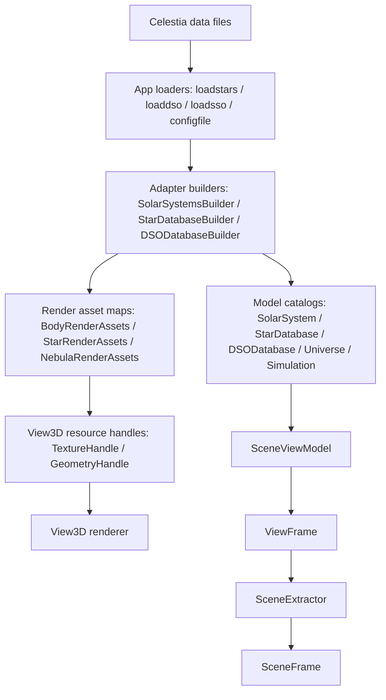
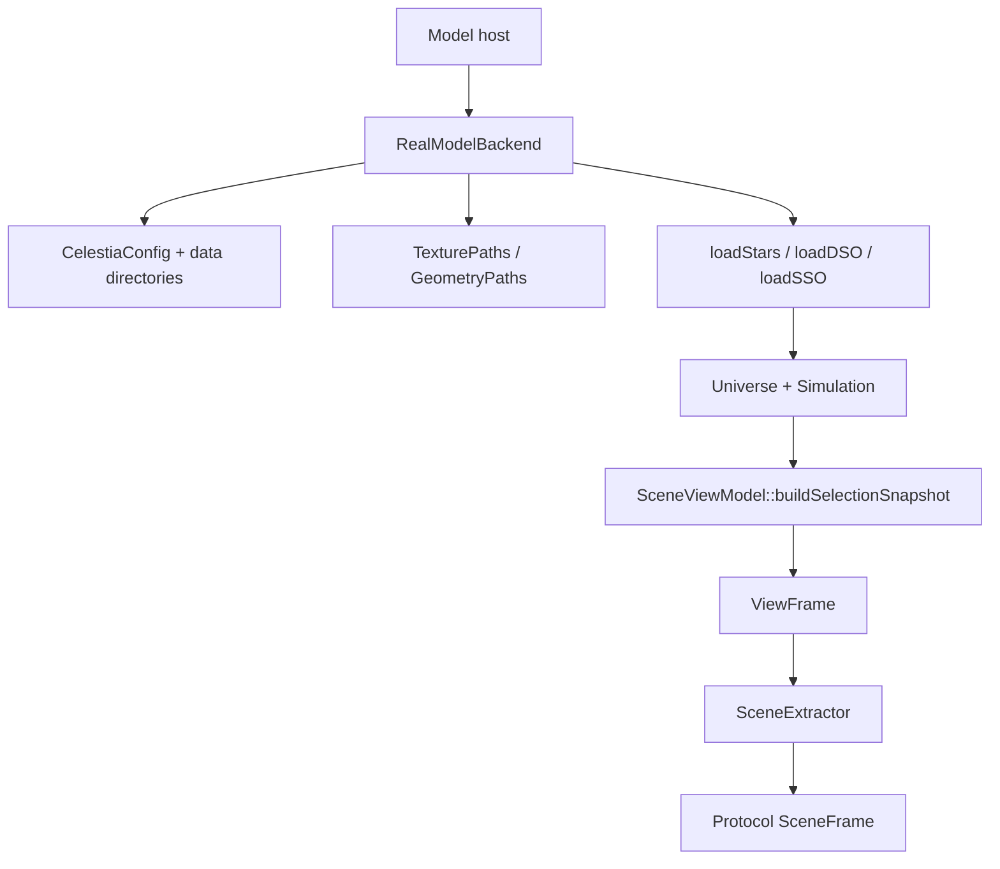
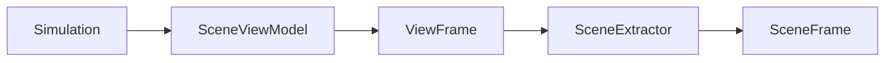
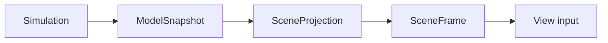

# Celestia Step22 资源边界与 Model 加载链路审计分析

## 1. 文档目的

本文是 Step22 的源码审计分析文档，服务于 Celestia 标准 MVC 解耦的后续 Model 层拆分工作。

本文不把当前代码描述为已经完成 Model 层整体解耦。当前已经完成的是一个较窄的事实：`src/celengine/model` 目录内不再直接依赖 `adapter`。但 Celestia 的真实加载链路、资源引用、渲染资源外挂和运行时输出仍然存在跨层混合，需要在后续步骤继续拆解。

本文重点回答四类问题：

1. Adapter 当前到底是什么，不是什么。
2. 资源路径、资源句柄、外挂渲染资源和 View3D 私有实现之间是什么关系。
3. `SolarSystemsBuilder`、`StarDatabaseBuilder`、`DSODatabaseBuilder` 为什么仍是 Model 解耦的关键工作点。
4. `RealModelBackend` 和运行时输出链路为什么仍是过渡形态。

## 2. 分析方法

本轮分析采用源码实体优先的方法，不从抽象 MVC 口号直接推断代码归属。

分析顺序为：

1. 从当前边界扫描结果确定仍存在的依赖类型。
2. 从加载入口追踪 Model 对象如何创建。
3. 从资源字段追踪纹理、网格、材质信息如何进入对象或对象外挂表。
4. 从 `RealModelBackend` 追踪真实数据如何进入 runtime 后端。
5. 从 runtime 输出追踪当前进程间消息实际输出的结构。

## 3. 术语口径

| 术语 | 本文含义 | 归属判断 |
|---|---|---|
| 纯 Model 状态 | 天体目录、轨道、层级、时间、物理参数、对象索引、名称索引 | 应属于 Model |
| Model 视觉属性 | 与可视化有关但不绑定具体渲染后端的数值，例如颜色、反照率、云层高度、散射参数 | 可以属于 Model，但要避免绑定 View3D 资源句柄 |
| 资源引用 | 纹理名、网格名、逻辑资源 ID、资源路径候选 | 可作为跨 View 的资源描述 |
| 资源路径索引 | 把资源名解析到数据目录、纹理目录、模型目录的能力 | 倾向于公共连接层或资源服务 |
| 外挂渲染资源 | 按 Model 对象指针保存纹理/几何资源的外部映射表 | 是过渡形态，需要继续抽象 |
| View3D 私有资源 | OpenGL、纹理管理器、网格管理器、渲染缓存、渲染对象 | 应属于具体 View3D 实现 |
| 应用加载器 | 读取配置文件、星表、深空、太阳系数据文件的入口 | 当前可复用，但不应无边界下沉到 Model |
| 运行时投影 | 从 Model/Simulation 输出给进程通信或 View 使用的数据结构 | 应位于 Model 输出和 View 输入之间 |

## 4. 当前边界扫描摘要

当前 `tools/mvc/scan_mvc_boundary_debt.ps1` 的扫描结果仍显示 63 条边界问题，类型可归纳为：

| 类型 | 数量 | 代表文件 | 含义 |
|---|---:|---|---|
| `adapter -> runtime` | 1 | `src/celengine/adapter/sceneviewmodel.h` | Adapter 层直接依赖 runtime 的 `ViewFrame` |
| `adapter -> view` | 12 | `solarsys.cpp`、`stardbbuilder.cpp`、`bodyrenderassets.h`、`nebularenderassets.h` | Adapter 层仍使用 View3D 的纹理/几何句柄或管理器类型 |
| `runtime-model -> app` | 4 | `realmodelbackend.cpp` | runtime/model 为加载真实数据直接依赖应用层加载器 |
| `runtime-model -> view` | 2 | `realmodelbackend.cpp` | runtime/model 直接创建 View3D 资源路径对象 |
| `runtime-model-projection` | 44 | `modelsnapshot.h`、`sceneextractor.*`、`modelservice.cpp` | runtime/model 输出仍使用历史 View 投影结构 |

这组扫描结果不能单独作为 Model 解耦验收标准，但可以作为后续拆分顺序的证据。它说明当前主要问题已经从“Model 目录直接 include Adapter”转移到“加载链路、资源链路和运行时输出链路仍然混合”。

## 5. 当前总体结构

当前相关链路可以概括为：

真实三进程后端链路可以概括为：

这两个图说明：当前“真实数据加载能力”已经能进入 runtime model host，但它不是一个干净的 Model 后端。它仍然借用了原始应用加载入口、Adapter Builder、View3D 资源路径对象以及历史 `ViewFrame`。

## 6. Adapter 当前定位

### 6.1 当前 Adapter 包含的能力

当前 `src/celengine/adapter` 不是一个单纯的 Controller，也不是一个干净的多 View 资源服务。它至少混合了以下能力：

| 能力 | 代表对象 | 当前问题 |
|---|---|---|
| 数据构建 | `SolarSystemsBuilder`、`StarDatabaseBuilder`、`DSODatabaseBuilder` | 创建 Model 对象的同时处理纹理和网格 |
| 对象外挂资源 | `BodyRenderAssets`、`StarRenderAssets`、`NebulaRenderAssets` | 资源表脱离 Model 对象本体，但字段类型仍来自 View3D |
| 资源加载辅助 | `NebulaRenderAssetLoader` | 把 DSO 文件中的 Mesh 信息直接变成 `GeometryHandle` |
| 运行时投影 | `SceneViewModel` | 从 `Simulation` 输出 `ViewFrame`，并让 adapter 依赖 runtime |
| 几何/选择辅助 | `SelectionGeometryProvider`、`SelectionPicker` 等 | 连接 Model 对象和 View 几何/拾取能力 |

因此，Adapter 当前更准确的描述是“过渡连接层”。它承载了把旧 Celestia 业务代码迁往 MVC 结构的中间职责，但还不是最终稳定的分层。

### 6.2 Adapter 与 Controller 的关系

在当前工程中，Adapter 不等于 Controller。

Controller 更偏向输入、命令、流程调度和进程通信控制；Adapter 当前承担的是旧 Celestia 代码和新 runtime/protocol/View3D 之间的结构适配。它包含资源映射、数据构建、运行时投影等多个方向的适配逻辑。

后续合理方向不是把 Adapter 简单改名为 Controller，而是继续拆分：

| 当前 Adapter 内容 | 后续可能归属 |
|---|---|
| 数据文件到 Model 对象的构建 | Model loading / catalog loading 层 |
| 资源名到资源描述的解析 | 公共资源索引或资源服务 |
| 具体纹理/几何句柄 | View3D 私有实现 |
| Simulation 到输出帧的转换 | Model 输出投影层或 protocol projection 层 |
| 输入选择、拾取、相机命令 | Controller 或 View/Controller 交界 |

## 7. 资源路径、资源句柄与外挂资源

### 7.1 `TexturePaths` 与 `GeometryPaths`

`TexturePaths` 和 `GeometryPaths` 当前位于 `src/celengine/view3d`，但它们承担的职责并不完全等同于 OpenGL 渲染。它们更接近“资源路径索引”：

1. 维护纹理、网格等资源的查找路径。
2. 把配置文件中的资源目录转换为可搜索路径集合。
3. 为后续资源加载提供文件定位能力。

问题在于：它们定义在 View3D 目录，并与 `TextureHandle`、`GeometryHandle` 等 View3D 类型位于同一头文件体系中。于是 RealModelBackend 和 Builder 只要想复用资源路径能力，就会被迫 include View3D 头文件。

结论：

1. 资源路径索引能力本身可以成为多 View 共用基础能力。
2. 当前实现位置和类型边界不干净。
3. 后续不能简单删除它们，而应考虑抽出与 View3D 句柄无关的资源索引类型。

### 7.2 `BodyRenderAssets`

`BodyRenderAssets` 是按 `Body*` / `RingSystem*` 维护的外挂渲染资源表。它保存：

1. `Surface`
2. alternate surface
3. body geometry
4. ring texture
5. ring geometry

它的价值是：避免把所有渲染资源都塞回 `Body` 对象本体，从而让 Model 对象比旧代码更干净。

但它的问题也很明确：

1. 保存的几何和纹理类型仍是 View3D 句柄。
2. 使用对象指针作为 key，仍然和当前进程内对象生命周期强绑定。
3. 它更像 View3D 渲染资源外挂表，而不是跨 View 通用资源描述。

结论：`BodyRenderAssets` 是一个有用的过渡结构，但不能直接作为最终公共 Adapter 资源服务。

### 7.3 `StarRenderAssets`

`StarRenderAssets` 类似于 `BodyRenderAssets`，按 `StarDetails*` 保存纹理和几何资源。

当前 `StarDatabaseBuilder` 会在处理星表对象时：

1. 读取 Mesh 字段。
2. 读取 Texture 字段。
3. 通过 `GeometryPaths` / `TexturePaths` 转换为句柄。
4. 写入 `StarRenderAssets`。

结论：Star 侧已经把资源从核心星表对象中外置了一部分，但资源类型仍未从 View3D 中脱离。

### 7.4 `NebulaRenderAssets`

`NebulaRenderAssets` 按 `Nebula*` 保存 `GeometryHandle`。`DSODatabaseBuilder` 在创建 DSO 后，如果对象是 `Nebula`，会调用 `NebulaRenderAssetLoader` 读取 Mesh 并写入该表。

与 SolarSystem 和 Star 相比，DSO 侧的资源逻辑较窄，主要集中在星云网格资源。但它仍然存在同一个问题：资源外挂表保存的是 View3D 几何句柄，而不是跨 View 的资源描述。

### 7.5 资源对象归类

| 对象 | 当前职责 | 当前归属问题 | 后续方向 |
|---|---|---|---|
| `TexturePaths` | 纹理路径查找 | 位于 View3D 体系 | 抽为资源索引或资源定位能力 |
| `GeometryPaths` | 网格路径查找 | 位于 View3D 体系 | 抽为资源索引或资源定位能力 |
| `TextureHandle` | 纹理资源句柄 | View3D 类型 | 保留在具体 View3D 内 |
| `GeometryHandle` | 网格资源句柄 | View3D 类型 | 保留在具体 View3D 内 |
| `BodyRenderAssets` | Body/Ring 外挂渲染资源 | 类型仍绑定 View3D | 拆成公共资源描述与 View3D 句柄缓存 |
| `StarRenderAssets` | Star 外挂渲染资源 | 类型仍绑定 View3D | 同上 |
| `NebulaRenderAssets` | Nebula 外挂几何资源 | 类型仍绑定 View3D | 同上 |

## 8. Builder 家族横向审计

### 8.1 `SolarSystemsBuilder`

`SolarSystemsBuilder` 当前承担最复杂的加载和构建职责。它的构造参数包含：

1. `Universe&`
2. `GeometryPaths&`
3. `TexturePaths&`
4. `UrlManager&`

它处理的数据包括：

1. 太阳系对象层级。
2. 轨道和旋转模型。
3. 天体基础属性。
4. `Surface`、rings、alternate surface。
5. mesh 和 texture 资源。
6. InfoURL 等外部引用。

它的核心混合点在于：同一个 Builder 中同时创建 Model 对象，又读取 Texture/BumpMap/NightTexture/SpecularTexture/NormalMap/OverlayTexture/Mesh/Rings 等视觉和资源字段，并将这些字段转换为 View3D 资源句柄或外挂渲染资源。

这说明 Step21 把 `SolarSystem` 类族迁回 Model 只是第一步。`SolarSystemsBuilder` 仍是后续拆分重点，因为它是“数据构建”和“资源绑定”混在一起的入口。

### 8.2 `StarDatabaseBuilder`

`StarDatabaseBuilder` 构造参数中也包含：

1. `GeometryPaths&`
2. `TexturePaths&`
3. `UrlManager&`

它主要处理：

1. 星表对象和星表索引。
2. 星名、分类、额外属性。
3. Star mesh。
4. Star texture。
5. InfoURL。

与 `SolarSystemsBuilder` 相比，Star 侧的资源字段较少，但仍存在同类问题：星表加载不是纯粹创建 Model 数据，它也把 Mesh/Texture 解析为 View3D 资源句柄并写入 `StarRenderAssets`。

### 8.3 `DSODatabaseBuilder`

`DSODatabaseBuilder` 构造参数包含：

1. `GeometryPaths&`
2. `UrlManager&`

它主要处理：

1. DSO 对象创建。
2. DSO 名称、分类。
3. Octree 构建。
4. Nebula Mesh 资源。

DSO 侧比 SolarSystem 和 Star 更轻，但仍通过 `NebulaRenderAssetLoader` 将 Mesh 变成 `NebulaRenderAssets` 内的几何句柄。

### 8.4 Builder 对比表

| Builder | 创建的 Model 对象 | 资源输入 | 外挂资源表 | 主要问题 |
|---|---|---|---|---|
| `SolarSystemsBuilder` | `SolarSystem`、`Body`、`Surface`、`RingSystem` 等 | Texture、Mesh、Rings、AltSurface | `BodyRenderAssets` | 数据构建、材质解析、资源绑定高度混合 |
| `StarDatabaseBuilder` | `StarDatabase`、`StarDetails` 等 | Texture、Mesh | `StarRenderAssets` | 星表数据和星体资源绑定混合 |
| `DSODatabaseBuilder` | `DSODatabase`、`DeepSkyObject`、`Nebula` 等 | Mesh | `NebulaRenderAssets` | 深空对象数据和星云几何绑定混合 |

### 8.5 为什么不是只有 SolarSystem 特殊

SolarSystem 之所以在 Step21 被单独处理，是因为当时边界扫描中出现了 `model -> adapter` 的直接依赖，而 `SolarSystem` 类族正是该直接依赖的触发点。Step21 的目标是清除这个已知直接依赖。

但从当前源码看，StarDatabase 和 DSODatabase 并不是已经完美拆解。它们只是没有形成 `src/celengine/model` 目录直接 include `adapter` 的同类问题。它们在 Builder 和外挂资源层面仍然有 View3D 资源句柄绑定。

因此不能把 SolarSystem 视为唯一剩余问题。更准确的判断是：

1. SolarSystem 的 Model 类族直接依赖问题已处理。
2. SolarSystem、StarDatabase、DSODatabase 三条加载链路都仍有资源绑定混合问题。
3. 后续应横向处理 Builder 家族，而不是只盯住 SolarSystem。

## 9. `Surface` 与 `Atmosphere`

### 9.1 `Surface`

`Surface` 当前位于 `src/celengine/model/surface.h`。它包含多类字段：

| 字段组 | 示例 | 分层判断 |
|---|---|---|
| 颜色和材质数值 | base color、specular color、specular power、opacity | 可以视为 Model 视觉属性 |
| 纹理缩放和标志 | texture scale、appearance flags | 需要根据使用方式判断，可能是 Model 视觉属性 |
| 纹理句柄 | base texture、bump map、night texture、specular texture、overlay texture | 不应作为最终 Model 纯状态 |

这说明 `Surface` 不是简单的“全属于 Model”或“全属于 View”。其中材质数值可以作为天体外观数据保留，但纹理句柄需要被改造成资源引用或外部资源描述。

### 9.2 `Atmosphere`

`Atmosphere` 当前位于 `src/celengine/model/atmosphere.h`。它也包含多类字段：

| 字段组 | 示例 | 分层判断 |
|---|---|---|
| 物理/视觉参数 | height、cloud height、scattering、mie、absorption | 可以视为 Model 视觉/物理属性 |
| 颜色参数 | lower color、upper color、sky color、sunset color | 可以视为 Model 视觉属性 |
| 云层纹理句柄 | cloud texture、cloud normal map | 不应作为最终 Model 纯状态 |

因此 `Atmosphere` 的后续处理方向与 `Surface` 类似：保留物理和视觉参数，替换具体纹理句柄为资源引用或外部资源描述。

## 10. `RealModelBackend`

### 10.1 来源和职责

`RealModelBackend` 是当前 MVC/runtime 改造过程中新增的真实数据后端入口，不是原始 Celestia 旧架构中天然存在的核心类。它的作用是让 model host 能加载真实 Celestia 数据，而不是只输出合成测试场景。

它当前承担：

1. 读取配置和数据目录。
2. 创建 `TexturePaths`、`GeometryPaths`。
3. 调用 `loadStars`、`loadDSO`、`loadSSO` 等应用加载器。
4. 创建 `Universe`。
5. 创建 `Simulation`。
6. 基于 `Simulation` 输出 `ViewFrame`。

### 10.2 当前依赖问题

`RealModelBackend` 当前存在两类明显跨层依赖：

| 依赖类型 | 代表依赖 | 问题 |
|---|---|---|
| runtime/model -> app | `configfile.h`、`loadstars.h`、`loaddso.h`、`loadsso.h` | model host 为加载数据直接依赖应用层加载入口 |
| runtime/model -> view | `texmanager.h`、`meshmanager.h` | model host 为资源路径直接依赖 View3D 类型 |

这些依赖不是完全没有原因。旧 Celestia 的真实数据加载能力本来就散落在应用加载器、celengine 和 View3D 资源体系之间。为了让真实数据先跑起来，`RealModelBackend` 采用了复用现有加载器的方式。

但这只能作为过渡，不应被视为最终合理结构。

### 10.3 后续拆分候选

`RealModelBackend` 后续至少可以拆出以下职责：

| 候选职责 | 目标 |
|---|---|
| 数据配置读取 | 把 app 配置读取与 model host 生命周期分离 |
| Catalog 加载服务 | 统一负责 Star/DSO/SSO 的 Model 数据加载 |
| 资源索引服务 | 提供与 View3D 句柄无关的资源路径和资源引用 |
| Simulation 后端 | 只持有 `Universe`、`Simulation` 和时间推进能力 |
| Model 输出投影 | 从 `Simulation` 输出真正的 Model snapshot |

拆分顺序上，不建议先直接替换所有加载器。更稳妥的顺序是先抽象资源引用和资源索引，再处理 Builder，再收窄 `RealModelBackend`。

## 11. 运行时输出链路

当前 runtime/model 输出链路大致是：

### 11.1 `ModelSnapshot` 的问题

当前 `src/celruntime/model/modelsnapshot.h` 中的抽象名义上接近 Model snapshot，但实际接口仍返回 `ViewFrame`。这说明它还不是最终意义上的 Model 输出。

合理的目标结构应更接近：

其中：

1. `ModelSnapshot` 表示 Model 后端的稳定输出。
2. `SceneProjection` 表示为了具体显示、协议或前端消费而做的投影。
3. `SceneFrame` 表示进程间协议消息。
4. View 再根据自身能力解释 `SceneFrame` 或后续更明确的 View 输入。

### 11.2 `SceneViewModel` 的问题

`SceneViewModel` 位于 `adapter`，但它 include runtime 的 `ViewFrame`，导致 `adapter -> runtime` 依赖。这说明当前输出结构仍然不是清晰的单向依赖。

从语义上看，`SceneViewModel` 做的是从 `Simulation` 构造当前可显示场景快照。这件事本身有价值，但它不应迫使 celengine adapter 层依赖 runtime 数据结构。

### 11.3 `SceneExtractor` 的问题

`SceneExtractor` 位于 runtime/model，它从 `ViewFrame` 抽取 protocol `SceneFrame`。当前这样做可以让三进程程序输出场景，但也导致 runtime/model 层同时理解历史 View 投影结构和协议结构。

后续应考虑把这段能力明确为 projection 层，而不是继续放在 model 后端核心中。

## 12. 当前“已经完成”的工作边界

基于 Step21 和 Step22 审计，当前可以稳妥陈述为：

1. `SolarSystem` / `SolarSystemCatalog` 已迁回 `src/celengine/model`。
2. `src/celengine/model` 目录内的直接 Adapter include 已清理。
3. `SolarSystemsBuilder` 仍在 Adapter 中，仍承担数据构建和资源绑定混合职责。
4. Star/DSO 加载链路虽然没有同类 `model -> adapter` 直接依赖，但仍存在 Builder 层资源绑定问题。
5. `RealModelBackend` 能加载真实数据，但仍是过渡实现。
6. 运行时输出仍然以 `ViewFrame` 为核心，不是最终 Model 输出。

不能陈述为：

1. Model 层已经完全解耦。
2. Adapter 已经是稳定多 View 资源服务。
3. `ViewFrame` 已经是最终 Model 输出规范。
4. View3D 已经平权模板化。

## 13. 后续工作建议

### 13.1 Step23 候选主题

建议 Step23 聚焦“资源引用与资源索引抽象”，原因是它位于多个问题的交汇点：

1. `Surface` / `Atmosphere` 中的纹理句柄需要替换方向。
2. `BodyRenderAssets` / `StarRenderAssets` / `NebulaRenderAssets` 需要从 View3D 句柄中脱身。
3. `RealModelBackend` 需要摆脱对 View3D `TexturePaths` / `GeometryPaths` 的直接依赖。
4. Builder 家族后续拆分需要先知道资源字段应该写到哪里。

Step23 不宜直接大规模移动 Builder 文件。先定义资源引用和资源索引的最小实现边界，能降低后续拆 Builder 时的风险。

### 13.2 后续拆分顺序建议

| 顺序 | 工作 | 原因 |
|---:|---|---|
| 1 | 定义跨 View 的资源引用/资源索引边界 | 先解决 TexturePaths/GeometryPaths 与 View3D 混合 |
| 2 | 将 `Surface` / `Atmosphere` 中的具体句柄替换为资源引用或外部描述 | 清理 Model 视觉属性中的 View3D 类型 |
| 3 | 拆分 `BodyRenderAssets` / `StarRenderAssets` / `NebulaRenderAssets` | 让资源外挂表不再直接等同于 View3D 句柄缓存 |
| 4 | 横向拆 Builder 家族 | 将数据构建和资源绑定分离 |
| 5 | 收窄 `RealModelBackend` | 让真实数据后端只组合清晰职责 |
| 6 | 替换 `ViewFrame` 输出链路 | 建立真正的 `ModelSnapshot -> SceneProjection -> SceneFrame` |
| 7 | 重新启动 View 模板平权迁移 | 在 Model 输出稳定后再迁移 View 形态 |

### 13.3 Step23 实施结果

截至 2026-07-08，Step23 已经按“资源引用与资源索引边界”计划完成首轮代码落地。完成内容如下：

1. 新增 `src/celengine/resource/texturepaths.h`、`src/celengine/resource/texturepaths.cpp`，把 `TextureResolution`、`TextureFlags`、`TextureInfo`、`TexturePaths` 从 View3D 纹理管理器头文件中剥离。
2. 新增 `src/celengine/resource/geometrypaths.h`、`src/celengine/resource/geometrypaths.cpp`，把 `GeometryHandle`、`GeometryInfo`、`GeometryPaths` 从 View3D 网格管理器头文件中剥离。
3. `src/celengine/view3d/texmanager.*` 和 `src/celengine/view3d/meshmanager.*` 继续保留真实纹理、网格和渲染几何加载职责，但通过中立资源头文件复用路径索引类型。
4. `src/celruntime/model/realmodelbackend.cpp` 已从 `view3d/meshmanager.h`、`view3d/texmanager.h` 改为 include `celengine/resource/geometrypaths.h`、`celengine/resource/texturepaths.h`。
5. `BodyRenderAssets`、`StarRenderAssets`、`NebulaRenderAssets` 以及 Builder 相关调用点改用中立资源头文件提供资源句柄和路径索引类型。
6. CMake 增加 `CELESTIA_RESOURCE_SOURCES` 和 `celestia_resource` object library，并把资源 object 纳入统一 exe 与 headless model backend 所需对象集合。
7. 新增 `test/unit/mvc_step23_resource_boundary_test.cpp`，固化资源目录、View3D manager include、`RealModelBackend` include、CMake object library 四个边界检查。

本轮也明确保留了一类真实 View3D 依赖：`src/celengine/adapter/bodylocationgeometryprojector.cpp` 仍调用 `GeometryManager::find()`，因此它继续 include `view3d/meshmanager.h`。这不是资源索引依赖，而是 Adapter 内部对真实几何管理器的使用，后续应在 Adapter/View 边界治理中单独处理，不能在 Step23 中为了清扫描项而移除。

Step23 后的边界扫描结果：

| 扫描类别 | Step23 前 | Step23 后 | 说明 |
|---|---:|---:|---|
| 总发现数 | 63 | 53 | 本轮只处理资源路径索引直接依赖 |
| `runtime-model->view` | 2 | 0 | `RealModelBackend` 不再直接 include View3D 资源管理器头 |
| `adapter->view` | 12 | 4 | 剩余为真实 Adapter/View 依赖，不在 Step23 强行清理 |
| `runtime-model->app` | 4 | 4 | 仍来自 `configfile`、`loadstars`、`loaddso`、`loadsso` 入口 |
| `runtime-model-projection` | 44 | 44 | 运行时输出仍以 `ViewFrame` / `SceneFrame` 投影结构为过渡形态 |
| `adapter->runtime` | 1 | 1 | `SceneViewModel` 仍引用 runtime `ViewFrame` |

Step23 的验证结果：

1. `unit`、`celestia-model-host`、`celestia-sdl` 构建通过。
2. Step13、Step17、Step23、MVC 装配和 runtime session 相关 32 个 CTest 用例全部通过。
3. `tools/mvc/scan_mvc_boundary_debt.ps1` 显示 `runtime-model->view` 已清零。
4. `test/scripts/test_mvc_model_adapter_boundary_clean.ps1` 通过。
5. `tools/regression/run_celestia_compat_regression.ps1 -Mode Quick` 通过，生成 10 个统一 SDL exe 截图场景和 6 个 runtime smoke 场景记录。

因此，Step23 的完成含义应严格限定为：资源路径索引已经从 View3D manager 头文件中剥离出来，并解除 `RealModelBackend` 对 View3D 资源路径类型的直接依赖。它不表示 Builder 家族已经拆分完成，不表示 `Surface` / `Atmosphere` 资源字段已经完成重构，也不表示运行时输出已经脱离 `ViewFrame` 过渡形态。

## 14. 风险判断

### 14.1 最大风险

最大风险不是某一个 include，也不是某个类的位置，而是继续把“能跑起来的过渡结构”误认为“已经完成的 MVC 边界”。

例如：

1. `RealModelBackend` 能加载真实数据，但它依赖 View3D 资源路径类型。
2. `BodyRenderAssets` 把资源从 `Body` 本体外移了，但仍然保存 View3D 句柄。
3. `ViewFrame` 能驱动当前 runtime 输出，但它仍是历史 View 投影结构。

这些都是有效的中间成果，但不是最终边界。

### 14.2 需要避免的错误做法

1. 不应只根据目录名判断层级。
2. 不应只因为字段“和渲染有关”就从 Model 中移除。
3. 不应在资源引用边界未明确前大规模移动 Builder。
4. 不应把 `TexturePaths` / `GeometryPaths` 直接视为 View 私有垃圾代码。
5. 不应继续以新 View 效果为目标绕开现有源码结构。

## 15. 结论

Step22 的核心结论是：

1. 当前 Model 目录直接依赖 Adapter 的问题已经清理，但 Model 层整体解耦没有完成。
2. 下一轮主要问题集中在资源边界、Builder 家族和 runtime 输出链路。
3. Adapter 当前是过渡连接层，不是稳定的 Controller，也不是干净的多 View 资源服务。
4. `Surface` / `Atmosphere` 需要字段级拆分判断，不能整体归入或移出 Model。
5. `RealModelBackend` 是真实数据后端的过渡入口，不能作为终局架构固化。
6. 后续最优先的编码准备工作是定义资源引用与资源索引边界，然后再拆 Builder 和运行时输出。

因此，Step23 建议不要直接进入 View3D 模板迁移，也不要直接大规模搬 Builder 文件。更合理的下一步是先做“跨 View 资源引用与资源索引”的最小代码改造方案，并把它作为 Builder 家族拆分的前置条件。
