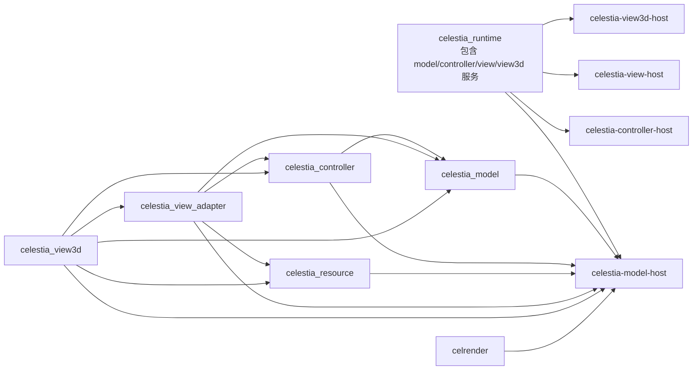

# Celestia Step24 前 MVC 架构检查点报告

- 检查时间: 2026-07-14 至 2026-07-15
- 检查分支: `codex/celestia-mvc-step13-real-model-backend`
- 检查提交: `0f733ef603b8db5ffc02b735c153d8302bfad3ed`
报告定位: Step24 实施计划之前的架构决策材料，不是 Step24 计划，也不包含业务代码修改。

## 1. 检查目标与判定口径

本次检查不以“扫描台账减少了多少项”作为 MVC 解耦的最终判定。检查同时使用以下五类证据:

1. 物理编译和链接关系：Model、Controller、View Host 实际编译进了哪些对象库。
2. 运行状态所有权：时间、暂停、选择、相机和 Observer 状态由谁真实持有和修改。
3. 原 View3D 白盒业务链：原渲染器实际读取哪些 Model/Controller/Adapter 能力。
4. 资源生命周期：路径、句柄、资源描述、跨进程引用和 GPU 对象是否分层。
5. 验证有效性：现有测试到底证明了什么，哪些结论尚未被覆盖。

本报告分别对三个问题作出判定:

| 问题 | 检查结论 |
|---|---|
| Step20-Step23 的已有成果是否应保留 | **应保留**，它们是真实的边界收紧，不是无效工作 |
| 当前是否已完成 Model 解耦或平权 View 架构 | **未完成** |
| 是否可直接按 Step23 文档中的旧顺序进入 Step24 | **不建议准入**，需先补齐架构前置判定 |

## 2. 总体结论

截至 `0f733ef`，最准确的定位是:

> 当前已经建成一套可编译、可运行、可切换的 MVC Runtime 基础设施，并完成了部分 Model 源码边界和资源路径边界治理；但 Model 进程的物理组成、Controller 的真实业务驱动、Model 输出语义和 View3D 平权组件化仍未完成。

这意味着:

1. 当前结果不是“失败”，因为进程通信、Host 生命周期、协议序列化、基线回归和若干源码边界都是可验证的已完成能力。
2. 当前结果也不能被称为“MVC 主体已经切完”，因为新三进程链路还没有承接原 Celestia 的大部分业务状态和 View3D 能力。
3. 统一 exe 保持原能力是一个重要安全网，但它同时会遮蔽新链路的缺口：统一 exe 的图像没退化，不等于新 View3D 已具备同等能力。

## 3. 升级改造过程的合理性复审

### 3.1 Step1-Step11：基础设施有价值，但架构收口过早

有效成果:

- 源码目录、CMake 对象目标、Host 进程、RuntimeEnvelope、传输层、组装配置、View 插件清单和 DataPlane 基础能力都已建立。
- 这些能力对后续多 View 是可复用基础，不应回滚。

方法问题:

- 当时对原 `CelestiaCore -> Simulation/Observer -> Renderer` 业务链的白盒分析还不充分，却过早使用了“最终架构收口”类表述。
- 当时建立的是“进程和消息能通”，不是“原业务已按 MVC 重组”。

### 3.2 Step12-Step18：纵向样板有效，但不是业务等价实现

有效成果:

- 真实数据根加载、`SceneFrame`、`ResourceRef`、View3D Host 消费、输入返回 Controller 和 Model 的纵向链路已经走通。
- 统一 exe 回归矩阵扩展到 10 个场景，固定了修改后不丢原能力的基本验证方式。

能力边界:

- 当前新 View3D 只是协议和进程链的渲染样板，并不是原 View3D 的子集迁移。
- Controller 指令大部分是投影状态回显，并未驱动真实 `Simulation` 业务方法。

### 3.3 已回滚的 Step19-Step86：路线偏移，回滚决策正确

该阶段以新 View 效果逐步补齐为主，没有按原源码的业务责任切片迁移，与“白盒利用现有代码、1:1 承接能力”的目标不一致。回滚到 Step18 并从边界审计重启是必要纠偏。

### 3.4 Step19.0、Step20-Step23：方向基本合理，但尚属局部治理

已证明有效的修改:

- Model 目录的 View/Renderer 直接 include 已清理。
- `OrbitSampler` 不再输出 View 曲线类型。
- `ReferenceMark`、`Marker`、生命周期事件的 Model 语义与绘制语义得到一轮分离。
- `SolarSystem` / `SolarSystemCatalog` 已从 Adapter 构建器中分离到 Model。
- `TexturePaths` / `GeometryPaths` 已从 View3D manager 中抽到中立资源目录。

仍需保持的准确表述:

- Step20-Step23 证明了若干“局部硬边界”被清理。
- 它们没有证明 Model Host 已物理独立，也没有证明 Controller/View 已承接真实业务。

## 4. 当前物理编译和链接架构

### 4.1 源码目标图



关键源码证据:

- `src/celestia/CMakeLists.txt:102-118` 定义 `CELESTIA_HEADLESS_MODEL_BACKEND_LIBS`。
- 该集合包含 `celestia_view_adapter`、`celestia_view3d` 和 `celrender`。
- `src/celestia/CMakeLists.txt:125-134` 把上述对象集合直接加入 `celestia-model-host`。
- `src/celruntime/CMakeLists.txt:1-87` 用一个 `CELESTIA_RUNTIME_SOURCES` 清单同时包含 Model、Controller、View 和 `view3d/view3dhost.cpp`。
- `src/celruntime/CMakeLists.txt:100-122` 的四个 Host 都嵌入同一个 `$<TARGET_OBJECTS:celestia_runtime>`。

### 4.2 物理边界判定

| 检查项 | 当前状态 | 判定 |
|---|---|---|
| `src/celengine/model` 是否直接 include View/Adapter | 相关扫描为 0 | 通过局部源码边界 |
| `celestia-model-host` 是否不编译 View3D/Render 对象 | 实际仍纳入 View Adapter、View3D、celrender 对象 | 不通过 |
| 四个 Host 是否使用角色专用 Runtime 目标 | 共享一个大型 Runtime 对象库 | 不通过 |
| Model Host 当前 PE 导入是否包含 SDL/OpenGL | `dumpbin /dependents` 未显示 SDL/OpenGL，链接器当前可删除未用符号 | 运行时动态依赖较干净，但不抵消构建图耦合 |

因此，当前可以说“Model 源码目录的部分直接依赖已清理”，不能说“Model 进程已建立独立的物理构建边界”。

## 5. 运行状态所有权审计

### 5.1 当前状态矩阵

| 状态 | 原业务事实源 | 当前 Runtime 实现 | 问题 |
|---|---|---|---|
| 仿真时间 | `Simulation::time` | Backend `setTime/step` 调用真实 `Simulation` | 基本连通 |
| 暂停 | `Simulation::setPauseState/getPauseState` | `ControllerService::paused_` 和 `ModelService::paused_` 各保存一份，输出时覆盖快照 | 多事实源 |
| 时间倍速 | `Simulation::setTimeScale/getTimeScale` | Controller 和 ModelService 各有 `timeScale_`，`model.step` 手工乘倍速 | 未使用真实 Simulation 状态 |
| 选择对象 | `Simulation::setSelection/getSelection` | ModelService 用 `selectionType_` / `selectionId_` 改写输出容器 | 输出回显不等于业务选择 |
| 相机位置和方向 | `Observer` / `Simulation` | ModelService 保存 Z 距离和 yaw，输出时直接覆盖 | 真实 Observer 没有被驱动 |
| 居中、Goto、Follow、Orbit | `Simulation::centerSelection/gotoSelection/follow/orbit` | Runtime 指令设置固定距离、布尔标志或字符串 | 只是结果模拟 |
| 渲染开关、标签、纹理精度 | `Renderer` 和 `CelestiaCore` | 未进入完整的新 Controller/View 状态模型 | 尚未迁移 |

### 5.2 源码证据

- `src/celruntime/model/modelsnapshot.h:26-34` 的 `SimulationBackend` 只有 `load/setTime/step/snapshot`，无选择、导航、暂停、Observer 操作接口。
- `src/celruntime/model/modelservice.h:55-66` 保存了暂停、倍速、FOV、相机、Follow 和 Selection 覆盖状态。
- `src/celruntime/model/modelservice.cpp:360-389` 先取 Backend 快照，再用上述字段改写快照。
- `src/celruntime/controller/controllerservice.h:40-42` 又持有一份 `paused_`、`timeScale_`、`cameraFov_`。
- `src/celengine/controller/simulation.h` 和 `simulation.cpp` 已经提供真实 `setPauseState`、`setTimeScale`、`setSelection`、`centerSelection`、`gotoSelection`、`follow`、`orbit` 等业务方法，但 Runtime 命令端口未将它们接入 Backend。

### 5.3 状态所有权结论

当前 Controller 与 Model 之间完成的是“消息路由闭环”，不是“原 Celestia 业务状态闭环”。

这个问题比单纯的 include 依赖更关键，因为新 View 即使补齐画面，也可能只在消费一份与真实 `Simulation/Observer` 脱节的模拟状态。

## 6. 原 View3D 白盒能力与新 View 现状

### 6.1 原 View3D 不是单纯的绘制函数

原单进程驱动链是:

```text
CelestiaCore::tick
  -> Simulation::update
  -> Observer/Selection/Timeline 状态更新

CelestiaCore::draw/view render
  -> Renderer::render(Observer, Universe, faintestVisible, Selection)
  -> 可见性和裁剪
  -> 星体、DSO、太阳系对象、轨道、标签和标记列表
  -> 表面、网格、大气、云层、光照、环、彗尾和参考标记
  -> GPU 资源和 OpenGL 绘制
```

关键证据:

- `src/celestia/celestiacore.cpp:2120-2130` 直接把 `Observer`、`Universe`、星等阈值和 `Selection` 传给 `Renderer::render`。
- `src/celengine/view3d/render.h:157-160` 的主渲染入口就是上述四类输入，不是一份已整理好的 SceneFrame。
- `src/celengine/view3d/render.h:438-644` 包含星体、DSO、近邻太阳系、行星、环、轨道、标签、标记、彗尾等列表构建和渲染能力。
- `src/celestia/celestiacore.cpp` 中的大量键盘分支直接切换 `RenderFlags`、`RenderLabels`、星体样式和纹理精度。这部分同时涉及 Controller 命令、View 状态和用户反馈。

### 6.2 当前 Model 输出只是选中对象投影

`SceneViewModel::buildSelectionSnapshot` 当前只输出:

- 时间、倍速、暂停。
- 当前 Observer 位置、方向、FOV 和参考系。
- 当前 Selection。
- Selection 是 Body 时的一个 Body、它的中心星和 16 个轨道采样点。
- Selection 是 Star 时的一个 Star。

源码位置:

- `src/celengine/adapter/sceneviewmodel.cpp:219-227` 固定生成 16 个一天窗口内的轨道采样。
- `src/celengine/adapter/sceneviewmodel.cpp:287-301` 只从当前 Selection 追加 Body 或 Star。
- `ViewFrameBody` 虽预留了 mesh/diffuse/normal resource id，但 `appendBody` 当前没有填充这些字段。
- `RealModelBackend` 当前只把恒星、SSO 和 DSO 文件追加为 catalog 类资源，未把 `TexturePaths/GeometryPaths` 句柄转为具体场景资源引用。

### 6.3 当前跨进程 View3D 是固定图形样板

`src/celruntime/view3d/view3dloop.cpp:240-286` 的实际绘制行为是:

- 即使 SceneFrame 没有星，也至少绘制 18 个固定位置亮点。
- 轨道按窗口尺寸画一条固定椭圆点集，未使用真实轨道点位置。
- Body 由数个 `glScissor + glClear` 矩形组成，不是球体、网格或 Celestia Renderer 的行星渲染。

源码规模也能说明能力差距:

| 目录 | 文件数 | 约代码行数 | 定位 |
|---|---:|---:|---|
| `src/celengine/view3d` | 80 | 21,594 | 原 View3D 场景构建和渲染主体 |
| `src/celrender/view3d` | 39 | 5,469 | 原 View3D 底层绘制设施 |
| `src/celruntime/view3d` | 8 | 842 | Runtime 消息消费和固定图形样板 |

行数不是架构质量指标，但结合具体绘制代码，它可以明确否定“新 View3D 已承接原 View3D”的说法。

### 6.4 View 平权化判定

- `src/celviews/debug2d` 和 `src/celviews/opengl3d` 当前只有插件 JSON 清单，没有各自完整的实现目录。
- `src/celestia/viewproviders/view3dprovider.cpp` 的 `OpenGLViewRuntime` 只持有 `Renderer` 指针，没有实现 `present()`。
- `ViewRuntime::present` 基类默认实现是空操作。
- 原 View3D 仍占据 `celengine/view3d + celrender/view3d + CelestiaCore` 特殊位置，未被组织成可与未来 2D、BS 或其他 3D View 平等替换的组件。

结论: View 插件身份和 Host 运行时已经存在，但 View 源码所有权和完整业务能力还没有平权化。

## 7. 资源边界检查

### 7.1 Step23 的真实价值

Step23 将 `TexturePaths` 和 `GeometryPaths` 移到 `src/celengine/resource`，使路径查找和句柄分配不再被命名为 View3D manager 私有能力。这个方向合理，因为路径解析本身不等于 GPU 纹理或网格对象。

但 Step23 的成果尚未等于“公共资源服务”:

- `TextureHandle` 和 `GeometryHandle` 都是 `uint32_t` 索引。
- `getHandle()` 返回当前 `TexturePaths/GeometryPaths` 实例内部容器的索引。
- RenderAssets 使用 `Body*`、`StarDetails*`、`Nebula*` 作为 key，属于进程内挂接表。
- 这些句柄不是跨进程稳定 Resource ID，也不能直接被多个 View 作为公共资源服务协议使用。

### 7.2 `Surface` 和 `Atmosphere` 不能整类简单迁移

`Surface` 包含两类字段:

| 字段类型 | 代表 | 初步归属 |
|---|---|---|
| 材质和光照参数 | color、specularColor、specularPower、lunarLambert、appearanceFlags | 场景外观/渲染输入，不是 GPU 对象 |
| 资源句柄 | base/bump/night/specular/overlay texture | 逻辑资源引用，不应是某个 View 的 GPU 缓存句柄 |

`Atmosphere` 更明显是混合对象:

| 字段类型 | 代表 | 实际用途 |
|---|---|---|
| 结构/计算事实 | height、cloudHeight、cloudSpeed | 大气和云层事实；`height/cloudHeight` 直接参与 Body 裁剪半径计算 |
| 散射参数 | mieCoeff、rayleighCoeff、absorptionCoeff 等 | 光学模型输入，未必是特定 View 私有 |
| 资源句柄 | cloudTexture、cloudNormalMap | 逻辑资源引用 |
| 表现参数 | 颜色、cloudShadowDepth | 场景外观/渲染输入 |

`src/celengine/model/body.cpp:938-945` 使用大气高度、云高度和环半径计算 `Body::getCullingRadius()`。因此，不能因为 `Atmosphere` 里有纹理句柄，就把整个类当作 View 私有资源移走。

### 7.3 资源目标分层

后续应明确区分:

```text
层 1：逻辑资源描述
  稳定 Resource ID、类型、包、相对路径、hash、材质/几何参数

层 2：资源定位与数据传输
  路径解析、内容发布、DataPlaneRef、缓存 key

层 3：View 私有渲染缓存
  OpenGL/Vulkan/CPU/BS 各自的纹理、网格、shader 和销毁生命周期
```

当前 Step23 主要触及了第 2 层中的“路径索引”，第 1 层和第 3 层尚未系统分开。DataPlane 实现和 `DataPlaneRef` 解析已存在，但真实 mesh/texture 还没有生产级的 publish/acquire 链路。

## 8. Runtime 输出语义检查

当前 `ViewFrame` 同时承担:

1. `SimulationBackend::snapshot()` 的返回类型。
2. `view.frame` 的跨进程 payload。
3. `SceneExtractor` 的输入。
4. `ModelService` 命令覆盖状态的写入容器。

因此 `ViewFrame` 不是纯 ModelSnapshot。当前 53 项边界扫描中的 44 项 `runtime-model-projection` 都集中反映这个语义问题。但应注意:

- 44 不代表 44 个相互独立的架构问题。
- 它们主要是同一个输出分层问题在多个文件和符号上的投影。
- 完成标准不应是机械把 44 变成 0，而应是建立清晰的 Model 事实快照、场景投影和跨进程序列化三层语义。

这三层的字段不应凭空设计。必须先完成原 View3D 对 `Simulation/Observer/Universe/Renderer/RenderAssets` 的读集盘点，再决定哪些是 Model 事实，哪些是公共场景投影，哪些是 View3D 私有状态。

## 9. 验证体系检查

### 9.1 本次实际执行结果

| 验证 | 结果 |
|---|---|
| 构建 `unit` / Model Host / Controller Host / View3D Host / SDL | 通过 |
| 全量 CTest | `200/200` 通过 |
| `scan_mvc_dependencies.ps1` | 通过 |
| `scan_cmake_targets.ps1` | 通过 |
| `scan_mvc_boundary_debt.ps1` | 53 项：1 adapter->runtime，4 adapter->view，4 runtime-model->app，44 runtime-model-projection |
| Model 目录直接 Adapter 边界测试 | 通过 |
| Full 固定基线对比 | 通过，10/10 场景，6/6 runtime 配置 |
| Full 提交一致性 | 报告记录的 current commit 为当前 `0f733ef` |

本次架构检查机测记录:

`DOC/CODEX_DOC/06_测试文档/03_机测记录/2026-07-15-101405-Celestia-Step24前MVC架构检查点-机测记录.md`

本次 Full 报告:

`DOC/CODEX_DOC/06_测试文档/03_机测记录/2026-07-14-134535-Celestia-compat-regression-machine-report.md`

人工检查 contact sheet 后，10 组 baseline/current 未发现统一 SDL exe 主路径的明显可见退化。

### 9.2 当前验证真正证明了什么

可以证明:

- 当前源码可在现有构建配置下编译。
- 现有单测、Runtime 进程通信和配置切换测试通过。
- 固定 10 场景中，统一 SDL exe 与解耦前基线保持高度一致。
- Step20-Step23 未破坏当前被回归覆盖的原主路径。

不能证明:

- 新三进程 View3D 的图像与原 View3D 等价。
- Controller 命令已经调用原 `Simulation/Observer` 业务方法。
- Model Host 已不编译 View3D/Render 源码。
- 资源已通过稳定跨进程 ID 和 DataPlane 在多 View 之间复用。
- Qt/Win32 前端或 Celestia 所有脚本、交互和渲染能力等价。

### 9.3 验证机制存在的具体缺口

1. **Full 截图对比仍是统一 exe 主路径。** 跨进程 View3D 没有同样的多场景截图对比门槛。
2. **Full 的 runtime smoke 默认只检查进程成功退出。** 只有 Step18 模式的 `RequireRuntimeDetails` 会检查 `frameRendered/bodyCount/resourceCount` 等 token，Full 没有启用这一强化检查。
3. **Quick 报告的总状态默认是 pass。** `Invoke-Quick` 没有像 Full 一样汇总 screenshot/runtime 的 fail/warn 状态。
4. **Full 即使计算出 fail/warn，当前函数也只写报告，没有根据总状态主动返回失败退出码。** 因此 CI 或自动执行不能只依赖脚本退出码。
5. **图像通过标准偏宽。** 单张图像只因非黑像素比例低于 0.002 或尺寸过小失败；dHash 和平均色差超限只标 warn，没有按场景的结构、对象或功能断言。
6. **基线完整性检查仍硬编码为 8 张。** 当前场景已是 10 张，`Ensure-BaselineScreenshots` 使用 `Count -eq 8`，导致本次 Full 再次生成了 baseline。
7. **Step23 专用单测主要是源码文本包含关系测试。** 它能守住目录和 include 边界，不能证明路径解析、句柄稳定性和多 View 资源生命周期。
8. **MVC dependency/CMake 扫描规则过窄。** 当前 CMake 扫描能在 Model Host 实际纳入 View3D/celrender 对象的情况下通过，说明“扫描通过”不是物理解耦的充分条件。

## 10. 文档和交付状态检查

### 10.1 文档事实源漂移

- `CODEX_START_HERE.md` 仍把 Step19/Step18 写为当前状态，并记录 88 项边界债务。
- 当前实际提交是 Step23 `0f733ef`，当前扫描是 53 项。
- `02-08-Celestia当前解耦现状与MVC能力盘点.md` 仍停留在 Step12 `0fd93ad`。

这不是代码缺陷，但它会直接降低新会话的架构判断可靠性，也容易使后续工作误用过时基线。

### 10.2 分支集成状态

- 当前分支已与远端同步。
- 当前分支相对 `origin/master` 为前进 31 个提交、0 个落后提交。
- Step20-Step23 尚未进入 master。

长期分支不影响当前审计结论，但会增加后续集成和文档同步风险。是否合并应在本检查点人工确认后单独决定。

## 11. 问题分级

### P0：未解决前不应直接进入原 Step24

| 问题 | 风险 | 完成判定 |
|---|---|---|
| Model Host 构建图仍纳入 View Adapter/View3D/celrender | 目录看似干净，进程仍不是物理独立单元 | Model Host 专用目标在不纳入 View3D/celrender/SDL/OpenGL 源码对象的情况下单独编译和运行 |
| Controller/ModelService 用多份覆盖状态模拟 Simulation | 新 View 显示的状态可能与真实业务对象脱节 | 命令通过 Backend 端口驱动真实 `Simulation/Observer`，快照只读事实状态 |
| Step24 把 `Surface/Atmosphere` 作为整体资源化的前提不充分 | 可能把仿真/裁剪事实和纹理资源一起错迁 | 完成字段级读写者、计算用途、跨进程需求和 View 私有性矩阵 |

### P1：进入模板 View 迁移前必须解决

| 问题 | 风险 |
|---|---|
| 原 View3D 读集和内部对象还没有形成完整迁移矩阵 | 再次从输出协议或画面倒推业务 |
| `ViewFrame` 同时承担快照、投影和消息语义 | 字段归属混乱，Model 被 View 输出牵引 |
| 资源句柄是进程内索引，RenderAssets 按原始指针挂接 | 无法直接变成多 View 可用的稳定资源层 |
| 跨进程 View3D 没有原 View3D 的图像验证门槛 | 通信测试通过，视觉和业务能力仍可大量缺失 |

### P2：工程治理问题

- 启动说明和现状盘点过时。
- Quick/Full 的总状态与进程退出码不够严格。
- 基线截图数量门槛仍为 8，与当前 10 场景不一致。
- 分支相对 master 长期积累 31 个提交，需明确人工检查和集成节点。

## 12. Step24 准入决策

### 12.1 决策

| 准入对象 | 结论 | 说明 |
|---|---|---|
| 继续保留 Step20-Step23 代码 | 通过 | 这些修改是有源码和回归证据的边界收紧 |
| 把 Model 层标记为已完全解耦 | 不通过 | 物理构建、状态所有权和 Runtime 输出均未闭合 |
| 直接执行原建议 Step24：`Surface/Atmosphere` 纹理字段资源引用化 | 不通过 | 字段级归属和真实消费者尚未固定 |
| 进入 Step24 前置架构准备 | 有条件通过 | 只允许做目标依赖图、状态命令端口、原 View 读集和资源字段矩阵的分析/计划 |

### 12.2 建议的后续顺序

本节只给出架构顺序，不代替单独的 Step24 实施计划。

1. **固定目标物理依赖图。** 定义 Model Host、Controller Host、公共 Runtime 和每个 View 专用目标允许/禁止纳入的源码目标，并让扫描脚本真正检查该构建图。
2. **建立唯一业务状态源。** Controller 只产生类型命令；Backend 命令端口调用真实 `Simulation/Observer`；ModelSnapshot 只从真实状态读取。
3. **完成原 View3D 白盒读集和所有权矩阵。** 对 Renderer 的可见性列表、轨道、标签、大气、表面、网格、标记、网格/纹理加载和 CelestiaCore 交互逐项归类。
4. **在白盒矩阵上设计资源三层和字段迁移。** 不整体迁移 `Surface/Atmosphere`，而是拆分事实、场景外观参数、稳定资源引用和 View 私有 GPU 缓存。
5. **再设计 ModelSnapshot / SceneProjection / SceneFrame。** 输出字段由原 View 业务读集导出，而不是先冻结协议再倒推业务。
6. **创建真正的模板 View 所有者目录。** 从原 View3D 源码逐片迁移、适配并删除旧所有者中的重复实现，而不是另造一个平行效果 View。
7. **每个迁移切片同时跑两类门槛。** 一类是统一 exe 原能力基线，另一类是跨进程模板 View 的同场景截图和业务操作结果对比。

## 13. 待进一步确认的未知项

以下问题本次已识别，但未做无证据定论:

1. 原 Renderer 中哪些可见性、裁剪和轨道列表计算应属于公共 SceneProjection，哪些应保留为 View3D 私有策略。
2. `Surface`、`Atmosphere`、`RingSystem`、ReferenceMark 中各字段是否被非 View3D 计算或脚本 API 消费。
3. 未来多 View 是否共享“已解码 CPU 资源”，还是只共享“资源描述和字节数据”。这将决定 DataPlane 和每 View GPU 缓存的分界。
4. 原 CelestiaCore 中哪些 UI/脚本反馈应属于 Controller 运行时，哪些是特定桌面 View 的私有表现。

这些未知项应通过原源码读写链和消费者盘点解答，不应用一般 MVC 经验直接替代。

## 14. 检查点最终结论

本检查点给出 **有条件通过**:

- 通过的是：Step20-Step23 成果值得保留，当前工程可编译、可测试，统一 exe 在已覆盖 10 场景下与固定基线一致。
- 未通过的是：Model 进程物理独立、唯一业务状态源、Runtime 输出分层、资源三层和 View3D 平权组件化。
- 准入范围是：可以继续做 Step24 前置架构计划和低风险验证加固。
- 暂停范围是：不应直接按原顺序整体改造 `Surface/Atmosphere`，也不应开始从效果出发实现新 View3D。

## 15. 证据索引

主要源码:

```text
src/celestia/CMakeLists.txt
src/celruntime/CMakeLists.txt
src/celruntime/model/modelsnapshot.h
src/celruntime/model/modelservice.h
src/celruntime/model/modelservice.cpp
src/celruntime/model/realmodelbackend.cpp
src/celruntime/controller/controllerservice.h
src/celruntime/controller/controllerservice.cpp
src/celengine/controller/simulation.h
src/celengine/controller/simulation.cpp
src/celengine/adapter/sceneviewmodel.cpp
src/celengine/model/surface.h
src/celengine/model/atmosphere.h
src/celengine/model/body.cpp
src/celengine/resource/texturepaths.h
src/celengine/resource/geometrypaths.h
src/celengine/adapter/bodyrenderassets.cpp
src/celengine/adapter/starrenderassets.cpp
src/celengine/adapter/nebularenderassets.cpp
src/celengine/view3d/render.h
src/celengine/view3d/render.cpp
src/celruntime/view3d/view3dloop.cpp
tools/mvc/scan_mvc_dependencies.ps1
tools/mvc/scan_cmake_targets.ps1
tools/mvc/scan_mvc_boundary_debt.ps1
tools/regression/run_celestia_compat_regression.ps1
```

本次执行命令:

```powershell
powershell -NoProfile -ExecutionPolicy Bypass -File tools\mvc\scan_mvc_dependencies.ps1
powershell -NoProfile -ExecutionPolicy Bypass -File tools\mvc\scan_cmake_targets.ps1
powershell -NoProfile -ExecutionPolicy Bypass -File tools\mvc\scan_mvc_boundary_debt.ps1
powershell -NoProfile -ExecutionPolicy Bypass -File test\scripts\test_mvc_model_adapter_boundary_clean.ps1
cmake --build build-mvc-sdl-rel --config Release --target unit celestia-model-host celestia-controller-host celestia-view3d-host celestia-sdl --parallel 8
ctest --test-dir build-mvc-sdl-rel -C Release --output-on-failure
powershell -NoProfile -ExecutionPolicy Bypass -File tools\regression\run_celestia_compat_regression.ps1 -Mode Full -SkipBuild
```
