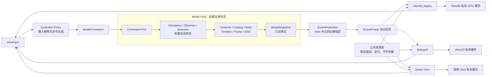
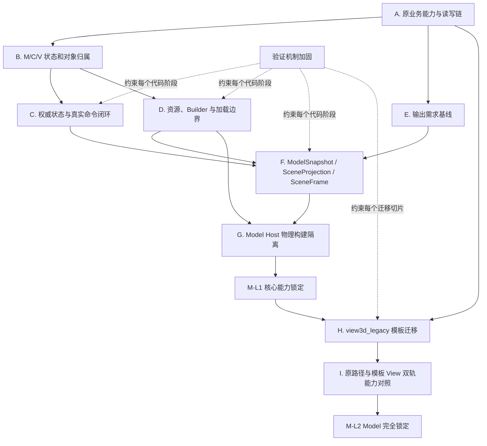

# Celestia MVC 总体决策与路线图

- 文档状态：待人工评审
- 事实基线：`0f733ef603b8db5ffc02b735c153d8302bfad3ed`
- 编制日期：2026-07-15
- 文档定位：MVC 总体决策材料，不是 Step24 实施计划

## 0. 先看结论

当前 Celestia 改造最准确的状态不是“已经完成 MVC”，也不是“前面的工作全部无效”，而是：

> 已经建成可运行的多进程 MVC 基础设施，并完成了一部分 Model 源码边界治理；但原 Celestia 的真实业务状态、完整 View3D 能力和物理构建边界还没有按 MVC 重新组织完成。

由此形成五项总体决策：

1. **保留 Step20-Step23。** 这些步骤真实清理了 Model、SolarSystem 和资源路径索引的局部边界。
2. **不把当前状态称为 Model 已解耦。** Model Host 仍编入 View3D/celrender 相关对象，运行状态也存在多份事实源。
3. **不直接执行原先设想的 Step24 代码改造。** `Surface`、`Atmosphere` 和资源字段的归属尚不能按整类判断。
4. **下一项工作应先形成原业务链与 M/C/V 责任归属基线。** 分析单位是业务能力、状态和对象关系，不是按钮，也不是画面效果。
5. **任何后续代码阶段都必须有单独计划并经人工确认。** 本文只确定依赖关系和先后顺序，不授权开始代码修改。

## 1. 最终目标到底是什么

最终目标不是得到三个能够互相发消息的 exe，也不是另外绘制一个“看起来像 Celestia”的 3D 窗口。最终目标同时满足以下条件：

| 目标 | 完成含义 |
|---|---|
| 原能力保真 | 原 Celestia 的业务与可视化能力通过白盒迁移得到承接，不靠黑盒仿制 |
| Model 独立 | Model 的对象、计算和权威状态不依赖任何具体 View；Model Host 可独立构建和运行 |
| Controller 真实驱动 | Controller 产生控制意图和类型化命令，真实修改 `Simulation` / `Observer` 等权威状态，不保存重复事实 |
| View 平权 | 原 View3D、未来 2D、其他 3D 和 BS View 都以普通组件形态存在，各自拥有私有目录和构建目标 |
| 公共能力可复用 | 只有确实能被多个 View 使用的协议、资源描述、数据传输和计算能力才进入公共层 |
| 可持续验证 | 每个迁移切片同时证明原统一 exe 未退化，并证明新模板 View 承接了对应业务能力 |

### 1.1 Model 的两个锁定层次

Model 锁定不能用一个时间点笼统描述，应分为两个层次：

| 层次 | 含义 | 达成时机 |
|---|---|---|
| M-L1：核心能力锁定 | Model 对象语义、计算能力和权威状态不再因 View 迁移而改变；后续只允许调整输出适配和修复缺陷 | 权威状态、资源边界、输出分层和 Model Host 物理独立完成后 |
| M-L2：Model 完全锁定 | View3D 白盒迁移和能力对照完成，输出需求已被真实迁移验证；除明确缺陷外不再修改 Model | 模板 View 能力迁移和双轨回归全部关闭后 |

当前尚未达到 M-L1。

## 2. 目标架构

### 2.1 逻辑责任图



这张图表达的是目标责任，不等同于当前目录名：

1. `Simulation`、`Observer` 和 `Selection` 的最终源码归属需要由业务读写链确认，但它们的运行状态只能有一个权威持有者。
2. Controller 不拥有暂停、倍速、选择和相机等第二份业务事实，只负责解释输入、形成命令和处理控制策略。
3. `ModelSnapshot`、`SceneProjection`、`SceneFrame` 是三个不同语义，不能继续由一个 `ViewFrame` 同时承担。
4. 公共资源层提供稳定描述、定位和数据，不持有某个 View 的 OpenGL/Vulkan/浏览器渲染对象。

### 2.2 View 的目标组织形态

目标组织原则如下：

```text
src/celviews/
  view3d_legacy/     原 View3D 白盒迁移后的模板 View
  debug2d/           普通 2D View
  <future-view>/     后续其他 2D、3D 或 BS View
```

最终要求：

1. 每个 View 都有自己的实现目录、入口、私有资源缓存和构建目标。
2. 删除某个 View 的私有目录，应只失去该 View，不破坏 Model、Controller 和其他 View。
3. `src/celengine/view3d`、`src/celrender/view3d` 中的原 View3D 私有能力应随迁移逐片改变所有者；最终不能继续作为特殊系统核心存在。
4. `celrender` 中只有被多个 View 真实复用的能力才可保留为公共渲染设施；仅供原 View3D 使用的代码应归入该 View。
5. 具体目录名和每个文件的去向不能在本路线图中一次性拍定，必须由原源码消费者矩阵逐片决定。

## 3. 当前处在什么位置

| 能力面 | 当前状态 | 准确判断 |
|---|---|---|
| 多进程 Host、传输、组装和消息 | 可用 | 是后续工作的基础设施，应保留 |
| 统一 exe 原能力回归 | 已有 10 场景基线 | 能守住已覆盖的原路径，但不能证明新 View3D 等价 |
| Model 目录直接 View/Adapter 依赖 | 已清理一部分 | 局部源码边界通过 |
| SolarSystem 类族归属 | 已改善 | Model 对 Adapter 的直接反向依赖已清理 |
| 资源路径索引 | 已从 View3D manager 抽出 | 只是中立路径索引，不是完整公共资源服务 |
| Model Host 物理独立 | 未完成 | 构建图仍纳入 View Adapter、View3D 和 celrender 对象 |
| 权威业务状态 | 未完成 | Controller、ModelService 和真实 `Simulation` 之间存在重复状态 |
| Controller 原业务驱动 | 未完成 | 当前多数命令是输出覆盖或结果模拟 |
| Runtime 输出分层 | 未完成 | `ViewFrame` 混合快照、投影、消息和覆盖容器语义 |
| View 平权目录与目标 | 未完成 | 插件清单存在，但完整 View 实现仍未按组件拥有 |
| 原 View3D 白盒迁移 | 尚未开始 | 当前跨进程 View3D 是固定图形样板，不是原代码迁移结果 |
| 跨进程 View3D 能力回归 | 尚未建立 | 目前没有与统一 exe 对应的同场景业务和截图门槛 |

因此，当前阶段应称为：

> **MVC 基础设施完成、Model 局部治理完成、业务重组尚未闭合。**

## 4. 前面工作分别产出了什么

| 阶段 | 有效成果 | 没有完成的内容 | 对后续的用途 |
|---|---|---|---|
| Step1-Step11 | Host、协议、传输、组装、View 插件和 DataPlane 基础 | 原业务没有按 MVC 完整迁移 | 提供运行和通信底座 |
| Step12-Step18 | 真实数据加载纵向样板、SceneFrame、输入返回链、统一 exe 回归 | 新 View3D 不是原 View3D 迁移，Controller 未真实驱动多数业务 | 证明技术链可通并建立兼容安全网 |
| 已回滚 Step19-Step86 | 无保留价值的效果补齐路线已移除 | 没有按原业务源码切分 | 其结论不得继续指导新 View 实现 |
| Step19.0 / Step20 | Model 类族、边界扫描、低中风险边界治理 | Model 物理独立和输出分层未闭合 | 确定哪些对象不能按“与渲染有关”简单移走 |
| Step21 | SolarSystem / SolarSystemCatalog 回到 Model 责任 | Builder 与资源绑定仍混合 | 清除一个真实 Model 反向依赖 |
| Step22 | Builder、资源、Surface/Atmosphere、RealModelBackend 审计 | 只做分析，不代表边界已拆完 | 证明资源必须字段级治理 |
| Step23 | TexturePaths / GeometryPaths 中立化 | 稳定资源 ID、DataPlane 实际资源链和 View 私有缓存未完成 | 为后续资源与 Builder 拆分提供起点 |
| Step24 前检查点 | 物理构建、状态所有权、View3D 差距和验证缺口得到复审 | 尚未形成实施计划 | 否决直接进入旧 Step24，触发本路线图 |

这些工作之所以没有形成显著画面效果，是因为它们主要处理基础设施和局部边界。问题不在于“没有画面就都无效”，而在于此前没有把这些局部成果放入一条可理解的总依赖链中。

## 5. 为什么后续必须按这个顺序



关键因果关系是：

1. 不先读清原业务链，就无法判断 `Simulation`、可见性列表、轨道采样、材质、大气和资源缓存分别属于哪一层。
2. 不先确定状态归属，就会继续由 Controller 和 ModelService 各保存一份暂停、倍速、选择和相机状态。
3. 不先完成资源字段和 Builder 边界，就无法让 Model Host 从 View3D/celrender 构建目标中真正独立。
4. 不先获得原 View3D 的真实读集，就无法设计足够且不过度的输出协议。
5. Model 核心未达到 M-L1 前迁移 View，会再次产生临时接口、重复实现和输出倒推业务。
6. 模板 View 没有实际承接原能力前，不能宣布 Model 达到 M-L2。

## 6. 分阶段路线

### 阶段 A：原业务链与责任归属基线

| 项目 | 内容 |
|---|---|
| 为什么先做 | 它是状态、资源、输出和 View 迁移四条路线共同的事实输入 |
| 分析单位 | 时间推进、选择、导航、观察者、可见性、星体/DSO/太阳系、轨道、标签、标记、表面、大气、环、资源加载等业务能力 |
| 主要工作 | 从 `CelestiaCore -> Simulation/Observer -> Renderer/Adapter/Resource` 追踪创建、读、写、销毁和反馈链 |
| 输出 | 一份主文档，包含业务能力矩阵、对象/状态所有权矩阵、原 View3D 读集、验证场景映射和未决项 |
| 完成判定 | 每项原能力都能指出源入口、权威状态、主要消费者、目标归属、迁移切片和验证方法；未知项明确列出而非猜测 |
| 解锁 | 权威状态闭环、资源拆分、输出分层三个实施计划 |

本阶段不修改 C++，也不按按钮逐项拆解。按键只作为某项业务能力的触发证据。

### 阶段 B：验证机制加固

| 项目 | 内容 |
|---|---|
| 为什么此时做 | 在第一个架构代码切片前，必须先确保失败能够被自动识别 |
| 主要工作 | 修正 Quick/Full 总状态与退出码、10 场景基线数量、Full runtime 详细检查；建立跨进程模板 View 场景框架 |
| 输出 | 可在自动执行中真实失败的统一 exe 门槛，以及后续可扩展的跨进程业务/截图门槛 |
| 完成判定 | 人工制造的截图、runtime token 或进程失败会返回非零；报告和退出状态一致；基线不会因 8/10 数量错误被重建 |
| 解锁 | 后续每个代码切片具备可信的停止条件 |

跨进程完整场景内容由阶段 A 的能力矩阵导出，不能凭当前固定图形样板编造。

### 阶段 C：权威状态与真实命令闭环

| 项目 | 内容 |
|---|---|
| 为什么在资源和 View 前 | 如果状态是假的，后续输出和画面即使正确也只是显示模拟数据 |
| 主要工作 | 建立 Backend 命令端口；Controller 只发送类型化命令；真实调用 `Simulation/Observer`；移除 Controller/ModelService 的重复事实状态 |
| 工作切片 | 时间与暂停、选择、观察者与相机、导航与跟随、需要独立 View 状态的表现策略 |
| 输出 | 单一权威状态源、只读快照和端到端命令测试 |
| 完成判定 | 命令后读取真实对象得到变化；重启或换 View 不依赖 Controller 内存回显；不存在同一业务状态的第二份权威值 |
| 解锁 | 可信的 `ModelSnapshot` 和 Controller 能力边界 |

这里的切片单位是状态族，不是 Space、H、C、G、F 等按钮。

### 阶段 D：资源、Builder 与加载边界

| 项目 | 内容 |
|---|---|
| 为什么需要独立阶段 | Model Host 当前对 View3D/celrender 的主要物理依赖集中在加载、Builder 和资源绑定链 |
| 主要工作 | 对 `Surface`、`Atmosphere`、Ring、RenderAssets 和 Builder 字段逐项分类；区分 Model 事实、场景外观、稳定资源引用、数据传输和 View 私有缓存 |
| 输出 | 资源三层实现边界、稳定资源描述、数据构建与资源绑定分开的 Builder、收窄后的 RealModelBackend |
| 完成判定 | Model 事实不含具体 GPU 对象；资源引用不依赖 View3D manager；只有特定 View 使用的缓存和加载器归入该 View |
| 解锁 | 输出资源字段设计和 Model Host 物理隔离 |

禁止按“包含纹理字段”把 `Surface` 或 `Atmosphere` 整体移出 Model。

### 阶段 E：输出语义与物理构建隔离

| 项目 | 内容 |
|---|---|
| 前置输入 | 阶段 A 的 View 读集、阶段 C 的权威状态、阶段 D 的资源边界 |
| 主要工作 1 | 分开 `ModelSnapshot`、`SceneProjection`、`SceneFrame`，逐字段说明来源、生命周期和消费者 |
| 主要工作 2 | 拆分角色专用 Runtime/CMake 目标，使 Model Host 不再编入 View3D、celrender、SDL/OpenGL 源码对象 |
| 输出 | 清晰的输出流水线、角色专用构建目标、能检查真实依赖图的扫描规则 |
| 完成判定 | Model Host 单独构建、启动和处理真实数据；构建图无 View 私有对象；协议字段均可追溯到业务读集 |
| 解锁 | M-L1 核心能力锁定和模板 View 迁移 |

### 阶段 F：原 View3D 模板化迁移

| 项目 | 内容 |
|---|---|
| 迁移方式 | 以原源码为业务事实，逐片改变代码所有者并适配依赖；不是另造效果，也不是机械 `git mv` |
| 目录目标 | 建立与其他 View 平权的 `view3d_legacy` 私有目录和构建目标 |
| 候选切片 | View 入口与生命周期、场景列表与可见性、星体/DSO、行星与表面、大气/环/彗尾、轨道/标签/标记、资源/GPU、输入反馈 |
| 每片要求 | 迁移后旧位置不保留重复私有实现；统一 exe 原能力通过；模板 View 对应业务和画面通过 |
| 完成判定 | 原 View3D 私有代码不再占据特殊核心位置；删除 `view3d_legacy` 只失去该 View；其他 View 可使用同一 M/C/公共能力 |
| 解锁 | View 平权架构和能力等价关闭阶段 |

候选切片只用于说明工作规模，最终顺序必须由阶段 A 的依赖图确定。

### 阶段 G：双轨能力对照与 M-L2

| 项目 | 内容 |
|---|---|
| 对照对象 | 固定原源码/统一 exe 基线与迁移后的模板 View |
| 验证类型 | 状态结果、对象数量和身份、资源解析、关键交互、多场景截图、进程隔离和残留进程检查 |
| 完成判定 | 能力矩阵中的可测项全部有两条路径证据；不可测项有明确原因和人工检查记录；Model 不再因 View 缺字段被动修改 |
| 最终结果 | Model 达到 M-L2，原 View3D 成为第一个普通模板 View，后续 View 按同一组织方式接入 |

## 7. 哪些工作可以并行

从依赖关系看，存在以下并行可能：

| 并行组合 | 前提 | 风险控制 |
|---|---|---|
| 阶段 A 与验证脚本基础加固 | 路线图已批准，验证加固不预设业务字段 | 不提前设计跨进程场景内容 |
| 阶段 C 与阶段 D | 阶段 A 的状态和对象归属已确认 | 不同时修改共享输出结构和同一 CMake 清单 |
| 多个 View3D 迁移切片 | M-L1 已达到，切片无共享文件和顺序依赖 | 每个会话使用独立 worktree、明确写入范围和合并顺序 |

不能并行或不宜并行的部分：

1. 阶段 A 未完成前，不应同时开始状态、资源和输出的实现。
2. 输出分层必须等待权威状态和资源字段形态稳定。
3. Model Host 物理隔离必须以真实依赖拆除为前提，不能只改 CMake 藏住依赖。
4. 第一个模板 View 的骨架、所有权规则和首个迁移切片应串行完成；模式被验证后再考虑多会话并行。

当前采用单会话串行推进更稳妥；“可以并行”不等于“现在应立即并行”。

## 8. 下一项工作的建议

在本文通过人工评审后，建议把下一项单独计划定义为：

> **Step24 候选：原 Celestia 业务链与 M/C/V 责任归属基线。**

其边界是：

```text
修改：分析文档和必要的只读分析脚本输出。
不修改：C++ 业务代码、CMake、Runtime 协议、View 实现和回归逻辑。
```

Step24 候选应只产生一份主分析文档，至少包含：

1. 按业务能力组织的原调用链，而不是按按钮或目录罗列文件。
2. 关键状态、对象、计算和资源的创建者、写入者、读取者、销毁者。
3. 当前所有者、目标所有者、是否公共、是否 View3D 私有及判断证据。
4. 每项能力对应的迁移切片和可执行验证场景。
5. 无法确认的争议项、所缺证据和后续决策点。

只有这份文档经人工评审后，才分别编写阶段 B、C、D 的实施计划；不能在 Step24 分析过程中顺便开始代码改造。

## 9. 每阶段为什么算完成

| 检查点 | 不是完成依据 | 必须具备的完成依据 |
|---|---|---|
| 业务归属基线 | 又写了一份类清单 | 每项能力形成入口、状态、消费者、目标归属、迁移和验证的闭环 |
| 验证加固 | 脚本显示 pass | 故意制造失败时脚本非零退出，报告状态与退出状态一致 |
| 权威状态闭环 | 某几个按键有响应 | 状态族真实修改原业务对象，重复事实源被删除 |
| 资源边界 | 扫描项数量下降 | Model 事实、稳定资源引用、传输和 View 私有缓存能独立解释和测试 |
| 输出分层 | 新增三个类型名 | 每个字段只有一种语义，并能追溯到原 View 真实消费需求 |
| Model 物理独立 | PE 暂时没有 OpenGL 导入 | 构建图不纳入 View 私有对象，Model Host 可独立构建和运行 |
| View 迁移 | 新目录能启动 | 原私有实现改变所有者、旧处无重复、双轨能力证据通过 |
| Model 锁定 | 台账清零 | M-L1/M-L2 对应的业务、物理、运行和验证条件全部成立 |

## 10. 既有文档如何使用

| 文档 | 已回答的问题 | 本路线图中的用途 | 不能替代的内容 |
|---|---|---|---|
| `02-09` 源码结构与 Model 类族分析第一版 | 建立第一轮对象和源码观察框架 | 历史分析基线 | 不能作为当前最终归属结论 |
| `02-10` Model 边界实体归属矩阵 | Step20A 时的归属和债务分类 | 提供阶段 A 的初始分类 | 不能替代原 View3D 完整读写链 |
| `02-11` Runtime Model 输出分层说明 | 指出 `ViewFrame` 语义混合 | 支撑阶段 E | 未给出全部字段的最终来源 |
| `02-12` 源码结构与 Model 类族分析第二版 | 深化 Simulation、ReferenceFrame、Builder 和类族关系 | 阶段 A 的 Model 侧输入 | 仍未覆盖完整原 View3D 能力链 |
| `02-13` Step22 资源边界审计 | 解释 Adapter、Builder、资源、Surface/Atmosphere、RealModelBackend | 阶段 D 的事实输入 | 不能直接授权整类迁移 |
| `02-14` Step24 前架构检查点 | 复审物理构建、状态所有权、View 差距和验证缺口 | 本路线图的主要问题依据 | 它是检查报告，不是执行顺序说明 |
| `02-15` 本文 | 说明目标、当前位置、因果顺序和阶段输出 | 后续计划的总导航 | 不代替任何阶段的详细实施计划 |

以后提出“下一步建议”时，必须同时指明：依据哪份事实、解决哪个未完成条件、为什么排在此处、产出什么、如何判断完成、完成后解锁什么。

## 11. 明确禁止的工作方式

1. 不按视觉效果重新实现一个平行 View3D。
2. 不把按钮响应当作 MVC 拆分的主工作单位。
3. 不因目录名或 OpenGL 关键字直接判断对象归属。
4. 不把扫描台账清零当作完成解耦的充分条件。
5. 不在原 View3D 读集不清楚时先冻结输出字段。
6. 不复制一套原实现长期双持；迁移切片必须改变真实所有者并处理旧实现。
7. 不机械移动文件后用临时依赖补到能编译；迁移必须允许接口和依赖适配。
8. 不把统一 exe 回归通过描述为跨进程 View3D 已无退化。
9. 不在没有独立计划和人工确认时进入新的 step 代码实施。

## 12. 已决事项与未决事项

### 12.1 已决事项

- Step20-Step23 保留。
- 已回滚 Step19-Step86 不再作为架构和实现依据。
- 原 View3D 是业务事实源，后续采用白盒迁移。
- 所有 View 最终必须平权并拥有各自私有目录。
- 公共能力必须证明可被其他 View 使用。
- 当前不能直接整体改造 `Surface` / `Atmosphere`。
- Model 锁定采用 M-L1 与 M-L2 两级判定。
- 本文通过前不开始 Step24 代码工作。

### 12.2 仍需由阶段 A 解答

- `Simulation`、`Observer`、`Selection` 的最终逻辑与物理归属边界。
- Renderer 的可见性、裁剪、轨道列表中哪些属于 View 中立投影，哪些属于 View3D 私有策略。
- `Surface`、`Atmosphere`、Ring、ReferenceMark 各字段的非 View3D 消费者。
- 多 View 共享到资源描述、原始字节还是解码后的 CPU 资源哪一层。
- 原 `CelestiaCore` 中脚本、UI 反馈和渲染开关分别属于 Controller、公共 Runtime 还是特定 View。
- `view3d_legacy` 的最终目录名、内部子目录和首个迁移切片。

这些问题有意保持未决，因为当前证据不足；路线图的作用是规定用什么证据、在什么阶段解决，而不是提前猜出答案。

## 13. 本路线图的评审结论口径

如果本文通过评审，只能说明：

```text
Celestia MVC 的最终目标、当前阶段、剩余工作依赖关系、阶段产物和完成判定已经形成统一导航。
可以单独编写 Step24“原业务链与 M/C/V 责任归属基线”计划。
```

不能说明：

```text
Step24 已经获得代码实施授权。
Model 已经完成解耦或锁定。
输出协议、资源边界和 View3D 目录已经最终确定。
跨进程 View3D 已经具备原 View3D 能力。
```

下一次决策点是：人工审阅本文的目标、阶段依赖和 Step24 候选边界；确认后，再单独落 Step24 详细计划。
