# Celestia 原业务链与 MVC 责任归属基线

- 文档状态：Step24 分析执行完成，等待人工评审
- 执行分支：`codex/celestia-mvc-step13-real-model-backend`
- 执行提交：`0f733ef603b8db5ffc02b735c153d8302bfad3ed`
- 架构代码基线：`0f733ef603b8db5ffc02b735c153d8302bfad3ed`
- 分析日期：2026-07-15
- 分析性质：源码只读白盒分析，不包含程序修改

## 0. 一页结论和阅读导航

### 0.1 总体结论

Step24 已经把“为什么下一步这么做”从一般 MVC 判断落到了 Celestia 的真实源码链上。本文覆盖 18 个业务能力族，形成 8 个已证实边界冲突、14 个带关闭条件的 U0 未决项、17 个从验证加固到 M-L2 的候选切片，以及 16 个必须补充的验证场景缺口。

当前最重要的结论不是“Model 只剩一个问题”，而是：Celestia 已有一部分有意义的逻辑拆分和 Runtime 基础，但 M-Core、M-Session、Controller、Projection、资源和原 View3D 的所有权尚未闭合，Model Host 也没有物理独立。后续不能直接迁移 View3D，更不能继续根据样板画面补 SceneFrame 字段。

| 关键问题 | Step24 结论 | 对下一步的约束 |
|---|---|---|
| Model 是否已经解耦 | 否。Universe/Catalog/Timeline/ReferenceFrame/Orbit 等 M-Core 事实较清楚，但 Simulation、Observer、资源/shape、Builder、Surface/Atmosphere 和 ReferenceMark 仍混合 | 先完成权威状态、资源/Builder 和输出/构建隔离，才能达到 M-L1 |
| Model Host 是否独立 | 否。CMake 仍把 Adapter、View3D、celengine、celrender 等对象编入 headless Model Host | 物理独立必须看构建图和独立运行，不能看 target 名称 |
| Simulation 属于哪层 | 不是单一层。Universe 所有权归 M-Core root；时间/Observer/Selection 归 M-Session；导航门面归 C-Command；faintestVisible 归 View policy/Projection request | 必须函数组拆分，不能整体改名或搬目录 |
| Observer 是否只是相机 | 否。pose/frame/journey/tracking/time 是 M-Session；FOV/zoom/displayedSurface/locationFilter 是 View 镜头或 policy | View 可以绑定 Observer Session，但不应把镜头表现字段当 Model 事实 |
| Selection 是否是核心层 | 否。它是小型对象引用；当前选择才是 M-Session 状态 | 只升级为稳定 ObjectRef，不建立 Selection 子系统 |
| Adapter 是否应永久保留为一层 | 否。现有 adapter 目录混合 Builder、Picking、Projection、RenderAssets 和 View policy | 按真实所有权拆开；provider/transport 等可复用连接能力另行保留 |
| 原 View3D 是否已是普通组件 | 否。统一库和 Model Host 都直接聚合其对象，celrender 也全是 View3D 实现 | M-L1 后白盒迁移到普通 `view3d_legacy` 私有目标，逐片删除旧位置实现 |
| Projection 应输出什么 | 只能输出多 View 同语义消费的时间派生、对象引用、场景事实和详情；不能输出 RenderList、屏幕 Annotation、shader/GPU 对象 | `U-PROJ-001/002` 未关闭前不得冻结完整 SceneProjection |
| 资源能否统一成公共服务器 | 只能确认稳定资源描述/ID 和 CPU shape 的共享必要性；CPU image、material/marker style 等没有第二 View 证据 | 不提前建设大而全 View-Common 或图片服务器 |
| 当前回归是否可作阻断门槛 | 尚不能。10 场景有价值，但 Full/Quick 的逻辑 fail 不可靠转成非零退出，基线仍按 8 张判断，且 09/10 等名称超出实际覆盖 | 第一项代码前工作必须是 `V-01` 验证机制加固 |
| 后续总体顺序 | `V-01 -> C-01..04 -> D-01..03 -> E-01 -> M-L1 -> F-01..07 -> G-01 -> M-L2` | 每个新代码阶段仍需单独计划和人工确认 |

### 0.2 目前能作出的决策

本文已经足以支持人工评审以下四件事：

1. 是否接受第 10 节的 M-Core、M-Session、C-Command、Projection、Resource、View3D 目标责任划分。
2. 是否接受第 11 节先验证、再状态、再资源、再输出隔离、最后模板 View 白盒迁移的依赖顺序。
3. 是否允许在评审通过后分别制定“验证机制加固”“权威状态与真实命令闭环”“资源、Builder 与加载边界”三份实施计划。
4. 是否接受 14 个 U0 项保留到各自最迟关闭阶段，而不是为了让台账归零强行下结论。

本文仍不足以授权任何 C++/CMake 修改，也不足以确定最终目录、冻结输出字段、宣布 Model 达到 M-L1，或开始 `view3d_legacy` 迁移。

### 0.3 阅读导航

| 想回答的问题 | 直接阅读 |
|---|---|
| 原系统如何创建、运行和绘制 | 第 2 节 |
| 18 个业务能力是否完整 | 第 3 节 |
| Simulation/Observer/Selection/时间/导航真实状态在哪里 | 第 4 节 |
| Universe、Catalog、对象生命周期和三类 Builder 有何差异 | 第 5、7 节 |
| 原 View3D 到底读取并计算什么 | 第 6、8、9 节 |
| 每个对象/状态/资源最终属于哪里 | 第 10 节 |
| 为什么按这个顺序迁移、哪些可并行 | 第 11 节 |
| 当前 10 场景真正测了什么、还缺什么 | 第 12 节 |
| 哪些是已证实冲突、哪些仍不能决定 | 第 13 节 |
| Step24 能解锁什么、不能宣称什么 | 第 14 节 |
| 每个结论对应哪段源码 | 附录 A |
| 每个能力如何串起证据、归属、迁移和验证 | 附录 B |

## 1. 分析范围、代码基线、方法和限制

### 1.1 分析目标

本文以原 Celestia 源码为业务事实，沿着“触发入口、权威状态、对象与计算、场景派生、资源、View3D 消费、反馈”恢复原系统业务链，再判断目标 MVC 责任和迁移依赖。

本文不是按目录给类贴标签，也不以当前跨进程固定图形 View3D 的字段反推原系统需求。

### 1.2 只读源码范围

```text
src/celestia/
src/celengine/model/
src/celengine/controller/
src/celengine/adapter/
src/celengine/resource/
src/celengine/view3d/
src/celrender/view3d/
src/celruntime/
src/celscript/
tools/regression/scenarios/
```

Qt、Win32、SDL 和脚本源码只用于反查入口、写入者、读取者与反馈，不扩展为平台 UI 设计分析。

### 1.3 分析动作

| 动作 | 含义 |
|---|---|
| `CREATE` | 构造、加载或注册对象/状态 |
| `READ` | 读取对象、状态、字段或资源 |
| `WRITE` | 修改权威状态、对象或 side table |
| `DESTROY` | 销毁、reset、remove 或生命周期清理 |
| `CALL` | 业务调用或跨层调用关系 |
| `BUILD` | CMake 对象库、目标和链接关系 |

### 1.4 证据等级

| 等级 | 含义 |
|---|---|
| `F0` | 源码可直接确认的成员、调用、读写、构造、销毁、include 或构建关系 |
| `F1` | 由多个 F0 事实组合得出的跨文件结论 |
| `D0` | 基于事实的目标设计判断，必须说明选择原因 |
| `U0` | 证据不足的未决问题，必须写出缺口和关闭条件 |

### 1.5 目标责任类别

| 类别 | 含义 |
|---|---|
| `M-Core` | 天体对象、客观状态、领域计算或与具体 View 无关的索引 |
| `M-Session` | Model Host 内唯一权威的运行会话状态 |
| `C-Command` | 输入解释、命令生成、控制策略和操作编排，不保存第二份业务事实 |
| `Projection` | 从权威事实派生、可被多个 View 以同语义消费的中立场景数据 |
| `Resource-Common` | 稳定资源描述、路径定位、内容标识和数据传输，不含具体 GPU 对象 |
| `View3D-Private` | 只有 View3D 需要的屏幕、像素、着色、GPU 缓存或绘制实现 |
| `View-Common` | 至少两个真实 View 具有相同语义和生命周期的公共 View 能力 |
| `App-Assembly` | 启动、配置、进程组装和平台无关应用编排 |
| `Platform-UI` | Qt、Win32、SDL 的窗口、菜单、对话框和平台事件适配 |
| `Split-Required` | 当前类型或函数混合多个责任，需要字段级或函数级拆分 |
| `UNRESOLVED` | 当前证据不足，不能强行归属 |

### 1.6 禁止结论

仅凭本文完成，不能宣称：

```text
Model 已完成解耦或达到 M-L1。
Simulation、Projection、资源和 View3D 的最终目录已经确定。
可以直接修改 Surface/Atmosphere 或冻结 SceneFrame 字段。
可以开始 view3d_legacy 源码迁移。
统一 exe 回归通过等于跨进程 View3D 已承接原能力。
```

## 2. 原系统总体创建链、运行链和绘制链

### 2.1 创建链

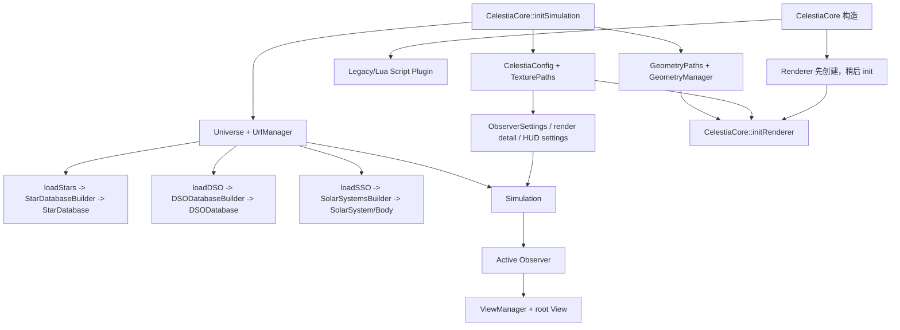

创建链已经表明原系统没有单一“Model 加载器”：`CelestiaCore::initSimulation` 同时编排配置、Catalog、资源路径、Universe、Simulation、ViewManager 和部分 Renderer/HUD 参数。Builder 又同时写 Model 对象和 RenderAssets。因此，启动编排、数据构建和资源绑定必须在后续按责任拆开，不能把 `initSimulation` 整体归入 Model。

### 2.2 运行链

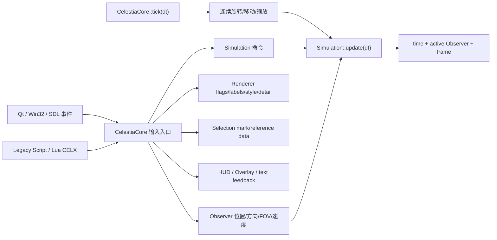

`CelestiaCore` 是原系统输入编排中心，不是权威状态容器。它保存键位按下、鼠标惯性、HUD、历史和窗口等应用状态，同时把真实业务修改分发给 `Simulation`、`Observer`、`Universe` 和 `Renderer`。

### 2.3 绘制链

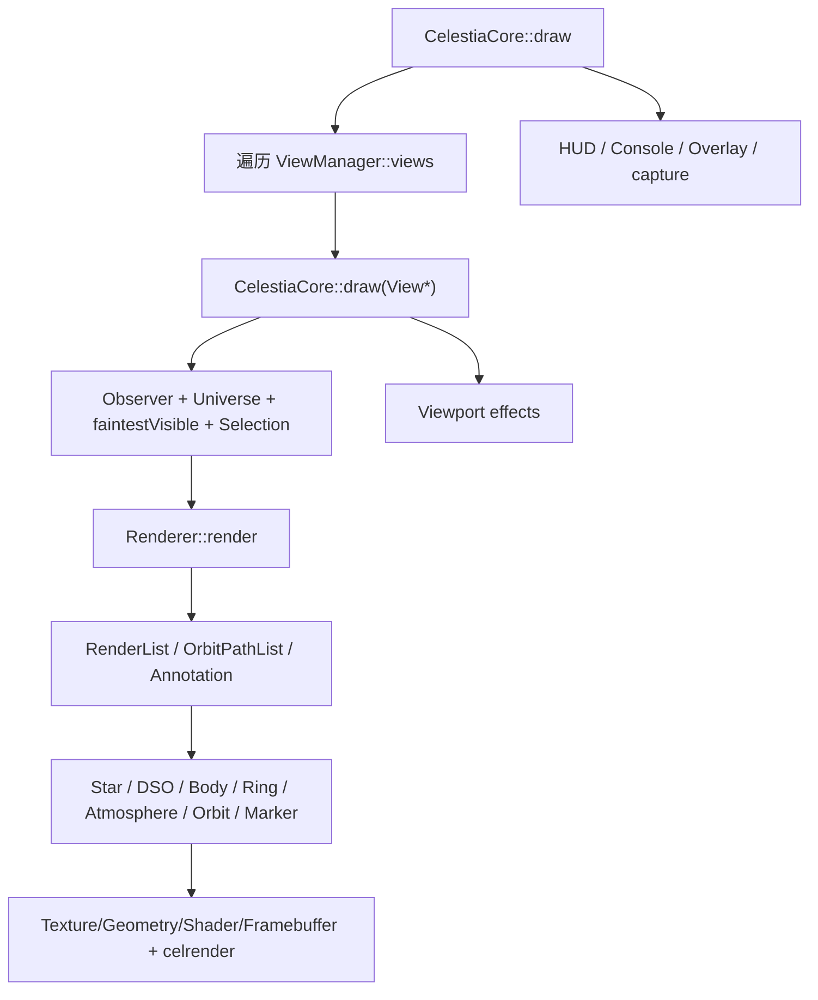

根 View 使用 `Simulation::getActiveObserver()`；分屏 View 使用各自 `View::observer`，但共同读取同一个 Universe、可见星等和 Selection。原 View3D 因而同时依赖权威会话状态、Model 对象图、场景派生、View 状态和 GPU 资源。

### 2.4 三条链的初步边界含义

| 链 | 原系统主要所有者 | 当前交织 | Step24 后续判断重点 |
|---|---|---|---|
| 创建链 | `CelestiaCore::initSimulation` / Builder | App 编排、Model 创建、资源绑定混合 | 哪些进入 App-Assembly、M-Core、Resource-Common、View3D-Private |
| 运行链 | `CelestiaCore` 触发，`Simulation/Observer/Renderer/Universe` 分别持有状态 | 输入、命令、权威状态和反馈混在一个 Core | 哪些是 C-Command，哪些是 M-Session，哪些是 View 状态 |
| 绘制链 | `CelestiaCore::draw` + `Renderer` | Renderer 内同时有列表生成、裁剪、布局、资源和 GPU 绘制 | 哪些可成为 Projection，哪些必须留在 View3D |

## 3. 业务能力总矩阵

本节先固定业务能力全集；详细读写链、目标责任和验证分别在第 4-12 节展开。

| Capability ID | 业务能力 | 主入口 | 权威对象/状态候选 | 主要消费者 | 详细章节 |
|---|---|---|---|---|---|
| `CAP-BOOT` | 配置、对象创建和启动编排 | `CelestiaCore::initSimulation/initRenderer` | Config、Universe、Simulation、Renderer | 全系统 | 2、5、7 |
| `CAP-TIME` | 时间、暂停、倍速、时间推进 | 输入/脚本、`tick` | `Simulation` | Observer、Timeline、Renderer、脚本 | 4 |
| `CAP-OBS` | Observer、参考系、相机和 FOV | 输入/脚本、ViewManager | `Simulation` active Observer / `View::observer` | Renderer、HUD、Picking | 4、6 |
| `CAP-SEL` | Selection、Picking 和对象引用 | 输入、文本、脚本、UI | `Simulation::selection` | Renderer、HUD、导航、脚本 | 4、6、9 |
| `CAP-NAV` | Center、Goto、Follow、Chase、Orbit | 输入/脚本 | Simulation + Observer/ObserverFrame | Renderer、HUD、脚本 | 4 |
| `CAP-CATALOG` | Star、DSO、SolarSystem Catalog | `loadStars/loadDSO/loadSSO` | Universe + Catalog | Simulation、Renderer、查询、脚本 | 5、7 |
| `CAP-VIS` | 可见性、裁剪、星等、LOD、场景列表 | `Renderer::render` | Universe/Observer 事实 + Renderer policy | View3D、Picking 部分路径 | 6 |
| `CAP-STAR` | 恒星和星场 | Renderer 星体阶段 | StarDatabase、Star/StarDetails | View3D、脚本、查询 | 6、7 |
| `CAP-DSO` | Galaxy、Nebula、Cluster 等 | Renderer DSO 阶段 | DSODatabase、DeepSkyObject | View3D、脚本、查询 | 6、7 |
| `CAP-BODY` | 行星、卫星、小天体、航天器 | SolarSystemsBuilder、Renderer SSO 阶段 | Body、Timeline、FrameTree | Simulation、View3D、脚本、查询 | 5、7、8 |
| `CAP-SURFACE` | Surface、材质、网格、纹理、替代表面 | Builder/RenderAssets/Renderer | Body 结构事实 + 外挂表现数据 | View3D、UI、脚本部分路径 | 7、8、9 |
| `CAP-ATM` | 大气、云、阴影、环、彗尾 | Builder/Body/Renderer | Atmosphere/Ring + RenderAssets | Body 计算、View3D | 7、8 |
| `CAP-ORBIT` | Orbit、Trajectory、采样和曲线 | Model 轨道 + Renderer 轨道阶段 | Orbit/Timeline/Frame | Simulation、View3D、脚本 | 5、6、8 |
| `CAP-ANNOT` | Label、Marker、ReferenceMark、Grid、Boundary | Universe/Renderer/UI/脚本 | 语义对象 + Renderer annotation | View3D、HUD、脚本 | 6、8、9 |
| `CAP-POLICY` | RenderFlags、LabelMode、StarStyle、Ambient、纹理精度 | Core/UI/脚本 | Renderer + 部分 Simulation | View3D、HUD、持久化 | 4、8、9 |
| `CAP-RESOURCE` | 路径、句柄、RenderAssets、Manager、Shader、Framebuffer | Config/Builder/Renderer init | Resource path tables + View3D managers | Builder、View3D、Runtime backend | 7、8 |
| `CAP-SCRIPT` | Legacy Script 与 Lua/CELX | Script plugin/API | 多个真实状态所有者 | Automation、HUD、Renderer | 9 |
| `CAP-FEEDBACK` | HUD、Overlay、状态提示和捕获 | Core、脚本、命令结果 | HUD/Overlay/Core timeInfo | 用户、脚本 | 2、9 |

能力族不是未来模块名。一个能力族可以横跨多个目标责任；例如 `CAP-SURFACE` 必须再拆 Model 事实、场景外观、资源引用和 View3D GPU 对象。

## 4. 权威状态与命令链矩阵

### 4.1 原系统会话聚合关系

`Simulation` 的目录名不能直接代表其责任。源码事实是：它一方面用 `unique_ptr` 持有唯一 `Universe`，另一方面持有 Observer 集合、active Observer、当前 Selection、暂停/倍速/同步策略、可见星等和近邻 SolarSystem 缓存，并向 Core、脚本和平台入口提供导航命令门面。因此它是“运行会话聚合器 + 命令门面”的混合对象，不只是传统意义上的 Controller。

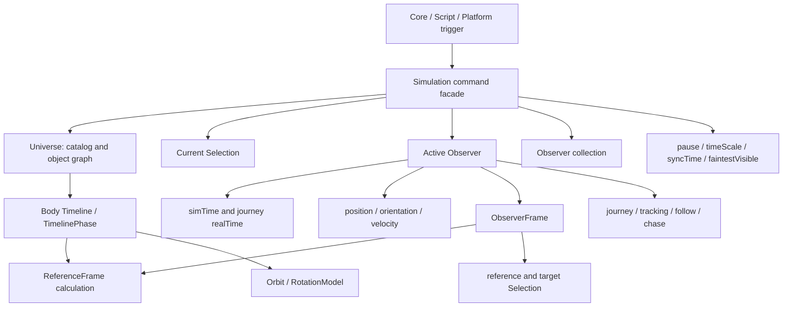

这里最容易误判的是时间：全局时间操作通过 `Simulation` 进入，但实际儒略日字段 `Observer::simTime` 存在每个 Observer 内。`Simulation::getTime()` 返回 active Observer 的时间；`setTime()` 根据 `syncTime` 写全部 Observer 或只写 active Observer；`update(dt)` 则对所有 Observer 调用 `Observer::update(dt, timeScale)`。因此“Simulation 管理全局时间”准确表达的是会话级时间策略和统一入口，不是说唯一时间数值字段直接存放在 `Simulation`。

### 4.2 状态所有权、写入和读取矩阵

| 状态族 | 原始真实成员 | 主要写入路径 | 主要读取者/计算 | 多 Observer 语义 | 当前事实结论 |
|---|---|---|---|---|---|
| 仿真儒略日 | `Observer::simTime` | `Simulation::setTime`；`Simulation::update -> Observer::update` | Timeline、ReferenceFrame、Orbit、对象位置、Renderer、脚本 | `syncTime=true` 时 setTime 同步全部；update 始终推进全部 | 数值在 Observer，统一策略在 Simulation |
| 会话实时时钟 | `Simulation::realTime` | `Simulation::update` | `Simulation::getRealTime`、会话级调用者 | 单一会话值 | 与 Observer journey 实时时钟不是同一用途 |
| Observer 实时时钟 | `Observer::realTime` | `Observer::update` | goto journey、速度插值、arrival time | 每个 Observer 独立 | Observer 导航状态的一部分 |
| 倍速 | `Simulation::timeScale` / `storedTimeScale` | `setTimeScale`、`setPauseState` | `Simulation::update`、UI/脚本 | 同一 Simulation 下共享 | 会话级权威策略 |
| 暂停 | `Simulation::pauseState` | `setPauseState` | UI/脚本；通过实际 `timeScale=0` 影响推进 | 同一 Simulation 下共享 | 暂停不是只读标志，会改写有效倍速 |
| 时间同步策略 | `Simulation::syncTime` | `setSyncTime` | `setTime`、`synchronizeTime` | 决定 setTime 是否同步全部 Observer | 会话级多 View 策略 |
| 当前选择 | `Simulation::selection` | `setSelection`、pick/text/script/UI 路径 | 导航、Renderer、HUD、脚本 | 所有 View 共用同一个当前选择 | Selection 值是句柄，权威选择状态属于会话 |
| Observer 位置/姿态 | `position/originalOrientation/...` 及 universal 派生值 | set、rotate、orbit、goto、update | Renderer、Picking、导航、URL/HUD | 每个 Observer 独立 | Observer 是可计算的会话实体，不是纯相机 DTO |
| Observer 速度 | `velocity`、`targetSpeed`、加速状态 | `setVelocity/setTargetSpeed`、update | 导航推进、HUD/脚本 | 每个 Observer 独立 | 导航状态和推进计算共存 |
| Observer 参考系 | `Observer::frame` -> `ObserverFrame` | `setFrame`、follow/chase/phase lock | 坐标转换、goto、orbit、Renderer | 每个 Observer 独立 | 包装会话选择与 Model ReferenceFrame 计算 |
| 跟踪和旅程 | `observerMode`、`journey`、tracked object、tracking orientation | goto/center/follow/chase/phaseLock/cancel | `Observer::update`、HUD/脚本 | 每个 Observer 独立 | 命令结果成为持续运行状态 |
| FOV/zoom | `Observer::fov/zoom/alternateZoom` | Core、脚本、平台工具栏、set 方法 | Renderer 投影、HUD、Picking | 每个 Observer 独立 | 当前属于 Observer；目标按镜头状态与 Observer pose 拆分，见 10.2 |
| 显示表面/位置过滤 | `Observer::displayedSurface/locationFilter` | UI/脚本/Core | Renderer、Location 展示 | 每个 Observer 独立 | 当前混入 Observer；目标归 View3D 显示策略，见 10.2 |
| 可见星等 | `Simulation::faintestVisible` | Core/UI/自动星等相关路径 | `Renderer::render`、HUD | 同一 Simulation 下共享 | 当前是会话显示阈值；目标按 View policy/Projection 请求拆分，见 10.2 |
| 最近 SolarSystem 缓存 | `Simulation::closestSolarSystem` | `update` 失效，查询时按 active Observer 重算 | 导航/状态显示相关调用者 | 只跟 active Observer | 会话派生缓存，不是 Catalog 所有权 |

### 4.3 命令进入权威状态的真实路径

原系统的导航操作不是 Controller 内修改一份字符串或输出覆盖值，而是触发 `Simulation` 门面后，由 active Observer 执行参考系、旅程、位置和姿态计算，并在后续 tick 中持续推进。

| 能力 | Trigger 示例 | Simulation 门面 | 实际执行/持续状态 | 直接结果 |
|---|---|---|---|---|
| 时间设置 | UI、Legacy、Lua | `setTime` | 一个或全部 `Observer::simTime` | Timeline/Frame/Object 查询时间改变 |
| 暂停/倍速 | 时间工具栏、按键、脚本 | `setPauseState/setTimeScale` | Simulation 字段；update 传入有效倍速 | 所有 Observer 推进速率改变 |
| 选择 | pick、搜索、脚本、选择窗口 | `setSelection` | `Simulation::selection` | 导航目标、HUD、Renderer 选择高亮改变 |
| Goto | Core、脚本、UI | `gotoSelection*` | `Observer::journey` + travelling mode | 后续 update 插值位置和姿态 |
| Center | Core、脚本 | `centerSelection*` | Observer journey/orientation | 相机持续转向目标 |
| Follow/Chase/PhaseLock | Core、脚本 | 同名门面 | ObserverFrame、tracked object、mode | 后续位置姿态跟随对象/参考系 |
| Orbit/Rotate | 鼠标、手柄、脚本 | `orbit/rotate` | Observer 位置/姿态 | 当前 Observer 立即改变 |
| FOV | Core、Lua、平台工具栏 | 直接取 active Observer | `Observer::fov` | 投影和拾取参数改变 |

`Simulation` 中这些方法应按字段继续拆读：`setSelection` 一类是会话状态写入；`gotoSelection` 一类是命令门面；真正的轨迹、坐标和姿态计算在 Observer/ObserverFrame/ReferenceFrame。不能因文件位于 `controller/` 就把 Observer 的全部计算判作 Controller，也不能因 Observer 被 Renderer 读取就把它判作 View 对象。

### 4.4 ReferenceFrame、Timeline 与 ObserverFrame 的区别

| 类型 | 持有什么 | 主要计算 | 生命周期/所有权 | 在业务链中的位置 |
|---|---|---|---|---|
| `ReferenceFrame` 类族 | 坐标轴定义及必要的对象引用/子 frame | 给定时间的 orientation、angular velocity、惯性判断 | 多以 `shared_ptr<const ReferenceFrame>` 被 TimelinePhase/ObserverFrame 引用 | Model 坐标计算事实 |
| `Timeline` | `vector<unique_ptr<TimelinePhase>>` | 按时间选择 phase、校验连续区间、传播变更 | Body 持有，phase 由 Timeline 独占 | Body 随时间变化的领域结构 |
| `TimelinePhase` | Body、起止时间、orbit frame、Orbit、body frame、RotationModel、所属 FrameTree | 组合某时间段的位置和姿态模型 | Timeline 独占；共享 Orbit/Frame/Rotation | Body 轨迹和姿态的领域配置 |
| `FrameTree` | 非拥有的 TimelinePhase 子节点和 owner Selection | 维护层级、遍历、变更传播、边界半径 | 由 SolarSystem/Body 体系关联管理 | Model 对象层级与空间计算结构 |
| `ObserverFrame` | `ReferenceFrame`、coordinate-system 标记、reference/target Selection | universal 与 observer frame 间的位置/姿态/速度转换 | 每个 Observer 通过 shared pointer 持有 | 会话 Observer 对 Model frame 计算的包装 |

`ObserverFrame` 不是 `ReferenceFrame` 的替代品。前者记录某个 Observer 当前如何使用参考对象和坐标系；后者定义可由 Body Timeline 和其他领域对象共享的坐标计算。目标设计必须保留这一层差异。

### 4.5 Selection 的实际权重

`Selection` 是一个小型值句柄：`SelectionType` 加一个指向 Star、Body、DeepSkyObject 或 Location 的原始 `void*`。它不是 Catalog、索引或数据管理器。它附带 `radius/getPosition/getVelocity/parent/isVisible` 等便利方法，是为了让调用者用统一句柄访问不同对象，而不是形成独立业务层。

需要区分三个概念：

1. `Selection` 类型本身：跨对象类型引用句柄。
2. `Simulation::selection`：当前会话唯一权威选择状态。
3. Picking：View 根据屏幕坐标、Observer 和对象候选计算出 Selection 的过程。

此前反复强调 Selection 的合理原因，只是它横跨输入、导航、Renderer、HUD、脚本和 Frame 引用，适合作为检查闭环的追踪点；这不意味着它在系统层级上与 Simulation、Universe 或 Catalog 等量齐观。

### 4.6 前端和脚本交叉写入者

| 消费者/触发端 | 直接使用 | 对边界判断的意义 |
|---|---|---|
| Qt 时间工具栏 | Simulation pause/timeScale | 桌面控件只是会话时间命令触发端 |
| Qt/Win32 选择和 Goto UI | setSelection、goto/center | UI 不拥有当前选择或旅程状态 |
| Legacy command | selection、goto、center、follow、chase、phaseLock、frame、timeScale | 非窗口入口仍要求完整命令面 |
| Lua/CELX Celestia API | selection、pause、timeScale | 跨进程改造不能只覆盖按钮入口 |
| Lua/CELX Observer API | 位置/姿态、frame、goto、orbit、target speed、FOV | Observer 能力是可编程业务面，不是 Renderer 内部细节 |

这些入口只证明谁触发或消费，不改变权威状态所有权。后续 Controller 需要表达同一业务命令集，但不应保存第二份 pause、timeScale、selection 或 camera 事实。

### 4.7 当前 Runtime 与原事实源的差距

| 状态/能力 | 原系统事实源 | 当前 ControllerService | 当前 ModelService/Backend | 已确认问题 |
|---|---|---|---|---|
| pause | `Simulation::pauseState` | 本地 `paused_` | 另一份本地 `paused_` | 至少两份 Runtime 状态，未闭合到真实 Simulation |
| timeScale | `Simulation::timeScale/storedTimeScale` | 本地 `timeScale_` 并自行乘除 | 另一份 `timeScale_`，step 时自行乘 dt | 未复用原暂停和同步语义 |
| time | 每个 Observer 的 simTime，Simulation 统一入口 | 转发命令 | Backend 仅有 `setTime/step`；Real backend 调真实 Simulation | 时间部分接入真实后端，但接口过窄 |
| FOV | active/per-view Observer | 本地 `cameraFov_` | 本地 `cameraFov_` 并覆盖 snapshot | 未写入真实 Observer，也未保留多 Observer 语义 |
| selection | `Simulation::selection` 句柄 | 转发 type/id | ModelService 保存字符串并覆盖 snapshot | 输出可变化，但真实选择状态没有变化 |
| center/goto/orbit/follow | Simulation -> active Observer 真实导航 | 翻译为 model 命令 | 只修改 camera position/yaw/reference id 等输出覆盖字段 | 没有执行原旅程、参考系和位置姿态计算 |
| snapshot | Observer + Universe + Renderer 完整读集 | 无 | `SimulationBackend::snapshot()` 仅返回 ViewFrame；Real backend 用 `SceneViewModel` | 快照只是当前窄投影，不能代表原业务闭环 |

`SimulationBackend` 当前只有 `load/setTime/step/snapshot`，这从接口层面解释了为什么 ModelService 只能在旁边维护选择、FOV、跟随和相机覆盖值：真实命令能力没有进入 backend。该实现可用于早期链路连通，但不能作为后续状态所有权设计的基线。

### 4.8 Task4 阶段结论

1. `Simulation` 是混合对象：持有 Model 根对象和会话权威状态，同时暴露命令门面；后续需要按成员/函数拆分，而不是整类移动。
2. 时间的唯一语义由 Simulation 会话策略和 Observer 数值状态共同实现，任何新 Host 都必须保留多 Observer 同步规则。
3. Observer 持有并执行位置、姿态、速度、旅程、参考系和跟踪状态；它不是仅供 View3D 绘制的相机结构。
4. ReferenceFrame、Timeline 和 Orbit 是领域计算；ObserverFrame 是会话对这些计算的使用包装，二者不可合并为一个“相机层”。
5. Selection 类型只是统一对象句柄；真正需要唯一化的是 `Simulation::selection` 代表的当前会话状态。
6. 当前 Runtime 的 pause、timeScale、FOV、selection 和导航存在重复状态或输出覆盖，尚未形成“命令 -> 真实状态 -> 同一状态派生输出”的闭环。
7. FOV、displayedSurface、locationFilter 和 faintestVisible 在 Task4 时仍需结合 View3D、Picking、脚本和多 View 语义判断；第 10.2 节现已裁定为 View lens/policy 与 Projection 查询参数，不再作为会话领域事实。

## 5. Model 对象、计算和生命周期矩阵

### 5.1 Universe 聚合所有权

`Universe` 通过 `unique_ptr` 持有 StarDatabase、DSODatabase、SolarSystemCatalog、AsterismList、ConstellationBoundaries 和 UrlManager，并值持有 MarkerList。它同时提供对象查找、路径补全、近邻恒星、SolarSystem 反查、标记和信息 URL 等跨 Catalog 查询。

| 对象 | 创建者 | 运行所有者 | 主要写入方式 | 主要读取者 | 销毁方式 | 当前事实判断 |
|---|---|---|---|---|---|---|
| `Universe` | `CelestiaCore::initSimulation` | `Simulation` 的 `unique_ptr` | Catalog setter、loadSSO、mark/unmark | Simulation、Renderer、脚本、查询 UI | Simulation 析构链 | Model 对象图聚合入口 |
| `StarDatabase` | `StarDatabaseBuilder::finish` | Universe | load/replace/modify 后构建 octree/index | Renderer、Universe 查询、脚本 | Universe `unique_ptr` | Catalog 与空间索引属于 Model 事实 |
| `DSODatabase` | `DSODatabaseBuilder::finish` | Universe | DSO 文件逐项创建，finish 构建 octree/index | Renderer、Universe 查询、脚本 | Universe `unique_ptr` | Catalog 与空间索引属于 Model 事实 |
| `SolarSystemCatalog` | `loadSSO` | Universe | `SolarSystemsBuilder` 直接 `try_emplace` | Universe、Simulation、Renderer、脚本 | Universe `unique_ptr` map | Catalog 与天体层级属于 Model 事实 |
| `SolarSystem` | `SolarSystemsBuilder::getOrCreateSolarSystem` | SolarSystemCatalog map value | 创建 PlanetarySystem/FrameTree | Universe、Renderer、查询 | map `unique_ptr` | Model 聚合对象 |
| `PlanetarySystem` | SolarSystem 或 Body | SolarSystem/Body | add/remove Body、别名索引 | Universe、Renderer、脚本 | `unique_ptr` 级联 | Model 对象树 |
| `Body` | `PlanetarySystem::addBody` | PlanetarySystem vector | Builder、Timeline、特征管理器 | Simulation、Renderer、脚本 | vector `unique_ptr`；析构发事件 | Model 对象，但外挂表现需拆分 |
| `Star` | StarDatabaseBuilder | StarDatabase octree | Builder、StarDetails | Renderer、查询、脚本 | octree 容器 | Model 对象 |
| `StarDetails` | Builder/默认详情/clone | intrusive shared ownership | Builder 与 Model 默认/复制逻辑 | Star、Renderer、脚本 | 引用计数归零发事件 | Model 详情与外挂表现存在生命周期联动 |
| `DeepSkyObject` | DSODatabaseBuilder | DSODatabase octree | 对象 `load()` | Renderer、查询、脚本 | octree `unique_ptr` | Model 对象 |
| `MarkerList` | Universe 值成员 | Universe | mark/unmark | Renderer、脚本/UI | Universe 析构/clear | 标记语义状态，不等同于符号绘制 |

### 5.2 三类 Catalog 的内存形态

| Catalog | 主容器/索引 | 名称/交叉索引 | 空间查询 | Builder 结束动作 |
|---|---|---|---|---|
| Star | StarOctree + catalogNumberIndex | StarNameDatabase、HD/SAO 等 cross index | octree | 构建 octree 和 catalog number index，解析 barycenter、category、URL |
| DSO | DSOOctree + catalogNumberIndex | NameDatabase | octree | 构建 octree/index，计算平均绝对星等 |
| SolarSystem | `unordered_map<star index, unique_ptr<SolarSystem>>` | Body/PlanetarySystem 名称索引 | 通过 host star 和层级查询 | 延迟计算 Location 的地理坐标位置 |

Star/DSO 使用 octree 并不使它们变成 View 数据。该索引同时支撑空间查询和可见对象遍历，属于 Model 可查询对象图；Renderer 使用索引只是消费者之一。

### 5.3 生命周期事件和外挂数据

| Model 生命周期事件 | Adapter 订阅行为 | 说明 |
|---|---|---|
| Body destroyed | `BodyRenderAssets::remove` | Body 本体不持有全部表面/网格外挂 |
| Body default reset | `BodyRenderAssets::reset` | Model 重置会要求表现 side table 同步重置 |
| Ring removed | `BodyRenderAssets::removeRing` | Ring 纹理按 RingSystem 指针外挂 |
| Body shape override query | BodyRenderAssets 回答是否有 geometry override | Model 的 `isEllipsoid/isSphere` 会反查外挂形状，形成计算反向依赖 |
| StarDetails destroyed/clone/copy | StarRenderAssets remove/clone/copy | 纹理和 geometry 与共享 StarDetails 生命周期同步 |
| StarDetails default creation | StarRenderAssets 设置光谱类默认纹理 | Model 默认详情创建会触发表现默认值 |
| Nebula destroyed | `NebulaRenderAssets::remove` | Nebula geometry 按对象指针外挂 |

这套事件机制避免了 Model 头文件直接 include RenderAssets，却没有消除语义耦合。特别是 Body shape override query 会让 Model 几何判断依赖 Adapter 回调结果，后续必须按计算用途复审，不能把“扫描无直接 include”当成完全解耦。

### 5.4 当前生命周期结论

1. Model 对象的主所有权链清楚：Simulation -> Universe -> Catalog -> 对象树/索引。
2. 表现 side table 使用原始对象指针作为 key，依赖对象生命周期事件维持一致性，属于进程内机制。
3. 生命周期事件本身是中立通知，但某些事件名称和查询已经暴露表现需求，尤其 shape override。
4. 后续不能只移动 RenderAssets 文件；还必须处理默认值、clone/copy、reset 和几何计算的同步语义。

### 5.5 运行会话如何使用 Model 对象图

| 会话对象 | 持有/引用的 Model 事实 | 访问方式 | 是否改变 Model 所有权 |
|---|---|---|---|
| Simulation | 独占 Universe | `unique_ptr<Universe>` | 是，Simulation 是当前对象图根所有者 |
| Simulation selection | Star/Body/DSO/Location | Selection 原始指针句柄 | 否，只引用 Catalog 对象 |
| ObserverFrame | reference/target Selection + ReferenceFrame | shared frame + 值句柄 | 否，使用 Model 坐标计算 |
| Observer journey/tracking | 目标/中心 Selection | 值句柄和旅程参数 | 否，保存会话导航状态 |
| TimelinePhase | Orbit/RotationModel/ReferenceFrame | shared immutable 计算对象 | 属于 Body Model 结构 |
| FrameTree | TimelinePhase 节点和 owner Selection | 非拥有指针层级 | 属于 Model 对象层级索引 |

这条关系说明“Model 独立”不能被理解为禁止会话对象引用 Model。真正需要禁止的是 View 或 Controller 持有第二份同语义业务事实，以及 Model 计算反向读取 View3D 私有资源。

## 6. 原 View3D 完整读集与内部阶段

### 6.1 `Renderer::render` 的直接输入与隐式输入

`CelestiaCore::draw(View*)` 显式传给 `Renderer::render` 的只有 `Observer`、`Universe`、`faintestMagNight` 和 `Selection`，但 Renderer 还读取自身长期保存的显示策略、资源管理器和 GPU 状态。完整输入不能只按函数参数统计。

| 输入族 | 直接读取内容 | 用途 | 当前所有者 |
|---|---|---|---|
| Observer 时间 | simTime、realTime | Timeline/Orbit/Frame 查询、动画和缓存年龄 | Observer |
| Observer 视点 | position、orientation、zoom | 相对位置、视锥、投影、LOD、绘制矩阵 | Observer |
| Observer 显示字段 | displayedSurface、locationFilter | 替代表面和 Location 标签筛选 | Observer |
| Universe | Star/DSO Catalog、SolarSystem、Asterism、Boundary、Marker | 场景候选对象和语义标记 | Universe |
| Selection | type + object pointer | 高亮、轨道强制可见、选择标记/屏外指针 | Simulation 会话 |
| 可见星等输入 | `faintestMagNight` | 星/DSO/Body 可见阈值和自动星等基准 | Simulation 当前字段 |
| Renderer policy | RenderFlags、LabelMode、orbitMask、starStyle、ambient、distance/min-size、detail options | 决定哪些对象、标签、轨道和效果进入画面 | Renderer |
| 投影/窗口 | ProjectionMode、viewport、DPI、FOV、pixelSize | 视锥、像素大小、标签阈值、深度范围 | Renderer + Observer zoom |
| 表现外挂 | Body/Star/Nebula RenderAssets、BodyFeaturesManager | geometry、texture、surface、atmosphere、ring 等 | Adapter side tables/managers |
| View3D 资源 | TextureManager、GeometryManager、ShaderManager、字体、缓存、子 renderer | 句柄解析、批处理和 GPU 绘制 | Renderer |
| GPU 状态 | framebuffer、pipeline state、depth range、OpenGL buffers | 清屏、深度、混合、实际出图 | View3D |

这说明现有 `SceneFrame` 只覆盖少量相机、选择和示例对象字段，远未覆盖原 View3D 的真实读集；同时也说明不能把 Renderer 当前读取的一切都推给新 View。需要先把事实/派生与像素/GPU 需求拆开。

### 6.2 每帧阶段顺序

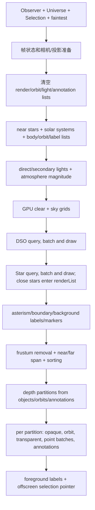

| 阶段 | 主要函数 | 读取 | 产物/副作用 | 是否直接调用 GPU |
|---|---|---|---|---|
| 1. 帧准备 | `render` 1399-1453 | Observer 时间/姿态/zoom/显示字段，ProjectionMode | FOV、pixelSize、camera/frustum/MVP、highlight | 否 |
| 2. 集合复位 | `render` 1454-1464 | 上帧缓存容器 | 清空 4 类 annotation、render/orbit/light/near-star 列表 | 否 |
| 3. 星等策略 | `autoMag`、render 1466-1469 | flags、zoom、faintest input | faintest/saturation/faintestPlanetMag | 否 |
| 4. 近邻系统收集 | `buildNearSystemsLists` | Universe、Observer、FrameTree、Timeline、Orbit、Body、flags | nearStars、LightSource、RenderList、OrbitPath、Body label | 否 |
| 5. 光照环境 | `setupSecondaryLightSources`、`adjustMagnitudeInsideAtmosphere` | Body/Atmosphere/光源/相对位置 | secondary lighting、调整后星等、ambientColor | 否 |
| 6. 背景和深空 | `renderSkyGrids/renderDeepSkyObjects/renderPointStars` | Catalog、Observer、policy、资源 | DSO/star 批、背景 annotation；近恒星可追加 renderList | 是，收集和绘制交织 |
| 7. 星座与标记 | `renderAsterisms/renderBoundaries/labelConstellations/markersToAnnotations/selectionToAnnotation` | Universe 语义对象、Selection、Observer、字体/颜色 | 背景/前景/深度排序 annotation | 部分立即绘制 |
| 8. 裁剪和排序 | `removeInvisibleItems`、`sort` | renderList、Atmosphere/Ring、frustum、viewport/FOV | 过滤后的 list、nearZ/farZ、排序 | 否 |
| 9. 深度分区 | `buildDepthPartitions` | render/orbit/annotation 深度跨度 | DepthBufferPartition | 否，但完全服务 GPU depth precision |
| 10. SolarSystem 绘制 | `renderSolarSystemObjects` | 各列表、Observer zoom、资源、policy | body/star/ring/tail/orbit/reference mark/annotation 像素 | 是 |
| 11. 前景和指针 | annotation render、`renderSelectionPointer` | annotation、Selection、Observer | UI-like 画面叠加 | 是 |

这个顺序还揭示一个迁移限制：原 Renderer 并没有清晰的“先完整生成中立场景，再统一绘制”阶段。DSO 和远恒星在各自 Catalog 遍历中直接写 GPU batch 并立即绘制；SolarSystem 对象才主要经过 `renderList` 和 depth partition。因此不能把 `renderList` 误称为“原系统完整场景”。

### 6.3 中间集合的生产者和消费者

| 中间对象 | 核心字段 | 主要生产者 | 主要消费者 | 当前局限 |
|---|---|---|---|---|
| `nearStars` | `const Star*` | `Universe::getNearStars` | direct light、SolarSystem 查找、近恒星轨道 | 原始指针、进程内 Catalog 生命周期 |
| `LightSource` | observer-relative position、color、luminosity、radius | `setupLightSources` | Body apparent magnitude、具体 LightingState | 混合客观光源属性与当前 Observer 相对坐标 |
| `SecondaryIlluminator` | `Body*`、viewer-relative position、radius、reflected irradiance | `buildRenderLists` + setup | 行星反射光计算 | 由像素阈值筛选，且保存原始指针 |
| `RenderListEntry` | Star/Body/ReferenceMark 指针、relative position、sun、distance/radius、near/far、pixel size、appMag、type/opaque | `PointStarRenderer`、`buildRenderLists/addRenderListEntries` | culling、depth partition、`renderItem` | 同时含 Model 引用、场景派生、像素 LOD、GPU 排序字段 |
| `OrbitPathListEntry` | Body/Star 指针、origin、centerZ、radius、opacity | `buildOrbitLists/addStarOrbitToRenderList` | depth partition、`renderOrbit` | opacity 和进入阈值由像素策略决定 |
| `Annotation` | text、MarkerRepresentation 指针、color、3D position、alignment、size | star/DSO/body/location/marker/selection/constellation 路径 | background/foreground/depth-sorted text/marker render | 语义、布局和字体绘制输入混在一起 |
| `DepthBufferPartition` | nearZ、farZ、index | `buildDepthPartitions` | per-interval projection/depth range | OpenGL 深度精度实现细节 |
| Star/DSO batch | GPU vertex buffers 或具体子 renderer 的内部列表 | PointStarRenderer/DSORenderer | GL 子 renderer | 没有中立可序列化场景对象 |

`RenderListEntry` 尤其不能原样提升成 Projection 协议：其中 `discSizeInPixels`、near/far、opaque 和排序深度受当前 View3D 投影、viewport、geometry 资源与深度实现影响；其 union 又直接保存 Model 指针。后续需要从业务事实重新定义中立派生，而不是给该结构增加序列化。

### 6.4 SolarSystem 列表构建的真实计算链

`buildNearSystemsLists -> buildRenderLists` 的单个 Body 路径如下：

```text
Universe near-star query
-> Star 对应 SolarSystem
-> FrameTree 当前 TimelinePhase
-> phase Orbit positionAtTime + orbitFrame orientation
-> observer-relative position
-> view-cone/subtree bounding tests
-> Body radius/culling radius/classification/visibility
-> direct-light apparent magnitude
-> pixel disc size and label/orbit policy
-> BodyRenderAssets geometry opacity + Ring/Atmosphere features
-> RenderListEntry / OrbitPathListEntry / Annotation
```

| 计算片段 | 事实输入 | 当前附加条件 | 阶段判断 |
|---|---|---|---|
| active TimelinePhase、orbit position、frame orientation | time、Body Timeline、Orbit、ReferenceFrame | 无 GPU 依赖 | 领域计算事实 |
| observer-relative position/distance | object position、Observer position | 当前 Observer | 可复用场景派生候选 |
| apparent magnitude | Body 光学属性、LightSource、距离 | Renderer 当前只取最亮光源策略 | 领域公式与显示策略需要再拆 |
| subtree bounding sphere traversal | FrameTree 统计、相对位置 | faintest/pixelSize/planetshine 阈值 | Model 索引与 View LOD 混合 |
| frustum/view-cone test | 相对位置、culling radius | ProjectionMode/FOV | View 投影相关可见性 |
| `discSizeInPixels > 1` | radius/distance | viewport/FOV/pixelSize | View3D LOD 策略 |
| geometry opacity | BodyRenderAssets geometry handle | GeometryManager 实例和 mesh 内容 | View3D 资源/绘制决策 |
| ring/comet/reference-mark entry | Body features | RenderFlags、像素阈值、具体 renderable type | 语义事实和 View3D 列表策略混合 |

### 6.5 裁剪、排序和深度分区不是同一种能力

1. **对象/时间计算**：哪个 TimelinePhase 生效、对象在何处、半径和姿态是什么，属于业务事实计算。
2. **Observer 相对派生**：相对位置、距离、视线方向可被多种 View 消费，但输出精度和坐标系仍需统一设计。
3. **投影可见性**：视锥、屏幕覆盖、像素 LOD、标签阈值依赖具体 View 的投影和 viewport；不同 2D/3D/BS View 不一定共享结果。
4. **绘制顺序**：opaque/translucent 顺序、near/far、depth partitions 和 OpenGL depth range 是 View3D 实现。
5. **语义过滤**：Body visible/classification、用户要求显示哪些对象具有跨 View 价值，但当前与 RenderFlags/bodyVisibilityMask 混合，需要在 Task8、9 再定状态位置。

因此，“Renderer 中做的计算”既不能整体留在 View3D，也不能整体上提到 Model/Projection。正确迁移单位必须细到输入和产物，而不是函数或文件。

### 6.6 原 View3D 物理边界

| 物理区域 | 当前内容 | 是否可作为未来普通 View 私有目录的主体 |
|---|---|---|
| `src/celengine/view3d` | Renderer 总编排、场景收集、策略状态、纹理/geometry/shader/FBO、投影和大量 GL 设施 | 只有完成责任拆分后可以；当前包含可迁出的事实派生 |
| `src/celrender/view3d` | Galaxy/Nebula/Atmosphere/Ring/Grid/Line 等具体 GPU renderer | 大部分是 View3D 私有实现候选 |
| `src/celengine/adapter` RenderAssets | Model 指针到表现资源/Surface/Atmosphere/Ring 的 side table | 不能长期作为“公共 Adapter”整体保留；需按字段在 Task7、9 拆分 |
| `src/celengine/model` | Catalog、Body、Timeline、Frame、Orbit、物理/几何事实 | View3D 应消费，不应搬入 View 私有目录 |

### 6.7 Task5 的 `CAP-VIS` 阶段结论

1. 原 View3D 的完整流水线已恢复为“帧准备、对象/光源/标签收集、部分即时绘制、裁剪排序、深度分区、SolarSystem 绘制和前景反馈”，不是单一 Renderer 调用黑盒。
2. 原系统没有一个覆盖 Star、DSO、Body、Orbit、Annotation 的完整中立 Scene 对象；现有中间列表只覆盖各自局部路径。
3. `RenderListEntry` 等结构是进程内 View3D 工作结构，不是未来输出规范的直接原型。
4. Model 时间/Frame/Orbit 计算、Observer 相对派生、投影可见性、语义显示策略和 GPU 顺序必须分别处理。
5. Task5 只固定了分解轴；在 Task6-8 补齐对象族和交叉消费者后，第 10.4 节已把中立对象/场景事实归 Projection，把像素、列表、深度和 GPU 策略归 View3D，并保留 `U-PROJ-001/002` 的接口粒度问题。

### 6.8 Star 从 Catalog 到画面的双路径

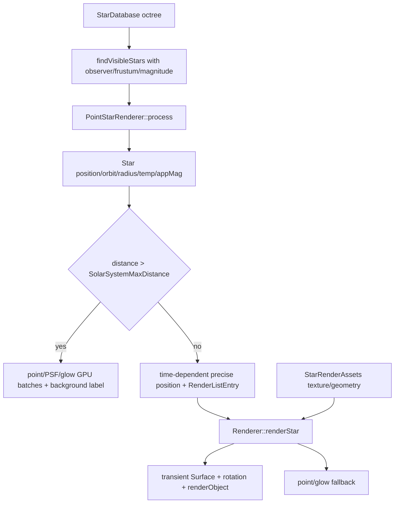

| 段 | 读取的事实/策略 | 输出 | 责任观察 |
|---|---|---|---|
| Catalog 查询 | octree、absolute magnitude、approximate position；Observer position/orientation、FOV/aspect、limiting magnitude | 候选 Star + distance + apparent magnitude 回调 | Catalog 索引是 Model；`findVisibleStars` 已混入投影视锥查询参数 |
| Star 领域计算 | precise `getPosition(time)`、Orbit/barycenter、radius、temperature、absolute/apparent magnitude、rotation | 时间位置、亮度、物理尺度、颜色温度输入 | 主要是 Model 事实/计算 |
| 远恒星场景/绘制 | relative position、appMag、temperature；starStyle、pixelSize、DPI、exposure/PSF 参数 | point/glow vertex batch、可选背景标签 | 场景派生和 View3D 像素/光度表现紧耦合 |
| 近恒星场景 | 高精度相对位置、radius、appMag、pixel size | `RenderListEntry` | 进入 SolarSystem 深度分区路径 |
| 近恒星资源 | StarRenderAssets texture/geometry，rotation | 临时 emissive Surface、RenderProperties | 资源绑定和 View3D object render |
| 近恒星最终绘制 | disc pixels、mesh、point/glow fallback | GPU 像素 | View3D 私有 |

Star 具有“远处星场粒子”和“近处可遮挡球体/自定义网格”两种原业务表现。未来输出若只发一个 Star point 列表，会丢失近恒星的 mesh、rotation、深度遮挡和 surface 纹理路径；若只发普通 Body-like scene item，又无法承接大规模 octree 星场和 PSF batch 的性能需求。

### 6.9 StarRenderAssets 仍留下的 Model 表现语义

`StarRenderAssets` 用 `StarDetails*` 作为 side-table key，保存 TextureHandle 和 GeometryHandle；默认纹理集合按光谱类选择，并通过 StarDetails 生命周期事件同步 destroy/clone/copy/default。它不是 Model 数据事实，也不是可直接供多个异构 View 共同消费的“资源服务器”。

更重要的是，`StarDetails::Knowledge` 仍包含 `KnowTexture`，`StarRenderAssets::setTexture` 会回写该 Model 位。因而当前 Star 只做到了“纹理句柄不在 StarDetails 字段中”，尚未做到“Model 不知道纹理状态”。该知识位及默认纹理事件都需要在后续真实所有者迁移中处理，不能把 side table 存在本身视为已经解耦。

### 6.10 DSO 公共收集链

```text
DSODatabase octree
-> findVisibleDSOs(observer position/orientation/FOV/aspect/limiting magnitude)
-> DSORenderer::process
-> object frustum + distance/appMag + DeepSkyObjectRenderPolicy
-> subtype-specific brightness/near-far
-> subtype renderer add
-> subtype GPU renderer render
-> optional background annotation
```

DSO 基类共同保存 position、orientation、radius/bounding radius、absolute magnitude、visible/clickable 和 catalog index。Catalog octree 与名称/编号索引是 Model；但 `findVisibleDSOs` 与 Star 对应方法一样直接接收视点、视向、FOV 和 limiting magnitude，属于“Model 索引提供了 View-oriented 查询”的混合 API。`DSORenderer` 又做第二次精确 frustum test、距离到视星等转换、亮度经验修正、RenderFlags 映射和标签策略。

### 6.11 DSO 子类不能合并成一个渲染结论

| 子类 | Model/对象字段 | 场景收集与投影 | 资源/表现数据 | View3D 最终绘制 | 已确认的特殊问题 |
|---|---|---|---|---|---|
| Galaxy | common DSO + Hubble type、detail、form id | relative position、appMag、brightness、near/far、label | `GalacticFormManager` 的标准/自定义 blob form；procedural textures | GalaxyRenderer 点云/几何着色器路径 | Galaxy 对象直接解析 CustomTemplate；detail/form 是表现字段；亮度修正读取 GL sRGB 状态 |
| Globular | common DSO + core radius、King concentration、tidal radius；另有 detail/formIndex | relative position、appMag、brightness、near/far、label | renderer 内按 concentration 建 procedural form、center/star/color textures | tidal quad + point sprites | core/concentration/tidal 是领域事实；detail/formIndex 是表现派生，当前混在对象内 |
| Nebula | common DSO + nebula type | relative position、frustum、near/far、label | NebulaRenderAssets 的 GeometryHandle -> GeometryManager/RenderGeometry | unlit geometry，按 radius/orientation 变换 | brightness 参数在 NebulaRenderer::add 被忽略；无 geometry 时不绘制对象，但标签仍可出现 |
| OpenCluster | common DSO，无额外字段 | relative position、distance-based label symbol | 无独立资源 | `OpenClusterRenderer::add/render` 当前均为空；只显示成员恒星和可选标签 | 原系统本来就没有 cluster body 图元，不能把“无绘制”误判为迁移丢失 |

`Galaxy` 是本轮非常明确的反向依赖样本：

1. `legacy/galaxy.cpp` include `view3d/render.h`。
2. `Galaxy::getBrightnessCorrection` 读取 `celestia::gl::sRGBRendering`。
3. `Galaxy::lightGain` 是静态全局显示增益，由 Galaxy 类型自己保存。
4. `Galaxy::setForm/loadDetails` 直接访问 GalacticFormManager 并加载 `CustomTemplate`。

这些都不是 Galaxy 的天文客观事实。它们证明 Model 未完全解耦的问题不只存在于 SolarSystem/Body；Star 和 DSO 也有表现知识残留。后续应保留 Hubble type、position、orientation、radius、magnitude 等事实，把 form/detail/brightness display policy 和 GPU form resource 从对象族中拆出。

### 6.12 DeepSkyObjectRenderPolicy 的实际性质

`DeepSkyObjectRenderPolicy` 只有两个映射函数：把 `DeepSkyObjectType` 映射到 `RenderFlags::ShowGalaxies/...` 和 `RenderLabels::...`。它 include View3D 的 `renderflags.h`，输出也是 View3D policy enum；它不加载资源、不提供 Catalog，也不包含 Model 计算。

所以它虽然当前位于 `adapter/`，实质是 View3D 显示策略映射。它不能作为多个 View 通用 Adapter 的正例。其他 View 若采用不同可见分类和标签体系，应自己映射 DSO 类型；只有将来两个以上真实 View 使用完全相同的中立语义时，才有理由提取 View-Common 规则。

### 6.13 Task6 的 `CAP-STAR` / `CAP-DSO` 阶段结论

1. Star 和 DSO 的 Model Catalog、对象事实、场景查询、资源表现和 GPU 绘制四段均已找到；OpenCluster 的独立资源/对象绘制段明确为“无”。
2. 两类 Catalog 都在 Model 方法中构造视锥并做 limiting-magnitude 查询；第 10.3/10.4 节已确定 M-Core 保留中立索引、Projection 组合查询，具体裁剪参数边界由 `U-PROJ-001` 关闭。
3. StarRenderAssets 已把句柄移出 StarDetails 字段，但 `KnowTexture`、默认纹理和 clone/copy 语义仍使 Model 生命周期知道表现状态。
4. Galaxy 的 form/detail/lightGain/sRGB 依赖是比目录 include 扫描更强的未解耦证据；Globular 也混合领域参数和表现 detail/formIndex。
5. Nebula geometry 是 View3D 表现资源 side table；OpenCluster 无独立绘制是原始能力事实；不能对所有 DSO 使用同一种迁移模板。

## 7. Catalog、Builder、资源和加载链

### 7.1 公共外层加载器

`loadStars`、`loadDSO`、`loadSSO` 都使用 `CatalogLoader` 派生类遍历配置文件和 extras 目录。它们的共同责任是文件顺序、skip path、进度和错误处理；实际对象构建交给各自 Builder。

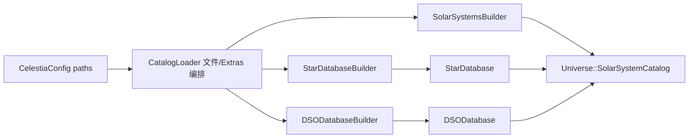

### 7.2 Builder 横向责任矩阵

| 责任 | StarDatabaseBuilder | DSODatabaseBuilder | SolarSystemsBuilder |
|---|---|---|---|
| 解析输入 | binary stars + STC | DSC object type/name/properties | SSC disposition/object/properties |
| 创建 Model 对象 | Star、StarDetails、barycenter、orbit/rotation | DSO 子类并调用对象 `load` | SolarSystem、PlanetarySystem、Body、Location、Timeline/Phase/Frame |
| 修改/替换 | 支持 Add/Replace/Modify，维护临时查找 | 当前逐项 Add | 支持 Add/Replace/Modify 和延迟修正 |
| 构建 Model 索引 | Star octree、catalog number、name/cross index | DSO octree、catalog number、name index | host star map、Body name index、FrameTree |
| 领域后处理 | barycenter、category、URL、温度/半径/rotation | category、URL、平均星等 | Timeline 校验、Frame、Orbit、Rotation、Location 地理坐标 |
| 资源路径输入 | GeometryPaths + TexturePaths | GeometryPaths | GeometryPaths + TexturePaths |
| 表现 side table 写入 | StarRenderAssets mesh/texture | NebulaRenderAssets geometry | BodyRenderAssets surface/mesh/orientation/scale/ring texture/alternate surface |
| finish 结果 | 返回 `unique_ptr<StarDatabase>` | 返回 `unique_ptr<DSODatabase>` | 已直接写 Universe，仅完成 Location 延迟位置 |

### 7.3 为什么 Builder 不能整体判为 Adapter 或 Model

Builder 内至少存在四类责任：

1. **文件语法和加载编排**：文件格式、extras、错误报告，属于数据导入适配。
2. **Model 构建**：创建对象、Timeline、Frame、Orbit、索引和对象层级，属于 Model 构建能力。
3. **逻辑资源引用解析**：把文件名解析为 Texture/Geometry 句柄，属于过渡资源定位。
4. **View3D 表现绑定**：写 Star/Body/Nebula RenderAssets，属于表现外挂。

StarDatabaseBuilder 也不是“已经完全拆干净”的对照组：它在 `applyCustomDetails` 中同时设置 StarDetails 的半径、温度、RotationModel 等 Model 事实，并写 StarRenderAssets 的 mesh/texture。DSODatabaseBuilder 在创建 DSO 后对 Nebula 额外加载 geometry。SolarSystemsBuilder 的混合程度更高，但不是唯一需要拆分的 Builder。

### 7.4 三类 finish 的语义差异

| Builder | finish 前主要状态 | finish 动作 | 所有权交付 |
|---|---|---|---|
| Star | unsortedStars、临时索引、barycenter/category/URL 延迟表 | 构建 octree/index，解析延迟关系 | 返回 StarDatabase 给 Universe |
| DSO | `vector<unique_ptr<DeepSkyObject>>`、名称表 | 构建 octree/index、平均星等 | 返回 DSODatabase 给 Universe |
| SolarSystem | 已直接写 Universe/SolarSystem/Body | 计算所有 Location 的最终笛卡尔位置 | 无返回值，Universe 已持有对象 |

### 7.5 RealModelBackend 的当前位置

`RealModelBackend` 复用 `ReadCelestiaConfig`、`loadStars`、`loadDSO`、`loadSSO` 建立真实 Universe/Simulation，因此数据来源是真实的；但它也直接组合应用层加载入口、资源路径实例、SceneViewModel 和 Runtime 快照输出。它是过渡组装器，不是可直接冻结的 Model 入口。

### 7.6 当前加载链结论

1. `CatalogLoader` 的文件遍历和 Builder 的对象构建应分开评估，不能把 `load*.cpp` 全部算作 Model。
2. 三类 Catalog 的对象图和索引都属于 Model；三类 Builder 都存在导入适配责任。
3. 资源路径解析与 RenderAssets 写入不是同一责任，Step23 只把前者移到中立目录。
4. 后续 Builder 拆分必须保持 Add/Replace/Modify、barycenter、Timeline、extras 顺序和生命周期同步，不能只按函数行数移动代码。

## 8. Surface、Atmosphere、Ring 与 RenderAssets 字段级矩阵

### 8.1 Body 领域状态与画面路径

Body 不是一个静态“行星数据结构”。它把对象层级、Timeline、FrameTree、尺寸/质量/反照率/热参数、分类和交互标志组合起来，并通过 TimelinePhase 的 Orbit、RotationModel、ReferenceFrame 计算任意时间的位置、速度和姿态。

| Body 能力组 | 真实字段/依赖 | 主要计算 | 非渲染消费者 | View3D 消费 | 事实判断 |
|---|---|---|---|---|---|
| 层级和名称 | system、satellites、names/aliases | path、find、parent/child | 搜索、脚本、URL、导航 | label、树遍历 | Model 对象图 |
| 时间位置 | Timeline -> TimelinePhase -> Orbit/orbitFrame/FrameTree owner | universal/astrocentric position、velocity | Observer/导航、Selection、脚本、Picking | list position、orbit、lighting | Model 领域计算 |
| 时间姿态 | RotationModel + bodyFrame | orientation、angular velocity、坐标转换 | ReferenceFrame、Location、脚本 | mesh/cloud/ring orientation | Model 领域计算 |
| 基础形状 | radius、semiAxes | sphere/ellipsoid、planetocentric/geodetic conversion | 密度、Picking、Location、导航 | LOD、culling、mesh scale | Model 形状事实，但 custom geometry 反查破坏边界 |
| 物理/光度 | mass、density、geom/bond/spherical albedo、temperature、emissivity、internal heat | density、temperature、luminosity、apparent magnitude | 脚本、信息 UI、场景计算 | point brightness、光照 | Model 事实/计算 |
| 业务分类 | BodyClassification | effective orbit class、默认交互/显示语义 | browser、搜索、脚本 | label/orbit/body visibility mask | 分类本身是 Model；显示映射是 policy |
| 交互状态 | visible、clickable | pick/query eligibility | Picking、Selection | culling/point/body render | 当前为共享会话/对象状态，不能只留 View |
| 显示行为字段 | visibleAsPoint、secondary illuminator、orbitVisibility | 是否进入 point/light/orbit path | 少量非 View 消费 | Renderer 直接使用 | 与对象事实混合的表现策略 |
| cullingRadius | 由 shape、Atmosphere、Ring、ReferenceMark、Comet 规则合成 | FrameTree bounding/culling envelope | FrameTree 更新 | view-cone/subtree culling | 是派生场景包围体，不等同于物理半径 |

`Body::getPosition/getVelocity/getOrientation/getAngularVelocity` 的计算完全由 Timeline、Orbit、RotationModel 和 ReferenceFrame 驱动，不依赖 OpenGL。真正的反向依赖发生在“custom geometry 是否存在”以及由它影响的形状语义，而不是所有 Body 计算。

### 8.2 custom geometry 对 Model 计算的反向影响

当前链路如下：

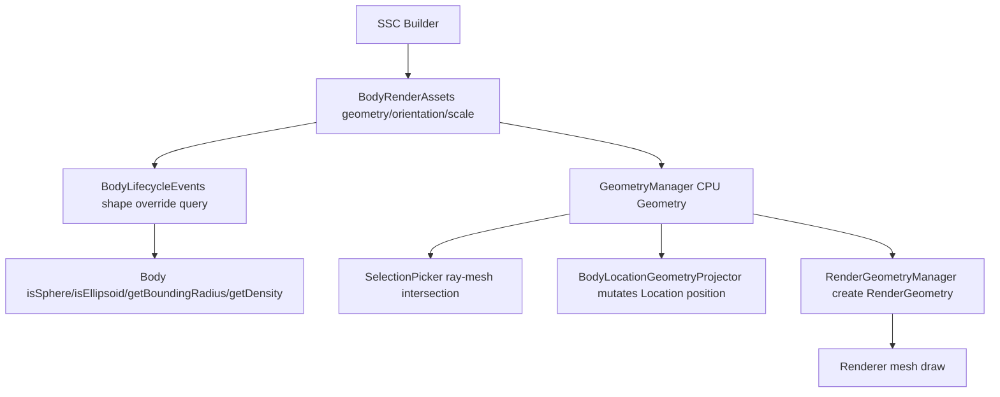

| 反向使用 | geometry 提供什么 | 业务影响 |
|---|---|---|
| `Body::isSphere/isEllipsoid` | 只查询是否存在 geometry override | custom mesh 会改变形状分类 |
| `Body::getBoundingRadius` | 存在 override 时用 `radius * sqrt(3)` | 影响 FrameTree bounds、可见性和近邻遍历 |
| `Body::getDensity` | 非 ellipsoid 时不按 semiAxes 计算体积 | 资源绑定会改变物理查询返回值 |
| SelectionPicker | CPU Geometry::pick + orientation/scale | 是否命中对象以及命中距离 |
| BodyLocationGeometryProjector | CPU mesh ray intersection | 会直接修改 Location 的最终位置 |
| Renderer | CPU Geometry -> RenderGeometry | 决定 mesh、材质和 GPU 绘制 |

因此 custom geometry 同时承载“对象真实/交互形状”和“View3D 网格表现”两种语义。后续不能简单把 geometry handle、orientation 和 scale 全部判作 View3D-Private；应先建立中立的 shape/mesh 事实与 CPU 查询边界，再由 View3D 创建 GPU 表现。当前 `BodyRenderAssets` 的命名掩盖了这种双重用途。

### 8.3 Surface 字段级矩阵

Body 的物理反照率和温度已另存在 Body；`Surface` 主要描述如何把对象画出来，并直接保存进程内 TextureHandle。

| 字段组 | 字段 | 原始语义/消费者 | 当前判断输入 |
|---|---|---|---|
| 基础颜色 | `color` | 无 base texture 或 BlendTexture 时作为 surface color；也给 point body 和 secondary illumination 着色 | 中立外观候选，不是 Body 物理反照率 |
| 高光参数 | `specularColor/specularPower` | RenderInfo/shader 高光 | 表现材质 |
| 光度模型 | `lunarLambert` | shader 中混合 Lambert 与 Lommel-Seeliger | 可移植材质参数，但当前只由 View3D shader 实现 |
| 基础纹理 | `baseTexture` | TextureManager -> base texture；也可覆盖 mesh material | 逻辑资源引用 |
| 法线/凹凸 | `bumpTexture` | TextureManager；shader normal/bump path | 逻辑资源引用 + View3D shader policy |
| 夜面纹理 | `nightTexture` | 受 ShowNightMaps 控制 | 逻辑资源引用 + View policy |
| 高光纹理 | `specularTexture` | gloss/specular mask | 逻辑资源引用 |
| 覆盖纹理 | `overlayTexture` | 最后叠加 | 逻辑资源引用 + View 合成规则 |
| flags | Blend/Apply*/Specular/Emissive 等 | 决定纹理采样、光照和混合分支 | View-oriented material policy |
| alternate surfaces | name -> Surface map | Observer.displayedSurface 和脚本选择，Renderer 回退 default Surface | 外观变体集合 + 会话选择状态 |

`Surface` 不应整体留在 M-Core，也不能把所有字段直接叫“GPU 私有”：颜色、纹理语义和材质参数可能被多个图形 View 复用，但 flags 的具体分支与现有 shader 强绑定。第 10.5 节已将它标作 `Split-Required`，区分 M-Core 常量、Projection appearance、Resource 引用和 View3D 实现；公共字段集合仍由 `U-SURFACE-001` 约束。

### 8.4 Atmosphere 字段级矩阵

| 字段组 | 字段 | 非 GPU 影响 | View3D 使用 | 边界观察 |
|---|---|---|---|---|
| 几何范围 | `height` | Body cullingRadius；inside-atmosphere 星等调整 | atmosphere shell 厚度/淡入 | 可查询的场景事实与绘制范围共用 |
| 云层范围 | `cloudHeight` | Body cullingRadius | cloud sphere、depth、inside/outside | 场景几何参数 |
| 经验颜色 | lower/upper/sky/sunset color | 无已发现的非 View 消费 | legacy/modern atmosphere renderer | 表现参数 |
| 云层运动 | `cloudSpeed` | 不推进 Model 状态 | Renderer 以 simTime 算 texture offset | 参数可中立，当前实现是 View 动画 |
| 云资源 | cloudTexture/cloudNormalMap | 无 | TextureManager + cloud shader | 资源引用 |
| 散射 | Mie coefficient/scale/asymmetry、Rayleigh coefficient/scale、absorption | mieScaleHeight 参与 culling/depth envelope | ShaderManager uniforms/atmosphere renderer | 光学场景参数，但单位和算法绑定当前实现 |
| 云阴影 | `cloudShadowDepth` | 无 | shader cloud shadow | View3D 表现策略 |

Atmosphere 本身不是简单的“天气 Model”，也不是只包含 GPU 句柄。它把场景包围范围、光学参数、经验颜色、动画参数和纹理引用放在同一结构中。特别是 `height/cloudHeight/mieScaleHeight` 已影响 Renderer 之外的 Body 派生包围体；把 Atmosphere 整体移入 View 会让 Model 的空间查询失去输入。

### 8.5 RingSystem 与其他 BodyFeatures

| 内容 | 当前所有者 | 非绘制作用 | View3D 作用 | 观察 |
|---|---|---|---|---|
| ring inner/outer radius | BodyFeaturesManager 的 `unique_ptr<RingSystem>` | outerRadius 扩大 Body cullingRadius | ring geometry、进入/离开 ring、shadow plane/LOD | 中立场景几何事实 |
| ring color | RingSystem | 无明确非 View 消费 | RingRenderer tint | 表现参数 |
| ring texture | BodyRenderAssets 按 RingSystem* side table | 无 | TextureManager、ring/shadow shader | View3D 资源绑定 |
| Atmosphere | BodyFeaturesManager 按 Body* side table | culling 等 | shell/cloud/shadow | 混合场景事实与表现 |
| Location | BodyFeaturesManager | 搜索、Selection、脚本、坐标 | labels/picking | Model 对象，但 mesh 投影依赖中立形状能力 |
| ReferenceMark | BodyFeaturesManager | 语义引用和 bounding radius | 具体 reference mark render | Task8 再拆语义与图元 |
| orbit/comet colors | BodyFeaturesManager | 无 | Orbit/Comet renderer | 明确表现策略，Task8 处理 |

`BodyFeaturesManager` 位于 Model 并不代表它的所有 map 都属于 Model。它本身就是一个混合 side-table 聚合器，至少需要把 Atmosphere/Ring/Location 等场景事实与 orbit/comet colors 等纯表现项分开。

### 8.6 BodyRenderAssets 字段不能整体迁移

| BodyRenderAssetState 字段 | 当前消费者 | 是否有非 View3D 业务作用 | 后续处理方向输入 |
|---|---|---|---|
| geometry handle | Body shape query、Picking、Location projector、Renderer | 有 | 拆出中立 shape/geometry identity，View3D 只持 GPU realization |
| geometry orientation | Picking、Location projector、Renderer | 有 | 随中立 shape descriptor |
| geometry scale | Picking、Renderer | 有 | 随中立 shape descriptor |
| default Surface | Renderer、Builder；point/secondary light color | 主要表现 | appearance/material + resource reference |
| alternate Surfaces | script/Observer selection、Renderer | 会话可选表现 | appearance variants；不进入 M-Core 天体事实 |
| ring texture | Renderer/Ring shader | 无 | View3D/resource binding |

生命周期事件用于清理 side table 可以保留为通用对象生命周期通知，但 shape override query 不应继续由 View3D 表现表反向回答 Model。后续需要先把 shape descriptor 建成 Model 可直接读取的事实，再删除该反向查询。

### 8.7 Texture/Geometry 的实际五段流转

| 层次 | 当前类型 | 输入/输出 | 是否含 GPU | 当前边界事实 |
|---|---|---|---|---|
| 1. Catalog 描述解析 | SolarSystemsBuilder/Star/DSO Builder | filename、directory、flags、center、normalize、scale/orientation | 否 | 导入适配责任 |
| 2. 逻辑定位与句柄 | TexturePaths/GeometryPaths | path metadata <-> process-local numeric handle | 否 | 中立资源定位基础，但 handle 不是跨进程稳定 ID |
| 3. 对象绑定 | Body/Star/Nebula RenderAssets，Atmosphere/Surface fields | Model object pointer -> handle/appearance/shape fields | 否 | 当前同时含 shape、外观和 View3D 绑定 |
| 4a. CPU Geometry | GeometryManager -> Geometry | load 3DS/CMOD/CMS、材质和 pickable CPU shape cache | 不直接调用 GL，但接口可创建 RenderGeometry | 被 Picking/Location 和 View3D 共用，需拆接口 |
| 4b. GPU realization | RenderGeometryManager、TextureManager、ShaderManager、Framebuffer | CPU geometry/TextureInfo -> RenderGeometry/Texture/shader/FBO | 是 | View3D 私有生命周期和上下文 |
| 5. 具体绘制 | Renderer + celrender/view3d | resolve handle、build RenderInfo、draw | 是 | View3D 私有 |

TextureManager 当前从 TextureInfo 直接调用 `LoadTextureFromFile/LoadHeightMapFromFile` 生成 `Texture`，没有独立的中立 CPU image cache。Geometry 则已经存在 CPU/GPU 两级，但 `Geometry::createRenderGeometry()` 又把两级写在同一接口中。因此二者不能用同一套“全部公共”或“全部私有”结论。

跨进程时还必须注意：TextureHandle/GeometryHandle 只是各进程内 Path table 的索引。除非能够证明每个进程以完全相同顺序建立同一表，否则不能把裸数值句柄作为稳定资源标识；协议应携带稳定 resource ID 或可校验描述，再由每个 View 建立本地 GPU 缓存。

### 8.8 CPU 资源共享未决项

| U0 ID | 未决问题 | 已有证据 | 缺失证据 | 关闭条件 | 未关闭前禁止结论 |
|---|---|---|---|---|---|
| `U-RES-001` | CPU Geometry 应放 Model/Resource-Common 还是独立 shape service | Picking 与 Location 需要 `Geometry::pick`；Renderer 需要 `createRenderGeometry` | 解耦后的接口形态、性能和线程/进程生命周期 | 提出不依赖 View3D 头的 pickable mesh 接口，并通过 mesh Picking、Location、render 三类验证 | 禁止把 GeometryManager 整体搬入 View3D 或整体冻结为公共资源 |
| `U-RES-002` | 图片解码是否值得跨 View 共享 | 当前 TextureManager 直接生成 GL Texture | 第二个真实 View 的格式、内存和传输需求 | 至少两个 View 证明共享 decoded image 可减少重复且生命周期一致 | 禁止提前新建公共图片服务器 |
| `U-ATM-001` | Atmosphere 光学参数是 Model 事实还是中立 appearance | 参数影响 culling 和 shader，部分值明显为经验颜色 | 2D/BS/其他 3D View 的消费语义 | 两类 View 的字段语义与单位一致，或拆出独立 optical scene descriptor | 禁止整类移动 Atmosphere |
| `U-SURFACE-001` | Surface 哪些字段可成为跨 View material 描述 | 颜色/纹理/光度参数可复用，flags 强绑定当前 shader | 其他 View 的真实 material 需求 | 字段级最小公共集合经两个 View 验证 | 禁止把当前 Surface 原样提升成公共规范 |

### 8.9 Task7 阶段结论

1. Body 的位置、姿态、速度、温度、光度、层级和基础形状是明确 Model 能力；它们不依赖 OpenGL。
2. custom geometry 已参与形状分类、密度、包围体、Picking 和 Location 计算，因此 geometry identity/orientation/scale 不能被当作纯 View3D 数据。
3. Surface 是外观、材质和资源引用的混合结构；Atmosphere 是场景范围、光学参数、外观和资源的混合结构；二者都必须字段级拆分。
4. Ring radius 是场景几何事实，ring color/texture 是表现数据；BodyFeaturesManager 也需要按 map 拆责任。
5. TexturePaths/GeometryPaths 可作为中立定位基础，但裸 handle 只在进程内稳定；TextureManager/RenderGeometry/Shader/FBO 明确属于 View3D。
6. CPU Geometry 的中立化是 Model 解耦和模板 View 迁移前的关键前置项，当前以 `U-RES-001` 保留，不能靠目录移动解决。

## 9. Frontend 与 Script 交叉消费者

### 9.1 Orbit 事实、采样、列表和曲线绘制

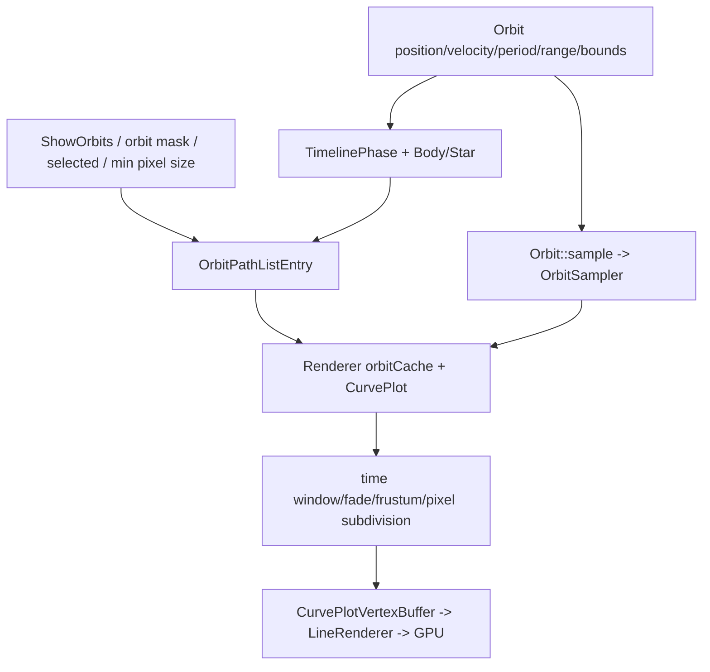

| 层次 | 类型/函数 | 输入 | 输出 | 边界事实 |
|---|---|---|---|---|
| 轨道事实 | `celephem::Orbit` 类族 | time、轨道参数/样本文件/脚本 | position、velocity、period、valid range、bounding radius | Model 领域计算，无 GL 依赖 |
| 通用采样 | `Orbit::sample` + `OrbitSampler` | time interval、adaptive rules | `(t, position, velocity, boundingRadius)` samples | 无 GPU；可作为中立计算能力 |
| 显示候选 | `buildOrbitLists/addStarOrbitToRenderList` | Body/Star、FrameTree、Selection、orbit visibility/mask、pixelSize/minOrbitSize | `OrbitPathListEntry` | 领域引用与 View 像素策略混合 |
| View3D 缓存 | Renderer `orbitCache` + `CurvePlot` | Orbit pointer、current time、detail options | 当前显示窗口内曲线样本 | 生命周期按 frameCount/显示窗口管理 |
| 曲线投影 | `CurvePlot::render/renderFaded` | camera modelview、frustum、near/far、pixel subdivision、fade window | 高精度线段流 | View3D 投影和裁剪 |
| GPU 绘制 | `CurvePlotVertexBuffer` + LineRenderer | line vertices/color/opacity | 像素 | View3D 私有 |

Orbit 采样可以被多个 View 复用，但“采样一次后原样广播”未必正确：原 View3D 会按当前时间窗口增量补样、按像素阈值细分并做视锥裁剪。未来 Projection 可以提供轨道事实、范围或中立 samples；每个 View 是否自行决定精度，需要结合带宽和第二个真实 View 的需求裁定。当前可以明确的是 `CurvePlot`、LineRenderer、fade/pixel subdivision 不能放入 M-Core。

BodyFeaturesManager 的 orbit color 与 RendererColors fallback 都是表现策略。颜色不应继续和 Atmosphere/Location 等 Model feature 放在同一管理器内。

### 9.2 Marker、Annotation、Selection 与 Picking 的区别

| 概念 | 当前数据 | 生产/所有者 | 消费者 | 点击关系 | 实际层次 |
|---|---|---|---|---|---|
| Selection handle | type + object pointer | 值对象；当前状态在 Simulation | 导航、HUD、Renderer、script | Picking 的结果 | 跨对象引用句柄 |
| Marker semantic | Selection、priority、occludable、sizing | Marker；Universe MarkerList | Renderer、script/UI | 不建立新对象；仍指向原 Selection | 会话/对象标记状态 |
| MarkerRepresentation | symbol、pixel size、color、label | 当前嵌在 Marker | Renderer annotation | 只控制画法 | View appearance |
| Annotation | projected x/y/depth、text、markerRep、alignment、size | Renderer 每帧临时生成 | font/marker renderer | 不参与 SelectionPicker | View3D 屏幕布局工作项 |
| Picking | screen ray + Observer + Universe/Catalog/Geometry | SelectionPicker/Core | 返回 Selection | 真正点击实现 | View 输入坐标到对象的查询能力 |

`Marker` 当前把语义状态与具体图元混在一起：`MarkerSizing::ConstantSize` 明确按像素解释，MarkerRepresentation 也带 symbol、size、color 和 label；Universe 又直接值持有 MarkerList。后续应至少拆为“标记哪个对象、优先级、是否可遮挡”等状态，以及“某个 View 如何显示该标记”的 style。Annotation 已经是投影后的屏幕坐标和字体布局输入，应留在 View 内。

Marker 本身不会被 SelectionPicker 单独拾取。点击仍命中它引用的 Star/Body/DSO/Location；这意味着未来无需把 Annotation 当成 Model 对象，也不应为了支持点击而把屏幕坐标写回 Model。

### 9.3 ReferenceMark 的当前反向持有

`BodyReferenceMark` 基类只定义 tag 和 boundingSphereRadius；真正的 `ReferenceMark` 及 BodyAxisArrows、FrameAxisArrows、SunDirectionArrow、VelocityVectorArrow、SpinVectorArrow、PlanetographicGrid、VisibleRegion 等子类位于 View3D，包含颜色、尺寸、opacity、ShaderProperties 和 `render()`。

当前 `BodyFeaturesManager` 却以 `unique_ptr<BodyReferenceMark>` 持有这些 View3D 子类，Core/Lua 直接构造具体子类后塞进 Model manager，Renderer 再 `dynamic_cast<const ReferenceMark*>` 并调用虚拟 render。这形成了“Model 容器拥有 View3D 对象”的明确边界倒置。

正确分解至少需要：

```text
ReferenceMark semantic request
  kind/tag/body/target/enabled/size semantics
-> time-dependent neutral direction/orientation/grid data
-> View3D style and geometry
-> ReferenceMarkRenderer/GPU
```

其中 Body 轴向、速度、太阳方向等向量来自 Model 计算；箭头网格、ShaderProperties、颜色和不透明绘制属于 View3D。`boundingSphereRadius` 当前又影响 Body cullingRadius，因此未来应由中立 semantic bounds 提供，不能依赖具体 View3D 子类实例。

### 9.4 RenderPolicy 状态矩阵

| 状态 | 当前持有者 | Trigger/持久化 | 主要消费者 | 是否改 Model 事实 | 阶段结论 |
|---|---|---|---|---|---|
| RenderFlags | Renderer | Core keys、Qt/Win32/SDL、Legacy/Lua、URL/CelestiaState、preferences | 场景收集、DSO/Body/effect/GPU branches | 否；改变查询和画面范围 | View 显示 policy，命令面必须保留 |
| RenderLabels | Renderer | 同上 | Star/DSO/Body/Location/constellation annotation | 否 | View label policy |
| body/orbit masks | Renderer | UI/config/script 间接设置 | Body visibility/orbit list | 否 | View category policy |
| StarStyle/PSF 参数 | Renderer | UI/preferences/Lua | PointStarRenderer、close body point fallback | 否 | View3D 表现/质量 policy |
| Ambient light | Renderer | UI/preferences/script | object/ring lighting | 否 | View3D lighting policy |
| TextureResolution | Renderer -> TextureManager | UI/preferences/script | TexturePaths resolution lookup、cache reset | 否 | View 资源质量 policy |
| faintestVisible | Simulation | config/UI/script/preferences | Renderer input、HUD；AutoMag 可覆盖每帧值 | 不改天体事实，但决定可见候选 | 目标为 View3D policy + Projection 查询参数，见 10.2 |
| displayedSurface | Observer | UI/script/preferences | Body/Ring Surface selection | 不改 Body | 目标为 per-View3D appearance policy，见 10.2 |
| locationFilter | Observer | UI/script/preferences | Location annotation | 不改 Location | 目标为 per-View3D label policy，见 10.2 |
| HUD elements/detail | Hud/HudSettings | UI/config | HUD overlay | 否 | View/app feedback policy |

RenderFlags 自身也混合多种粒度：对象类别开关、轨道/标签、网格、阴影、云/大气效果、自动星等和线条效果都塞在一个 bitset 中。未来可以继续提供兼容命令面，但内部不应把它视为一个不可拆的权威状态块。

### 9.5 脚本是跨边界命令消费者，不是层归属依据

| 脚本面 | 当前直接对象 | 能力 | 目标设计约束输入 |
|---|---|---|---|
| Legacy command | Simulation/Observer | time、selection、goto/follow/frame、surface | 应进入 C-Command/M-Session 闭环 |
| Legacy command | Renderer | flags、labels、ambient、star style、resolution | 应成为带 View target 的显示命令 |
| Lua Celestia API | Simulation + Renderer | 查询/修改会话和显示 policy | 不能要求脚本持有进程内 Renderer 指针 |
| Lua Observer API | Observer | pose、frame、speed、FOV、surface/filter | 需要保持 per-observer/per-view 语义 |
| Lua Object API | BodyFeaturesManager + View3D concrete ReferenceMark | 添加/删除轴、箭头、网格 | 需要改为 semantic reference-mark 命令 |
| Lua overlay API | Hud/OverlayManager | image/video/text overlay | View/app overlay 命令，不进入 Model |

脚本覆盖面证明跨进程 Controller 不能只实现桌面按钮的少数动作；同时也证明需要在命令中区分 Model session target 和 View target。脚本是 Trigger，不是状态所有者；不能因为脚本能修改 Renderer，就把 Renderer policy 放入 Controller 保存第二份。

### 9.6 HUD、Overlay 和业务反馈

| 内容 | 事实来源 | 当前布局/绘制 | 边界观察 |
|---|---|---|---|
| 时间/倍速/暂停 | Simulation | Hud format + Overlay text | 数据应由会话输出，格式/位置属于 View |
| 速度/FOV/frame/travel/follow/chase | Observer/Simulation | Hud format + Overlay | 会话状态投影 + View 文本 |
| Selection 详情 | Star/Body/DSO/Location + Universe names | Hud 直接计算距离、视大小、温度、质量、RA/Dec | 当前 HUD 直接读取大量 Model；未来需要查询/详情投影，不应复制 Model |
| 临时命令消息 | Core/script `showText` | Hud 保存 message text/start/duration 并绘制 | 命令结果/feedback event + View toast |
| TextInput/autocomplete | UI 输入 + Universe query | Hud/TextInput 绘制 | Controller/Platform input 与 View 绘制混合 |
| script image/video | OverlayManager stacks | ImageOverlay/VideoOverlay 直接 View3D render | View3D/app overlay 私有能力 |
| movie capture/FPS/edit mode/view borders | App/Renderer/ViewManager | Hud/Overlay | App/View 状态，不是 Model |

“HUD 显示了某个字段”不能推出字段属于 View。HUD 当前直接读取 Simulation 和 Model 是统一 exe 的便利路径；目标架构应输出足够的会话/对象详情，再由 View 格式化。反过来，图片/视频叠加、字体、safe area、RTL、文本布局和绘制明显不应进入 Projection 或 Model。

### 9.7 Task8 阶段结论

1. Orbit、OrbitSampler 是领域/中立采样能力；显示候选、时间窗口、像素细分、CurvePlot 和 LineRenderer 是 View3D 责任。
2. Marker 把语义标记和像素 style 混在 Model 持有的对象中；Annotation 是 View3D 屏幕工作项；Picking 独立返回 Selection。
3. BodyFeaturesManager 当前拥有 View3D ReferenceMark 子类，是明确边界倒置，必须改为 semantic request + 中立派生 + View3D geometry。
4. Renderer policy 由 UI/脚本触发、由 Renderer 持有和消费，不修改 Model 事实；Controller 只应传递命令而不保存副本。
5. faintestVisible、displayedSurface、locationFilter 当前放在 Simulation/Observer，但具有显示 policy 性质；第 10.2 节已按多 View 语义裁定为 View3D policy 或 Projection 查询参数。
6. HUD 所需数据来自 Model/M-Session，文字布局和媒体叠加属于 View/App；命令反馈应形成事件，不应继续依赖 Core 直接调用本地 Hud。

## 10. 目标 M/C/Projection/Resource/View 所有权矩阵

### 10.1 判定规则和矩阵读法

本节的目标归属是基于第 2-9 节 F0/F1 事实形成的 D0 判断，不是按当前目录改名。一个当前类型只要同时保存两类权威状态、同时包含领域计算与像素/GPU 计算，或同时承担构建与资源绑定，就必须标为 `Split-Required`，不能为了让矩阵看起来简单而整体归入某一层。

矩阵中的“目标所有者”表示最终唯一权威位置；“允许消费者”表示可经函数调用、查询接口或输出协议读取；“禁止依赖/迁移后果”同时约束后续代码计划。`View-Common` 只有在至少两个真实 View 对同一语义和生命周期给出复用证据后才能成立，当前不因“以后可能会用”而提前创建。

### 10.2 系统根、运行会话和控制命令

| 责任项 | 当前所有者/交织 | 目标类别 | 目标唯一所有者与允许消费者 | 依据 | 禁止依赖/迁移后果 |
|---|---|---|---|---|---|
| Universe 与三类 Catalog 对象图 | `Simulation` 独占 Universe；Universe 独占 Catalog | `M-Core` | Model Root 独占 Universe/Catalog；M-Session、Projection 和查询服务只持稳定引用 | `E-CATALOG-002`、`E-TIME-002` | M-Core 不得依赖 Controller、View 或 GPU；Simulation 不再以“会话对象”身份拥有领域根 |
| Model 创建和会话创建顺序 | `CelestiaCore::initSimulation` 同时创建配置、资源、Universe、Simulation、View | `App-Assembly` | Composition Root 负责构造和注入，不保存天体或会话事实 | `E-BOOT-002`、`E-BOOT-003` | 禁止把整个 `initSimulation` 搬入 M-Core；后续按构造步骤拆接口 |
| 仿真时间数值 | 每个 `Observer::simTime` 保存，Simulation 统一读写 | `M-Session` | 每个 Observer Session 保存自己的时间；Session 管理同步策略 | `E-TIME-003`、`E-OBS-002` | Controller/Runtime DTO 不得保存第二份可写时间 |
| 暂停、倍速和同步策略 | `Simulation` | `M-Session` | Session 内一个不可分割的时间状态机；命令经 C-Command 进入 | `E-TIME-004` | 不得在 ControllerService 与 ModelService 各留副本；暂停不能降为无副作用布尔值 |
| Observer 位置、姿态、速度、参考系、旅程和跟踪 | `Observer` 集计算状态和命令方法于一体 | `M-Session` | Observer Session 是权威运行实体；Projection、Picking、HUD 查询只读 | `E-OBS-002`、`E-OBS-003`、`E-OBS-004` | View 不得直接改 pose；Controller 不得用快照覆盖真实 Observer |
| active Observer、Observer 集合和 View 绑定 | `Simulation` + `ViewManager` + `View::observer` | `Split-Required` | M-Session 管 Observer 生命周期和 active session；App/View Host 管 `ViewInstance -> ObserverSessionId` 绑定 | `E-OBS-001`、`E-TIME-002` | 禁止以进程内裸指针作为跨进程绑定；具体绑定生命周期见 `U-OBS-001` |
| 当前 Selection 状态 | `Simulation::selection` | `M-Session` | Session 保存一个权威对象引用；导航、Projection、HUD 读取 | `E-SEL-002` | View/Controller 不得各存“当前选择”；命令成功前不得仅修改输出字符串 |
| Selection 类型本身 | `SelectionType + void*`，附对象便利查询 | `Split-Required` | 进程内可保留领域对象引用；输出协议必须使用稳定 `ObjectRef/ObjectId` | `E-SEL-001`、`E-RUNTIME-003` | raw pointer 不得穿过协议；ID 规则关闭前不得冻结 SceneFrame 引用，见 `U-ID-001` |
| Goto/Center/Follow/Chase/Orbit/Rotate 命令入口 | `Simulation` 门面再调用 active Observer | `C-Command` + `M-Session` | C-Command 解析目标和参数；Observer Session 执行并持续保存 journey/frame/mode | `E-NAV-001`、`E-OBS-003` | Controller 不保存 journey 结果；不得把 Observer 计算复制到新 Controller |
| 对象搜索、路径补全、最近 SolarSystem 查询 | `Simulation` 同时用 Universe、Selection、active Observer | `Split-Required` | M-Core 提供 Catalog 查询；M-Session 提供当前上下文；C-Command 组合查询意图 | `E-NAV-001`、`E-CATALOG-002` | 查询索引不得进入 UI；最近对象缓存不能成为第二份 Catalog |
| FOV、zoom、投影模式 | FOV/zoom 在 Observer，projection mode 在 Renderer/Core | `Split-Required` | View 实例持 lens/projection state；C-Command 改目标 View；Picking 请求携带同一镜头参数 | `E-OBS-002`、`E-VIS-002` | M-Session Observer 不再持表现镜头；View 不得改 Observer pose 来模拟缩放 |
| displayedSurface、locationFilter | `Observer`，仅被显示和 UI/脚本路径消费 | `View3D-Private` | 每个 View3D 实例的显示策略；命令可显式指定 View | `E-OBS-002`、`E-POLICY-002` | 不得继续作为通用 Observer 领域状态；其他 View 不被迫理解旧 Surface 名或 Location mask |
| faintestVisible 与 AutoMag | 固定阈值在 Simulation，AutoMag 参数与计算在 Renderer/Core | `Split-Required` | View3D 持显示阈值/AutoMag policy；Projection 查询把阈值作为只读请求参数 | `E-POLICY-001`、`E-VIS-001` | 不得作为全局 M-Session 事实限制所有 View；Projection 是否承担候选裁剪见 `U-PROJ-001` |
| Runtime pause/timeScale/FOV/camera/selection/follow 覆盖字段 | ControllerService 与 ModelService 各保存局部字段 | 删除重复状态 | 命令只写真实 M-Session 或目标 View；输出只从权威状态生成 | `E-RUNTIME-002`、`E-RUNTIME-003` | 迁移后旧 override 字段必须删除，不能以“兼容缓存”继续写 |

目标关系不是“一个 View 对应一套 Model”。Model Host 可以创建多个 Observer Session；不同 View 可绑定同一 Session 观察同一位置，也可绑定不同 Session 独立导航。View 私有的 FOV、投影模式和显示策略与 Observer Session 的位置、姿态、时间和旅程分开，这才允许 2D、3D、BS 等 View 平权，而不是让原 View3D 的相机字段成为全局 Model 事实。

### 10.3 领域对象、Catalog、Builder 和生命周期

| 责任项 | 当前所有者/交织 | 目标类别 | 目标唯一所有者与允许消费者 | 依据 | 禁止依赖/迁移后果 |
|---|---|---|---|---|---|
| Star/StarDetails/StarDatabase/Octree/索引 | Model 目录；可见查询还接收 View 参数 | `M-Core`，查询 API `Split-Required` | M-Core 保存恒星事实、关系和索引；中立空间查询供 Projection 使用 | `E-CATALOG-004`、`E-STAR-001`、`E-STAR-002` | M-Core 不得 include View3D；索引不得返回 GPU batch 或像素对象 |
| DeepSkyObject/DSODatabase/Octree/索引 | Model 与 legacy DSO 类型混合 | `M-Core`，具体表现字段 `Split-Required` | DSO 类型、位置、半径、光度和索引归 M-Core | `E-CATALOG-006`、`E-DSO-001` | Galaxy/Globular 的 form/detail/lightGain 不能借“对象字段”身份留在 M-Core |
| SolarSystem/Body/PlanetarySystem/Location | Universe/Catalog/Builder | `M-Core` | M-Core 保存对象层级、属性和查询 | `E-CATALOG-008`、`E-CATALOG-009`、`E-BODY-001` | 不得因 SolarSystem Builder 特殊写法把 SolarSystem 整体归 Adapter |
| Timeline/TimelinePhase/FrameTree | Body 对象图 | `M-Core` | M-Core 独占时序、phase、层级和变化传播 | `E-FRAME-002`、`E-BODY-001` | View 只能读时间派生结果或经查询调用，不得重建另一套 phase 树 |
| ReferenceFrame/Orbit/RotationModel | TimelinePhase 等共享引用 | `M-Core` | M-Core 提供给定时间的坐标、位置、速度和姿态计算 | `E-FRAME-001`、`E-ORBIT-001` | OpenGL、像素阈值、shader 和 View 生命周期不得进入这些抽象 |
| ObserverFrame | Observer 引用 ReferenceFrame 和 Selection | `M-Session`，依赖 `M-Core` | Session 表达某 Observer 当前使用的参考对象和坐标模式 | `E-OBS-004` | 不得用它替代领域 ReferenceFrame；不得放进 View3D |
| Body 温度、光度、视星等、基础形状 | Body；部分包围体被表现数据反向影响 | `M-Core`，受影响函数 `Split-Required` | M-Core 保持物理计算；外部形状/场景边界经中立输入提供 | `E-BODY-002`、`E-BODY-003` | M-Core 不得回调 View3D RenderAssets；shape override 需先关闭 `U-RES-001` |
| 三类 Builder 的文件解析、对象构造、索引、资源绑定 | 各 Builder 内混合，finish 语义不同 | `Split-Required` | 输入解析/启动编排、M-Core factory/index、Resource binding、View3D asset loader 分开 | `E-CATALOG-003` 至 `E-CATALOG-009`、`E-RESOURCE-002` 至 `E-RESOURCE-004` | 不能整体命名为 Adapter 后保留混合；迁移后旧 Builder 中对应实现必须删除 |
| Model 生命周期事件 | Body/StarDetails/Nebula 回调驱动 side table | `Split-Required` | M-Core 发布稳定对象生命周期；资源和 View 订阅自己的清理，不反向提供领域答案 | `E-LIFE-001` 至 `E-LIFE-005` | 资源回调不得让 M-Core 查询 GPU/表现对象；跨进程不能传对象地址 |
| addon/extras 加载顺序和配置路径 | CelestiaCore/loaders | `App-Assembly` | 启动编排决定输入源顺序，调用各责任构建器 | `E-CATALOG-003`、`E-CATALOG-005`、`E-CATALOG-007` | 不得把平台窗口或 Renderer 初始化混入数据导入 |

### 10.4 Projection、场景派生和 View3D 内部

| 责任项 | 当前所有者/交织 | 目标类别 | 目标唯一所有者与允许消费者 | 依据 | 禁止依赖/迁移后果 |
|---|---|---|---|---|---|
| 给定时间的对象位置、姿态、速度、半径、层级和光源事实 | Renderer 直接遍历 Model 并计算 | `Projection` 调用 `M-Core` | Projection 输出稳定 ObjectRef 与中立单位数据；各 View 只读 | `E-BODY-001`、`E-VIS-005`、`E-VIS-006` | Projection 不得输出 Model 指针、GL 类型或 `RenderListEntry` |
| Star/DSO/Body 空间候选查询 | Catalog octree 与 Renderer handler 交织 FOV、星等和 frustum | `Split-Required` | M-Core 保留中立索引；Projection 可组合查询；像素/具体投影裁剪边界待 `U-PROJ-001` | `E-STAR-001`、`E-DSO-001`、`E-VIS-010` | 未决项关闭前不得把整个 `findVisible*` 复制进 Runtime，也不得原样固化为协议 |
| RenderList/OrbitPathList/Annotation/depth partitions | Renderer 每帧临时创建 | `View3D-Private` | Legacy View3D 自己持有和消费 | `E-VIS-003`、`E-VIS-004`、`E-VIS-008` | 不得作为通用 SceneFrame 类型；新 View 不依赖这些头 |
| frustum、pixel size、LOD、near/far、透明排序、depth range | Renderer/ProjectionMode | `View3D-Private` | View3D 依据自身镜头、分辨率和精度策略计算 | `E-VIS-006` 至 `E-VIS-009` | 不得写回 M-Core；不得要求 2D/BS View复用 OpenGL 深度分区 |
| 恒星远场点/PSF 与近场实体分流 | PointStarRenderer + Renderer | `View3D-Private`，上游事实 `Projection` | Projection 提供恒星事实/候选；View3D 决定 point/PSF/mesh/fallback | `E-STAR-003`、`E-STAR-004` | Scene 输出不得把恒星简化成单一屏幕点后宣称能力等价 |
| Galaxy/Nebula/Globular/OpenCluster 具体画法 | legacy 类型 + celrender renderer | `Split-Required` 后归 `View3D-Private` | M-Core 留领域字段；View3D 持 form/detail/procedural/GPU 实现 | `E-DSO-004` 至 `E-DSO-008` | M-Core 不得读取 GL sRGB；OpenCluster“无独立图元”需保留为能力规则 |
| Orbit 中立采样 | `Orbit::sample` + OrbitSampler | `M-Core`/`Projection` | M-Core 计算，Projection 可按明确精度请求输出中立 samples | `E-ORBIT-001`、`E-ORBIT-002` | 采样协议粒度关闭前不得广播固定密度折线，见 `U-PROJ-002` |
| Orbit 显示窗口、像素细分、CurvePlot、LineRenderer | Renderer/celrender | `View3D-Private` | View3D 持缓存、fade、裁剪和 GPU 线段 | `E-ORBIT-003`、`E-ORBIT-004` | 不得上提为公共轨道服务 |
| HUD 所需对象/会话详情 | Hud 直接读 Model/Simulation | `Projection` + `M-Session` 查询 | 中立详情输出提供数值和标识；View 负责语言、格式和布局 | `E-FEEDBACK-002` | Projection 不输出字体、像素坐标或翻译后字符串 |
| HUD/Console/Overlay/图片视频/捕获 | CelestiaCore/Hud/OverlayManager | `View3D-Private` + `App-Assembly` | View3D 负责呈现，App 负责捕获和应用生命周期 | `E-FEEDBACK-001` 至 `E-FEEDBACK-003` | 不得归入 Model；其他 View 可有不同反馈 UI |
| 当前 `SceneViewModel/ViewFrame` | 只覆盖窄场景和 Runtime 局部状态 | `Projection` 候选，必须重构 | 只能在责任矩阵和能力验证确定后扩展或替换 | `E-RUNTIME-001`、`E-RUNTIME-004` | 不得把现有字段当最终规范；不得以“能画几个 primitive”替代原业务链 |

Projection 的目标不是把原 Renderer 搬到 Model Host，也不是让 Model Host预先算出 OpenGL 绘制列表。它只承接多 View 确实以同一语义消费的时间派生、对象引用、场景事实和查询结果。像素大小、屏幕标签碰撞、shader 分支和深度分区仍由具体 View 决定。

### 10.5 Surface、Atmosphere、Ring、形状与资源

| 责任项 | 当前所有者/交织 | 目标类别 | 目标唯一所有者与允许消费者 | 依据 | 禁止依赖/迁移后果 |
|---|---|---|---|---|---|
| Body 基础半径、半轴、质量、反照率、emissivity | Body | `M-Core` | M-Core 领域事实和计算 | `E-BODY-002`、`E-BODY-003` | 不得迁入材质或 View3D 资源对象 |
| custom geometry 身份、orientation、scale 与形状覆盖 | BodyRenderAssets，但 Picking/Location/Body 计算读取 | `Split-Required` | M-Core 保存逻辑 shape descriptor；Resource-Common 提供可拾取 CPU 形状；View3D 解析 GPU geometry | `E-ASSET-001`、`E-GEOMETRY-001`、`E-GEOMETRY-002` | 不能整体留在表现 side table，也不能整体搬进 Model；见 `U-RES-001` |
| Surface 颜色、光度参数、纹理引用和 shader flags | `Surface` 单结构 | `Split-Required` | 领域常量留 M-Core；稳定 appearance/resource ref 进入 Projection/Resource；shader flags 留 View3D | `E-SURFACE-001`、`E-SURFACE-002` | 不得原样公开 `Surface`；公共字段集合见 `U-SURFACE-001` |
| Atmosphere 高度、云层、散射/吸收、颜色、纹理、阴影 | `Atmosphere` 单结构；Body 和 Renderer 都读取 | `Split-Required` | 几何/物理场景参数进入 M-Core/Projection；resource ref 进入 Resource；着色开关和具体 shader 输入留 View3D | `E-ATM-001`、`E-ATM-002` | 不得整类迁移；光学字段语义见 `U-ATM-001` |
| Ring 内外半径 | BodyFeaturesManager | `M-Core` | M-Core 场景几何事实 | `E-RING-001` | 不得由 View3D texture 是否存在决定 ring 几何 |
| Ring 颜色和纹理 | 颜色在 RingSystem，纹理在 BodyRenderAssets | `Split-Required` | 中立 appearance/resource ref 与 View3D material 分开 | `E-RING-001`、`E-ASSET-001` | 不得继续由两个无明确边界的容器共同定义一个表现对象 |
| TexturePaths/GeometryPaths 逻辑定位 | resource path tables | `Resource-Common` | 资源服务保存稳定路径、flags、规范化元数据和内容标识 | `E-RESOURCE-005` | 进程内数字 handle 不得作为输出协议 ID |
| CPU Geometry 缓存、解码和 Picking mesh | GeometryManager/Geometry 接口与 View3D create 方法耦合 | `Split-Required` / `UNRESOLVED` | 目标至少要把 CPU 可查询形状与 GPU RenderGeometry 分开 | `E-GEOMETRY-001` 至 `E-GEOMETRY-003` | 关闭 `U-RES-001` 前不得移动整个 Manager |
| CPU image decode 的共享层 | 当前不存在，TextureManager 直接创建 GL texture | `UNRESOLVED` | 是否创建 Resource-Common image data 由第二个 View 和性能证据决定 | `E-RESOURCE-006` | 禁止仅凭架构整洁度新建图片服务器，见 `U-RES-002` |
| TextureManager/RenderGeometryManager/Shader/FBO/GL texture | View3D/celrender | `View3D-Private` | Legacy View3D 自己管理 GPU 生命周期 | `E-GEOMETRY-003`、`E-RESOURCE-006`、`E-VIS-003` | M-Core、Projection 和 Resource-Common 不得 include GPU 类型 |
| Body/Star/Nebula RenderAssets side tables | adapter 目录，按 Model 指针和生命周期事件保存 | `Split-Required` | 逻辑资源绑定进入 Resource-Common；具体 3D asset state 进入 View3D；领域 shape 输入独立 | `E-LIFE-002`、`E-LIFE-004`、`E-LIFE-005` | 不得把 adapter 当永久层名掩盖所有权；每一字段迁走后旧 side table 字段必须删除 |

### 10.6 Marker、ReferenceMark、显示策略、脚本和反馈

| 责任项 | 当前所有者/交织 | 目标类别 | 目标唯一所有者与允许消费者 | 依据 | 禁止依赖/迁移后果 |
|---|---|---|---|---|---|
| Marker 指向对象、priority、occludable | Universe MarkerList | `M-Session` | Session 保存语义标记集合，引用稳定 ObjectRef | `E-MARKER-001` | 可变用户标记不得作为 Universe Catalog 事实；不得携带屏幕坐标 |
| Marker symbol、pixel size、color、label、sizing | MarkerRepresentation 嵌在 Marker | `Split-Required` | View3D 解释旧 style；是否形成 View-Common style 见 `U-MARK-001` | `E-MARKER-001`、`E-ANNOT-001` | 未经第二 View 证明不得把像素 symbol 规范提升为公共 View 层 |
| Annotation x/y/depth/alignment/font work item | Renderer 临时列表 | `View3D-Private` | Legacy View3D 每帧创建和布局 | `E-ANNOT-001` | 不得写回 M-Session 或跨进程当对象事实 |
| ReferenceMark 启用状态和 kind/tag/target | BodyFeaturesManager 当前持具体 View3D 子类 | `M-Session` + `Projection` | Session 保存 semantic request；Projection 基于 M-Core 生成向量/网格/中立 bounds | `E-REFMARK-001` 至 `E-REFMARK-003` | M-Core 容器不得拥有 View3D 对象；中立 bounds 见 `U-REFMARK-001` |
| ReferenceMark shader、颜色、箭头/网格 geometry、render | View3D 子类 | `View3D-Private` | Legacy View3D 根据 semantic output 绘制 | `E-REFMARK-002`、`E-REFMARK-003` | 不得放回 BodyFeaturesManager |
| RenderFlags/Labels/body-orbit masks | Renderer，UI/脚本/Core 写 | `View3D-Private` | 每个 View3D 实例持显示 policy；C-Command 传命令 | `E-POLICY-001`、`E-POLICY-002` | Controller 不得保存副本；其他 View 不强制服从同一位掩码 |
| StarStyle/PSF/Ambient/TextureResolution | Renderer/TextureManager | `View3D-Private` | View3D 质量和照明策略 | `E-POLICY-001` | 不得进入 M-Session 或 Projection 事实 |
| Legacy/Lua 脚本 API | Script 命令直接访问 Core/Simulation/Observer/Renderer | `C-Command` + `App-Assembly` adapter | 保留脚本语义，映射到真实命令、查询、反馈接口 | `E-SCRIPT-001`、`E-SCRIPT-002` | 不得因脚本在进程内而绕过权威状态；脚本不决定数据归属 |
| 临时业务反馈消息 | Core/script 直接 `showText` 到 Hud | `C-Command` result/event | 命令结果产生结构化 feedback event；各 View 决定显示 | `E-FEEDBACK-002`、`E-FEEDBACK-003` | Model 不保存 toast；输出协议不固定字体、位置和持续时间的具体画法 |
| 平台窗口、菜单、对话框和事件翻译 | Qt/Win32/SDL | `Platform-UI` | 平台层只产生命令和 View 操作 | `E-SCRIPT-001`、`E-POLICY-002` | 平台层不直接成为权威状态源；不能用某一前端按钮集合定义完整 Controller |

### 10.7 `Simulation` 的最终拆分判断

`Simulation` 不能整体保留为 Controller，也不能整体改名为 Model。它必须按责任拆为以下五组：

| 当前函数/字段组 | 目标归属 | 说明 |
|---|---|---|
| `Universe` 所有权、Catalog 入口 | M-Core 的 Model Root；App-Assembly 注入 | 领域对象图与运行会话生命周期分开 |
| `observers`、`activeObserver`、time policy、pause/timeScale/sync、selection | M-Session | 这是运行中唯一权威状态 |
| `update`、Observer journey/frame/pose 推进 | M-Session | 是权威状态演化，不是输入解释 |
| goto/center/follow/chase/orbit/rotate/selectPlanet 等外部门面 | C-Command 调度到 M-Session/M-Core | 业务命令语义保留，门面本身不持副本 |
| find/completion/nearest system 等混合查询 | M-Core 查询 + M-Session 上下文 + C 查询编排 | 当前便利函数需拆参数和结果，不整体搬迁 |
| faintestVisible | View3D policy/Projection query parameter | 不是天体事实，也不能限制其他 View |

因此，“Model 层锁死”不能以 `Simulation` 文件不再变化为条件。先要完成上述函数组拆分，让 M-Core 与 M-Session 分别拥有明确的事实；之后才可能进入“核心能力不变、只改输出协议”，最终再进入“Model 文件完全不动”的阶段。

### 10.8 ReferenceFrame 复审

`ReferenceFrame`、Timeline、TimelinePhase、Orbit 和 RotationModel 的共同特征是：输入为时间和领域对象，输出为位置、姿态、角速度或时序关系，源码中没有像素、屏幕、shader 或 GPU 生命周期。它们应稳定归入 M-Core。Renderer 当前直接调用这些计算，并不使它们成为 View 能力。

`ObserverFrame` 则记录某个运行 Observer 当前选择的坐标模式、reference 和 target，它依赖 M-Core 的 ReferenceFrame 计算，但生命周期属于 M-Session。Controller 只发“切换到何种 frame”的命令，不能拥有或复制 frame 状态；Projection 可读取计算结果，但不能成为 frame 权威源。

### 10.9 Selection 权重复审

Selection 在目标架构中仍然只是对象引用，不形成独立层或管理器。需要保留的只有两件事：M-Core 内的类型安全对象引用语义，以及 M-Session 中的“当前选择”状态。Picking、搜索、脚本和 UI 都只是产生新的对象引用；导航、HUD 和 Projection 是消费者。

当前 `Selection` 用 raw pointer 并附带多种便利查询，适合统一 exe 内部调用，却不适合作为进程协议。后续需要稳定 ObjectId 和按能力查询的对象详情，但这属于引用表示升级，不是把 Selection 提升成核心子系统。

### 10.10 目标类别的依赖约束

| 源类别 | 允许直接依赖 | 明确禁止直接依赖 |
|---|---|---|
| `M-Core` | 基础数学/工具、领域内部类型、Resource-Common 的纯描述或只读内容接口 | M-Session、C-Command、Projection、任一 View、平台 UI、GPU |
| `M-Session` | M-Core、稳定 ObjectRef、领域计算接口 | 具体 View、Renderer policy、GPU、平台 UI |
| `C-Command` | M-Session 命令端口、M-Core 查询端口、View 命令端口、feedback 输出 | 可写业务事实副本、GPU、Catalog 内部容器 |
| `Projection` | M-Core 只读查询、M-Session 只读快照、Resource-Common 描述 | 平台 UI、具体 View renderer、GL 类型、屏幕布局对象 |
| `Resource-Common` | 文件/流/解码等中立基础设施、稳定资源描述 | Model 会话状态、Controller、具体 GPU 对象 |
| `View3D-Private` | Projection、M-Session 只读输出、Resource-Common、View3D 自有 GPU 栈 | 直接依赖或修改 M-Core/M-Session 内部对象、把私有对象注入 Model 容器 |
| `Platform-UI` | C-Command、View Host 操作、只读状态输出 | 直接修改 Simulation/Observer/Renderer 内部字段 |
| `App-Assembly` | 所有模块的构造接口 | 领域计算和绘制算法的长期实现 |

当前没有任何源码可以仅凭现状直接归为已成立的 `View-Common` 模块。Marker style、material 描述、CPU image 等只是候选；在第二个真实 View 给出相同语义、生命周期和性能需求前，分别保留在 `Split-Required` 或 `UNRESOLVED`。

### 10.11 能力族目标责任总索引

| Capability ID | 目标责任集合 | 详细判断 |
|---|---|---|
| `CAP-BOOT` | App-Assembly + M-Core root + M-Session + View assembly | 10.2、10.3 |
| `CAP-TIME` | M-Session + C-Command + read-only output | 10.2、10.7 |
| `CAP-OBS` | M-Session pose/frame/journey + View lens/policy + App/View binding | 10.2、10.7、10.8 |
| `CAP-SEL` | M-Core ObjectRef semantics + M-Session current selection + query/pick command | 10.2、10.9 |
| `CAP-NAV` | C-Command + M-Session state evolution + M-Core frame calculation | 10.2、10.7、10.8 |
| `CAP-CATALOG` | M-Core objects/index + App import + split Builder/resource binding | 10.3 |
| `CAP-VIS` | M-Core index + Projection neutral facts + View3D pixel/depth/list policy | 10.4 |
| `CAP-STAR` | M-Core facts/index + Resource/Projection + View3D far/near/GPU | 10.3、10.4、10.5 |
| `CAP-DSO` | M-Core facts/index + Resource/Projection + View3D procedural/GPU | 10.3、10.4、10.5 |
| `CAP-BODY` | M-Core calculation + shape/resource + Projection + View3D material/render | 10.3、10.5 |
| `CAP-SURFACE` | M-Core constants + Projection appearance + Resource refs + View3D material/shader | 10.5 |
| `CAP-ATM` | M-Core geometry/physical facts + Projection/Resource + View3D effects | 10.5 |
| `CAP-ORBIT` | M-Core calculation/sample + Projection + View3D window/fade/GPU | 10.4 |
| `CAP-ANNOT` | M-Session semantics + Projection derived data + View3D style/layout/GPU | 10.6 |
| `CAP-POLICY` | per-View policy + C-Command + Projection request parameters | 10.2、10.6 |
| `CAP-RESOURCE` | Resource-Common + M-Core shape descriptor + View3D GPU/cache | 10.3、10.5 |
| `CAP-SCRIPT` | Script adapter + C-Command/query/feedback + target View routing | 10.6 |
| `CAP-FEEDBACK` | state/detail output + command result event + View/App presentation | 10.4、10.6 |

## 11. 目标依赖图与迁移切片

### 11.1 当前事实依赖图

下面的图同时表达 CMake 对象聚合和第 2-10 节确认的源码依赖。实线表示明确的构建或直接调用关系，虚线表示目标架构中必须消除的反向/越界依赖。

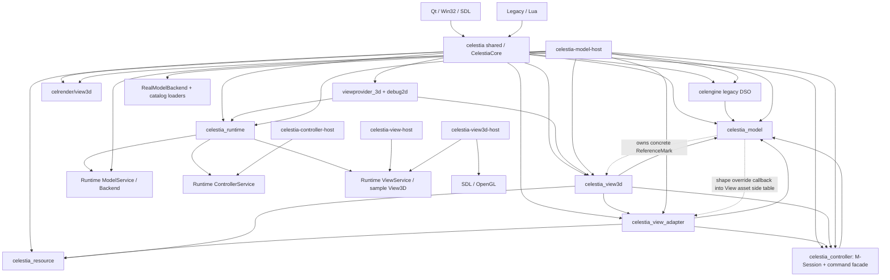

| 当前构建事实 | 直接证据 | 架构含义 |
|---|---|---|
| `celestia` shared 通过 `$<TARGET_OBJECTS:...>` 聚合 Model、Controller、Resource、Adapter、View3D、Runtime、provider、celengine 和 celrender | `E-BUILD-002` | 统一 exe 能运行只证明全量对象可在同一进程链接，不证明物理解耦 |
| `celestia_controller -> celestia_model`；Adapter 同时依赖 Model/Controller/Resource；View3D 再依赖三者和 Adapter | `E-BUILD-001` | 当前 Adapter 是混合连接区，View3D 仍能直接读完整 Model/Session |
| `CELESTIA_HEADLESS_MODEL_BACKEND_LIBS` 明确包含 Adapter、View3D、celengine、celrender、celimage、celttf 等对象 | `E-BUILD-003` | Model Host 尚未物理独立，名称中的 headless 不能作为验收证据 |
| 四个 Host 都编入完整 `celestia_runtime` object library | `E-BUILD-004` | Runtime 角色目前主要靠入口和运行分支区分，构建边界仍偏粗 |
| 3D provider 依赖 Runtime + 原 View3D，debug2d 只依赖 Runtime | `E-BUILD-005` | provider 接口是可保留公共连接能力；具体 3D provider 不是公共 View 能力 |
| `celrender` 当前全部源码都在 `view3d/` 下 | `E-BUILD-006` | celrender 不是与所有 View 平权的中立核心；现有实现应随 Legacy View3D 改变所有者 |

当前 `src/celengine/model`、`controller`、`resource`、`adapter`、`view3d` 的对象库拆分提供了分析抓手，但不等于最终 MVC 已经成立。尤其是 Model Host 仍通过加载器和 Builder 链把 View3D/celrender 带入，证明资源与加载边界是物理独立的真实前置项。

### 11.2 目标允许依赖图

目标图不提前冻结最终目录名，但冻结逻辑所有权和允许方向。`view3d_legacy` 表示原 View3D 白盒迁移后的第一个模板 View；provider/transport/protocol 等连接基础设施可由多个 View 复用，具体 GPU、场景列表和画法全部留在该 View 的私有构建目标。实线是允许依赖，标有 `FORBIDDEN` 的虚线是禁止方向，不代表目标调用。

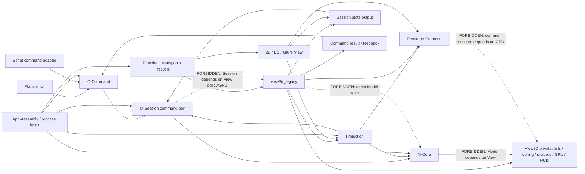

目标图的关键限制如下：

1. M-Core 只向上提供领域对象、计算和查询，不依赖 M-Session、Controller、Projection、任一 View 或 GPU。
2. M-Session 保存时间、Observer、Selection、旅程等唯一权威状态，只依赖 M-Core 和稳定对象引用。
3. Controller 只解释输入和发送命令；命令结果必须从真实 M-Session 或目标 View 回读，不能从 Controller 本地回显。
4. Projection 只读取 M-Core/M-Session，并输出中立对象、场景和详情数据；它不输出 RenderList、屏幕 Annotation 或 GL 对象。
5. Resource-Common 提供稳定资源描述/定位/内容；任何 GPU cache、shader、FBO 和具体 3D procedural asset 都由 `view3d_legacy` 私有持有。
6. View 只经命令端口修改状态。统一 exe 允许接口在进程内实现，但依赖方向必须与三进程模式相同。
7. Model Host 目标构建只含 M-Core、M-Session、必要 Projection/Resource、协议和 Host 基础设施；不得编入 `celestia_view3d`、`celrender`、SDL/OpenGL 或具体 provider。

### 11.3 总迁移依赖顺序

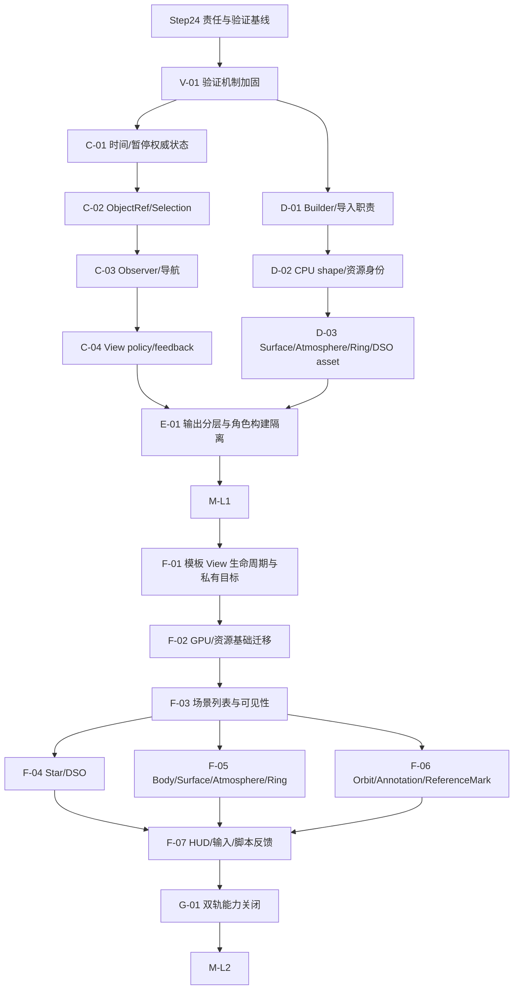

图中的 C 与 D 在逻辑上都只依赖验证加固和 Step24，可以在严格文件隔离时并行；当前单会话策略下按 C 后 D 串行执行更容易控制 `RealModelBackend`、Runtime 输出和 CMake 的共享改动。F-04/F-05/F-06 只有在 F-03 已把 `render.cpp` 的共享场景骨架拆出稳定边界后才可能并行。

### 11.4 代码前置切片：验证机制加固

| 字段 | `V-01` 验证机制加固 |
|---|---|
| 业务能力范围 | 全部 `CAP-*` 的基础失败检测；先覆盖 Quick/Full 状态、10 场景数量、runtime token、进程退出和报告一致性 |
| 当前真实所有者 | `tools/regression` 脚本、场景、基线与机器报告 |
| 目标责任类别 | 验证基础设施，不改变 MVC 所有权 |
| 前置依赖 | Step24 第 3、12 节能力/验证映射 |
| 需要改变所有权的源码 | 无；只修验证脚本和测试数据逻辑 |
| 旧位置必须删除的重复实现 | 删除或统一互相矛盾的 pass/fail 汇总、8/10 场景数量和只写报告不返回失败的路径 |
| 允许保留的公共能力及复用证据 | 场景启动、截图采集、进程清理、报告生成可供统一 exe 与各 View 复用 |
| 统一 exe 验证 | 人工破坏截图、token、场景数量或进程结果时必须非零退出，恢复后 10 场景通过 |
| 模板 View 验证 | 建立可注册多个场景和多截图检查点的跨进程框架；此切片不伪造原业务画面 |
| 暂停条件 | 故意制造失败仍返回成功，报告与退出码不一致，或程序基线相对 `0f733ef` 发生未评估变化 |

`V-01` 不是“先多写测试再说”，而是让后续每一个所有权迁移切片都具有可信停止条件。它必须先于任何 C++ 架构改动完成。

### 11.5 权威状态与命令切片候选

#### `C-01` 时间、暂停、倍速与同步

| 字段 | 内容 |
|---|---|
| 业务能力范围 | `CAP-TIME`，包括 per-Observer simTime、pause/timeScale 状态机、syncTime 和 update |
| 当前真实所有者 | Simulation/Observer；Runtime ControllerService/ModelService 另有重复字段 |
| 目标责任类别 | M-Session + C-Command + 只读 session output |
| 前置依赖 | `V-01`；第 4.2、4.3、10.2、10.7 节 |
| 需要改变所有权的源码 | Runtime 命令必须调用真实 Simulation；输出从真实 Observer/Simulation 读取 |
| 旧位置必须删除的重复实现 | ControllerService/ModelService 的 pause/timeScale 本地权威与快照覆盖 |
| 允许保留的公共能力及复用证据 | Simulation 的暂停状态机和 Observer 时间推进被统一 exe、脚本和多 View共同使用 |
| 统一 exe 验证 | 10 场景时间相关画面不退化；pause/resume/timeScale/setTime 后真实对象值与画面一致 |
| 模板 View 验证 | 三进程命令后连续帧 time、pause、scale 正确，重连后读取同一真实状态 |
| 暂停条件 | 命令只改变输出 DTO、暂停不再保存/恢复倍速，或多 Observer 同步语义改变 |

#### `C-02` ObjectRef、Selection 与对象查询

| 字段 | 内容 |
|---|---|
| 业务能力范围 | `CAP-SEL` 和 `CAP-CATALOG` 的稳定对象引用、当前选择、search/path/completion 基础 |
| 当前真实所有者 | raw-pointer Selection、Simulation::selection、Universe/Catalog 查询、Runtime 字符串覆盖 |
| 目标责任类别 | M-Core ObjectRef/查询 + M-Session current selection + C-Command |
| 前置依赖 | `C-01`；关闭 `U-ID-001` 的最小范围 |
| 需要改变所有权的源码 | 建立稳定 ObjectId 映射和真实 setSelection/query 端口；不复制 Catalog |
| 旧位置必须删除的重复实现 | ModelService 本地 selection 名称/类型覆盖和跨协议 pointer/本地 handle |
| 允许保留的公共能力及复用证据 | Catalog 查询与 Selection 多态对象语义同时被导航、HUD、脚本、Picking 使用 |
| 统一 exe 验证 | 文本选择、pick、路径查找、HUD 和导航目标保持一致；对象销毁后引用失效可控 |
| 模板 View 验证 | View 选择命令返回稳定 ObjectRef，后续详情/导航/重连仍指向同一对象 |
| 暂停条件 | 任一对象类没有稳定身份、addon 生命周期无法定义，或选择仍由 Controller 本地回显 |

#### `C-03` Observer、参考系、导航与跟随

| 字段 | 内容 |
|---|---|
| 业务能力范围 | `CAP-OBS`、`CAP-NAV`，包括 pose/velocity/frame/journey/goto/follow/chase/orbit/rotate |
| 当前真实所有者 | Observer/ObserverFrame/Simulation 命令门面；Runtime camera/follow 覆盖 |
| 目标责任类别 | M-Session 状态与演化 + C-Command；ReferenceFrame 保持 M-Core |
| 前置依赖 | `C-02` 稳定对象引用；关闭 `U-OBS-001` 的绑定规则 |
| 需要改变所有权的源码 | Backend 命令调用真实 Observer；ViewInstance 绑定 ObserverSessionId；输出 pose/frame/journey |
| 旧位置必须删除的重复实现 | Runtime camera/follow/target 覆盖和 Controller 伪状态；不复制 Observer 算法 |
| 允许保留的公共能力及复用证据 | Observer 位置/姿态/导航计算同时被 Renderer、Picking、HUD、URL 和脚本消费 |
| 统一 exe 验证 | goto/center/follow/chase/phaseLock/orbit/rotate 的时序与 10 场景关键截图不退化 |
| 模板 View 验证 | 命令后多帧 pose 连续变化；不同 View 共享或独立 Session 的行为符合绑定规则 |
| 暂停条件 | ReferenceFrame 被复制到 View、active Observer 语义不明确，或命令结果不能从真实 Observer 回读 |

#### `C-04` 镜头、显示策略与反馈路由

| 字段 | 内容 |
|---|---|
| 业务能力范围 | `CAP-POLICY`、`CAP-FEEDBACK` 以及 `CAP-OBS` 中的 FOV/zoom/displayedSurface/locationFilter/faintestVisible |
| 当前真实所有者 | Observer、Simulation、Renderer、Core/Hud 混合 |
| 目标责任类别 | View3D-Private policy + C-Command + structured feedback；pose 留 M-Session |
| 前置依赖 | `C-03`；View target 和 ObserverSessionId 已明确 |
| 需要改变所有权的源码 | 命令显式路由到目标 View；session output 与 lens/view policy output 分开 |
| 旧位置必须删除的重复实现 | Observer/Simulation 中纯显示字段和 Runtime FOV 副本；迁移前保持兼容适配，关闭后删除旧权威 |
| 允许保留的公共能力及复用证据 | feedback event 与 View target 路由可复用；具体 RenderFlags/AutoMag/Location mask 无跨 View 共性证据 |
| 统一 exe 验证 | FOV、AutoMag、替代表面、位置过滤、HUD 消息和脚本操作保持原结果 |
| 模板 View 验证 | 两个 View 可有不同 lens/policy 且共享同一 Observer pose；命令反馈抵达发起 View |
| 暂停条件 | policy 改动污染 M-Core、不同 View 被迫共享 Renderer 位掩码，或旧脚本语义丢失 |

### 11.6 资源、Builder 与加载切片候选

#### `D-01` 导入编排、领域构建与资源绑定分离

| 字段 | 内容 |
|---|---|
| 业务能力范围 | `CAP-BOOT`、`CAP-CATALOG`、`CAP-RESOURCE` 的 loadStars/loadDSO/loadSSO、三类 Builder 和 finish |
| 当前真实所有者 | CelestiaCore loaders + adapter 目录三类 Builder |
| 目标责任类别 | App-Assembly import orchestration + M-Core factory/index + Resource binding + View3D asset loader |
| 前置依赖 | `V-01`；第 5、7、10.3 节；定义 load outcome，不先冻结 appearance 字段 |
| 需要改变所有权的源码 | 按函数组拆 parse/create/index/resource write/finish，保留三类语义差异 |
| 旧位置必须删除的重复实现 | 新路径成功后删除旧 Builder 对同一 Model 字段或 RenderAssets 的写入，不长期双写 |
| 允许保留的公共能力及复用证据 | Catalog parse/factory/index 被统一 exe、Model Host、查询共同使用；具体 View asset binding 不公共 |
| 统一 exe 验证 | 三类 Catalog 数量、对象身份、addon/extras/override、Location finish 和关键场景不退化 |
| 模板 View 验证 | Model Host 无 View 初始化也能加载完整对象图并报告资源引用；View 独立绑定自己的 asset |
| 暂停条件 | 某类 Builder 失败会产生半成品且无回滚，或为统一接口丢失 Star/DSO/SSO 特有 finish 语义 |

#### `D-02` 稳定资源身份与 CPU shape 边界

| 字段 | 内容 |
|---|---|
| 业务能力范围 | `CAP-RESOURCE`、`CAP-BODY`、`CAP-SEL` 中的 GeometryPaths、custom shape、Picking、Location projector、bounds |
| 当前真实所有者 | Resource path tables、BodyRenderAssets、GeometryManager/Geometry、SelectionPicker |
| 目标责任类别 | M-Core shape descriptor + Resource-Common stable ID/CPU pickable shape + View3D GPU geometry |
| 前置依赖 | `C-02` ObjectRef；`D-01`；关闭 `U-RES-001`/`U-PICK-001` |
| 需要改变所有权的源码 | 拆 CPU Geometry 接口与 `createRenderGeometry`；让 Body/Picking/Location 不反查 View3D side table |
| 旧位置必须删除的重复实现 | BodyRenderAssets shape override callback 和 Geometry 中的 GPU factory 越界接口 |
| 允许保留的公共能力及复用证据 | CPU mesh 已被 Picking、Location 和 bounds 三类非绘制能力共同消费；GPU cache 仅 View3D |
| 统一 exe 验证 | ellipsoid/custom mesh Picking、Location 投影、density/bounds 和 mesh 绘制全部保持 |
| 模板 View 验证 | Model Host 不链接 GL 仍能完成 shape 查询；View3D 以 stable ResourceId 创建 GPU geometry |
| 暂停条件 | CPU/GPU 生命周期无法分开、性能显著退化且无缓存方案，或 shape 结果与原程序不一致 |

#### `D-03` Surface、Atmosphere、Ring 与 DSO/Star asset 字段拆分

| 字段 | 内容 |
|---|---|
| 业务能力范围 | `CAP-STAR`、`CAP-DSO`、`CAP-SURFACE`、`CAP-ATM`、`CAP-RESOURCE` |
| 当前真实所有者 | Surface/Atmosphere/BodyFeaturesManager、Body/Star/Nebula RenderAssets、legacy Galaxy/Globular |
| 目标责任类别 | M-Core facts + Projection appearance + Resource-Common refs + View3D private material/procedural/GPU state |
| 前置依赖 | `D-02`；逐项处理 `U-SURFACE-001`、`U-ATM-001`、`U-DSO-001`、`U-LOAD-001` |
| 需要改变所有权的源码 | 字段级分拆、稳定资源引用、生命周期事件单向化；去除 Galaxy 对 GL 状态读取 |
| 旧位置必须删除的重复实现 | RenderAssets/legacy 类型中已迁字段和 `KnowTexture` 等 Model 表现残留；不保留双 side table |
| 允许保留的公共能力及复用证据 | ring radius、atmosphere bounds、物理亮度有非 View 消费；shader flags/form/detail 尚无公共证据 |
| 统一 exe 验证 | Earth clouds/atmosphere、Saturn rings、mesh spacecraft、star/galaxy/deepsky 场景多截图不退化 |
| 模板 View 验证 | 中立输出含足够场景/资源语义；Legacy View 可重建原材质与 fallback，不要求其他 View 采用同一 shader |
| 暂停条件 | 字段没有原消费者证据、资源失败语义未定义，或任一 Model 类型仍 include/调用 GL/View3D |

### 11.7 输出、物理隔离与模板 View 迁移切片候选

#### `E-01` ModelSnapshot、SceneProjection、SceneFrame 与角色构建隔离

| 字段 | 内容 |
|---|---|
| 业务能力范围 | 全部场景/状态输出，重点 `CAP-VIS`、`CAP-RESOURCE`、`CAP-FEEDBACK` |
| 当前真实所有者 | Runtime ViewFrame/SceneViewModel/RealModelBackend；Model Host 全量链接 View3D/celrender |
| 目标责任类别 | M-Session snapshot + Projection + per-View frame；App-Assembly role targets |
| 前置依赖 | `C-01` 至 `C-04`、`D-01` 至 `D-03`；关闭影响字段的 U0 项 |
| 需要改变所有权的源码 | 每字段标来源/生命周期/消费者；拆 role-specific Runtime/CMake target；Model Host 只编真实后端依赖 |
| 旧位置必须删除的重复实现 | 混合 ViewFrame 字段、SceneExtractor/ModelService 覆盖、Model Host 的 View3D/celrender/SDL/OpenGL 对象 |
| 允许保留的公共能力及复用证据 | transport/envelope/provider lifecycle、ObjectRef、state/projection output 被至少两个 Host/View 消费 |
| 统一 exe 验证 | 统一模式走同一命令/输出接口仍通过 10 场景；不允许退回直接旁路读取来补字段 |
| 模板 View 验证 | 三进程 Model Host 独立构建启动；View 收到可追溯的真实状态/场景/资源数据 |
| 暂停条件 | Model Host 构建仍含 View3D/celrender，字段无法追溯原读集，或统一/三进程走两套业务实现 |

#### `F-01` `view3d_legacy` 生命周期、provider 和私有构建目标

| 字段 | 内容 |
|---|---|
| 业务能力范围 | `CAP-BOOT`、View 创建/销毁、viewport、进程/插件生命周期 |
| 当前真实所有者 | CelestiaCore/ViewManager、`celestia_viewprovider_3d`、Runtime view3d host |
| 目标责任类别 | view3d_legacy 私有 App/View shell；provider/transport 继续公共 |
| 前置依赖 | `E-01` 达到 M-L1；目录/target 命名计划单独评审 |
| 需要改变所有权的源码 | 从原 Core/View3D 入口逐段适配到模板 View 生命周期，不机械移动全部文件 |
| 旧位置必须删除的重复实现 | 已迁生命周期和 provider wiring；统一 exe 改为装配该普通 View target |
| 允许保留的公共能力及复用证据 | Runtime provider registry/transport/lifecycle 已被 3D 与 debug2d provider 使用 |
| 统一 exe 验证 | 原窗口启动、View 创建/分屏/销毁、viewport 和退出保持 |
| 模板 View 验证 | 独立 view3d_legacy target 启动/重连/退出；删除该 target 只失去该 View，不破坏 Model/Controller |
| 暂停条件 | 新 View target 需要链接整个 `celestia` shared 才能启动，或 provider 基础设施反向依赖具体 Renderer |

#### `F-02` View3D GPU、纹理、网格和具体 renderer 基础

| 字段 | 内容 |
|---|---|
| 业务能力范围 | `CAP-RESOURCE` 及所有 3D 绘制的 TextureManager、RenderGeometryManager、shader、FBO、celrender |
| 当前真实所有者 | `src/celengine/view3d`、`src/celrender/view3d`、部分 adapter RenderAssets |
| 目标责任类别 | view3d_legacy 私有资源/GPU 子模块 |
| 前置依赖 | `F-01`、`D-02`/`D-03` stable resource；GPU 初始化基线 |
| 需要改变所有权的源码 | 逐组件改到模板 View target并适配 Resource-Common，不复制实现 |
| 旧位置必须删除的重复实现 | 每个已迁 GPU/manager/renderer 源从核心 target 和旧目录责任中移除 |
| 允许保留的公共能力及复用证据 | 只保留 stable ResourceId/byte/CPU shape 公共；GL cache/shader/celrender 全部私有 |
| 统一 exe 验证 | GL capability、纹理/mesh fallback、FBO/effects 和资源释放保持 |
| 模板 View 验证 | 独立 target 创建真实 GL 资源并绘制可核实场景；Model Host 无 GL import/object |
| 暂停条件 | 为复用 GPU 代码把 celrender 放回公共核心，或资源生命周期只能依赖 Model pointer callback |

#### `F-03` 场景收集、可见性和列表骨架

| 字段 | 内容 |
|---|---|
| 业务能力范围 | `CAP-VIS`：近系统查询、Body/Orbit/Annotation 列表、culling、sorting、depth partition |
| 当前真实所有者 | `Renderer::render/build*Lists/removeInvisibleItems/buildDepthPartitions` |
| 目标责任类别 | 中立候选由 Projection；像素/视锥/深度列表由 view3d_legacy 私有 |
| 前置依赖 | `F-02`；`E-01`；关闭 `U-PROJ-001` |
| 需要改变所有权的源码 | 以函数块改变所有者并改读接口，不从截图重写算法 |
| 旧位置必须删除的重复实现 | 已迁列表/裁剪/排序函数；旧 Renderer 不保留旁路 Model 遍历 |
| 允许保留的公共能力及复用证据 | M-Core octree 和 Projection scene facts 公共；RenderListEntry/depth partition 无跨 View 证据 |
| 统一 exe 验证 | 所有 10 场景的对象存在、遮挡、近远裁剪、多截图结构保持 |
| 模板 View 验证 | 同一时间/Observer 下对象集合和关键深度关系与统一 exe 对照；允许私有 buffer 差异 |
| 暂停条件 | 输出字段无法追溯原计算、不得不复制 `render.cpp` 长期双持，或 culling 边界仍未决 |

#### `F-04` Star 与 DSO 白盒迁移

| 字段 | 内容 |
|---|---|
| 业务能力范围 | `CAP-STAR`、`CAP-DSO`：远/近恒星、标签、Galaxy/Nebula/Globular/OpenCluster |
| 当前真实所有者 | PointStarRenderer、Renderer star path、DSORenderer、legacy DSO、celrender renderers |
| 目标责任类别 | M-Core/Projection 提供事实；view3d_legacy 私有分流、style、procedural 和 GPU |
| 前置依赖 | `F-03`；`D-03`；关闭 `U-DSO-001` |
| 需要改变所有权的源码 | 按原双路径和各 DSO 子类逐段迁移，保留 OpenCluster 无独立图元规则 |
| 旧位置必须删除的重复实现 | 原 star/DSO 私有 renderer 和 legacy 表现字段的已迁部分 |
| 允许保留的公共能力及复用证据 | Catalog、位置、光度、type、索引公共；PSF/form/detail/procedural texture 私有 |
| 统一 exe 验证 | starfield/constellation、near star、galaxy/deepsky 多截图与对象/标签状态保持 |
| 模板 View 验证 | 远星点与近星实体两路、各 DSO 类型和 fallback 与基线对照 |
| 暂停条件 | 把所有 Star 压成 point DTO、合并 DSO 子类画法，或 Model 再次读取 GL 状态 |

#### `F-05` Body、Surface、Atmosphere、Ring 与彗尾白盒迁移

| 字段 | 内容 |
|---|---|
| 业务能力范围 | `CAP-BODY`、`CAP-SURFACE`、`CAP-ATM`、部分 `CAP-RESOURCE` |
| 当前真实所有者 | Renderer solar-system/renderPlanet/renderObject、Surface/Atmosphere、BodyRenderAssets、celrender |
| 目标责任类别 | M-Core/Projection/Resource 提供事实；view3d_legacy 私有材质、光照、shader 和绘制 |
| 前置依赖 | `F-03`、`D-02`、`D-03` |
| 需要改变所有权的源码 | 按 Body list -> lighting/eclipses -> surface -> atmosphere/cloud -> ring/comet -> mesh fallback 迁移 |
| 旧位置必须删除的重复实现 | 每个已迁 renderer、asset field 和旧 renderObject 分支，不保留第二套私有实现 |
| 允许保留的公共能力及复用证据 | 位置/姿态/温度/光度/ring radius/atmosphere bounds/resource refs 公共；shader/material 私有 |
| 统一 exe 验证 | Earth default/cloud/orbit/label、Moon close、Saturn rings、spacecraft/asteroid 多检查点 |
| 模板 View 验证 | 同场景同对象/资源/fallback，关键表面、云、大气、环、阴影和自定义 mesh 画面结构对照 |
| 暂停条件 | 物理计算被复制进 View、Surface/Atmosphere 整类跨层搬运，或 shape Picking/Location 退化 |

#### `F-06` Orbit、Marker、ReferenceMark、Label 和 Annotation 白盒迁移

| 字段 | 内容 |
|---|---|
| 业务能力范围 | `CAP-ORBIT`、`CAP-ANNOT`、Selection highlight/grid/boundary |
| 当前真实所有者 | Orbit/OrbitSampler、Renderer orbit cache/list、Marker/Universe、BodyFeaturesManager、ReferenceMark subclasses |
| 目标责任类别 | M-Core samples + M-Session semantics + Projection derived data + view3d_legacy layout/GPU |
| 前置依赖 | `F-03`；`C-02`；关闭 `U-PROJ-002`、`U-MARK-001`、`U-REFMARK-001` |
| 需要改变所有权的源码 | 拆 semantic/style/screen work item；迁移 CurvePlot、LineRenderer、annotation 和 reference geometry |
| 旧位置必须删除的重复实现 | Universe 中混合 MarkerRepresentation、BodyFeaturesManager 具体 View 对象、旧 Renderer annotation/orbit 实现 |
| 允许保留的公共能力及复用证据 | Orbit facts/samples、semantic ObjectRef/mark/vector 可复用；pixel style/layout/GPU 私有 |
| 统一 exe 验证 | orbit/labels/marker/reference/grid/boundary/selection highlight 操作与多截图保持 |
| 模板 View 验证 | 曲线窗口/fade、语义标记、遮挡、标签和 ReferenceMark 方向/bounds 与基线对照 |
| 暂停条件 | Model 继续拥有 View3D subclass、屏幕坐标写回 Model，或 orbit 固定采样导致精度/性能不等价 |

#### `F-07` HUD、脚本、输入和反馈收口

| 字段 | 内容 |
|---|---|
| 业务能力范围 | `CAP-SCRIPT`、`CAP-FEEDBACK` 和所有能力的最终输入/反馈入口 |
| 当前真实所有者 | CelestiaCore、Hud、OverlayManager、Legacy/Lua、平台前端 |
| 目标责任类别 | C-Command/script adapter + session/detail output + view3d_legacy HUD/overlay + App capture |
| 前置依赖 | `F-04` 至 `F-06`；C-Command 完整；对象详情 Projection 完整 |
| 需要改变所有权的源码 | 脚本经同一命令/查询；HUD 从输出读取；媒体/字体/布局迁入 View 私有；capture 留 App |
| 旧位置必须删除的重复实现 | Core 直写 Renderer/Simulation/Hud 的已替代入口和 Runtime 特例命令 |
| 允许保留的公共能力及复用证据 | 类型化命令、查询和 feedback event 公共；Hud/Overlay 具体呈现无公共要求 |
| 统一 exe 验证 | 10 个场景脚本、HUD、overlay、选择详情、消息、捕获/退出行为保持 |
| 模板 View 验证 | 同一脚本驱动真实状态与 View policy，HUD 数值一致，允许字体布局等私有表现差异 |
| 暂停条件 | 脚本绕过端口直改内部状态、HUD 缺字段倒逼复制 Model，或统一/三进程命令语义分叉 |

#### `G-01` 双轨能力关闭和 M-L2

| 字段 | 内容 |
|---|---|
| 业务能力范围 | 第 3 节全部 18 个 `CAP-*` |
| 当前真实所有者 | 固定统一 exe 基线、迁移后的 view3d_legacy 和各 Host |
| 目标责任类别 | 验证与人工验收，不新增业务所有权 |
| 前置依赖 | `F-01` 至 `F-07` 全部关闭；第 12 节映射无空白 |
| 需要改变所有权的源码 | 无新的替代实现；只修复已识别缺陷或补验证观察点 |
| 旧位置必须删除的重复实现 | 所有已迁 View3D 私有实现和 Model/Controller 副本；删除 view3d_legacy 后只损失该 View |
| 允许保留的公共能力及复用证据 | 仅保留由两个真实 View/Host 证明的协议、Projection、Resource、provider 基础 |
| 统一 exe 验证 | 全部 STATE/STRUCTURE/IMAGE/PROCESS 检查通过，机器报告与人工关键截图一致 |
| 模板 View 验证 | 业务、状态、资源、进程和多截图能力对照完成；允许差异逐项登记 |
| 暂停条件 | 任一能力无验证或豁免、旧私有实现仍双持、Model 因 View 缺字段继续被动修改 |

### 11.8 后续三类实施计划的输入边界

| 后续计划名称 | 必须读取的 Step24 输入 | 必须解决 | 明确不在该计划解决 |
|---|---|---|---|
| 验证机制加固计划 | 第 3 节能力全集、第 11.4 节 `V-01`、第 12 节场景/验证矩阵、第 13 节会阻断自动判断的未决项 | 退出码、报告一致性、10 场景、故障注入、跨进程场景框架 | 不设计新的业务输出字段，不修改 Model/Controller/View 责任 |
| 权威状态与真实命令闭环计划 | 第 4 节真实状态链、第 10.2/10.7-10.9 节、第 11.5 节 C 切片、`C-STATE-001`/`C-POLICY-001`/`U-ID-001`/`U-OBS-001` | 时间、Selection、Observer、导航、View policy 的唯一权威和真实命令闭环 | 不拆 Surface/Atmosphere/Builder，不迁移原 View3D 画法，不冻结完整 SceneProjection |
| 资源、Builder 与加载边界计划 | 第 5、7、8 节，第 10.3/10.5 节，第 11.6 节 D 切片，`C-ASSET-001`/`C-SHAPE-001` 与相关 U0 | parse/build/bind 分离、stable ResourceId、CPU/GPU shape、字段级资源归属、加载失败语义 | 不实现最终 View3D 模板，不重写 Renderer，不决定无第二 View 证据的 View-Common |

三份计划都必须单独编号、单独评审。Step24 只提供输入边界，不授权自动创建这些计划，更不授权执行代码。

### 11.9 串行与可并行关系

| 工作组合 | 依赖判断 | 当前建议 | 原因/限制 |
|---|---|---|---|
| `V-01` 与任何 C++ 切片 | 不可并行关闭 | `V-01` 先完成 | 后续切片必须已有可信失败检测 |
| C 状态切片彼此 | 强串行 | C-01 -> C-02 -> C-03 -> C-04 | 共用 Simulation、Observer、ModelService、协议和 RealModelBackend，且身份/Session 是导航前置 |
| D-01/D-02/D-03 | 原则串行；后期可局部并行 | 先完成一个公共拆分模式再评估 | 共用 Builder 接口、资源 ID、生命周期和 CMake；Star/DSO/SSO 不得各自发明接口 |
| 阶段 C 与 D | 逻辑可并行，物理有交集 | 当前单会话下串行 | 都可能改 RealModelBackend、输出类型和 CMake；并行需独立 worktree 与明确合并顺序 |
| E-01 与 C/D | 不可提前 | C、D 完成后 | 输出字段和 Model Host 依赖必须以稳定状态/资源边界为输入 |
| F-01/F-02/F-03 | 强串行 | 按顺序 | 先有普通 View 目标和资源基础，才能迁移共享 `render.cpp` 骨架 |
| F-04/F-05/F-06 | 条件并行 | F-03 关闭后再评估 | 当前都触及 Renderer/列表/资源；只有文件所有权拆开、输出冻结后才可多 worktree |
| F-07 | 汇合点 | F-04/F-05/F-06 后 | HUD/脚本/反馈需要完整命令和对象详情 |

任何并行任务只要共同修改 `celestiacore.cpp`、`render.cpp`、`modelservice.cpp`、输出类型、资源 ID 或同一 CMake 清单，就默认不可并行。当前用户已选择先不并行，因此本表只说明未来可能性，不启动多会话。

### 11.10 能力族到迁移切片索引

| Capability ID | 必经切片 | 关闭含义 |
|---|---|---|
| `CAP-BOOT` | `V-01`、`D-01`、`E-01`、`F-01`、`G-01` | 创建/加载/Host/View 生命周期与目标构建一致 |
| `CAP-TIME` | `V-01`、`C-01`、`E-01`、`G-01` | 唯一时间状态和跨进程命令/输出闭环 |
| `CAP-OBS` | `C-03`、`C-04`、`E-01`、`F-01`、`G-01` | Session pose 与 View lens/绑定分开且可验证 |
| `CAP-SEL` | `C-02`、`D-02`、`F-06`、`G-01` | stable ObjectRef、真实选择、Picking 和高亮闭环 |
| `CAP-NAV` | `C-03`、`E-01`、`F-07`、`G-01` | 原 Observer journey/frame/mode 被真实命令驱动 |
| `CAP-CATALOG` | `D-01`、`E-01`、`G-01` | 三类 Catalog/Builder 加载和对象身份完整 |
| `CAP-VIS` | `E-01`、`F-03`、`F-04..06`、`G-01` | 中立候选与 View3D 列表/culling/depth 白盒承接 |
| `CAP-STAR` | `D-01`、`D-03`、`F-03`、`F-04`、`G-01` | far/near 两路、资源、标签和画面完整 |
| `CAP-DSO` | `D-01`、`D-03`、`F-03`、`F-04`、`G-01` | 四类 DSO 规则和具体 View 实现完整 |
| `CAP-BODY` | `D-01..03`、`F-03`、`F-05`、`G-01` | 领域计算、shape、资源和完整绘制链闭合 |
| `CAP-SURFACE` | `D-02`、`D-03`、`F-05`、`G-01` | 字段级归属和 Legacy material/fallback 等价 |
| `CAP-ATM` | `D-03`、`F-05`、`G-01` | atmosphere/cloud/ring/comet 事实与绘制分开 |
| `CAP-ORBIT` | `E-01`、`F-03`、`F-06`、`G-01` | Orbit facts/sample 与曲线窗口/GPU 分开且等价 |
| `CAP-ANNOT` | `C-02`、`C-04`、`F-03`、`F-06`、`G-01` | Marker/ReferenceMark/Annotation 语义、派生和画法分开 |
| `CAP-POLICY` | `C-04`、`E-01`、`F-03..07`、`G-01` | policy per View、无 Controller/Session 副本 |
| `CAP-RESOURCE` | `D-01..03`、`E-01`、`F-02`、`F-04..06`、`G-01` | stable resources 与 View3D GPU 私有实现物理隔离 |
| `CAP-SCRIPT` | `C-01..04`、`F-07`、`G-01` | Legacy/Lua 走同一真实命令/查询/反馈端口 |
| `CAP-FEEDBACK` | `C-04`、`E-01`、`F-07`、`G-01` | 业务反馈与 View/App 呈现分开且能力完整 |

## 12. 能力到验证场景映射

### 12.1 验证类型和判定原则

| 类型 | 本文含义 | 不能替代什么 |
|---|---|---|
| `STATE` | 直接读取权威对象、字段、对象数量、ID、计算结果或命令结果并断言 | 不能用截图中“看起来动了”替代 |
| `STRUCTURE` | 构建目标、include/link 依赖、重复实现、目录/目标所有权扫描 | 不能证明运行语义正确 |
| `IMAGE` | 固定数据、时间、镜头和 policy 下的多检查点截图/画面结构对照 | 不能单独证明内部状态写入真实对象 |
| `PROCESS` | Host 启停、传输、切换、重连、退出码、残留进程和消息闭环 | 不能证明完整业务内容 |
| `MANUAL` | 对当前无法可靠自动量化的视觉细节进行人工并排评审并留记录 | 不能作为无记录的主观“差不多” |
| `EXEMPT` | 确实无法合理自动或人工验证的项，必须写原因和风险 | 不能用来回避难测能力 |

一个能力通常需要两种以上验证。例如导航必须同时有真实 Observer 状态断言和多时刻画面；资源边界必须同时有构建依赖扫描、资源解析状态和可见结果。`IMAGE` 只守画面，`STATE` 只守事实，两者不能相互代替。

### 12.2 当前回归脚本的真实判定机制

| 机制 | 源码事实 | 当前真正能证明 | 已确认缺口 |
|---|---|---|---|
| 场景发现 | 按文件名排序加载所有 `.cel`，只要求数量 `>= 10` | 至少有 10 个脚本文件 | 不要求恰好 10，不检查场景 ID/能力元数据 |
| 单场景执行 | 每个脚本启动一次 SDL exe，最多 90 秒；脚本等待后只 `capture` 一张 PNG 并退出 | 进程能执行脚本、生成一个最终画面 | 没有命令前/中/后多帧，没有状态或事件输出 |
| 硬失败 | build/ctest/三项 MVC scan、进程非零、超时、截图缺失、残留进程都会 `throw` | 这些基础故障会让 PowerShell 非零结束 | 图像比较和 runtime 结果中的逻辑 `fail` 不一定转成进程失败 |
| 当前图片基础检查 | 图片可读、`nonBlackRatio >= 0.002`、宽高至少 160x120 | 图片存在且不是几乎全黑/极小 | 不检查目标对象、标签、云、环、轨道或 HUD 是否实际存在 |
| Full 图片对照 | 尺寸不同或当前图几乎全黑标 `fail`；dHash Hamming > 30 或平均颜色距离 > 80 只标 `warn` | 报告可提示大幅全局变化 | `warn/fail` 只写报告，主脚本末尾没有据此 `throw/exit 1`；视觉差异本身不会可靠阻断更新 |
| Quick 总状态 | 运行 build/test/scan/runtime/screenshot，但调用 `Write-Report` 时未聚合 screen/runtime status | 命令级异常可阻断 | 报告默认写 `pass`，即使图片指标或 missing runtime config 被记为 `fail` |
| Full 总状态 | 聚合 screen/comparison/runtime 为 pass/warn/fail 并写报告 | 报告中的汇总相对 Quick 更完整 | 汇总状态仍不决定 PowerShell 退出码；CI 可能把报告 `fail` 当成功 |
| 基线完整性 | 场景要求至少 10 个，但 `Ensure-BaselineScreenshots` 只有截图数恰好等于 8 才认为完整 | 无稳定证明 | 10 张有效基线会被反复判“不完整”；恰好 8 张反而可能被接受，后两场无基线 |
| Runtime smoke | 六个 2D/3D stdio/socket/switch config；进程退出受检查 | Host 编排能启动和退出 | Quick/Full 不检查详细 token；Step18 才查 `all hosts stopped`，3D 只查 token 字符串存在，不断言 count 值或业务身份 |
| 多进程画面 | Runtime 3D 日志要求出现 frame/body/resource token | sample View3D 产生过某种 frame payload | 不与统一 exe 的 10 个业务场景或画面对照，不证明原 Renderer 能力 |
| 状态断言 | `.cel` 脚本不回写 JSON/状态，回归器不读取 Simulation/Observer/Catalog | 无 | 时间、Selection、Observer、导航和 policy 目前全靠最终截图间接推测 |
| 人工查看 | Full 生成 baseline/current contact sheet | 人可以并排检查 10 个最终画面 | 无强制人工签字、差异分类和多检查点；contact sheet 不是自动语义断言 |

因此，当前回归能力的客观结论是：它已经形成“固定旧提交 + 10 个统一 exe 最终截图 + 六个 runtime 启停配置”的有用安全网，但总状态、基线数量、状态断言和跨进程业务内容仍不足以担当后续架构迁移的阻断门槛。这正是 `V-01` 必须排在首个代码切片之前的原因。

### 12.3 现有 10 个场景逐项实测范围

下表依据脚本命令本身，不依据文件名推断。所有场景都先设置 `timerate 0` 和 `JD 2451545.0`，等待 1.5 秒后只捕获一张最终画面；当前自动判断均只有“进程/截图存在 + 非黑/尺寸”，Full 模式另做全图 hash/平均颜色对照。

| 场景 | 实际操作与状态变化 | 实际触发能力族 | 最终画面可观察内容 | 当前没有证明的内容 |
|---|---|---|---|---|
| `01-earth-default` | 清 labels/部分 flags；选 Earth；`synchronous` 进入 geosynchronous follow；立即 `gotoloc`；0.2s center | `CAP-TIME`、`CAP-SEL`、`CAP-NAV`、`CAP-BODY`、`CAP-SURFACE`、`CAP-POLICY`、`CAP-VIS` | 固定时刻的 Earth、恒星背景和基础表面 | 无状态回读；无云/大气/环；geosynchronous 状态随后可能被 gotoloc/center 覆盖，不能证明持续跟随 |
| `02-earth-clouds-orbits-labels` | 开 planets label、cloudmaps、orbits；选 Earth；synchronous + 立即 gotoloc + center | 上述能力加 `CAP-ATM`、`CAP-ORBIT`、`CAP-ANNOT` | Earth、云层、行星标签和轨道的最终组合 | 不断言各图层分别存在；无大气参数、轨道 sample/window、标签遮挡状态 |
| `03-moon-close` | 选 Moon；`goto time 0 distance 4`，equatorial up frame | `CAP-TIME`、`CAP-SEL`、`CAP-NAV`、`CAP-BODY`、`CAP-SURFACE`、`CAP-VIS` | Moon 近景与表面纹理/照明 | goto 为瞬时，不能证明 journey 插值；无 custom mesh、Picking 或 Location |
| `04-saturn-rings` | 选 Saturn；瞬时 goto，distance 7 | `CAP-TIME`、`CAP-SEL`、`CAP-NAV`、`CAP-BODY`、`CAP-ATM`、`CAP-SURFACE`、`CAP-RESOURCE` | Saturn 和 ring 最终画面 | 不分别断言内外半径、颜色、纹理、阴影和缺失资源 fallback |
| `05-asteroid-or-spacecraft` | 开 minorplanet label；只选择 `Sol/Eros`；瞬时 goto | `CAP-SEL`、`CAP-NAV`、`CAP-BODY`、`CAP-SURFACE`、`CAP-ANNOT`、`CAP-RESOURCE` | Eros 小天体及标签，具体是否使用自定义 mesh 取决于数据 | 没有 spacecraft 对象和分支；无 mesh identity、CPU shape、Picking/Location/fallback 断言 |
| `06-starfield-constellations` | 开 star/constellation labels 与 constellation render flag；选 Polaris；center | `CAP-STAR`、`CAP-CATALOG`、`CAP-ANNOT`、`CAP-POLICY`、`CAP-VIS` | 星场、Polaris 附近、星座线/标签 | 无近恒星实体路径、AutoMag/limiting magnitude、PSF style、StarRenderAssets mesh/texture |
| `07-galaxy-deepsky` | 开 stars/galaxies；选 `Milky Way`；瞬时 goto | `CAP-DSO`、`CAP-CATALOG`、`CAP-SEL`、`CAP-NAV`、`CAP-VIS`、`CAP-RESOURCE` | Milky Way galaxy 最终画面 | 不覆盖 Nebula、Globular、OpenCluster；不验证 form/detail/lightGain、sRGB 分支或 DSO labels |
| `08-script-overlay-hud` | Earth 场景；Legacy `print` 文本；`verbosity 2` | `CAP-SCRIPT`、`CAP-FEEDBACK`、`CAP-POLICY`，并间接触发 Earth 能力 | 打印文本、HUD detail 与 Earth/云最终画面 | 不是 image/video Overlay 测试；无 Console、反馈事件、对象详情字段或脚本命令结果断言 |
| `09-selection-follow-goto` | 选 Earth；执行 geosynchronous `synchronous`；立即 gotoloc；center；print | `CAP-SEL`、`CAP-NAV`、`CAP-SCRIPT`、`CAP-FEEDBACK`、`CAP-ORBIT`、`CAP-ANNOT` | Earth、轨道、标签、说明文字 | 没有 `follow` 命令；没有非零时长 goto 的中间帧；最终图不能证明 Selection、follow mode 或 journey 仍为真实权威状态 |
| `10-resource-fallback-missing` | 选 Mars；正常瞬时 goto/center；开 planets/orbits；print | `CAP-BODY`、`CAP-SURFACE`、`CAP-RESOURCE`、`CAP-ORBIT`、`CAP-FEEDBACK` | 正常 Mars、轨道、标签/文字 | 脚本没有删除、改名或替换任何资源，也没有指定缺失 asset；因此没有实际覆盖 missing/fallback |

场景名与真实覆盖不一致的三项需要明确纠正：`05` 只覆盖 Eros 而不是“asteroid 或 spacecraft”两类，`09` 不证明持续 follow/goto journey，`10` 不制造缺失资源。`08` 覆盖文本 print/HUD，不覆盖图片或视频 Overlay。后续验证计划应改场景内容或改名，不能继续把名称当作验收证据。

### 12.4 18 个业务能力族的目标验证映射

| Capability ID | 必需验证类型 | 当前已有证据 | 后续必须增加的关键断言 |
|---|---|---|---|
| `CAP-BOOT` | `STRUCTURE` + `PROCESS` + `STATE` | build/ctest、三项 scan、六个 runtime config | 各角色精确链接图；Model Host 无 View3D/GL；三类 Catalog load outcome；配置失败/退出/重连 |
| `CAP-TIME` | `STATE` + `PROCESS` + `IMAGE` | 10 场景固定 JD/rate 的最终图 | setTime/pause/resume/timeScale/sync 后真实 Simulation/Observer 数值；多 Observer 时间；多帧天体变化 |
| `CAP-OBS` | `STATE` + `PROCESS` + `IMAGE` | 场景最终镜头、runtime frame token | pose/orientation/velocity/frame/journey；ViewInstance-Session 绑定；独立 lens 与共享 pose |
| `CAP-SEL` | `STATE` + `PROCESS` + `IMAGE` | 多场景 select 后对象位于画面 | stable ObjectRef、真实 current selection、pick/search/script 一致、对象销毁失效、高亮/详情 |
| `CAP-NAV` | `STATE` + `PROCESS` + `IMAGE` | 瞬时 goto/gotoloc/center/synchronous 最终图 | 非零时长 journey 多检查点；follow/chase/phaseLock/orbit/rotate；重连后模式和 pose |
| `CAP-CATALOG` | `STATE` + `STRUCTURE` + `PROCESS` | 能选 Earth/Moon/Saturn/Eros/Mars/Polaris/Milky Way | Star/DSO/SSO 数量、ID、索引/关系、addon/extras/override、load failure 和查询结果 |
| `CAP-VIS` | `STATE` + `IMAGE` + `MANUAL` | 10 张全图对照 | 每类候选/剔除原因/列表计数；近远、遮挡、透明、depth；多分辨率多 FOV；人工关键结构检查 |
| `CAP-STAR` | `STATE` + `IMAGE` | Polaris 星场/星座场景 | far point/PSF 与 near body 两路、limiting magnitude/AutoMag、标签、mesh/texture fallback、数量 |
| `CAP-DSO` | `STATE` + `IMAGE` + `MANUAL` | Milky Way 单一 galaxy | Galaxy/Nebula/Globular/OpenCluster 分别测试；type/form/detail/lightGain、标签和无独立图元规则 |
| `CAP-BODY` | `STATE` + `IMAGE` | Earth/Moon/Saturn/Eros/Mars | Timeline/position/orientation/velocity/temperature/luminosity/bounds；层级；ellipsoid/custom mesh；对象身份 |
| `CAP-SURFACE` | `STATE` + `IMAGE` + `MANUAL` | 普通 Earth/Moon/Mars/Saturn 画面 | 各 texture/material 字段、alternate surface、mesh orientation/scale、fallback、资源 ID、shader flags 私有性 |
| `CAP-ATM` | `STATE` + `IMAGE` + `MANUAL` | Earth cloudmaps、Saturn rings | atmosphere height/cloud/scattering/shadow、ring radii/color/texture/shadow、comet tail；字段来源和 bounds |
| `CAP-ORBIT` | `STATE` + `IMAGE` | 三场打开 orbit flag 的最终图 | Orbit position/velocity/range/sample；时间窗口/fade/像素细分；selected/all mask；多时刻曲线 |
| `CAP-ANNOT` | `STATE` + `IMAGE` + `MANUAL` | planets/stars/constellation/minorplanet labels | Marker semantic/style、Annotation layout/occlusion、ReferenceMark 每 kind/bounds、grid/boundary、Selection highlight |
| `CAP-POLICY` | `STATE` + `PROCESS` + `IMAGE` | 脚本设置部分 flags/labels/cloud/orbit/galaxy | 全部 policy 分组、per-View 独立、持久化/脚本/UI 同义、AutoMag/FOV/surface/filter、无 Controller 副本 |
| `CAP-RESOURCE` | `STATE` + `STRUCTURE` + `PROCESS` + `IMAGE` | 正常纹理/mesh 间接画面；无真实 fallback | stable ResourceId/path/content、CPU/GPU 边界、resolve/cache/release、真实 missing/corrupt/fallback、Model Host link scan |
| `CAP-SCRIPT` | `STATE` + `PROCESS` + `IMAGE` | Legacy `.cel` 的 set/select/nav/policy/print/capture | Legacy 与 Lua/CELX 命令矩阵、错误反馈、跨进程目标 View、不能旁路权威端口、脚本结果回读 |
| `CAP-FEEDBACK` | `STATE` + `PROCESS` + `IMAGE` + `MANUAL` | print + verbosity 最终截图 | structured command result、HUD 数值来源、toast/Console/text input、image/video overlay、capture、格式/布局人工检查 |

没有任何一个完整能力族被标为 `EXEMPT`。像素级抗锯齿、字体栅格化、视频解码时序等局部细节可以有 `MANUAL` 或平台差异规则，但不能因此豁免整个 Star、HUD、Overlay 或 View3D 能力。

### 12.5 后续验证场景缺口

Step24 只记录需求，不创建脚本。每个缺口在后续验证计划中都必须转换成可执行场景和断言。

| Gap ID | 场景目的 | 前置对象/配置 | 操作序列 | 必须断言 |
|---|---|---|---|---|
| `VG-01` | 时间状态机和多 Observer 同步 | 两个 Observer Session，固定初始 JD | setTime -> setScale -> step -> pause -> step -> resume -> sync on/off | 每个 simTime、pause/stored/effective scale、对象位置和跨进程输出精确值 |
| `VG-02` | Observer 与 View lens 分离 | 两个 View 绑定同一/不同 Session | 改 pose、改 FOV、切 active View、销毁/重连 | pose 共享规则、lens 独立、active/绑定/生命周期和两张画面 |
| `VG-03` | Selection/ObjectRef/Picking/Search 闭环 | Star/Body/DSO/Location 各一；含 custom mesh | 文本搜索、路径、脚本 select、屏幕 pick、对象 reload/destroy | 四类稳定 ID、current selection、详情/高亮/导航一致、失效错误 |
| `VG-04` | 完整导航模式 | Earth/Moon/Saturn 等目标 | 非零时长 goto/center；follow/chase/phaseLock；orbit/rotate；逐帧采样 | journey/mode/frame/pose 连续性和开始/中间/结束截图 |
| `VG-05` | 三类 Catalog 与 addon 生命周期 | 固定 base + extras + override + 错误文件 | load、重复、override、查询、reload、shutdown | 数量/ID/关系/index、错误原子性、资源绑定结果、无悬空引用 |
| `VG-06` | Star 双路径和 AutoMag | 远星场 + 可接近恒星，两个 FOV/limiting magnitude | 缩放、移动到近星、切 StarStyle/AutoMag | far/near 分流、可见数量、label、PSF/mesh/texture/fallback 多截图 |
| `VG-07` | DSO 子类完整覆盖 | Galaxy/Nebula/Globular/OpenCluster 各一 | 逐类 select/goto、切 type flags/labels/light gain | 每类身份、候选、标签、具体画法；OpenCluster 无独立图元但成员星/label 存在 |
| `VG-08` | Body shape 与 CPU/GPU geometry | ellipsoid + custom mesh + surface Location | query bounds/density、pick、Location projection、render | CPU query 与 GPU view 使用同一资源身份，位置/bounds/pick/画面一致 |
| `VG-09` | Surface/Atmosphere/Ring 字段矩阵 | Earth alternate/cloud/atmosphere、Saturn ring、缺失纹理变体 | 逐字段/policy 切换并多点截图 | 字段来源、资源 resolve/fallback、bounds、cloud/ring/atmosphere/shadow |
| `VG-10` | Orbit 事实到曲线 | 短周期和长周期 Orbit | 不同时间窗口/FOV/mask，推进时间并抓多帧 | sample/range、曲线窗口、fade、细分、selected/all policy 和画面 |
| `VG-11` | Marker/ReferenceMark/Annotation | 四类 Selection；所有 ReferenceMark kind | mark/unmark、style、遮挡、grid/axes/vector、pick | semantic state、bounds/向量、屏幕 layout、遮挡、点击仍返回原对象 |
| `VG-12` | per-View policy 平权 | 两个 View 同一 Observer Session | 分别设置 flags/labels/FOV/surface/filter/AutoMag | policy 不串扰、Model 事实不变、两 View 输出/画面差异符合命令 |
| `VG-13` | Legacy/Lua 命令等价 | ENABLE_CELX 构建、相同初始 session | 用两种脚本执行 time/select/nav/policy/mark/feedback | 命令结果、真实状态、错误码、目标 View 和画面语义一致 |
| `VG-14` | HUD/feedback/overlay/capture | 对象详情、text/image/video asset、错误命令 | 显示 HUD、toast、Console、image/video、capture | 数值来自 state/detail output，媒体生命周期、错误反馈、截图/录制 |
| `VG-15` | 角色构建和进程隔离 | role-specific targets/configs | 单独构建/启动 Model、Controller、2D/3D View，切换/重连/退出 | Model Host 无 View3D/GL 对象，消息顺序、退出码、无残留进程 |
| `VG-16` | 真实资源缺失/损坏/fallback | 临时数据根中明确移除/损坏 texture/mesh | 启动指定对象场景，记录 resolve error，再恢复资源 | 预期 fallback/错误事件、对象仍可处理、无崩溃、恢复后资源和画面回归 |

现有场景可继续作为视觉基线，但不能用改名掩盖缺口。最直接的做法是保留原 10 场景作为“统一 exe 兼容组”，在验证加固计划中新增状态/进程组和多检查点画面组，并把 `VG-*` 与能力/切片互相引用。

### 12.6 每个迁移切片的双轨验证矩阵

| 切片 | 统一 exe 必须守住 | 模板/跨进程 View 必须新增证明 | 两条路径必须相同 | 允许的 View 私有差异 |
|---|---|---|---|---|
| `V-01` | 10 场景、build/test/scan、故障注入正确失败 | 多场景多检查点框架和 Host 故障能阻断 | pass/fail 语义、场景身份、证据可追溯 | artifact 路径、日志格式、截图采集实现 |
| `C-01` | 原 setTime/pause/scale/sync 行为和画面 | 命令真实写 Session，重连可回读 | 时间数值、状态机、对象时间派生结果 | 时间控件/HUD 的视觉布局 |
| `C-02` | search/pick/select/HUD/nav 目标不变 | stable ObjectRef 跨进程闭环和失效处理 | 对象身份、当前选择、查询结果 | View 高亮图元的私有实现 |
| `C-03` | 所有导航模式的 pose/frame/journey | 多 View Session 绑定、命令和连续帧 | pose、orientation、mode、frame、时序结果 | 输入设备映射、相机平滑的明确私有参数（若不改变原默认） |
| `C-04` | FOV/AutoMag/surface/filter/feedback 和脚本语义 | policy 目标 View 独立且无 Session 副本 | 命令含义、选中 policy 值、业务反馈内容 | 不同 View 可不支持无关的 Legacy 3D policy；必须明确返回 capability |
| `D-01` | 三类 Catalog 对象、关系、override、finish 不变 | 无 View 初始化也能构建完整 Model 并分别绑定 asset | 对象数量/ID/领域字段/load outcome | 各 View 选择绑定哪些私有 asset 格式 |
| `D-02` | custom mesh bounds/pick/Location/render 不变 | Model Host CPU shape + View GPU geometry 分离 | ResourceId、shape query、pick/Location 结果 | GPU buffer/cache 格式和上传策略 |
| `D-03` | Star/DSO/Body 外观和 fallback 场景不退化 | 中立字段/资源引用足以重建 Legacy 画面 | 领域/场景字段、资源身份、缺失语义 | shader、procedural texture、material cache 等 View3D 实现 |
| `E-01` | 统一模式必须改走同一命令/输出链仍通过 | Model Host 独立构建运行，View 收真实分层输出 | 状态/对象/场景字段语义和单位 | 编码、批处理、共享内存布局，只要规范和结果一致 |
| `F-01` | 原窗口、分屏、View 生命周期和退出 | 普通 `view3d_legacy` target 独立启停/重连 | View 数量、目标 Session、生命周期结果 | 进程窗口壳和插件装载细节 |
| `F-02` | 原 GL/resource/fallback/effects | 私有 target 独立创建/释放 GPU 资源 | 资源选择、fallback、可见绘制能力 | GPU handle、cache、shader 编译和驱动相关细节 |
| `F-03` | 原对象集合、culling、遮挡、排序和 depth | 由中立输出白盒承接同一列表逻辑 | 同场景候选、最终可见对象、关键深度关系 | 内部容器、buffer、并行策略；不能丢对象或改变默认可见规则 |
| `F-04` | Star/DSO 全子类和远近分流 | Legacy View 从 Projection/Resource 重建原路径 | 对象、位置、亮度规则、标签、分流、fallback | 浮点/驱动噪声、抗锯齿和程序化纹理微差，需阈值+人工记录 |
| `F-05` | Body/surface/cloud/atmosphere/ring/comet/mesh | 同业务链经模板 View 得到原能力 | 对象姿态、材质选择、资源、遮挡/阴影语义和关键画面结构 | shader/GPU 细节的微小像素差；不允许缺图层或用简化球替代 mesh |
| `F-06` | Orbit/label/marker/reference/grid/boundary | semantic + Projection + private layout/render 全链 | 轨道事实、标记对象、向量/bounds、标签内容和遮挡语义 | 字体栅格/线宽细差；不能缺少 kind、曲线窗口或交互 |
| `F-07` | Legacy/Lua、HUD、Overlay、feedback、capture | 同一命令端口驱动真实状态和 View | 命令结果、HUD 数值、消息内容、媒体/捕获生命周期 | 平台字体、safe area、UI chrome；业务字段不得缺失 |
| `G-01` | 全能力矩阵、旧统一基线和结构扫描闭合 | view3d_legacy 达到白盒能力等价，其他 View 保持平权 | 所有声明为公共的语义、业务结果和允许差异清单 | 只有经人工批准并记录的 View 私有差异 |

“允许私有差异”不是降低 1:1 白盒迁移目标。它只允许由平台、驱动或确实属于具体 View 的实现造成、且不改变业务能力和关键视觉结构的差异。任何对象缺失、功能分支缺失、用样板 primitive 替代原 renderer、状态不真实或资源 fallback 不一致都不是允许差异。

### 12.7 无验证空白检查

第 12.4 节的 18 个 `CAP-*` 每一项都有至少一种自动验证类型，且均给出新增断言；没有整项 `EXEMPT`。其中 `CAP-VIS`、`CAP-DSO`、`CAP-SURFACE`、`CAP-ATM`、`CAP-ANNOT`、`CAP-FEEDBACK` 额外保留 `MANUAL`，原因是画面结构和字体/程序化纹理等细节尚不能完全由单一数值指标判断，但这些项同时都有 STATE/IMAGE/PROCESS 自动证据，不是只靠人工。

现有 10 场景在后续仍是统一 exe 视觉兼容基线；它们不能单独验收任何 M/C/V 层完成解耦。Step24 的验证结论是“已有安全网可复用，但必须先完成 `V-01`，才能作为代码迁移门槛”。

## 13. 冲突项、未决项和所需证据

### 13.1 冲突台账

| Conflict ID | 当前冲突 | 目标判断 | 必须消除的旧关系 | 影响能力 |
|---|---|---|---|---|
| `C-STATE-001` | ControllerService、ModelService 与真实 Simulation/Observer 同时保存 pause/timeScale/FOV/camera/selection/follow | M-Session/View 各保留唯一权威；Controller 只发命令 | 删除 Runtime 覆盖字段和“只改快照”路径 | `CAP-TIME`、`CAP-OBS`、`CAP-SEL`、`CAP-NAV` |
| `C-OWN-001` | Simulation 作为会话类独占 Universe | Universe 归 M-Core Model Root，Session 只持引用 | 拆构造所有权和销毁顺序 | `CAP-BOOT`、`CAP-CATALOG` |
| `C-VIEW-001` | BodyFeaturesManager 拥有带 shader/render 的 View3D ReferenceMark 子类 | semantic request 归 M-Session，派生归 Projection，绘制归 View3D | 删除 Model 容器到具体 View3D 类的所有权 | `CAP-ANNOT`、`CAP-BODY` |
| `C-SHAPE-001` | BodyRenderAssets 一面保存表现 mesh，一面回答 Body/Picking/Location 的形状计算 | 逻辑 shape 与 CPU query shape 中立化，GPU geometry 留 View3D | 删除 Model 对 View3D side table 的反向查询 | `CAP-BODY`、`CAP-SURFACE`、`CAP-RESOURCE` |
| `C-ASSET-001` | Builder 同时创建 M-Core 对象、索引和 View3D RenderAssets | 解析、领域构建、资源绑定、具体 View asset load 分开 | 每段迁移完成后删除 Builder 内旧写入 | `CAP-BOOT`、`CAP-CATALOG`、`CAP-RESOURCE` |
| `C-POLICY-001` | faintestVisible、FOV、displayedSurface、locationFilter 放在 Simulation/Observer，但只控制 View 查询和表现 | pose/time 留 Session；镜头和显示 policy 归目标 View | 删除 Session 中纯显示字段，命令显式指定 View | `CAP-OBS`、`CAP-VIS`、`CAP-POLICY` |
| `C-ID-001` | Selection 和 RenderAssets 以进程内 raw pointer/数字 handle 关联对象 | 输出协议使用稳定 ObjectRef/ResourceId | 不允许跨进程传地址或本地 handle | `CAP-SEL`、`CAP-RESOURCE`、`CAP-ANNOT` |
| `C-DSO-001` | Galaxy/Globular Model 类型保存 form/detail/lightGain，Galaxy 亮度计算还读取 GL 状态 | 领域参数与 View3D 资源/质量/亮度 policy 拆开 | M-Core 删除 GL 依赖和具体 form 资源 | `CAP-DSO` |

冲突项表示已有 F0/F1 证据足以确认边界错误；未决项表示方向已知但接口粒度、字段集合或生命周期仍缺证据。二者不能混为一类：冲突项必须在迁移切片中消除，未决项则必须先满足关闭条件再定实现。

### 13.2 未决项总台账

| U0 ID | 冲突或问题 | 已有 F0/F1 证据 | 当前不能下结论的原因 | 还需查看或验证 | 最迟关闭阶段 | 未关闭前禁止做什么 |
|---|---|---|---|---|---|---|
| `U-ID-001` | 跨进程 ObjectRef 的 ID 来源、稳定期和对象销毁语义 | `E-SEL-001`、`E-LIFE-001` 至 `E-LIFE-005`、`E-RUNTIME-003` | 现有对象以地址和 side table 生命周期关联，Catalog 类别的天然 ID 不一致 | 逐类盘点 Star/DSO/Body/Location ID，验证 addon reload、clone、destroy 和引用失效 | 权威状态与真实命令闭环计划开始前 | 冻结 Selection/SceneFrame 对象引用规范，或把 pointer 数值化 |
| `U-OBS-001` | ViewInstance 与 ObserverSession 的创建、共享、销毁和 active 语义 | `E-OBS-001`、`E-TIME-003`、`E-OBS-002` | 原系统既支持多个 View/Observer，又有全局 active Observer 和 shared selection | 用统一 exe 分屏、独立进程 View、脚本 active observer 三条路径验证目标生命周期 | 权威状态与真实命令闭环计划设计阶段 | 把一个全局 camera 当成全部 View 的永久模型，或让 View 私自创建不可管理的 Session |
| `U-PROJ-001` | Star/DSO/Body 候选查询中，哪些 frustum、FOV、星等和 culling 可成为中立 Projection | `E-STAR-001`、`E-DSO-001`、`E-VIS-006`、`E-VIS-007` | 当前索引查询和 View3D 像素/深度策略在同一链上，第二 View 的查询需求尚未证明 | 设计至少两个 View 请求样例，比较中立候选、带宽、重复计算和可见结果 | Scene/Projection 输出详细计划前 | 原样复制 `findVisible*`/`RenderListEntry` 为协议，或把全部 culling 留给 Model |
| `U-PROJ-002` | Orbit 输出应给参数、时间范围 samples 还是自适应流 | `E-ORBIT-001` 至 `E-ORBIT-004` | 原 View3D 按窗口、像素和缓存增量补样，不同 View 的精度需求未知 | 用原 Orbit 路径和至少一个非 3D View 设计带宽/误差/增量场景 | Scene/Projection 输出详细计划前 | 固定单一采样密度并宣称所有 View 等价 |
| `U-PICK-001` | Picking 由 View 发射射线后，候选与精确 CPU mesh 求交分别放在哪里 | `E-GEOMETRY-001`、`E-SEL-001`、`E-VIS-007` | 依赖镜头/屏幕输入、Catalog 查询和 CPU geometry，跨三个责任类别 | 建立 point pick、ellipsoid、custom mesh、Location 四类测试和时延要求 | 资源/Builder/加载边界计划中 CPU shape 设计前 | 把 Picking 整体归 View3D 或整体归 M-Core |
| `U-RES-001` | CPU Geometry 应放 M-Core、Resource-Common 还是独立 shape service | `E-GEOMETRY-001` 至 `E-GEOMETRY-003`、`E-BODY-003` | CPU mesh 同时用于 Picking、Location、bounds，当前接口又能创建 GPU geometry | 定义无 View3D 头的 pickable shape 接口并验证 mesh Picking、Location 和 render | 资源、Builder 与加载边界计划第一批实现前 | 整体移动 GeometryManager，或保留 Model 对 RenderGeometry 的反向接口 |
| `U-RES-002` | 是否建立跨 View 共享的 CPU image decode/cache | `E-RESOURCE-006` | 目前只有 GL TextureManager 的真实消费者，没有第二 View 的格式和生命周期证据 | 两个真实 View 对同一资源给出格式、缓存、内存和传输测量 | 第二个真实 View 资源接入前 | 仅为目录整洁新建公共图片服务器 |
| `U-SURFACE-001` | Surface 中哪些字段具有跨 View 一致的 material/appearance 语义 | `E-SURFACE-001`、`E-SURFACE-002` | 颜色/纹理/光度可能复用，flags 和组合规则绑定当前 shader | 逐字段对照 Legacy View3D 与第二 View 的消费、单位、默认值和 fallback | Scene/Projection 输出详细计划前 | 原样发布 Surface，或把全部字段判为 View3D 私有 |
| `U-ATM-001` | Atmosphere 光学参数是领域事实、中立 scene appearance 还是 View3D shader 参数 | `E-ATM-001`、`E-ATM-002` | height/cloudHeight 参与 bounds/星等，散射颜色等又直接驱动 shader | 对每字段记录计算消费者、单位和至少两类 View 的语义 | Scene/Projection 输出详细计划前 | 整类迁移 Atmosphere，或按“含纹理”全部判 View |
| `U-MARK-001` | Marker style 是否有足够共性形成 View-Common | `E-MARKER-001`、`E-ANNOT-001` | 当前 symbol、pixel size、颜色和 label 是 Legacy View3D 约定，其他 View 可能只需语义标记 | 第二 View 实现同一 marker 场景并对 style/lifecycle 做差异表 | 第二个真实 View marker 接入前 | 把 MarkerRepresentation 原样定为通用 View 规范 |
| `U-REFMARK-001` | ReferenceMark 的中立派生数据和 culling bounds 应如何表达 | `E-REFMARK-001` 至 `E-REFMARK-003`、`E-BODY-003` | 当前具体 View 子类既算向量/网格又提供 bounds 和 render | 逐 kind 拆输入、时间派生、bounds、style 和 geometry，并验证 culling | ReferenceMark 迁移切片实施前 | 只移动文件而保留 Model 拥有 View3D 实例，或删掉 bounds 影响 |
| `U-DSO-001` | Galaxy `lightGain/form/detail` 与 Globular `form/detail` 的领域/表现切分点 | `E-DSO-004` 至 `E-DSO-006` | 某些 detail 可能是 catalog 数据，当前又直接决定 procedural renderer 和 GL 亮度 | 追踪配置字段、默认值、脚本可见性和每个 renderer 消费，建立无 GL 亮度基准 | DSO 迁移切片设计前 | 直接删除字段或把 GL-dependent 算法留在 M-Core |
| `U-LOAD-001` | addon/extras 增量加载时，Model、资源绑定和 View asset 的提交/回滚顺序 | `E-CATALOG-003`、`E-CATALOG-005`、`E-CATALOG-007`、`E-LIFE-001` 至 `E-LIFE-005` | 当前依赖进程内顺序和对象回调，分进程后的失败一致性未定义 | 盘点 load failure、duplicate、override、reload 和 shutdown 行为，形成事务边界 | 资源、Builder 与加载边界计划设计阶段 | 分开 Builder 后让部分 Model 成功、资源失败而无可观测状态 |
| `U-VIEWCOMMON-001` | 哪些 material、marker、image、label 能力应成为真正 View-Common | 第 8-10 节只证明 Legacy View3D 消费 | 当前没有第二个达到业务能力要求的真实 View，复用判断缺少对照 | 用第二 View 的实际代码和验证场景逐项提出提升，不接受仅凭想象 | 每个公共能力提升前逐项关闭 | 预建“大而全公共 View 层”，或让新 View 依赖 Legacy 私有类型 |

### 13.3 未决项分布和关闭原则

当前共记录 14 个 U0 项：身份与会话 2 项、Projection/Picking 3 项、资源与加载 3 项、Surface/Atmosphere 2 项、Marker/ReferenceMark 2 项、DSO 1 项、View 共性 1 项。数量不是完成度指标；关闭一项必须同时补齐源码事实、目标接口、至少一个失败用例和对应验证，不得仅把 `UNRESOLVED` 标签改成 D0。

这些未决项不阻止 Step24 给出总体迁移顺序，但会限制具体接口冻结。例如，可以确认“GPU Geometry 必须留在 View3D”，却还不能确认 CPU Geometry 的最终物理模块；可以确认“Marker 语义状态不能继续与像素样式绑在 Universe”，却还不能确认样式是否值得成为 View-Common。

## 14. Step24 结论、可解锁计划和禁止结论

### 14.1 Step24 已完成的分析闭环

1. 以业务能力而不是目录/按钮组织了 18 个 `CAP-*`，并恢复创建链、运行链和绘制链。
2. 说明了 Simulation、Observer、Selection、Timeline、ReferenceFrame、Catalog、Builder、Renderer、Surface/Atmosphere、资源、Orbit、Marker/ReferenceMark、脚本和反馈的真实读写关系。
3. 对原 View3D 的场景收集、可见性、列表、深度、Star/DSO/Body、Orbit、Annotation 和 GPU 资源形成了白盒读集。
4. 建立了字段组/函数组级目标责任矩阵，没有把混合类型整体塞入某一层。
5. 从当前 CMake 复原了统一库与四个 Host 的物理依赖，确认 Model Host 尚未摆脱 View3D/celrender。
6. 形成 8 个冲突项、14 个 U0 项和明确关闭条件，没有以“未决项为零”伪造完成度。
7. 导出 17 个候选切片、串并行约束和三类后续计划的输入边界。
8. 审计了 10 个现有场景和回归脚本，形成 18 能力验证映射、16 个新增场景缺口和双轨矩阵。

### 14.2 当前解耦现状的正式判断

| 方面 | 当前判断 | 关键原因 |
|---|---|---|
| M-Core 领域能力 | 部分边界清楚，但未完全独立 | 核心天体计算较纯；shape callback、Galaxy GL policy、Surface/Atmosphere、ReferenceMark 等仍越界 |
| M-Session | 尚未形成独立且唯一的逻辑/物理模块 | Simulation/Observer 同时承担会话、命令和 View policy，Universe 还由 Simulation 独占 |
| Controller | 形式存在，业务闭环不真实 | Runtime ControllerService/ModelService 保存重复状态，多数命令未写真实 Simulation/Observer |
| Projection | 有纵向样板，远未覆盖原读集 | 当前 ViewFrame/SceneViewModel 无法表达原 Renderer 的 Star/DSO/Body/资源/Annotation 完整链 |
| Resource/Builder | 已识别边界，但仍混合 | Builder 同写 Model 与 RenderAssets；CPU/GPU geometry 和生命周期存在反向依赖 |
| 原 View3D | 仍占特殊核心位置 | 直接链接/读取 Model、Controller、Adapter、Resource，celrender 全属 View3D，Model Host 也编入其对象 |
| 多 View 基础设施 | 有用但不等于业务迁移 | Runtime、transport、provider、Host、DataPlane 可以保留；sample View3D 不承接原业务能力 |
| 验证能力 | 有安全网但不能可靠阻断 | 10 场景和 runtime smoke 可复用，退出状态、基线数量、状态/语义断言和跨进程画面仍不足 |

因此，当前合理表述是：**MVC 基础设施和部分 Model 归类已经建立，但标准 MVC 解耦尚未完成，M-L1 尚未达到，原 View3D 模板化迁移尚未开始。**

### 14.3 人工评审通过后可解锁的工作

只能解锁“制定下一阶段详细计划”，不能直接解锁代码：

1. **验证机制加固计划**：以第 12 节为输入，首先修复真实失败退出、10 场景基线、故障注入和跨进程场景框架。
2. **权威状态与真实命令闭环计划**：以第 4、10.2、10.7-10.9、11.5 和相关冲突/U0 为输入，规划 `C-01..C-04`。
3. **资源、Builder 与加载边界计划**：以第 5、7、8、10.3、10.5、11.6 和相关冲突/U0 为输入，规划 `D-01..D-03`。

三份计划必须分别说明写入范围、测试、暂停条件、旧实现删除和提交边界，并分别经人工确认。输出分层/物理隔离计划必须等待 C/D 结果；`view3d_legacy` 计划必须等待 E-01 和 M-L1。

### 14.4 本文仍不能支持的结论

禁止基于 Step24 单独宣称或执行：

```text
Model 已完成解耦或达到 M-L1/M-L2。
当前统一 exe 或三进程 View3D 已具备原 View3D 完整能力。
14 个 U0 项都已关闭。
SceneProjection、SceneFrame、ObjectRef 或资源字段可以立即冻结。
Surface、Atmosphere、GeometryManager、Builder 或 Simulation 可以整体搬迁。
现有 adapter 可原样成为永久公共层。
celrender 是所有 View 共用的中立渲染层。
可以创建或迁移 view3d_legacy 源码。
可以提交、推送或开始下一 step 的代码实现。
```

### 14.5 人工评审检查点

人工评审建议按以下顺序进行：

1. 先看 0.1 和 14.2，确认本文对“当前没有完成什么”的判断是否符合项目目标。
2. 审核 10.2、10.7-10.9，重点确认 Simulation/Observer/Selection 和 View policy 的拆分。
3. 审核 10.3-10.6，重点确认 Builder、shape、Surface/Atmosphere、Marker/ReferenceMark 没有整体误判。
4. 审核 11.3-11.9，确认迁移先后、旧实现删除和并行限制。
5. 审核 12.2-12.6，确认现有回归的真实缺口和双轨标准没有被夸大或收窄。
6. 审核 13.2，决定各 U0 的关闭时机是否可接受；不要求本阶段强行给出接口答案。

### 14.6 Step24 状态口径

截至本文所列代码基线，Task 1-12 的分析执行已完成，程序文件零修改。Step24 现在停在人工评审门口：只有用户确认本文的事实、目标责任和迁移/验证顺序后，Step24 才能记为正式验收完成。在此之前，状态是“分析成果已交付，人工评审待完成”。

## 附录 A. 源码证据索引

### A.1 总链证据

| Evidence ID | 文件与符号 | 基线行 | 动作 | 直接事实 | 等级 | 支持结论 |
|---|---|---:|---|---|---|---|
| `E-BOOT-001` | `src/celestia/celestiacore.cpp` `CelestiaCore::CelestiaCore` | 233-244 | CREATE | Core 构造时先创建 Renderer、Timer、脚本插件和 Console，Renderer 并非 Simulation 创建 | F0 | 创建链包含 App 与 View3D 设施 |
| `E-BOOT-002` | `src/celestia/celestiacore.cpp` `CelestiaCore::initSimulation` | 2532-2616 | CREATE | Core 读取配置并创建 TexturePaths、GeometryPaths、GeometryManager 和 Universe | F0 | `initSimulation` 是混合启动编排入口 |
| `E-CATALOG-001` | 同上 | 2618-2642 | CALL/WRITE | Core 调用三类加载器，并把 Star/DSO Catalog 所有权交给 Universe；SSO 直接写 Universe | F0 | 三类 Catalog 创建链不同但共用资源路径 |
| `E-BOOT-003` | 同上 | 2771-2784 | CREATE | Core 以 Universe 和 ObserverSettings 创建 Simulation，并以 active Observer 创建根 View | F0 | Simulation 持有运行对象图，View 引用 Observer |
| `E-RESOURCE-001` | `src/celestia/celestiacore.cpp` `CelestiaCore::initRenderer` | 2827-2879 | CALL | Renderer init 接收 GeometryManager、TexturePaths 和渲染细节，随后初始化自动星等 | F0 | Renderer 初始化依赖资源与表现配置 |
| `E-TIME-001` | `src/celestia/celestiacore.cpp` `CelestiaCore::tick` | 1774-1981 | CALL/WRITE | Core 处理连续输入并在末尾调用 `Simulation::update(dt)` | F0 | Core 是输入编排者，不是仿真时间本体 |
| `E-VIS-001` | `src/celestia/celestiacore.cpp` `CelestiaCore::draw(View*)` | 2091-2130 | READ/CALL | Renderer 每帧直接接收 Observer、Universe、faintestVisible 和 Selection | F0 | 原 View3D 读集不能由当前 SceneFrame 代替 |
| `E-FEEDBACK-001` | `src/celestia/celestiacore.cpp` `CelestiaCore::draw/renderOverlay` | 2019-2068, 2453-2458 | CALL | 场景绘制后，Core 独立绘制 HUD、Console、Overlay 并处理捕获 | F0 | 用户反馈并非全部属于 Renderer 场景绘制 |
| `E-OBS-001` | `src/celestia/viewmanager.cpp` `ViewManager` | 75-333 | CREATE/WRITE | ViewManager 管理根/分屏 View、active View 和每个 View 的 Observer | F0 | 多 View 共享 Universe，但 Observer 可以按 View 分开 |
| `E-CATALOG-002` | `src/celengine/model/universe.h` `Universe` members | 103-110 | CREATE/DESTROY | Universe 用 `unique_ptr` 持有三类 Catalog、边界、星座线和 UrlManager，并值持有 MarkerList | F0 | Universe 是 Model 对象图聚合所有者 |
| `E-CATALOG-003` | `src/celestia/loadstars.cpp` `loadStars` | 76-140 | CREATE/CALL | Star 加载器读取 binary、名称、cross index、配置 Catalog 和 extras，最后调用 Builder finish | F0 | 文件编排与对象构建可分 |
| `E-CATALOG-004` | `src/celengine/adapter/stardbbuilder.cpp` `finish/buildOctree/buildIndexes` | 799-837, 1109-1155 | WRITE | Star Builder 构建 octree/index 并解析 barycenter、category 和 URL 后交付数据库 | F0 | Star 索引与对象关系属于 Model 构建 |
| `E-RESOURCE-002` | 同上 `applyCustomDetails` | 476-601 | WRITE | 同一函数既写 StarDetails 的物理属性/RotationModel，也写 StarRenderAssets mesh/texture | F0 | Star Builder 是混合责任 |
| `E-CATALOG-005` | `src/celestia/loaddso.cpp` `loadDSO` | 59-80 | CREATE/CALL | DSO 外层加载器遍历配置与 extras，Builder finish 后返回数据库 | F0 | DSO 文件编排与构建可分 |
| `E-CATALOG-006` | `src/celengine/adapter/dsodbbuilder.cpp` `load/finish` | 210-303 | CREATE/WRITE | DSO Builder 创建子类、加载字段和 category，并构建 octree/index | F0 | DSO 对象与索引属于 Model 构建 |
| `E-RESOURCE-003` | 同上 | 256-268 | WRITE | Nebula 创建后额外调用 NebulaRenderAssetLoader 写 geometry 外挂 | F0 | DSO Builder 也混合表现资源 |
| `E-CATALOG-007` | `src/celestia/loadsso.cpp` `loadSSO` | 60-83 | CREATE/WRITE | loadSSO 先在 Universe 创建 SolarSystemCatalog，Builder 在解析期间直接写入，finish 无返回值 | F0 | SolarSystem 的加载所有权路径不同于 Star/DSO |
| `E-CATALOG-008` | `src/celengine/adapter/solarsys.cpp` `createTimelinePhase` | 1702-1800 | CREATE | Builder 创建 ReferenceFrame、Orbit、RotationModel 和 TimelinePhase | F0 | SolarSystem Builder 包含大量 Model 构建能力 |
| `E-RESOURCE-004` | 同上 `createBody` 与解析辅助 | 620-871, 1101-1300 | WRITE | Builder 解析 Surface/Atmosphere/mesh/texture 并写 BodyRenderAssets | F0 | SolarSystem Builder 混合资源和表现绑定 |
| `E-CATALOG-009` | 同上 `getOrCreateSolarSystem/finish` | 1831-1866 | CREATE/WRITE | Builder 直接在 Universe Catalog 创建 SolarSystem，并在 finish 计算 Location 位置 | F0 | SSO finish 是延迟领域后处理 |
| `E-LIFE-001` | `src/celengine/model/body.cpp` `Body::~Body/reset/removeRings` | 68-92, 1138, 1354 | DESTROY/CALL | Body 生命周期向注册回调发布销毁、重置和 Ring 移除事件 | F0 | 外挂数据依赖 Model 生命周期同步 |
| `E-LIFE-002` | `src/celengine/adapter/bodyrenderassets.cpp` callback registration | 73-85 | CALL/DESTROY | BodyRenderAssets 注册 remove/reset/removeRing 和 shape override query | F0 | 生命周期通知中包含表现清理和计算反查 |
| `E-LIFE-003` | `src/celengine/model/star.cpp` `StarDetails` lifecycle | 878-922 | DESTROY/CALL | StarDetails 销毁、clone、copy 和默认创建均发送事件 | F0 | 共享详情与表现资源有复制语义 |
| `E-LIFE-004` | `src/celengine/adapter/starrenderassets.cpp` callbacks | 74-100 | CALL/WRITE | StarRenderAssets 随 StarDetails 事件 remove/clone/copy/default texture | F0 | Star 表现 side table 紧随 Model 生命周期 |
| `E-LIFE-005` | `src/celengine/model/nebula.cpp` + `nebularenderassets.cpp` | 45-47, 34-36 | DESTROY | Nebula 析构事件触发 geometry 外挂删除 | F0 | DSO 表现 side table 使用对象指针生命周期 |
| `E-TIME-002` | `src/celengine/controller/simulation.h` `Simulation` members | 121-135 | CREATE/READ/WRITE | Simulation 持有 realTime、timeScale、storedTimeScale、syncTime、Universe、Selection、Observer 集合、faintestVisible 和 pauseState | F0 | Simulation 是混合运行会话聚合器 |
| `E-TIME-003` | `src/celengine/controller/simulation.cpp` `getTime/setTime/update` | 47-92 | READ/WRITE/CALL | getTime 读取 active Observer；setTime 按 syncTime 写一个或全部 Observer；update 推进全部 Observer | F0 | 时间策略在 Simulation，数值在 Observer |
| `E-TIME-004` | 同上 `getTimeScale/setTimeScale/setPauseState` | 429-474 | READ/WRITE | 暂停时保存原倍速并把有效 timeScale 置零，恢复时还原 | F0 | pause 与 timeScale 是一个不可分割的会话状态机 |
| `E-OBS-002` | `src/celengine/controller/observer.h` `Observer` members | 316-362 | READ/WRITE | Observer 保存 simTime、位置姿态、速度、frame、旅程、跟踪、FOV/zoom、过滤和显示表面 | F0 | Observer 不是纯绘制 DTO |
| `E-OBS-003` | `src/celengine/controller/observer.cpp` `Observer::update` | 639-734 | WRITE/CALL | 每 tick 推进 simTime、旅程、速度、位置、姿态和 tracking | F0 | 导航命令结果由 Observer 持续计算 |
| `E-OBS-004` | `src/celengine/controller/observer.h/.cpp` `ObserverFrame` | 67-120, 1657-1750 | READ/CALL | ObserverFrame 组合 ReferenceFrame、reference/target Selection，并完成 universal/frame 坐标转换 | F0 | 会话 frame 包装与 Model ReferenceFrame 不同 |
| `E-NAV-001` | `src/celengine/controller/simulation.cpp` navigation methods | 215-343 | CALL/WRITE | rotate/orbit/goto/center/follow/chase/phaseLock 均把当前 selection 交给 active Observer | F0 | Simulation 是命令门面，Observer 是执行状态主体 |
| `E-SEL-001` | `src/celengine/controller/selection.h/.cpp` `Selection` | 25-82, 67-183 | READ | Selection 是 type + raw pointer 值句柄，并统一提供位置、速度、半径、父级和可见性访问 | F0 | Selection 不是管理器或独立层 |
| `E-SEL-002` | `src/celengine/controller/simulation.h/.cpp` `selection` | 129, 349-374 | READ/WRITE | Simulation 保存并读写当前 Selection | F0 | 权威当前选择属于运行会话 |
| `E-FRAME-001` | `src/celengine/model/frame.h` `ReferenceFrame` | 47-69 | READ/CALL | ReferenceFrame 以给定时间计算 orientation/angular velocity 和惯性属性 | F0 | ReferenceFrame 是领域坐标计算抽象 |
| `E-FRAME-002` | `src/celengine/model/timeline.h` + `timelinephase.h` | 19-42, 29-125 | CREATE/READ | Timeline 独占 phases；phase 组合时间区间、Orbit、RotationModel、两类 frame 和 FrameTree | F0 | Body 时序和 frame 属于 Model 对象结构 |
| `E-SCRIPT-001` | `src/celscript/legacy/command.cpp` + `src/celscript/lua/celx_*.cpp` | 多处命令入口 | CALL/WRITE | Legacy/Lua 可写时间、Selection、导航、Observer frame、速度和 FOV | F1 | 业务命令面不能只按桌面按钮设计 |
| `E-RUNTIME-001` | `src/celruntime/model/modelsnapshot.h` `SimulationBackend` | 25-34 | CALL | Backend 只暴露 load、setTime、step 和 ViewFrame snapshot | F0 | 当前真实后端命令面不足 |
| `E-RUNTIME-002` | `src/celruntime/controller/controllerservice.h` + `model/modelservice.h` | 40-42, 55-67 | READ/WRITE | Controller 和 ModelService 分别保存 pause/timeScale/FOV；ModelService 另存相机、选择和跟随覆盖字段 | F0 | Runtime 存在重复状态源 |
| `E-RUNTIME-003` | `src/celruntime/model/modelservice.cpp` command handlers | 349-443, 470-663 | WRITE/CALL | ModelService 用本地字段覆盖快照；选择/导航命令未写真实 Simulation，只有时间和 step 进入 Backend | F0 | 当前输出变化不等于原业务状态已改变 |
| `E-RUNTIME-004` | `src/celruntime/model/realmodelbackend.cpp` `RealModelBackend` | 169-252 | CALL | Real backend 用真实 Simulation setTime/update，但 snapshot 由 SceneViewModel 构造窄 ViewFrame | F0 | 已接真实数据与时间，但未承接完整状态和渲染读集 |
| `E-VIS-002` | `src/celengine/view3d/render.cpp` `Renderer::render` | 1399-1595 | READ/WRITE/CALL | 单帧读取 Observer/Universe/Selection 与 Renderer policy，建立多类列表并交织执行背景、深空、恒星、SolarSystem 和 annotation 绘制 | F0 | 原 View3D 不是只消费预制场景 |
| `E-VIS-003` | `src/celengine/view3d/render.h` Renderer members | 652-795 | READ/WRITE | Renderer 同时保存 policy、投影、列表、资源管理器、GPU 缓冲、缓存和具体子 renderer | F0 | Renderer 是多责任聚合类 |
| `E-VIS-004` | `src/celengine/view3d/renderlistentry.h` `RenderListEntry` | 17-47 | CREATE/READ | 列表项混合 Model 指针、相对位置、像素大小、星等、near/far、opaque 和具体 renderable type | F0 | 不能原样作为中立 Projection 输出 |
| `E-VIS-005` | `src/celengine/view3d/render.cpp` `buildNearSystemsLists` | 5446-5507 | READ/CALL | 先查询近恒星和光源，再按 SolarSystem FrameTree 构建 Body、Orbit、Label 列表 | F0 | SolarSystem 场景收集依赖 Model 树和 View policy |
| `E-VIS-006` | 同上 `buildRenderLists` | 3468-3690 | READ/CREATE | 遍历 active TimelinePhase，计算位置、视锥、像素大小、星等、子树裁剪和表现条目 | F0 | 单函数混合领域、场景和 View LOD 计算 |
| `E-VIS-007` | 同上 `removeInvisibleItems` | 5199-5348 | READ/WRITE | 结合 frustum、Ring/Atmosphere、像素大小和几何形状计算 near/far，过滤并排序 renderList | F0 | 可见性和 GPU 深度输入交织 |
| `E-VIS-008` | 同上 `buildDepthPartitions` | 5509-5650 | READ/CREATE | 按对象、Orbit 和 annotation 深度跨度建立分区 | F0 | 深度分区是 View3D 精度实现 |
| `E-VIS-009` | 同上 `renderSolarSystemObjects` | 5653-5796 | READ/CALL | 每个深度分区依次绘制 opaque、Orbit、transparent、point batches 和 annotation，并直接控制 OpenGL depth range | F0 | 实际 GPU 绘制阶段可明确留在 View3D |
| `E-VIS-010` | 同上 `renderPointStars/renderDeepSkyObjects` | 3980-4205 | READ/CALL | Star/DSO Catalog 可见查询与 GPU batch/具体 renderer 绘制在同一路径完成 | F0 | renderList 不是完整场景；Star/DSO 需单独拆链 |
| `E-STAR-001` | `src/celengine/model/stardb.cpp` `findVisibleStars` | 212-245 | READ/CALL | StarDatabase 接收 observer position/orientation、FOV、aspect 和 limiting magnitude，构造视锥遍历 octree | F0 | Model 索引 API 混入投影查询参数 |
| `E-STAR-002` | `src/celengine/model/staroctree.cpp` visible processor | 39-92 | READ/CALL | octree 以 node bounds、绝对/视星等和距离筛候选，再回调 StarHandler | F0 | 星场初筛复用 Model 索引和亮度事实 |
| `E-STAR-003` | `src/celengine/view3d/pointstarrenderer.cpp` `process` | 53-242 | READ/CREATE/CALL | 远星进入 point/PSF batch，近星按时间重算位置并进入 RenderList；两路均可生成标签 | F0 | Star 有远场和近场两条不同表现链 |
| `E-STAR-004` | `src/celengine/view3d/render.cpp` `renderStar` | 3139-3224 | READ/CALL | 近星读取 temperature/radius/rotation 与 StarRenderAssets，构造 emissive Surface 并绘制 mesh/point fallback | F0 | 近恒星能力不能由单一 point 数据代替 |
| `E-STAR-005` | `src/celengine/adapter/starrenderassets.cpp` asset state/lifecycle | 22-205 | READ/WRITE/DESTROY | side table 按 StarDetails 指针保存 texture/geometry，并同步 default/clone/copy/destroy | F0 | 表现资源依赖 Model 生命周期 |
| `E-STAR-006` | `src/celengine/model/star.h` `StarDetails::Knowledge` | 74-82 | READ/WRITE | Model knowledge 位包含 `KnowTexture` | F0 | Star Model 仍知道表现字段是否已设置 |
| `E-DSO-001` | `src/celengine/model/dsodb.cpp` `findVisibleDSOs` | 131-167 | READ/CALL | DSODatabase 接收 Observer 投影参数并构造视锥遍历 octree | F0 | DSO Model 索引 API 混入 View-oriented query |
| `E-DSO-002` | `src/celengine/view3d/dsorenderer.cpp` `process` | 63-197 | READ/CREATE/CALL | 对候选 DSO 做精确 frustum、appMag、brightness、policy 分发和标签生成 | F0 | DSO 场景派生与 View3D policy 混合 |
| `E-DSO-003` | `src/celengine/adapter/deepskyobjectrenderpolicy.cpp` | 18-56 | READ | 仅把 DSO type 映射到 View3D RenderFlags/RenderLabels | F0 | 这是 View3D policy 映射，不是通用资源 Adapter |
| `E-DSO-004` | `src/celengine/legacy/galaxy.cpp` load/brightness | 75-113, 130-180 | READ/WRITE/CALL | Galaxy 自身加载 form/detail，保存全局 lightGain，亮度修正读取 GL sRGB 状态 | F0 | Galaxy Model 混有表现资源和 GL-dependent policy |
| `E-DSO-005` | `src/celrender/view3d/galaxyrenderer.cpp` add/render | 97-239 | READ/CALL | GalaxyRenderer 使用 form blobs、detail、orientation、brightness、shader 和 procedural textures 绘制 | F0 | Galaxy form/detail 是具体 3D 表现输入 |
| `E-DSO-006` | `src/celengine/legacy/globular.cpp` + `globularrenderer.cpp` | 33-109, 514-671 | READ/CALL | Model 计算 core/concentration/tidal 并保存 detail/form；renderer 创建 procedural form/textures 后绘制 | F1 | Globular 需要拆领域参数与表现 detail/form |
| `E-DSO-007` | `src/celrender/view3d/nebularenderer.cpp` | 49-104 | READ/CALL | Nebula 按对象指针查 GeometryHandle，解析 RenderGeometry 后按 radius/orientation 绘制 | F0 | Nebula geometry 是 View3D side-table 资源 |
| `E-DSO-008` | `src/celrender/view3d/openclusterrenderer.cpp` | 20-43 | CALL | update/add/render 均无实际对象绘制；注释明确只显示成员恒星和标签 | F0 | OpenCluster 无独立图元是原系统能力事实 |
| `E-BODY-001` | `src/celengine/model/body.cpp` position/orientation/velocity | 513-677 | READ/CALL | Body 通过 TimelinePhase、Orbit、RotationModel、ReferenceFrame 和 FrameTree owner 计算时间状态 | F0 | 核心运动计算不依赖 View3D |
| `E-BODY-002` | 同上 temperature/luminosity/apparent magnitude | 378-412, 760-856 | READ/CALL | Body 以恒星、距离、反照率、emissivity 和 internal heat 计算温度/光度/视星等 | F0 | 光度与热计算属于 Model |
| `E-BODY-003` | 同上 shape/bounds | 288-301, 483-496, 936-960 | READ/CALL | isSphere/isEllipsoid/bounding radius 反查 shape override；cullingRadius 合并 Atmosphere/Ring/ReferenceMark/Comet | F0 | 物理形状和场景包围体已交织表现输入 |
| `E-SURFACE-001` | `src/celengine/model/surface.h` `Surface` | 17-51 | READ/WRITE | Surface 保存 appearance flags、颜色、光度参数和五类 TextureHandle | F0 | 该结构是 material/资源/View policy 混合体 |
| `E-SURFACE-002` | `src/celengine/view3d/render.cpp` `renderObject` | 2292-2643 | READ/CALL | Renderer 解析所有 Surface/Atmosphere texture，计算材质、frustum、cloud/atmosphere/ring 并调用具体 GPU 路径 | F0 | Surface flags 和资源最终由 View3D 实现 |
| `E-ATM-001` | `src/celengine/model/atmosphere.h` | 22-44 | READ/WRITE | Atmosphere 混合高度、颜色、云运动、TextureHandle、散射/吸收和阴影参数 | F0 | Atmosphere 必须字段级判断 |
| `E-ATM-002` | `src/celengine/model/body.cpp` `recomputeCullingRadius` + Renderer atmosphere paths | 936-960, 5397-5443 | READ | Atmosphere height/cloudHeight 影响 Model culling，height 还影响观察者在大气内的 limiting magnitude | F1 | Atmosphere 不只是 GPU 参数包 |
| `E-RING-001` | `src/celengine/model/body.h` `RingSystem/BodyFeaturesManager` | 93-104, 386-452 | CREATE/READ/WRITE | RingSystem 的半径/颜色由 BodyFeaturesManager 持有，纹理另在 RenderAssets | F0 | Ring 几何事实与表现资源已分成两处 |
| `E-ASSET-001` | `src/celengine/adapter/bodyrenderassets.cpp` state/callbacks | 20-220 | READ/WRITE/DESTROY | 同一 side table 保存 geometry/orientation/scale、Surface variants 和 ring texture，并回答 Model shape override | F0 | BodyRenderAssets 不是单一责任 |
| `E-GEOMETRY-001` | `src/celengine/adapter/selectionpicker.cpp` exact body pick | 99-175 | READ/CALL | Picking 使用 geometry handle/orientation/scale 和 CPU Geometry::pick | F0 | custom mesh 是交互形状输入 |
| `E-GEOMETRY-002` | `src/celengine/adapter/bodylocationgeometryprojector.cpp` | 25-82 | READ/WRITE/CALL | Location projector 以 CPU mesh ray intersection 修改 Location position | F0 | custom mesh 参与 Model 数据计算 |
| `E-GEOMETRY-003` | `src/celengine/view3d/meshmanager.h/.cpp` managers | 22-47, 440-542 | CREATE/READ | GeometryManager 缓存 CPU Geometry；RenderGeometryManager 再创建 GPU RenderGeometry | F0 | 资源已有 CPU/GPU 两级但接口仍耦合 |
| `E-RESOURCE-005` | `src/celengine/resource/texturepaths.h` + `geometrypaths.h` | 类型全体 | CREATE/READ | Path tables 把路径、flags、center/normalize 等映射为进程内数字 handle | F0 | 逻辑定位中立，但裸 handle 非稳定跨进程 ID |
| `E-RESOURCE-006` | `src/celengine/view3d/texmanager.cpp` | 20-128 | CREATE/READ/DESTROY | TextureManager 按分辨率解析 TextureInfo 并直接创建/缓存 GL Texture | F0 | 当前无独立公共 CPU image 层 |
| `E-RESOURCE-007` | `src/celengine/view3d/render.cpp` `renderPlanet` | 2799-3034 | READ/CALL | Body 绘制组合 Surface、Atmosphere、Ring、geometry、rotation、Lighting/Eclipse、Location projector 后调用 renderObject | F0 | Body 到画面路径跨越 Model、shape、资源和 View3D |
| `E-ORBIT-001` | `src/celephem/orbit.h` `Orbit/OrbitSampleProc` | 22-111 | READ/CALL | Orbit 提供时间位置、速度、周期、范围、包围半径和无 GL 的 sample 回调 | F0 | 轨道事实和采样属于领域能力 |
| `E-ORBIT-002` | `src/celengine/model/orbitsampler.h` | 19-43 | CREATE/WRITE | OrbitSampler 只收集 t/position/velocity/boundingRadius | F0 | 可作为中立采样数据，不含绘制状态 |
| `E-ORBIT-003` | `src/celengine/view3d/render.cpp` `renderOrbit` | 988-1223 | READ/CREATE/CALL | Renderer 管理按 Orbit* 的 CurvePlot cache、时间窗口、fade、frustum 和 pixel subdivision | F0 | 轨道显示策略与缓存属于 View3D |
| `E-ORBIT-004` | `src/celengine/view3d/curveplot.*` | 类全体 | CREATE/CALL | CurvePlot 把 samples 转为高精度裁剪线段，CurvePlotVertexBuffer 使用 LineRenderer | F1 | 曲线投影和 GPU 线绘制不属于 Model |
| `E-MARKER-001` | `src/celengine/model/marker.h` | 19-104 | CREATE/READ/WRITE | Marker 混合 Selection/priority/occludable 与 symbol/pixel size/color/label | F0 | 语义 Marker 与 View style 未拆分 |
| `E-ANNOT-001` | `src/celengine/view3d/render.cpp` `addAnnotation` | 754-838 | CREATE | Renderer 把 3D position 投影为 screen x/y/depth，并生成字体/符号布局项 | F0 | Annotation 是 View3D 工作数据 |
| `E-ANNOT-002` | 同上 `markersToAnnotations` | 4530-4581 | READ/CREATE | Marker 按 Observer/FOV/occlusion/distance 转为 background/foreground/depth annotation | F0 | Marker 投影不应写回 Model |
| `E-REFMARK-001` | `src/celengine/model/bodyreferencemark.h` + `view3d/referencemark.h` | 类型全体 | CREATE/READ/CALL | Model base 只有 tag/bounds；View3D subclass 新增 virtual render/isOpaque | F0 | semantic reference mark 与 View geometry 可拆 |
| `E-REFMARK-002` | `src/celengine/view3d/axisarrow.h` | 27-161 | READ/CALL | ReferenceMark 子类持有 Body/Selection、size/color/opacity/ShaderProperties 并计算方向/姿态 | F0 | Model manager 当前拥有具体 View3D 对象 |
| `E-REFMARK-003` | `src/celengine/view3d/render.cpp` `addRenderListEntries` | 3443-3464 | READ/CALL | Renderer 从 BodyFeaturesManager 取 base pointer，dynamic_cast 为 ReferenceMark 后加入 renderList | F0 | 现有所有权边界倒置 |
| `E-POLICY-001` | `src/celengine/view3d/renderflags.h` | 类型全体 | READ | RenderFlags 同时包含类别、轨道、网格、阴影、效果和质量；RenderLabels/StarStyle 并列 | F0 | Policy 需要分组但属于 View 消费 |
| `E-POLICY-002` | `src/celengine/view3d/render.cpp` policy setters/members | 542-711, 4584-4661 | WRITE | Renderer 持有并更新 resolution/flags/labels/ambient/star style 等状态 | F0 | 原权威显示状态在 Renderer |
| `E-SCRIPT-002` | `src/celscript/legacy/command.cpp` + `src/celscript/lua/celx_*.cpp` | 多处入口 | CALL/WRITE | 脚本既写 Simulation/Observer，也直接写 Renderer/Hud/ReferenceMark | F1 | 新命令面必须区分 session 与 View target |
| `E-FEEDBACK-002` | `src/celestia/hud.cpp` `renderOverlay` | 920-999 | READ/CALL | HUD 读取 Simulation/Observer/Selection 并绘制 time/speed/frame/selection/message/capture | F0 | 数据事实与 View 格式布局可拆 |
| `E-FEEDBACK-003` | `src/celestia/overlaymanager.*` | 类型全体 | CREATE/WRITE/CALL | Script image/video stacks 带时间、位置、大小和直接 View3D render 生命周期 | F0 | 媒体 Overlay 是 View/App 能力 |
| `E-BUILD-001` | `src/celengine/CMakeLists.txt` object targets/links | 223-235 | BUILD | 当前拆出 model/controller/resource/adapter/view3d/legacy object targets；Controller 依赖 Model，Adapter 依赖 Model/Controller/Resource，View3D 再依赖前三者 | F0 | 现有对象库只是粗边界，Adapter/View3D 仍可直读内部状态 |
| `E-BUILD-002` | `src/celestia/CMakeLists.txt` `CELESTIA_CORE_LIBS` | 79-101, 144-147 | BUILD | `celestia` shared 聚合 Model、Controller、Resource、Adapter、View3D、Runtime、providers、celengine、celrender 等对象 | F0 | 统一 exe 全量链接不能证明进程角色物理隔离 |
| `E-BUILD-003` | 同上 `CELESTIA_HEADLESS_MODEL_BACKEND_LIBS` / model host sources | 103-137 | BUILD | headless Model Host 仍编入 Adapter、View3D、celengine、celrender、celimage、celttf 等对象和 catalog loaders | F0 | Model Host 尚未摆脱 View3D/celrender 物理依赖 |
| `E-BUILD-004` | `src/celruntime/CMakeLists.txt` | 1-123 | BUILD | 四个 Host 都编入完整 `celestia_runtime` object library，Model Host 另由 celestia CMake 注入真实后端和全套依赖 | F0 | Runtime role 主要靠入口区分，尚未形成细粒度角色构建 |
| `E-BUILD-005` | `src/celestia/viewproviders/CMakeLists.txt` | 1-15 | BUILD | 3D provider 依赖 Runtime + View3D，debug2d provider 只依赖 Runtime | F0 | provider 基础可公共，具体 3D provider 必须归属模板 View |
| `E-BUILD-006` | `src/celrender/CMakeLists.txt` | 1-42 | BUILD | celrender 当前全部源码均位于 `view3d/` 并组成单一 object target | F0 | 现有 celrender 是原 View3D 私有实现，不是中立公共渲染核心 |
| `E-VERIFY-001` | `tools/regression/scenarios/01-10*.cel` | 文件全体 | CALL/WRITE | 10 个 Legacy 脚本统一冻结时间、设置 policy/selection/navigation，等待后各捕获一张最终 PNG；09 未执行普通 follow，10 未制造缺失资源 | F0 | 场景名称不能替代实际命令覆盖分析 |
| `E-VERIFY-002` | `tools/regression/run_celestia_compat_regression.ps1` `Get-Scenarios/Invoke-ScreenshotSet` | 439-591 | READ/CALL | 场景数只要求至少 10；每场独立启动 SDL、要求截图存在并只计算全图 metrics | F0 | 当前无状态断言和多检查点画面 |
| `E-VERIFY-003` | 同上 `Get-MetricStatus/Get-ComparisonStatus` | 473-523 | READ | 非黑率/尺寸可 fail；dHash > 30 或平均颜色距离 > 80 只 warn；metrics 不可用也只 warn | F0 | 图片语义缺失不能被可靠自动识别 |
| `E-VERIFY-004` | 同上 `Ensure-BaselineScreenshots` | 871-888 | READ/CALL | 基线只有截图数等于 8 才视为完整，而场景已要求至少 10 | F0 | 基线数量门槛已与场景数不一致 |
| `E-VERIFY-005` | 同上 `Invoke-Quick/Invoke-Full` | 891-953 | READ/WRITE | Quick 未聚合 screen/runtime status；Full 只把聚合 pass/warn/fail 写报告，二者都没有按报告状态显式非零退出 | F0 | 当前报告失败不等于自动门槛失败 |
| `E-VERIFY-006` | 同上 `Invoke-RuntimeSmoke/Invoke-Step18` | 600-681, 955-976 | CALL/READ | 六个配置均检查进程；只有 Step18 要求详细 token，3D token 只检查字符串存在 | F0 | 多进程 smoke 未验证完整业务场景、count 值或画面 |
| `E-VERIFY-007` | 同上 `Invoke-CMakeAndCTest/Invoke-MvcScans/Invoke-ProcessWithTimeout` | 153-204, 375-437 | BUILD/CALL | build、ctest、三项 scan、进程非零/超时/截图缺失和残留进程会抛错 | F0 | 现有硬失败基础可保留并作为 V-01 起点 |

### A.2 能力族到证据索引

| Capability ID | 主要 Evidence ID | 证据覆盖 |
|---|---|---|
| `CAP-BOOT` | `E-BOOT-001..003`、`E-BUILD-002..005` | 创建、组装、统一库和四 Host 构建 |
| `CAP-TIME` | `E-TIME-001..004` | tick、simTime、pause/timeScale/sync |
| `CAP-OBS` | `E-OBS-001..004` | View/Observer 生命周期、状态、update、frame |
| `CAP-SEL` | `E-SEL-001..002`、`E-GEOMETRY-001` | 引用表示、权威选择和精确 Picking |
| `CAP-NAV` | `E-NAV-001`、`E-OBS-003..004` | 命令门面、journey 推进和 frame 转换 |
| `CAP-CATALOG` | `E-CATALOG-001..009` | Universe 所有权、三类加载/Builder/finish |
| `CAP-VIS` | `E-VIS-001..010` | Renderer 输入、列表、culling、depth 和具体阶段 |
| `CAP-STAR` | `E-STAR-001..006` | Catalog query、far/near path 和 RenderAssets 残留 |
| `CAP-DSO` | `E-DSO-001..008` | DSO query、各子类和具体 renderer |
| `CAP-BODY` | `E-BODY-001..003`、`E-RESOURCE-007` | 时间状态、物理计算、shape/bounds 和 renderPlanet |
| `CAP-SURFACE` | `E-SURFACE-001..002`、`E-ASSET-001` | 字段、RenderAssets 和 renderObject 消费 |
| `CAP-ATM` | `E-ATM-001..002`、`E-RING-001` | Atmosphere 字段/计算影响和 Ring 分层 |
| `CAP-ORBIT` | `E-ORBIT-001..004` | 领域 Orbit/sample 到 CurvePlot/GPU |
| `CAP-ANNOT` | `E-MARKER-001`、`E-ANNOT-001..002`、`E-REFMARK-001..003` | Marker、屏幕 Annotation 和 ReferenceMark 倒置 |
| `CAP-POLICY` | `E-POLICY-001..002`、`E-OBS-002` | Renderer policy 与混入 Observer 的显示字段 |
| `CAP-RESOURCE` | `E-RESOURCE-001..007`、`E-GEOMETRY-001..003`、`E-BUILD-003` | 路径/handle、CPU/GPU、RenderAssets 和 Model Host 依赖 |
| `CAP-SCRIPT` | `E-SCRIPT-001..002`、`E-VERIFY-001` | Legacy/Lua 写入面和现有场景触发 |
| `CAP-FEEDBACK` | `E-FEEDBACK-001..003`、`E-VERIFY-001` | HUD/Overlay/capture 和脚本最终画面 |

## 附录 B. 类型与业务能力交叉索引

本索引用于检查第 3 节每个能力族是否同时具有源码证据、目标责任、迁移路径和验证方法。`目标责任` 是责任集合，不表示当前已有同名物理模块。

| Capability ID | 主要当前类型/入口 | 关键证据 | 目标责任 | 迁移/关闭切片 | 验证与缺口 |
|---|---|---|---|---|---|
| `CAP-BOOT` | CelestiaCore init、loaders、Universe/Simulation/View/Renderer 创建、CMake targets | `E-BOOT-001..003`、`E-BUILD-002..005` | App-Assembly + M-Core root + M-Session + per-View assembly | `V-01`、`D-01`、`E-01`、`F-01` | STRUCTURE/PROCESS/STATE；`VG-05`、`VG-15` |
| `CAP-TIME` | Simulation time policy、Observer simTime/update、Core tick | `E-TIME-001..004` | M-Session；命令归 C-Command；输出只读 | `C-01`、`E-01` | STATE/PROCESS/IMAGE；`VG-01` |
| `CAP-OBS` | Observer、ObserverFrame、ViewManager、projection lens fields | `E-OBS-001..004` | pose/frame/journey 为 M-Session；lens/policy 为 View；绑定归 App/View Host | `C-03`、`C-04`、`E-01`、`F-01` | STATE/PROCESS/IMAGE；`VG-02`、`VG-04`；`U-OBS-001` |
| `CAP-SEL` | Selection、Simulation::selection、SelectionPicker | `E-SEL-001..002`、`E-GEOMETRY-001` | M-Core ObjectRef 语义 + M-Session current selection + query/pick command | `C-02`、`D-02`、`F-06` | STATE/PROCESS/IMAGE；`VG-03`；`U-ID-001`、`U-PICK-001` |
| `CAP-NAV` | Simulation navigation facade、Observer journey/frame/update | `E-NAV-001`、`E-OBS-003..004` | C-Command + M-Session 演化；ReferenceFrame 留 M-Core | `C-03`、`E-01` | STATE/PROCESS/IMAGE；`VG-04` |
| `CAP-CATALOG` | Universe、Star/DSO/SolarSystem Catalog、三类 Builder | `E-CATALOG-001..009` | M-Core objects/index + App import + split Builder/resource binding | `D-01`、`E-01` | STATE/STRUCTURE/PROCESS；`VG-05`、`U-LOAD-001` |
| `CAP-VIS` | Renderer::render/build lists/cull/sort/depth、Catalog visible queries | `E-VIS-001..010`、`E-STAR-001`、`E-DSO-001` | M-Core index + Projection neutral facts + View3D private pixel/depth lists | `E-01`、`F-03`、`G-01` | STATE/IMAGE/MANUAL；`VG-06/07/09/10`；`U-PROJ-001` |
| `CAP-STAR` | StarDatabase/Octree/Details、PointStarRenderer、renderStar、StarRenderAssets | `E-STAR-001..006` | M-Core facts/index + Resource refs + Projection + View3D far/near/GPU | `D-01`、`D-03`、`F-04` | STATE/IMAGE；`VG-06` |
| `CAP-DSO` | DSODatabase、Galaxy/Nebula/Globular/OpenCluster、DSORenderer/celrender | `E-DSO-001..008` | M-Core type/facts + Resource refs + Projection + View3D procedural/GPU | `D-01`、`D-03`、`F-04` | STATE/IMAGE/MANUAL；`VG-07`；`U-DSO-001` |
| `CAP-BODY` | Body/Timeline/FrameTree、SolarSystem、BodyRenderAssets、renderPlanet | `E-BODY-001..003`、`E-RESOURCE-007`、`E-ASSET-001` | M-Core facts/calculation + shape/resource + Projection + View3D | `D-01`、`D-02`、`D-03`、`F-05` | STATE/IMAGE；`VG-08`、`VG-09`；`U-RES-001` |
| `CAP-SURFACE` | Surface、BodyRenderAssets variants/custom geometry、renderObject | `E-SURFACE-001..002`、`E-ASSET-001` | M-Core constants + Projection appearance + Resource refs + View3D material/shader | `D-02`、`D-03`、`F-05` | STATE/IMAGE/MANUAL；`VG-08`、`VG-09`；`U-SURFACE-001` |
| `CAP-ATM` | Atmosphere、RingSystem/BodyFeaturesManager、comet/ring/atmosphere render | `E-ATM-001..002`、`E-RING-001`、`E-RESOURCE-007` | M-Core geometry/physical facts + Projection/Resource + View3D shader/effects | `D-03`、`F-05` | STATE/IMAGE/MANUAL；`VG-09`；`U-ATM-001` |
| `CAP-ORBIT` | Orbit/OrbitSampler、OrbitPathListEntry、CurvePlot/LineRenderer | `E-ORBIT-001..004` | M-Core calculation/sample + Projection request/output + View3D window/fade/GPU | `E-01`、`F-03`、`F-06` | STATE/IMAGE；`VG-10`；`U-PROJ-002` |
| `CAP-ANNOT` | Marker/MarkerRepresentation、Annotation、ReferenceMark、grid/boundary | `E-MARKER-001`、`E-ANNOT-001..002`、`E-REFMARK-001..003` | M-Session semantics + Projection derived data + View3D style/layout/GPU | `C-02`、`C-04`、`F-06` | STATE/IMAGE/MANUAL；`VG-11`；`U-MARK-001`、`U-REFMARK-001` |
| `CAP-POLICY` | Renderer flags/labels/style/ambient/resolution、Simulation/Observer display fields | `E-POLICY-001..002`、`E-OBS-002` | per-View policy + C-Command；只把查询参数传 Projection | `C-04`、`F-03..07` | STATE/PROCESS/IMAGE；`VG-12` |
| `CAP-RESOURCE` | Texture/Geometry paths、RenderAssets、Geometry/Texture managers、shader/FBO | `E-RESOURCE-001..007`、`E-GEOMETRY-001..003`、`E-BUILD-003` | stable Resource-Common + M-Core shape descriptor + View3D private GPU/cache | `D-01..03`、`E-01`、`F-02`、`G-01` | STATE/STRUCTURE/PROCESS/IMAGE；`VG-08/09/15/16`；`U-RES-001/002` |
| `CAP-SCRIPT` | Legacy command、Lua/CELX API、Script plugin | `E-SCRIPT-001..002`、`E-VERIFY-001` | Script adapter -> C-Command/query/feedback；不旁路状态 | `C-01..04`、`F-07` | STATE/PROCESS/IMAGE；`VG-13` |
| `CAP-FEEDBACK` | Hud、Console、OverlayManager、showText、capture | `E-FEEDBACK-001..003` | state/detail output + structured feedback + View3D/App private presentation | `C-04`、`E-01`、`F-07` | STATE/PROCESS/IMAGE/MANUAL；`VG-14` |

索引检查结果：18 个能力族均有当前类型、F0/F1 证据、目标责任、迁移切片和验证方式；没有空白能力，也没有仅凭目录名给出的目标归属。
