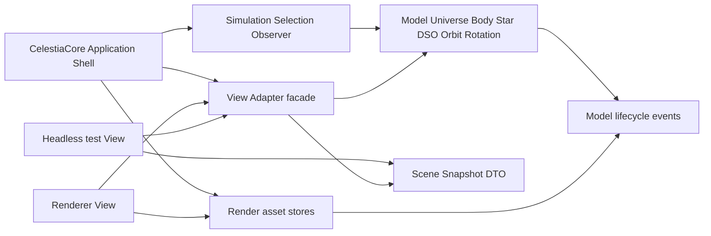

# Celestia MVC Step2 Implementation Plan

> **For agentic workers:** REQUIRED SUB-SKILL: Use superpowers:subagent-driven-development (recommended) or superpowers:executing-plans to implement this plan task-by-task. Steps use checkbox (`- [ ]`) syntax for tracking.

**Goal:** 在 Celestia 本仓库内继续完成更彻底的 MVC 解耦，使 Model 不依赖具体 Controller / View / View Adapter 实现，并用自动化测试证明同一套 Model / Simulation 可以被多种 View Adapter 消费。

**Architecture:** Step2 在 Step1 的 public header 边界收缩基础上继续下钻到实现层。核心做法是把 `BodyRenderAssets`、`StarRenderAssets`、`NebulaRenderAssets` 这类渲染资产 sidecar 从 Model 实现层移出，通过模型无关的生命周期事件、资源 sink 和 View Adapter facade 承接；再用 headless/test adapter 证明 Controller / View 可替换。

**Tech Stack:** C++17、CMake、MSVC BuildTools CMake/CTest、doctest、Typora-compatible Mermaid `graph` diagrams、现有 Celestia SDL runtime smoke。

---

## 1. 统一口径

从本方案开始：

- **Step1**：Celestia 本仓库内的 MVC 边界收缩，重点是 Model / Controller public header 不再暴露主要 View 资源。
- **Step2**：Celestia 本仓库内的更彻底 MVC 解耦，重点是 Model 实现层也不再依赖具体 View Adapter / 渲染资产实现，并证明 Controller / View 可替换。
- **后续 Planet_SIM clean-room 迁移**：不再称为 Step2，改称后续迁移阶段。该阶段只能消费 Step1 / Step2 形成的边界、语义和测试证据。

## 2. 当前阻塞证据

Step1 后，public header 已明显收缩，但 Step2 仍需处理以下实现层耦合：

```text
src/celengine/body.cpp: Body::~Body / Body::setDefaultProperties / visibility helpers still call BodyRenderAssets
src/celengine/star.cpp: StarDetailsManager / StarDetails lifecycle still calls StarRenderAssets
src/celengine/star.h: Star still friends StarRenderAssets
src/celengine/nebula.cpp: Nebula lifecycle and mesh loading still calls NebulaRenderAssets and includes render resources
src/celestia/celestiacore.cpp: CelestiaCore still directly wires Renderer, SelectionPicker and render asset helpers
```

当前可用的解耦先例是 `BodyFeaturesManager`：它按 `Body*` 管理非核心字段，不把所有附属状态塞进 `Body` 本体。Step2 应沿用“外部 sidecar / lifecycle / adapter”方向，但 View 资产 sidecar 不能再由 Model 具体类直接调用。

## 3. Step2 验收标准

Step2 只有同时满足以下条件才算完成：

1. `src/celengine/body.cpp`、`src/celengine/star.cpp`、`src/celengine/nebula.cpp` 不再出现 `BodyRenderAssets::`、`StarRenderAssets::`、`NebulaRenderAssets::`。
2. `src/celengine/body.cpp`、`src/celengine/star.cpp`、`src/celengine/nebula.cpp` 不再 include `bodyrenderassets.h`、`starrenderassets.h`、`nebularenderassets.h`、`meshmanager.h`、`render.h`。
3. `src/celengine/star.h` 不再 forward declare 或 friend `StarRenderAssets`。
4. `DeepSkyObject` / `Nebula` 的语义加载和 mesh / geometry 资产加载分离；DSO Model 不再接收 `GeometryPaths`。
5. `SelectionPicker` 可以通过几何 provider / pick context 消费可替换的拾取资源，而不是只绑定单一 `GeometryManager` 入口。
6. 新增至少一个 headless/test View Adapter，用自动化测试证明它能消费同一套 Model / Simulation 输出，不需要 `Renderer`。
7. `build-mvc-baseline-rel` 和 `build-mvc-sdl-rel` 全量构建、`ctest` 和 SDL runtime smoke 均通过。

验收检查命令：

```powershell
rg -n "BodyRenderAssets::|StarRenderAssets::|NebulaRenderAssets::" src\celengine\body.cpp src\celengine\star.cpp src\celengine\nebula.cpp
rg -n "bodyrenderassets.h|starrenderassets.h|nebularenderassets.h|meshmanager.h|render.h" src\celengine\body.cpp src\celengine\star.cpp src\celengine\nebula.cpp
rg -n "StarRenderAssets" src\celengine\star.h
```

以上命令在 Step2 完成时必须无输出。

## 4. 目标依赖图



Model 允许发出模型语义生命周期事件，但不能知道 `Renderer`、`GeometryManager`、`TextureHandle`、`GeometryHandle` 或具体 `*RenderAssets`。

## 5. 文件结构规划

### 新增文件

```text
src/celengine/bodylifecycle.h
src/celengine/bodylifecycle.cpp
src/celengine/stardetailslifecycle.h
src/celengine/stardetailslifecycle.cpp
src/celengine/nebularenderassetloader.h
src/celengine/nebularenderassetloader.cpp
src/celengine/selectiongeometryprovider.h
src/celengine/sceneviewmodel.h
src/celengine/sceneviewmodel.cpp
test/unit/mvc_step2_contract_test.cpp
```

### 修改文件

```text
src/celengine/CMakeLists.txt
test/unit/CMakeLists.txt
src/celengine/body.cpp
src/celengine/body.h
src/celengine/bodyrenderassets.cpp
src/celengine/bodyrenderassets.h
src/celengine/star.cpp
src/celengine/star.h
src/celengine/starrenderassets.cpp
src/celengine/starrenderassets.h
src/celengine/nebula.cpp
src/celengine/nebula.h
src/celengine/nebularenderassets.cpp
src/celengine/nebularenderassets.h
src/celengine/deepskyobj.cpp
src/celengine/deepskyobj.h
src/celengine/dsodbbuilder.cpp
src/celengine/selectionpicker.cpp
src/celengine/selectionpicker.h
src/celestia/celestiacore.cpp
DOC/CODEX_DOC/02_设计说明/02-05-Celestia标准MVC解耦与迁移映射说明.md
DOC/CODEX_DOC/04_研制计划/14-WBS-0.14-Celestia标准MVC解耦-Step2落地方案.md
CODEX_START_HERE.md
```

## 6. 任务分解

### Task 1: 写 Step2 失败边界测试

**Files:**
- Create: `test/unit/mvc_step2_contract_test.cpp`
- Modify: `test/unit/CMakeLists.txt`

- [ ] **Step 1: 新增失败测试**

新增测试文件内容：

```cpp
#include <doctest.h>

#include <filesystem>
#include <fstream>
#include <sstream>
#include <string>

namespace
{

std::filesystem::path sourceRoot()
{
    return std::filesystem::path(__FILE__).parent_path().parent_path().parent_path();
}

std::string readSourceFile(const std::filesystem::path& relativePath)
{
    std::ifstream input(sourceRoot() / relativePath);
    REQUIRE(input.good());
    std::ostringstream buffer;
    buffer << input.rdbuf();
    return buffer.str();
}

bool contains(const std::string& text, const std::string& token)
{
    return text.find(token) != std::string::npos;
}

} // end unnamed namespace

TEST_SUITE_BEGIN("MVC Step2 contract");

TEST_CASE("model implementation files do not call concrete render asset sidecars")
{
    const auto body = readSourceFile("src/celengine/body.cpp");
    const auto star = readSourceFile("src/celengine/star.cpp");
    const auto nebula = readSourceFile("src/celengine/nebula.cpp");

    CHECK_FALSE(contains(body, "BodyRenderAssets::"));
    CHECK_FALSE(contains(star, "StarRenderAssets::"));
    CHECK_FALSE(contains(nebula, "NebulaRenderAssets::"));
}

TEST_CASE("model implementation files do not include concrete view resource headers")
{
    const std::filesystem::path files[] = {
        "src/celengine/body.cpp",
        "src/celengine/star.cpp",
        "src/celengine/nebula.cpp",
    };

    for (const auto& file : files)
    {
        const auto source = readSourceFile(file);
        CHECK_FALSE(contains(source, "bodyrenderassets.h"));
        CHECK_FALSE(contains(source, "starrenderassets.h"));
        CHECK_FALSE(contains(source, "nebularenderassets.h"));
        CHECK_FALSE(contains(source, "meshmanager.h"));
        CHECK_FALSE(contains(source, "render.h"));
    }
}

TEST_CASE("star model header does not friend concrete render asset adapter")
{
    const auto starHeader = readSourceFile("src/celengine/star.h");

    CHECK_FALSE(contains(starHeader, "class StarRenderAssets"));
    CHECK_FALSE(contains(starHeader, "friend class StarRenderAssets"));
}

TEST_CASE("deep sky model API does not require geometry path resources")
{
    const auto dsoHeader = readSourceFile("src/celengine/deepskyobj.h");
    const auto nebulaHeader = readSourceFile("src/celengine/nebula.h");

    CHECK_FALSE(contains(dsoHeader, "GeometryPaths"));
    CHECK_FALSE(contains(nebulaHeader, "GeometryPaths"));
}

TEST_SUITE_END();
```

在 `test/unit/CMakeLists.txt` 的 `UNIT_TEST_SOURCES` 中加入：

```cmake
  mvc_step2_contract_test.cpp
```

- [ ] **Step 2: 运行测试确认失败**

```powershell
& 'C:\Program Files (x86)\Microsoft Visual Studio\18\BuildTools\Common7\IDE\CommonExtensions\Microsoft\CMake\CMake\bin\cmake.exe' --build build-mvc-baseline-rel --config Release
& 'C:\Program Files (x86)\Microsoft Visual Studio\18\BuildTools\Common7\IDE\CommonExtensions\Microsoft\CMake\CMake\bin\ctest.exe' --test-dir build-mvc-baseline-rel --output-on-failure -R unit
```

Expected: `MVC Step2 contract` 至少在 `BodyRenderAssets::`、`StarRenderAssets::`、`NebulaRenderAssets::`、`GeometryPaths` 上失败。

- [ ] **Step 3: Commit 红灯测试**

```powershell
git add test/unit/mvc_step2_contract_test.cpp test/unit/CMakeLists.txt
git commit -m "test: add MVC Step2 boundary contract"
```

### Task 2: Body 渲染资产从 Model 实现层外移

**Files:**
- Create: `src/celengine/bodylifecycle.h`
- Create: `src/celengine/bodylifecycle.cpp`
- Modify: `src/celengine/body.cpp`
- Modify: `src/celengine/bodyrenderassets.cpp`
- Modify: `src/celengine/bodyrenderassets.h`
- Modify: `src/celengine/solarsys.cpp`
- Modify: `src/celengine/CMakeLists.txt`
- Test: `test/unit/mvc_step2_contract_test.cpp`

- [ ] **Step 1: 定义模型生命周期事件**

`bodylifecycle.h` 只允许出现模型语义，不允许出现渲染资源类型：

```cpp
#pragma once

#include <functional>

class Body;

class BodyLifecycleEvents
{
public:
    using BodyCallback = std::function<void(const Body*)>;

    static void addDestroyedCallback(BodyCallback);
    static void addDefaultPropertiesResetCallback(BodyCallback);

    static void notifyDestroyed(const Body*);
    static void notifyDefaultPropertiesReset(const Body*);
};
```

`bodylifecycle.cpp` 用内部 `std::vector<BodyCallback>` 保存回调。这里是模型生命周期基础设施，不包含 `BodyRenderAssets`。

- [ ] **Step 2: 让 Body 只发出模型生命周期事件**

在 `body.cpp` 中移除：

```cpp
#include "bodyrenderassets.h"
```

`Body::~Body()` 改为：

```cpp
Body::~Body()
{
    BodyLifecycleEvents::notifyDestroyed(this);
    auto bodyFeaturesManager = GetBodyFeaturesManager();
    bodyFeaturesManager->removeFeatures(this);
}
```

`Body::setDefaultProperties()` 中用：

```cpp
BodyLifecycleEvents::notifyDefaultPropertiesReset(this);
```

替代 `BodyRenderAssets::reset(this)`。

- [ ] **Step 3: 让 BodyRenderAssets 注册生命周期回调**

在 `bodyrenderassets.cpp` 增加一次性注册逻辑：

```cpp
namespace
{
void ensureBodyLifecycleRegistration()
{
    static const bool registered = []()
    {
        BodyLifecycleEvents::addDestroyedCallback([](const Body* body)
        {
            BodyRenderAssets::remove(body);
        });
        BodyLifecycleEvents::addDefaultPropertiesResetCallback([](const Body* body)
        {
            BodyRenderAssets::reset(body);
        });
        return true;
    }();
    (void)registered;
}
}
```

每个 public `BodyRenderAssets` getter / setter 开头调用 `ensureBodyLifecycleRegistration()`。

- [ ] **Step 4: 验证 Body 红灯转绿**

```powershell
rg -n "BodyRenderAssets::|bodyrenderassets.h" src\celengine\body.cpp
& 'C:\Program Files (x86)\Microsoft Visual Studio\18\BuildTools\Common7\IDE\CommonExtensions\Microsoft\CMake\CMake\bin\cmake.exe' --build build-mvc-baseline-rel --config Release
& 'C:\Program Files (x86)\Microsoft Visual Studio\18\BuildTools\Common7\IDE\CommonExtensions\Microsoft\CMake\CMake\bin\ctest.exe' --test-dir build-mvc-baseline-rel --output-on-failure -R unit
```

Expected: `rg` 无输出；Step2 测试中 Body 相关断言通过。

- [ ] **Step 5: Commit Body 解耦**

```powershell
git add src/celengine/bodylifecycle.* src/celengine/body.cpp src/celengine/bodyrenderassets.* src/celengine/CMakeLists.txt
git commit -m "refactor: decouple body model from render assets"
```

### Task 3: StarDetails 渲染资产从 Model 实现层外移

**Files:**
- Create: `src/celengine/stardetailslifecycle.h`
- Create: `src/celengine/stardetailslifecycle.cpp`
- Modify: `src/celengine/star.cpp`
- Modify: `src/celengine/star.h`
- Modify: `src/celengine/starrenderassets.cpp`
- Modify: `src/celengine/starrenderassets.h`
- Modify: `src/celengine/CMakeLists.txt`
- Test: `test/unit/mvc_step2_contract_test.cpp`

- [ ] **Step 1: 定义 StarDetails 生命周期和默认类型事件**

接口只传递模型语义：

```cpp
#pragma once

#include <functional>

#include "stellarclass.h"

class StarDetails;

class StarDetailsLifecycleEvents
{
public:
    using DestroyedCallback = std::function<void(const StarDetails*)>;
    using CloneCallback = std::function<void(const StarDetails*, const StarDetails*)>;
    using MergeCallback = std::function<void(StarDetails*, const StarDetails*)>;
    using SpectralDefaultCallback = std::function<void(const StarDetails*, StellarClass::SpectralClass)>;
    using PlainDefaultCallback = std::function<void(const StarDetails*)>;

    static void addDestroyedCallback(DestroyedCallback);
    static void addCloneCallback(CloneCallback);
    static void addCopyCallback(CloneCallback);
    static void addCopyTextureIfUnsetCallback(MergeCallback);
    static void addNormalStarDefaultCallback(SpectralDefaultCallback);
    static void addWhiteDwarfDefaultCallback(PlainDefaultCallback);
    static void addNeutronStarDefaultCallback(PlainDefaultCallback);

    static void notifyDestroyed(const StarDetails*);
    static void notifyCloned(const StarDetails*, const StarDetails*);
    static void notifyCopied(const StarDetails*, const StarDetails*);
    static void notifyCopyTextureIfUnset(StarDetails*, const StarDetails*);
    static void notifyNormalStarDefault(const StarDetails*, StellarClass::SpectralClass);
    static void notifyWhiteDwarfDefault(const StarDetails*);
    static void notifyNeutronStarDefault(const StarDetails*);
};
```

- [ ] **Step 2: 从 `star.h` 移除 StarRenderAssets 友元**

删除：

```cpp
class StarRenderAssets;
friend class StarRenderAssets;
```

如果 `StarRenderAssets` 仍需要访问 `StarDetails` 私有字段，改为在 `StarDetailsLifecycleEvents` 回调中接收必要语义，或增加不含渲染类型的 package-level access function，不能重新 friend 具体 View Adapter。

- [ ] **Step 3: 用生命周期事件替代 star.cpp 中的 StarRenderAssets 调用**

替换点：

```text
StarDetailsManager::getNormalStarDetails -> notifyNormalStarDefault
StarDetailsManager::createWhiteDwarfDetails -> notifyWhiteDwarfDefault
StarDetailsManager::createNeutronStarDetails -> notifyNeutronStarDefault
StarDetails::~StarDetails -> notifyDestroyed
StarDetails::clone -> notifyCloned
StarDetails::mergeFromStandard -> notifyCopied / notifyCopyTextureIfUnset
```

- [ ] **Step 4: StarRenderAssets 注册回调**

`starrenderassets.cpp` 注册上述生命周期事件，并保持原有 `textureFor`、`cloneAssets`、`copyAssets` 语义由 View Adapter 层执行。

- [ ] **Step 5: 验证 Star 红灯转绿**

```powershell
rg -n "StarRenderAssets::|starrenderassets.h" src\celengine\star.cpp
rg -n "StarRenderAssets" src\celengine\star.h
& 'C:\Program Files (x86)\Microsoft Visual Studio\18\BuildTools\Common7\IDE\CommonExtensions\Microsoft\CMake\CMake\bin\cmake.exe' --build build-mvc-baseline-rel --config Release
& 'C:\Program Files (x86)\Microsoft Visual Studio\18\BuildTools\Common7\IDE\CommonExtensions\Microsoft\CMake\CMake\bin\ctest.exe' --test-dir build-mvc-baseline-rel --output-on-failure -R unit
```

Expected: 两条 `rg` 均无输出；Star Step2 断言通过。

- [ ] **Step 6: Commit Star 解耦**

```powershell
git add src/celengine/stardetailslifecycle.* src/celengine/star.* src/celengine/starrenderassets.* src/celengine/CMakeLists.txt
git commit -m "refactor: decouple star details from render assets"
```

### Task 4: DSO / Nebula 语义加载与 mesh 资产加载分离

**Files:**
- Create: `src/celengine/nebularenderassetloader.h`
- Create: `src/celengine/nebularenderassetloader.cpp`
- Modify: `src/celengine/deepskyobj.h`
- Modify: `src/celengine/deepskyobj.cpp`
- Modify: `src/celengine/nebula.h`
- Modify: `src/celengine/nebula.cpp`
- Modify: `src/celengine/dsodbbuilder.cpp`
- Modify: `src/celengine/CMakeLists.txt`
- Test: `test/unit/mvc_step2_contract_test.cpp`

- [ ] **Step 1: 收缩 DeepSkyObject load API**

`DeepSkyObject::load` 和 `loadDetails` 去掉 `GeometryPaths&` 参数，只处理名称、位置、朝向、半径、可见性、类型等 Model 语义。

目标签名：

```cpp
bool load(const celestia::util::AssociativeArray*,
          const std::filesystem::path& resPath,
          std::string_view name,
          celestia::engine::UrlManager& urlManager);

virtual bool loadDetails(const celestia::util::AssociativeArray*,
                         const std::filesystem::path&) = 0;
```

- [ ] **Step 2: Nebula 只加载语义类型**

`nebula.cpp` 移除：

```cpp
#include "meshmanager.h"
#include "nebularenderassets.h"
#include "rendcontext.h"
#include "render.h"
```

`Nebula::loadDetails` 只处理 `Type` 字段。

- [ ] **Step 3: 新增 NebulaRenderAssetLoader**

`nebularenderassetloader.h`：

```cpp
#pragma once

#include <filesystem>

class Nebula;

namespace celestia::engine
{
class GeometryPaths;
}
namespace celestia::util
{
class AssociativeArray;
}

class NebulaRenderAssetLoader
{
public:
    static bool load(Nebula&,
                     const celestia::util::AssociativeArray*,
                     const std::filesystem::path&,
                     celestia::engine::GeometryPaths&);
};
```

`nebularenderassetloader.cpp` 负责读取 `Mesh` 字段、调用 `geometryPaths.getHandle` 和 `NebulaRenderAssets::setGeometry`。

- [ ] **Step 4: DSODatabaseBuilder 编排语义加载和资产加载**

在 `dsodbbuilder.cpp` 中：

```cpp
if (obj == nullptr || !obj->load(objParams, resourcePath, objName, *urlManager))
{
    GetLogger()->warn("Bad Deep Sky Object definition--will continue parsing file.\n");
    continue;
}

if (auto* nebula = dynamic_cast<Nebula*>(obj.get());
    nebula != nullptr && !NebulaRenderAssetLoader::load(*nebula, objParams, resourcePath, *geometryPaths))
{
    GetLogger()->warn("Bad Nebula render asset definition--will continue parsing file.\n");
    continue;
}
```

- [ ] **Step 5: 验证 DSO / Nebula 红灯转绿**

```powershell
rg -n "NebulaRenderAssets::|nebularenderassets.h|meshmanager.h|render.h|rendcontext.h|GeometryPaths" src\celengine\nebula.cpp src\celengine\nebula.h src\celengine\deepskyobj.h
& 'C:\Program Files (x86)\Microsoft Visual Studio\18\BuildTools\Common7\IDE\CommonExtensions\Microsoft\CMake\CMake\bin\cmake.exe' --build build-mvc-baseline-rel --config Release
& 'C:\Program Files (x86)\Microsoft Visual Studio\18\BuildTools\Common7\IDE\CommonExtensions\Microsoft\CMake\CMake\bin\ctest.exe' --test-dir build-mvc-baseline-rel --output-on-failure -R unit
```

Expected: `rg` 无输出；DSO / Nebula Step2 断言通过。

- [ ] **Step 6: Commit DSO 解耦**

```powershell
git add src/celengine/nebularenderassetloader.* src/celengine/deepskyobj.* src/celengine/nebula.* src/celengine/dsodbbuilder.cpp src/celengine/CMakeLists.txt
git commit -m "refactor: split nebula semantic and render asset loading"
```

### Task 5: SelectionPicker 改为可替换几何 provider

**Files:**
- Create: `src/celengine/selectiongeometryprovider.h`
- Modify: `src/celengine/selectionpicker.h`
- Modify: `src/celengine/selectionpicker.cpp`
- Modify: `src/celestia/celestiacore.cpp`
- Modify: `src/celengine/CMakeLists.txt`
- Test: `test/unit/mvc_step2_contract_test.cpp`

- [ ] **Step 1: 新增几何 provider 接口**

`selectiongeometryprovider.h`：

```cpp
#pragma once

#include <Eigen/Geometry>

#include "meshmanager.h"

class Body;

class SelectionGeometryProvider
{
public:
    virtual ~SelectionGeometryProvider() = default;

    virtual celestia::engine::GeometryHandle geometryFor(const Body*) const = 0;
    virtual Eigen::Quaternionf geometryOrientationFor(const Body*) const = 0;
    virtual float geometryScaleFor(const Body*) const = 0;
    virtual const celestia::engine::Geometry* findGeometry(celestia::engine::GeometryHandle) const = 0;
};
```

这是 View Adapter 接口，不属于 Model。`SelectionPicker` 依赖该接口，具体实现可以由 `GeometryManager + BodyRenderAssets`、headless fake provider 或未来 UE provider 提供。

- [ ] **Step 2: 修改 SelectionPicker 构造函数**

目标：

```cpp
SelectionPicker(const Universe&, const SelectionGeometryProvider&);
```

`selectionpicker.cpp` 内不再直接持有 `GeometryManager&`。

- [ ] **Step 3: 在 CelestiaCore 建立默认 provider**

在 `celestiacore.cpp` 增加局部 provider 或私有小类：

```cpp
class CelestiaSelectionGeometryProvider final : public SelectionGeometryProvider
{
public:
    explicit CelestiaSelectionGeometryProvider(celestia::engine::GeometryManager& geometryManager);
    celestia::engine::GeometryHandle geometryFor(const Body*) const override;
    Eigen::Quaternionf geometryOrientationFor(const Body*) const override;
    float geometryScaleFor(const Body*) const override;
    const celestia::engine::Geometry* findGeometry(celestia::engine::GeometryHandle) const override;
};
```

实现可以继续使用 `BodyRenderAssets` 和 `GeometryManager`，但耦合留在 View Adapter / Application Shell，不回到 Model。

- [ ] **Step 4: 验证 provider 替换点**

```powershell
rg -n "GeometryManager&|GeometryManager\\*" src\celengine\selectionpicker.h src\celengine\selectionpicker.cpp
& 'C:\Program Files (x86)\Microsoft Visual Studio\18\BuildTools\Common7\IDE\CommonExtensions\Microsoft\CMake\CMake\bin\cmake.exe' --build build-mvc-baseline-rel --config Release
& 'C:\Program Files (x86)\Microsoft Visual Studio\18\BuildTools\Common7\IDE\CommonExtensions\Microsoft\CMake\CMake\bin\ctest.exe' --test-dir build-mvc-baseline-rel --output-on-failure -R unit
```

Expected: `selectionpicker.h` 不直接暴露 `GeometryManager`；测试通过。

- [ ] **Step 5: Commit picker provider**

```powershell
git add src/celengine/selectiongeometryprovider.h src/celengine/selectionpicker.* src/celestia/celestiacore.cpp src/celengine/CMakeLists.txt
git commit -m "refactor: inject selection geometry provider"
```

### Task 6: 增加 headless View Adapter 证明多 View 消费

**Files:**
- Create: `src/celengine/sceneviewmodel.h`
- Create: `src/celengine/sceneviewmodel.cpp`
- Modify: `src/celengine/CMakeLists.txt`
- Modify: `test/unit/mvc_step2_contract_test.cpp`

- [ ] **Step 1: 定义 View 可消费快照 DTO**

`sceneviewmodel.h`：

```cpp
#pragma once

#include <vector>

#include <Eigen/Core>

#include "selection.h"

struct SceneSelectionSnapshot
{
    Selection selection;
    Eigen::Vector3d positionKm;
    bool visible{ false };
    bool clickable{ false };
};

struct SceneViewSnapshot
{
    double time{ 0.0 };
    std::vector<SceneSelectionSnapshot> selections;
};

class Simulation;

class SceneViewModel
{
public:
    static SceneViewSnapshot buildSelectionSnapshot(const Simulation&);
};
```

`SceneViewModel` 只读取 `Simulation`、`Selection`、Model 查询语义，不依赖 `Renderer`、`GeometryManager`、`TextureManager`。

- [ ] **Step 2: 加入源码扫描测试**

在 `mvc_step2_contract_test.cpp` 增加：

```cpp
TEST_CASE("scene view model does not depend on concrete renderer")
{
    const auto header = readSourceFile("src/celengine/sceneviewmodel.h");
    const auto source = readSourceFile("src/celengine/sceneviewmodel.cpp");

    CHECK_FALSE(contains(header, "Renderer"));
    CHECK_FALSE(contains(header, "GeometryManager"));
    CHECK_FALSE(contains(header, "TextureManager"));
    CHECK_FALSE(contains(source, "Renderer"));
    CHECK_FALSE(contains(source, "GeometryManager"));
    CHECK_FALSE(contains(source, "TextureManager"));
}
```

- [ ] **Step 3: 验证 headless 消费存在**

```powershell
& 'C:\Program Files (x86)\Microsoft Visual Studio\18\BuildTools\Common7\IDE\CommonExtensions\Microsoft\CMake\CMake\bin\cmake.exe' --build build-mvc-baseline-rel --config Release
& 'C:\Program Files (x86)\Microsoft Visual Studio\18\BuildTools\Common7\IDE\CommonExtensions\Microsoft\CMake\CMake\bin\ctest.exe' --test-dir build-mvc-baseline-rel --output-on-failure -R unit
```

Expected: unit tests pass；`SceneViewModel` 证明非 Renderer View 可以消费 Controller / Model 输出。

- [ ] **Step 4: Commit headless proof**

```powershell
git add src/celengine/sceneviewmodel.* src/celengine/CMakeLists.txt test/unit/mvc_step2_contract_test.cpp
git commit -m "test: prove headless MVC view consumption"
```

### Task 7: 全量验证与文档闭环

**Files:**
- Modify: `DOC/CODEX_DOC/02_设计说明/02-05-Celestia标准MVC解耦与迁移映射说明.md`
- Modify: `DOC/CODEX_DOC/04_研制计划/14-WBS-0.14-Celestia标准MVC解耦-Step2落地方案.md`
- Modify: `CODEX_START_HERE.md`

- [ ] **Step 1: 更新正式设计说明**

把 `02-05` 中所有“Step2 = Planet_SIM 迁移”的表述改为：

```text
Step2 是 Celestia 本仓库内的更彻底 MVC 解耦；后续 Planet_SIM clean-room 迁移基于 Step2 形成的 Core / Adapter 边界另行启动。
```

- [ ] **Step 2: 更新 handoff 文档**

`CODEX_START_HERE.md` 中 `Current Phase Boundary` 改为：

```text
Step 2 is deeper MVC decoupling inside this Celestia repository.
Planet_SIM clean-room migration is a later independent migration phase.
```

- [ ] **Step 3: 跑完整验证**

```powershell
& 'C:\Program Files (x86)\Microsoft Visual Studio\18\BuildTools\Common7\IDE\CommonExtensions\Microsoft\CMake\CMake\bin\cmake.exe' --build build-mvc-baseline-rel --config Release
& 'C:\Program Files (x86)\Microsoft Visual Studio\18\BuildTools\Common7\IDE\CommonExtensions\Microsoft\CMake\CMake\bin\ctest.exe' --test-dir build-mvc-baseline-rel --output-on-failure

& 'C:\Program Files (x86)\Microsoft Visual Studio\18\BuildTools\Common7\IDE\CommonExtensions\Microsoft\CMake\CMake\bin\cmake.exe' --build build-mvc-sdl-rel --config Release
& 'C:\Program Files (x86)\Microsoft Visual Studio\18\BuildTools\Common7\IDE\CommonExtensions\Microsoft\CMake\CMake\bin\ctest.exe' --test-dir build-mvc-sdl-rel --output-on-failure
```

Expected:

```text
build-mvc-baseline-rel: build passed
build-mvc-baseline-rel: 42/42 or updated full test count passed
build-mvc-sdl-rel: build passed
build-mvc-sdl-rel: 42/42 or updated full test count passed
```

- [ ] **Step 4: SDL runtime smoke**

使用现有最小运行目录或重新准备 `build-mvc-sdl-rel/run-minimal`，启动：

```powershell
$env:CELESTIA_DATA_DIR=(Resolve-Path 'build-mvc-sdl-rel\run-minimal').Path
Start-Process -FilePath (Resolve-Path 'build-mvc-sdl-rel\src\celestia\sdl\celestia-sdl.exe').Path -WindowStyle Hidden
```

Expected: 进程越过配置和 catalog 加载，进入 SDL run loop。验证后结束进程。

- [ ] **Step 5: Commit 文档与验收记录**

```powershell
git add DOC/CODEX_DOC CODEX_START_HERE.md
git commit -m "docs: record MVC Step2 completion evidence"
```

## 7. 风险与控制

| 风险 | 影响 | 控制方式 |
| --- | --- | --- |
| 静态 sidecar 注册顺序错误 | 资产清理或默认纹理初始化丢失 | 生命周期注册函数在每个 public getter / setter 中调用，避免静态初始化顺序依赖 |
| StarDetails copy-on-write 行为回归 | 星体默认纹理或 clone 资产丢失 | Task 3 保留 clone / copy / copyTextureIfUnset 回调，并用现有 unit + runtime smoke 验证 |
| DSO mesh 加载分离导致 Nebula mesh 丢失 | Nebula 渲染缺网格 | Task 4 保持 DSODatabaseBuilder 在语义加载成功后立即执行 asset loader |
| SelectionPicker provider 抽象过宽 | 引入新复杂度 | provider 只暴露拾取所需 geometry handle、orientation、scale 和 findGeometry |
| 只完成源码扫描但没有真实可替换 View 证明 | Step2 验收不足 | Task 6 必须新增 headless snapshot consumer，证明非 Renderer View 可消费 Controller / Model 输出 |

## 8. 推荐执行策略

Step2 不建议一次性大提交。推荐按以下分支和提交节奏执行：

```text
Branch: codex/celestia-mvc-step2

Commit 1: test: add MVC Step2 boundary contract
Commit 2: refactor: decouple body model from render assets
Commit 3: refactor: decouple star details from render assets
Commit 4: refactor: split nebula semantic and render asset loading
Commit 5: refactor: inject selection geometry provider
Commit 6: test: prove headless MVC view consumption
Commit 7: docs: record MVC Step2 completion evidence
```

每个提交都必须至少运行：

```powershell
& 'C:\Program Files (x86)\Microsoft Visual Studio\18\BuildTools\Common7\IDE\CommonExtensions\Microsoft\CMake\CMake\bin\cmake.exe' --build build-mvc-baseline-rel --config Release
& 'C:\Program Files (x86)\Microsoft Visual Studio\18\BuildTools\Common7\IDE\CommonExtensions\Microsoft\CMake\CMake\bin\ctest.exe' --test-dir build-mvc-baseline-rel --output-on-failure -R unit
```

最后一个提交必须跑 baseline + SDL 全量构建、全量 `ctest` 和 runtime smoke。
