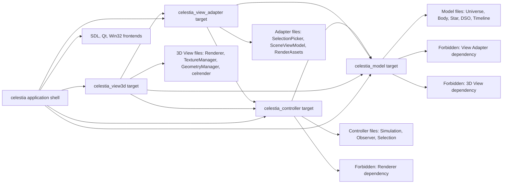
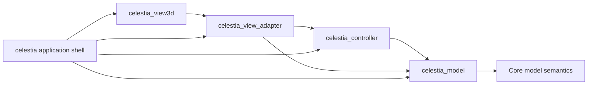

# Celestia MVC Step3 Physical Modularization Implementation Plan

> **For agentic workers:** REQUIRED SUB-SKILL: Use superpowers:subagent-driven-development (recommended) or superpowers:executing-plans to implement this plan task-by-task. Steps use checkbox (`- [ ]`) syntax for tracking.

**Goal:** 在 Step1 / Step2 已完成进程内 MVC 逻辑解耦的基础上，用 CMake target、边界测试和小步目录重组固化 Model / Controller / View Adapter / 3D View / Application Shell 的物理边界。

**Architecture:** Step3 不先做大规模搬目录，而是先让构建系统表达架构边界：Model target 不能依赖 View / Adapter，Controller target 只能依赖 Model，View Adapter target 可以消费 Model / Controller，3D View target 依赖 Adapter，Application Shell 负责最终编排。只有在 target 依赖稳定、双构建和全量测试通过后，再执行小范围 `git mv` 目录重组。

**Tech Stack:** C++17、CMake OBJECT libraries、MSVC BuildTools CMake/CTest、doctest、Typora-compatible Mermaid `graph` diagrams、现有 Celestia SDL runtime smoke。

---

## 0. Step3 执行结果

执行分支：`codex/celestia-mvc-step3`

验收结论：

- CMake MVC target split: passed
- Step1 / Step2 / Step3 boundary tests: passed
- `build-mvc-baseline-rel` full build: passed
- `build-mvc-baseline-rel` full `ctest`: 53/53 passed
- `build-mvc-sdl-rel` full build: passed
- `build-mvc-sdl-rel` full `ctest`: 53/53 passed
- SDL runtime smoke: passed with `build-mvc-sdl-rel/run-full`

已落地内容：

- `src/celengine/CMakeLists.txt` 拆出 `CELESTIA_MODEL_SOURCES`、`CELESTIA_CONTROLLER_SOURCES`、`CELESTIA_VIEW_ADAPTER_SOURCES`、`CELESTIA_VIEW3D_SOURCES`、`CELESTIA_LEGACY_ENGINE_SOURCES`。
- `src/celengine/CMakeLists.txt` 新增 `celestia_model`、`celestia_controller`、`celestia_view_adapter`、`celestia_view3d` object targets。
- `src/celestia/CMakeLists.txt` 在 `celestia` application shell 汇总层显式聚合上述 object targets。
- `test/unit/mvc_step3_contract_test.cpp` 检查 source bucket、target 存在性、target 依赖方向、Model / Controller CMake 归属和实现文件边界。

边界说明：

- Step3 是进程内 MVC 的物理构建边界固化，不是 M / C / V 独立 OS 进程拆分。
- `solarsys.*`、`stardbbuilder.*`、`dsodbbuilder.*` 仍承担模型加载与渲染资源绑定的混合职责，因此归入 `celestia_view_adapter`，不放入纯 `celestia_model` target。
- `galaxy.*`、`globular.*`、`marker.*` 仍有渲染状态或渲染方法，因此暂留 `CELESTIA_LEGACY_ENGINE_SOURCES`，避免污染纯 Model target。
- 目录 `git mv` 重组未在 Step3 阶段执行；后续已由 Step4 / WBS-0.16 单独承接并落地。

## 1. 统一口径

从本方案开始：

- **Step1**：Celestia 本仓库内的 MVC public header 边界收缩。
- **Step2**：Celestia 本仓库内的 Model 实现层与具体 View Adapter / 渲染资产解耦。
- **Step3**：Celestia 本仓库内的物理模块化与构建边界固化，重点是 CMake target 依赖方向、目录落点和自动化防回归测试。
- **后续进程级 MVC**：M / C / V 独立 OS 进程、IPC / RPC / 消息总线协议，不属于 Step3。
- **后续 Planet_SIM clean-room 迁移**：消费 Step1 / Step2 / Step3 形成的边界和证据，仍是独立迁移阶段。

## 2. 当前事实基础

当前 Step2 后的代码边界已经成立，但物理结构仍然混合：

```text
src/celengine/
  Model: body, star, universe, deepskyobj, orbit/frame/timeline/catalog 等
  Controller: simulation, observer, selection 等
  View Adapter: selectionpicker, render assets, lifecycle callbacks, sceneviewmodel 等
  3D View / View resources: render, texmanager, meshmanager, shader, framebuffer 等

src/celrender/
  3D renderer helper implementations

src/celestia/
  CelestiaCore application shell
  sdl / qt / win32 frontend
```

当前 CMake 关键事实：

```text
src/celengine/CMakeLists.txt: add_library(celengine OBJECT ${CELENGINE_SOURCES})
src/celrender/CMakeLists.txt: add_library(celrender OBJECT ${CELRENDER_SOURCES})
src/celestia/CMakeLists.txt: celestia shared library aggregates $<TARGET_OBJECTS:celengine> and $<TARGET_OBJECTS:celrender>
```

Step3 的目标不是用目录名“证明”架构，而是让构建图和测试证明依赖方向不能倒退。

## 3. Step3 验收标准

Step3 只有同时满足以下条件才算完成：

1. 新增 `test/unit/mvc_step3_contract_test.cpp`，用源码扫描和 CMake 文件扫描证明物理边界。
2. `src/celengine/CMakeLists.txt` 至少拆出可审查 source 分组：Model、Controller、View Adapter、View Resource / Legacy。
3. 构建系统至少形成以下可独立审查的 target 或 source bucket：

```text
celestia_model
celestia_controller
celestia_view_adapter
celestia_view3d
celestia_app_shell 或现有 celestia application-shell 汇总层
```

4. 依赖方向满足：

```text
celestia_model 不依赖 celestia_controller / celestia_view_adapter / celestia_view3d
celestia_controller 只允许依赖 celestia_model
celestia_view_adapter 可以依赖 celestia_model / celestia_controller
celestia_view3d 可以依赖 celestia_view_adapter / celestia_model / celestia_controller
celestia_app_shell 可以依赖上述全部模块并编排前端
```

5. Model / Controller 的边界测试不能只查 public header，也要检查实现文件和 CMake target 归属。
6. 如果执行目录重组，必须用 `git mv` 小步移动，并保持 Step1 / Step2 边界测试仍通过。
7. `build-mvc-baseline-rel` 和 `build-mvc-sdl-rel` 全量构建、全量 `ctest` 和 SDL runtime smoke 均通过。

## 4. 目标依赖图



## 5. 文件结构规划

### 新增文件

```text
test/unit/mvc_step3_contract_test.cpp
DOC/CODEX_DOC/04_研制计划/15-WBS-0.15-Celestia标准MVC解耦-Step3物理模块化与构建边界固化方案.md
```

### 修改文件

```text
src/celengine/CMakeLists.txt
src/celrender/CMakeLists.txt
src/celestia/CMakeLists.txt
test/unit/CMakeLists.txt
CODEX_START_HERE.md
DOC/CODEX_DOC/02_设计说明/02-05-Celestia标准MVC解耦与迁移映射说明.md
```

### 仅在 Task 8 执行的可选目录移动

```text
src/celengine/model/
src/celengine/controller/
src/celengine/adapter/
src/celrender/view3d/
```

Task 8 必须在 Task 1-7 稳定后再执行。若 Task 1-7 已经能通过 CMake target 固化边界，Task 8 可作为后续小版本单独执行。

## 6. 任务分解

### Task 1: 写 Step3 物理边界失败测试

**Files:**
- Create: `test/unit/mvc_step3_contract_test.cpp`
- Modify: `test/unit/CMakeLists.txt`

- [ ] **Step 1: 新增物理边界测试文件**

创建 `test/unit/mvc_step3_contract_test.cpp`：

```cpp
#include <doctest.h>

#include <filesystem>
#include <fstream>
#include <sstream>
#include <string>
#include <string_view>

namespace
{

std::filesystem::path sourceRoot()
{
    return std::filesystem::path(__FILE__).parent_path().parent_path().parent_path();
}

std::string readSourceFile(const std::filesystem::path& relativePath)
{
    std::ifstream input(sourceRoot() / relativePath);
    REQUIRE(input.good());

    std::ostringstream buffer;
    buffer << input.rdbuf();
    return buffer.str();
}

bool contains(std::string_view text, std::string_view token)
{
    return text.find(token) != std::string_view::npos;
}

void checkNoToken(const std::string& source, std::string_view token)
{
    CAPTURE(token);
    CHECK_FALSE(contains(source, token));
}

} // end unnamed namespace

TEST_SUITE_BEGIN("MVC Step3 physical contract");

TEST_CASE("celengine CMake defines MVC source ownership buckets")
{
    const auto cmake = readSourceFile("src/celengine/CMakeLists.txt");

    CHECK(contains(cmake, "CELESTIA_MODEL_SOURCES"));
    CHECK(contains(cmake, "CELESTIA_CONTROLLER_SOURCES"));
    CHECK(contains(cmake, "CELESTIA_VIEW_ADAPTER_SOURCES"));
    CHECK(contains(cmake, "CELESTIA_VIEW_RESOURCE_SOURCES"));
}

TEST_CASE("CMake exposes physical MVC targets")
{
    const auto engineCmake = readSourceFile("src/celengine/CMakeLists.txt");
    const auto renderCmake = readSourceFile("src/celrender/CMakeLists.txt");
    const auto appCmake = readSourceFile("src/celestia/CMakeLists.txt");

    CHECK(contains(engineCmake, "add_library(celestia_model OBJECT"));
    CHECK(contains(engineCmake, "add_library(celestia_controller OBJECT"));
    CHECK(contains(engineCmake, "add_library(celestia_view_adapter OBJECT"));
    CHECK(contains(renderCmake, "add_library(celestia_view3d OBJECT"));
    CHECK(contains(appCmake, "$<TARGET_OBJECTS:celestia_model>"));
    CHECK(contains(appCmake, "$<TARGET_OBJECTS:celestia_controller>"));
    CHECK(contains(appCmake, "$<TARGET_OBJECTS:celestia_view_adapter>"));
    CHECK(contains(appCmake, "$<TARGET_OBJECTS:celestia_view3d>"));
}

TEST_CASE("model target does not contain view adapter or view resource files")
{
    const auto cmake = readSourceFile("src/celengine/CMakeLists.txt");
    const auto modelStart = cmake.find("set(CELESTIA_MODEL_SOURCES");
    REQUIRE(modelStart != std::string::npos);
    const auto modelEnd = cmake.find("set(CELESTIA_CONTROLLER_SOURCES", modelStart);
    REQUIRE(modelEnd != std::string::npos);
    const auto modelSection = cmake.substr(modelStart, modelEnd - modelStart);

    checkNoToken(modelSection, "selectionpicker");
    checkNoToken(modelSection, "bodyrenderassets");
    checkNoToken(modelSection, "starrenderassets");
    checkNoToken(modelSection, "nebularenderassets");
    checkNoToken(modelSection, "render.cpp");
    checkNoToken(modelSection, "texmanager");
    checkNoToken(modelSection, "meshmanager");
    checkNoToken(modelSection, "framebuffer");
    checkNoToken(modelSection, "glshader");
}

TEST_CASE("controller target does not contain renderer or view adapter files")
{
    const auto cmake = readSourceFile("src/celengine/CMakeLists.txt");
    const auto controllerStart = cmake.find("set(CELESTIA_CONTROLLER_SOURCES");
    REQUIRE(controllerStart != std::string::npos);
    const auto controllerEnd = cmake.find("set(CELESTIA_VIEW_ADAPTER_SOURCES", controllerStart);
    REQUIRE(controllerEnd != std::string::npos);
    const auto controllerSection = cmake.substr(controllerStart, controllerEnd - controllerStart);

    checkNoToken(controllerSection, "selectionpicker");
    checkNoToken(controllerSection, "render.cpp");
    checkNoToken(controllerSection, "render.h");
    checkNoToken(controllerSection, "texmanager");
    checkNoToken(controllerSection, "meshmanager");
    checkNoToken(controllerSection, "bodyrenderassets");
    checkNoToken(controllerSection, "starrenderassets");
    checkNoToken(controllerSection, "nebularenderassets");
}

TEST_SUITE_END();
```

- [ ] **Step 2: 注册测试**

在 `test/unit/CMakeLists.txt` 的 `UNIT_TEST_SOURCES` 中加入：

```cmake
  mvc_step3_contract_test.cpp
```

- [ ] **Step 3: 运行测试确认失败**

```powershell
& 'C:\Program Files (x86)\Microsoft Visual Studio\18\BuildTools\Common7\IDE\CommonExtensions\Microsoft\CMake\CMake\bin\cmake.exe' --build build-mvc-baseline-rel --config Release
& 'C:\Program Files (x86)\Microsoft Visual Studio\18\BuildTools\Common7\IDE\CommonExtensions\Microsoft\CMake\CMake\bin\ctest.exe' --test-dir build-mvc-baseline-rel --output-on-failure
```

Expected: 新增 Step3 contract tests 至少因 CMake source bucket / target 不存在而失败。

- [ ] **Step 4: Commit 红灯测试**

```powershell
git add test/unit/mvc_step3_contract_test.cpp test/unit/CMakeLists.txt
git commit -m "test: add MVC Step3 physical boundary contract"
```

### Task 2: 在 `celengine` 中建立 MVC source ownership buckets

**Files:**
- Modify: `src/celengine/CMakeLists.txt`
- Test: `test/unit/mvc_step3_contract_test.cpp`

- [ ] **Step 1: 拆分 source bucket，不改变最终链接行为**

把现有 `CELENGINE_SOURCES` 拆为：

```cmake
set(CELESTIA_MODEL_SOURCES
  body.cpp
  body.h
  bodylifecycle.cpp
  bodylifecycle.h
  category.cpp
  category.h
  deepskyobj.cpp
  deepskyobj.h
  dsodb.cpp
  dsodb.h
  dsooctree.cpp
  dsooctree.h
  frame.cpp
  frame.h
  frametree.cpp
  frametree.h
  galaxy.cpp
  galaxy.h
  galaxyform.cpp
  galaxyform.h
  globular.cpp
  globular.h
  location.cpp
  location.h
  name.cpp
  name.h
  nebula.cpp
  nebula.h
  nebulalifecycle.cpp
  nebulalifecycle.h
  opencluster.cpp
  opencluster.h
  rotationmanager.cpp
  rotationmanager.h
  solarsys.cpp
  solarsys.h
  star.cpp
  star.h
  stardetailslifecycle.cpp
  stardetailslifecycle.h
  stardb.cpp
  stardb.h
  starname.cpp
  starname.h
  staroctree.cpp
  staroctree.h
  stellarclass.cpp
  stellarclass.h
  surface.h
  timeline.cpp
  timeline.h
  timelinephase.cpp
  timelinephase.h
  univcoord.h
  universe.cpp
  universe.h
  urlmanager.cpp
  urlmanager.h
)

set(CELESTIA_CONTROLLER_SOURCES
  observer.cpp
  observer.h
  selection.cpp
  selection.h
  simulation.cpp
  simulation.h
)

set(CELESTIA_VIEW_ADAPTER_SOURCES
  bodylocationgeometryprojector.cpp
  bodylocationgeometryprojector.h
  bodyrenderassets.cpp
  bodyrenderassets.h
  deepskyobjectpicker.cpp
  deepskyobjectpicker.h
  deepskyobjectrenderpolicy.cpp
  deepskyobjectrenderpolicy.h
  dsodbbuilder.cpp
  dsodbbuilder.h
  nebularenderassetloader.cpp
  nebularenderassetloader.h
  nebularenderassets.cpp
  nebularenderassets.h
  sceneviewmodel.cpp
  sceneviewmodel.h
  selectiongeometryprovider.h
  selectionpicker.cpp
  selectionpicker.h
  starrenderassets.cpp
  starrenderassets.h
  stardbbuilder.cpp
  stardbbuilder.h
)

set(CELESTIA_VIEW_RESOURCE_SOURCES
  framebuffer.cpp
  framebuffer.h
  geometry.cpp
  geometry.h
  glmarker.cpp
  glshader.cpp
  glshader.h
  glsupport.cpp
  glsupport.h
  lightenv.h
  lodspheremesh.cpp
  lodspheremesh.h
  meshmanager.cpp
  meshmanager.h
  modelgeometry.cpp
  modelgeometry.h
  objectrenderer.h
  pointstarrenderer.cpp
  pointstarrenderer.h
  pointstarvertexbuffer.cpp
  pointstarvertexbuffer.h
  psfstarvertexbuffer.cpp
  psfstarvertexbuffer.h
  rendcontext.cpp
  rendcontext.h
  render.cpp
  render.h
  rendercolors.cpp
  rendercolors.h
  renderflags.h
  renderglsl.cpp
  renderglsl.h
  renderinfo.h
  renderlistentry.h
  shadermanager.cpp
  shadermanager.h
  starcolors.cpp
  starcolors.h
  starpipelineowner.h
  texmanager.cpp
  texmanager.h
  texture.cpp
  texture.h
  virtualtex.cpp
  virtualtex.h
  warpmesh.cpp
  warpmesh.h
)

set(CELESTIA_ENGINE_LEGACY_SOURCES
  asterism.cpp
  asterism.h
  astroobj.h
  atmosphere.cpp
  atmosphere.h
  axisarrow.cpp
  axisarrow.h
  boundaries.cpp
  boundaries.h
  completion.cpp
  completion.h
  console.cpp
  console.h
  constellation.cpp
  constellation.h
  curveplot.cpp
  curveplot.h
  fisheyeprojectionmode.cpp
  fisheyeprojectionmode.h
  marker.cpp
  marker.h
  octree.h
  octreebuilder.h
  orbitsampler.h
  overlay.cpp
  overlay.h
  imageoverlay.cpp
  imageoverlay.h
  parseobject.cpp
  parseobject.h
  perspectiveprojectionmode.cpp
  perspectiveprojectionmode.h
  planetgrid.cpp
  planetgrid.h
  projectionmode.cpp
  projectionmode.h
  rectangle.h
  referencemark.h
  shared.h
  skygrid.h
  starbrowser.cpp
  starbrowser.h
  textlayout.cpp
  textlayout.h
  trajmanager.cpp
  trajmanager.h
  viewporteffect.h
  viewporteffect.cpp
  visibleregion.cpp
  visibleregion.h
)

set(CELENGINE_SOURCES
  ${CELESTIA_MODEL_SOURCES}
  ${CELESTIA_CONTROLLER_SOURCES}
  ${CELESTIA_VIEW_ADAPTER_SOURCES}
  ${CELESTIA_VIEW_RESOURCE_SOURCES}
  ${CELESTIA_ENGINE_LEGACY_SOURCES}
)
```

`ENABLE_FFMPEG` 仍追加到 `CELENGINE_SOURCES`，不要在本任务中改动 FFMPEG 归属。

- [ ] **Step 2: 构建验证 source bucket 不改变行为**

```powershell
& 'C:\Program Files (x86)\Microsoft Visual Studio\18\BuildTools\Common7\IDE\CommonExtensions\Microsoft\CMake\CMake\bin\cmake.exe' --build build-mvc-baseline-rel --config Release
& 'C:\Program Files (x86)\Microsoft Visual Studio\18\BuildTools\Common7\IDE\CommonExtensions\Microsoft\CMake\CMake\bin\ctest.exe' --test-dir build-mvc-baseline-rel --output-on-failure
```

Expected: 除 Step3 target 尚未存在的 contract 断言外，编译通过。

- [ ] **Step 3: Commit source bucket**

```powershell
git add src/celengine/CMakeLists.txt
git commit -m "build: group celengine sources by MVC ownership"
```

### Task 3: 拆出 `celestia_model` OBJECT target

**Files:**
- Modify: `src/celengine/CMakeLists.txt`
- Modify: `src/celestia/CMakeLists.txt`
- Test: `test/unit/mvc_step3_contract_test.cpp`

- [ ] **Step 1: 添加 model target**

在 `src/celengine/CMakeLists.txt` 中加入：

```cmake
add_library(celestia_model OBJECT ${CELESTIA_MODEL_SOURCES})
```

保留 `celengine` target，但从 `CELENGINE_SOURCES` 中移除 `${CELESTIA_MODEL_SOURCES}`，避免同一 `.cpp` 被重复编译进最终 shared library。

- [ ] **Step 2: 把 model object 加入 `CELESTIA_CORE_LIBS`**

在 `src/celestia/CMakeLists.txt` 中把：

```cmake
set(CELESTIA_CORE_LIBS $<TARGET_OBJECTS:cel3ds>
                       $<TARGET_OBJECTS:celastro>
                       $<TARGET_OBJECTS:celengine>
```

改为：

```cmake
set(CELESTIA_CORE_LIBS $<TARGET_OBJECTS:cel3ds>
                       $<TARGET_OBJECTS:celastro>
                       $<TARGET_OBJECTS:celestia_model>
                       $<TARGET_OBJECTS:celengine>
```

- [ ] **Step 3: 处理 gperf 生成文件归属**

如果 `location.gperf` 或 `solarsys.gperf` 依赖 target 名称，先保持：

```cmake
gperf_add_table(celengine location.gperf location.cpp 4)
gperf_add_table(celengine solarsys.gperf solarsys.cpp 4)
```

不要在本任务中迁移 gperf 生成逻辑。若重复生成或编译失败，再单独拆一个 follow-up commit 调整。

- [ ] **Step 4: 构建与测试**

```powershell
& 'C:\Program Files (x86)\Microsoft Visual Studio\18\BuildTools\Common7\IDE\CommonExtensions\Microsoft\CMake\CMake\bin\cmake.exe' --build build-mvc-baseline-rel --config Release
& 'C:\Program Files (x86)\Microsoft Visual Studio\18\BuildTools\Common7\IDE\CommonExtensions\Microsoft\CMake\CMake\bin\ctest.exe' --test-dir build-mvc-baseline-rel --output-on-failure
```

Expected: 编译通过；Step3 contract 中 `celestia_model` target 断言通过。

- [ ] **Step 5: Commit model target**

```powershell
git add src/celengine/CMakeLists.txt src/celestia/CMakeLists.txt
git commit -m "build: split model sources into celestia_model target"
```

### Task 4: 拆出 `celestia_controller` OBJECT target

**Files:**
- Modify: `src/celengine/CMakeLists.txt`
- Modify: `src/celestia/CMakeLists.txt`
- Test: `test/unit/mvc_step3_contract_test.cpp`

- [ ] **Step 1: 添加 controller target**

在 `src/celengine/CMakeLists.txt` 中加入：

```cmake
add_library(celestia_controller OBJECT ${CELESTIA_CONTROLLER_SOURCES})
```

从 `CELENGINE_SOURCES` 中移除 `${CELESTIA_CONTROLLER_SOURCES}`。

- [ ] **Step 2: 把 controller object 加入 `CELESTIA_CORE_LIBS`**

在 `src/celestia/CMakeLists.txt` 中加入：

```cmake
$<TARGET_OBJECTS:celestia_controller>
```

建议顺序：

```cmake
$<TARGET_OBJECTS:celestia_model>
$<TARGET_OBJECTS:celestia_controller>
$<TARGET_OBJECTS:celengine>
```

- [ ] **Step 3: 验证 controller 没有 renderer 依赖**

```powershell
rg -n "render.h|Renderer|GeometryManager|TextureManager|bodyrenderassets|starrenderassets|nebularenderassets" src\celengine\simulation.cpp src\celengine\simulation.h src\celengine\observer.cpp src\celengine\observer.h src\celengine\selection.cpp src\celengine\selection.h
```

Expected: 无输出，或只有注释/文档中不影响编译依赖的文本。若有真实 include 或类型依赖，必须先移除。

- [ ] **Step 4: 构建与测试**

```powershell
& 'C:\Program Files (x86)\Microsoft Visual Studio\18\BuildTools\Common7\IDE\CommonExtensions\Microsoft\CMake\CMake\bin\cmake.exe' --build build-mvc-baseline-rel --config Release
& 'C:\Program Files (x86)\Microsoft Visual Studio\18\BuildTools\Common7\IDE\CommonExtensions\Microsoft\CMake\CMake\bin\ctest.exe' --test-dir build-mvc-baseline-rel --output-on-failure
```

Expected: 编译通过；Step3 contract 中 `celestia_controller` target 断言通过。

- [ ] **Step 5: Commit controller target**

```powershell
git add src/celengine/CMakeLists.txt src/celestia/CMakeLists.txt
git commit -m "build: split controller sources into celestia_controller target"
```

### Task 5: 拆出 `celestia_view_adapter` OBJECT target

**Files:**
- Modify: `src/celengine/CMakeLists.txt`
- Modify: `src/celestia/CMakeLists.txt`
- Test: `test/unit/mvc_step3_contract_test.cpp`

- [ ] **Step 1: 添加 view adapter target**

在 `src/celengine/CMakeLists.txt` 中加入：

```cmake
add_library(celestia_view_adapter OBJECT ${CELESTIA_VIEW_ADAPTER_SOURCES})
```

从 `CELENGINE_SOURCES` 中移除 `${CELESTIA_VIEW_ADAPTER_SOURCES}`。

- [ ] **Step 2: 把 view adapter object 加入 `CELESTIA_CORE_LIBS`**

在 `src/celestia/CMakeLists.txt` 中加入：

```cmake
$<TARGET_OBJECTS:celestia_view_adapter>
```

建议顺序：

```cmake
$<TARGET_OBJECTS:celestia_model>
$<TARGET_OBJECTS:celestia_controller>
$<TARGET_OBJECTS:celestia_view_adapter>
$<TARGET_OBJECTS:celengine>
```

- [ ] **Step 3: 重新运行 Step1 / Step2 边界扫描**

```powershell
rg -n "BodyRenderAssets::|StarRenderAssets::|NebulaRenderAssets::" src\celengine\body.cpp src\celengine\star.cpp src\celengine\nebula.cpp
rg -n "bodyrenderassets.h|starrenderassets.h|nebularenderassets.h|meshmanager.h|render.h" src\celengine\body.cpp src\celengine\star.cpp src\celengine\nebula.cpp
rg -n "StarRenderAssets" src\celengine\star.h
rg -n "Renderer|GeometryManager|TextureManager" src\celengine\sceneviewmodel.h src\celengine\sceneviewmodel.cpp
```

Expected: 四条命令均无输出。

- [ ] **Step 4: 构建与测试**

```powershell
& 'C:\Program Files (x86)\Microsoft Visual Studio\18\BuildTools\Common7\IDE\CommonExtensions\Microsoft\CMake\CMake\bin\cmake.exe' --build build-mvc-baseline-rel --config Release
& 'C:\Program Files (x86)\Microsoft Visual Studio\18\BuildTools\Common7\IDE\CommonExtensions\Microsoft\CMake\CMake\bin\ctest.exe' --test-dir build-mvc-baseline-rel --output-on-failure
```

Expected: 编译通过；Step3 contract 中 `celestia_view_adapter` target 断言通过。

- [ ] **Step 5: Commit view adapter target**

```powershell
git add src/celengine/CMakeLists.txt src/celestia/CMakeLists.txt
git commit -m "build: split view adapter sources into celestia_view_adapter target"
```

### Task 6: 拆出 `celestia_view3d` OBJECT target

**Files:**
- Modify: `src/celengine/CMakeLists.txt`
- Modify: `src/celrender/CMakeLists.txt`
- Modify: `src/celestia/CMakeLists.txt`
- Test: `test/unit/mvc_step3_contract_test.cpp`

- [ ] **Step 1: 在 `celengine` 中隔离 view resource source bucket**

确认 `CELESTIA_VIEW_RESOURCE_SOURCES` 不再留在 `CELENGINE_SOURCES` 中。

- [ ] **Step 2: 在 `src/celrender/CMakeLists.txt` 中合并 3D View 源**

将 `src/celrender/CMakeLists.txt` 改为：

```cmake
set(CELRENDER_SOURCES
  asterismrenderer.cpp
  asterismrenderer.h
  atmosphererenderer.cpp
  atmosphererenderer.h
  boundariesrenderer.cpp
  boundariesrenderer.h
  cometrenderer.cpp
  cometrenderer.h
  eclipticlinerenderer.cpp
  eclipticlinerenderer.h
  galaxyrenderer.cpp
  galaxyrenderer.h
  globularrenderer.cpp
  globularrenderer.h
  largestarrenderer.cpp
  largestarrenderer.h
  legacylargestarrenderer.cpp
  legacylargestarrenderer.h
  psfglowlargerenderer.cpp
  psfglowlargerenderer.h
  linerenderer.cpp
  linerenderer.h
  nebularenderer.cpp
  nebularenderer.h
  openclusterrenderer.cpp
  openclusterrenderer.h
  referencemarkrenderer.cpp
  referencemarkrenderer.h
  ringrenderer.cpp
  ringrenderer.h
  skygridrenderer.cpp
  skygridrenderer.h
  gl/binder.cpp
  gl/binder.h
  gl/buffer.cpp
  gl/buffer.h
  gl/vertexobject.cpp
  gl/vertexobject.h
)

add_library(celestia_view3d OBJECT
  ${CELRENDER_SOURCES}
  ${CELESTIA_VIEW_RESOURCE_SOURCES}
)

add_library(celrender OBJECT ${CELRENDER_SOURCES})
```

如果 `CELESTIA_VIEW_RESOURCE_SOURCES` 在 `src/celrender/CMakeLists.txt` 不可见，先不要跨目录引用变量；改为在 `src/celengine/CMakeLists.txt` 中添加：

```cmake
add_library(celestia_view3d_engine OBJECT ${CELESTIA_VIEW_RESOURCE_SOURCES})
```

并在 `src/celestia/CMakeLists.txt` 汇总 `$<TARGET_OBJECTS:celestia_view3d_engine>` 与 `$<TARGET_OBJECTS:celrender>`。最终文档中仍把二者归为 3D View 物理边界。

- [ ] **Step 3: 更新 application shell 汇总**

在 `src/celestia/CMakeLists.txt` 中加入：

```cmake
$<TARGET_OBJECTS:celestia_view3d>
```

或在采用 fallback 时加入：

```cmake
$<TARGET_OBJECTS:celestia_view3d_engine>
$<TARGET_OBJECTS:celrender>
```

- [ ] **Step 4: 构建与测试**

```powershell
& 'C:\Program Files (x86)\Microsoft Visual Studio\18\BuildTools\Common7\IDE\CommonExtensions\Microsoft\CMake\CMake\bin\cmake.exe' --build build-mvc-baseline-rel --config Release
& 'C:\Program Files (x86)\Microsoft Visual Studio\18\BuildTools\Common7\IDE\CommonExtensions\Microsoft\CMake\CMake\bin\ctest.exe' --test-dir build-mvc-baseline-rel --output-on-failure
```

Expected: 编译通过；Step3 contract 中 3D View target 断言按实际 target 名称更新并通过。

- [ ] **Step 5: Commit 3D View target**

```powershell
git add src/celengine/CMakeLists.txt src/celrender/CMakeLists.txt src/celestia/CMakeLists.txt test/unit/mvc_step3_contract_test.cpp
git commit -m "build: isolate 3D view sources behind view target"
```

### Task 7: Application Shell 汇总和 target 防回归检查

**Files:**
- Modify: `src/celestia/CMakeLists.txt`
- Modify: `test/unit/mvc_step3_contract_test.cpp`

- [ ] **Step 1: 固化 application shell object 汇总顺序**

`CELESTIA_CORE_LIBS` 建议顺序：

```cmake
set(CELESTIA_CORE_LIBS $<TARGET_OBJECTS:cel3ds>
                       $<TARGET_OBJECTS:celastro>
                       $<TARGET_OBJECTS:celestia_model>
                       $<TARGET_OBJECTS:celestia_controller>
                       $<TARGET_OBJECTS:celestia_view_adapter>
                       $<TARGET_OBJECTS:celestia_view3d>
                       $<TARGET_OBJECTS:celengine>
                       $<TARGET_OBJECTS:celephem>
                       $<TARGET_OBJECTS:celimage>
                       $<TARGET_OBJECTS:celmath>
                       $<TARGET_OBJECTS:celmodel>
                       $<TARGET_OBJECTS:celrender>
                       $<TARGET_OBJECTS:celttf>
                       $<TARGET_OBJECTS:celutil>
)
```

如 Task 6 使用 `celestia_view3d_engine` fallback，则把它放在 `celestia_view_adapter` 之后、`celengine` 之前。

- [ ] **Step 2: 增加 CMake 汇总检查**

在 `mvc_step3_contract_test.cpp` 增加：

```cpp
TEST_CASE("application shell aggregates MVC targets explicitly")
{
    const auto appCmake = readSourceFile("src/celestia/CMakeLists.txt");

    CHECK(contains(appCmake, "$<TARGET_OBJECTS:celestia_model>"));
    CHECK(contains(appCmake, "$<TARGET_OBJECTS:celestia_controller>"));
    CHECK(contains(appCmake, "$<TARGET_OBJECTS:celestia_view_adapter>"));
    CHECK(contains(appCmake, "$<TARGET_OBJECTS:celestia_view3d>") ||
          contains(appCmake, "$<TARGET_OBJECTS:celestia_view3d_engine>"));
}
```

- [ ] **Step 3: 构建与测试**

```powershell
& 'C:\Program Files (x86)\Microsoft Visual Studio\18\BuildTools\Common7\IDE\CommonExtensions\Microsoft\CMake\CMake\bin\cmake.exe' --build build-mvc-baseline-rel --config Release
& 'C:\Program Files (x86)\Microsoft Visual Studio\18\BuildTools\Common7\IDE\CommonExtensions\Microsoft\CMake\CMake\bin\ctest.exe' --test-dir build-mvc-baseline-rel --output-on-failure
```

Expected: 所有 Step3 contract tests 通过。

- [ ] **Step 4: Commit application shell 汇总**

```powershell
git add src/celestia/CMakeLists.txt test/unit/mvc_step3_contract_test.cpp
git commit -m "build: wire MVC targets through application shell"
```

### Task 8: 可选小范围目录重组

**Files:**
- Move: `src/celengine/model/*`
- Move: `src/celengine/controller/*`
- Move: `src/celengine/adapter/*`
- Move: `src/celrender/view3d/*`
- Modify: `src/celengine/CMakeLists.txt`
- Modify: `src/celrender/CMakeLists.txt`
- Modify: affected includes only when required

- [ ] **Step 1: 判断是否执行目录移动**

执行前必须满足：

```text
Task 1-7 已完成
baseline build passed
baseline ctest passed
SDL build passed
SDL ctest passed
working tree clean
```

如果目标只是固化构建边界，允许跳过 Task 8，并把目录重组交给 Step4；当前 Step4 已由 WBS-0.16 单独落地。

- [ ] **Step 2: 移动 Model 文件**

使用 `git mv`，一次只移动 Model 文件：

```powershell
New-Item -ItemType Directory -Force src\celengine\model
git mv src\celengine\body.* src\celengine\model\
git mv src\celengine\star.* src\celengine\model\
git mv src\celengine\universe.* src\celengine\model\
git mv src\celengine\deepskyobj.* src\celengine\model\
```

不要在同一提交中移动 Controller / Adapter / View3D。

- [ ] **Step 3: 更新 CMake 和必要 includes**

把 `CELESTIA_MODEL_SOURCES` 中对应路径改为：

```cmake
model/body.cpp
model/body.h
model/star.cpp
model/star.h
model/universe.cpp
model/universe.h
model/deepskyobj.cpp
model/deepskyobj.h
```

只有在编译器报 include 找不到时，再补 target include directory 或局部 include 路径，不提前做全仓 include 重写。

- [ ] **Step 4: 构建与测试**

```powershell
& 'C:\Program Files (x86)\Microsoft Visual Studio\18\BuildTools\Common7\IDE\CommonExtensions\Microsoft\CMake\CMake\bin\cmake.exe' --build build-mvc-baseline-rel --config Release
& 'C:\Program Files (x86)\Microsoft Visual Studio\18\BuildTools\Common7\IDE\CommonExtensions\Microsoft\CMake\CMake\bin\ctest.exe' --test-dir build-mvc-baseline-rel --output-on-failure
```

Expected: build passed, tests passed。

- [ ] **Step 5: Commit Model 目录移动**

```powershell
git add src/celengine/CMakeLists.txt src/celengine/model src/celengine
git commit -m "refactor: move model sources into celengine model folder"
```

- [ ] **Step 6: Controller / Adapter / View3D 按同样规则分批移动**

每批移动都遵守：

```text
git mv only one ownership group
update CMake paths
build baseline
ctest baseline
commit
```

推荐提交：

```text
refactor: move controller sources into celengine controller folder
refactor: move adapter sources into celengine adapter folder
refactor: move 3D view sources into celrender view3d folder
```

### Task 9: 全量验证

**Files:**
- No source changes unless verification exposes a real defect.

- [ ] **Step 1: Step1 / Step2 / Step3 边界扫描**

```powershell
rg -n "BodyRenderAssets::|StarRenderAssets::|NebulaRenderAssets::" src\celengine\body.cpp src\celengine\star.cpp src\celengine\nebula.cpp
rg -n "bodyrenderassets.h|starrenderassets.h|nebularenderassets.h|meshmanager.h|render.h" src\celengine\body.cpp src\celengine\star.cpp src\celengine\nebula.cpp
rg -n "StarRenderAssets" src\celengine\star.h
rg -n "Renderer|GeometryManager|TextureManager" src\celengine\sceneviewmodel.h src\celengine\sceneviewmodel.cpp
```

Expected: 均无输出。若 Task 8 已移动文件，使用新路径重跑同等检查。

- [ ] **Step 2: baseline 构建和全量测试**

```powershell
& 'C:\Program Files (x86)\Microsoft Visual Studio\18\BuildTools\Common7\IDE\CommonExtensions\Microsoft\CMake\CMake\bin\cmake.exe' --build build-mvc-baseline-rel --config Release
& 'C:\Program Files (x86)\Microsoft Visual Studio\18\BuildTools\Common7\IDE\CommonExtensions\Microsoft\CMake\CMake\bin\ctest.exe' --test-dir build-mvc-baseline-rel --output-on-failure
```

Expected:

```text
build-mvc-baseline-rel: build passed
build-mvc-baseline-rel: ctest passed, all tests passed
```

- [ ] **Step 3: SDL 构建和全量测试**

```powershell
& 'C:\Program Files (x86)\Microsoft Visual Studio\18\BuildTools\Common7\IDE\CommonExtensions\Microsoft\CMake\CMake\bin\cmake.exe' --build build-mvc-sdl-rel --config Release
& 'C:\Program Files (x86)\Microsoft Visual Studio\18\BuildTools\Common7\IDE\CommonExtensions\Microsoft\CMake\CMake\bin\ctest.exe' --test-dir build-mvc-sdl-rel --output-on-failure
```

Expected:

```text
build-mvc-sdl-rel: build passed
build-mvc-sdl-rel: ctest passed, all tests passed
```

- [ ] **Step 4: SDL runtime smoke**

```powershell
$env:CELESTIA_DATA_DIR=(Resolve-Path 'build-mvc-sdl-rel\run-minimal').Path
$exe=(Resolve-Path 'build-mvc-sdl-rel\src\celestia\sdl\celestia-sdl.exe').Path
$p=Start-Process -FilePath $exe -WindowStyle Hidden -PassThru
Start-Sleep -Seconds 6
$alive=Get-Process -Id $p.Id -ErrorAction SilentlyContinue
if ($alive) {
  Stop-Process -Id $p.Id -Force
  Write-Output "SDL smoke: process entered run loop for 6s and was stopped; pid=$($p.Id)"
  exit 0
}
Write-Output "SDL smoke failed: process exited early; pid=$($p.Id) exit=$($p.ExitCode)"
exit 1
```

Expected:

```text
SDL smoke: process entered run loop for 6s and was stopped
```

- [ ] **Step 5: Git hygiene**

```powershell
git status --short --branch
git diff --check
```

Expected: 无未预期文件；`git diff --check` exit code 0。

### Task 10: 文档闭环

**Files:**
- Modify: `CODEX_START_HERE.md`
- Modify: `DOC/CODEX_DOC/02_设计说明/02-05-Celestia标准MVC解耦与迁移映射说明.md`
- Modify: `DOC/CODEX_DOC/04_研制计划/15-WBS-0.15-Celestia标准MVC解耦-Step3物理模块化与构建边界固化方案.md`

- [ ] **Step 1: 更新 `CODEX_START_HERE.md`**

增加 Step3 状态：

```text
Step 3 is physical modularization and build-boundary hardening inside this Celestia repository.
It uses CMake targets and boundary tests to prevent Model / Controller / View dependencies from regressing.
It is not a process split and not Planet_SIM migration.
```

- [ ] **Step 2: 更新主 MVC 映射说明**

在 `02-05-Celestia标准MVC解耦与迁移映射说明.md` 增加 Step3 构建依赖图：



- [ ] **Step 3: 在本方案文档写入执行结果**

完成后在本文开头追加：

```text
## 0. Step3 执行结果

执行分支：
codex/celestia-mvc-step3

验收结论：
- CMake MVC target split: passed
- Step1 / Step2 / Step3 boundary tests: passed
- baseline build and ctest: passed
- SDL build and ctest: passed
- SDL runtime smoke: passed
```

- [ ] **Step 4: Commit 文档闭环**

```powershell
git add CODEX_START_HERE.md DOC\CODEX_DOC
git commit -m "docs: record MVC Step3 physical modularization evidence"
```

## 7. 风险与控制

| 风险 | 影响 | 控制方式 |
| --- | --- | --- |
| 过早大规模移动目录 | include 路径和 CMake 变更混在一起，难以定位失败 | 先 target 拆分，再可选目录移动；每次只移动一个 ownership group |
| OBJECT library 重复编译同一 `.cpp` | link duplicate symbol 或 shared library 重复对象 | 从旧 `CELENGINE_SOURCES` 移出已拆 target 的 source |
| gperf 生成文件目标绑定复杂 | `location.cpp` / `solarsys.cpp` 生成或依赖失败 | 第一轮保留 gperf target 绑定，必要时单独提交处理 |
| source bucket 名称有了但依赖仍可倒退 | 目录好看但没有约束力 | 用 doctest 扫描 CMake bucket 和源码 include；最终以 CMake target 明确汇总 |
| 3D View 源跨 `celengine` / `celrender` | 一次性合并失败 | 允许 `celestia_view3d_engine + celrender` fallback，文档中归为同一 3D View 边界 |
| 误把 Step3 理解为进程拆分 | 目标膨胀 | 文档和验收标准明确 Step3 是构建边界，不含 IPC / RPC / 多进程 |

## 8. 推荐执行策略

推荐分支：

```text
codex/celestia-mvc-step3
```

推荐提交节奏：

```text
Commit 1: test: add MVC Step3 physical boundary contract
Commit 2: build: group celengine sources by MVC ownership
Commit 3: build: split model sources into celestia_model target
Commit 4: build: split controller sources into celestia_controller target
Commit 5: build: split view adapter sources into celestia_view_adapter target
Commit 6: build: isolate 3D view sources behind view target
Commit 7: build: wire MVC targets through application shell
Commit 8+: optional refactor: move ownership folders by group
Final: docs: record MVC Step3 physical modularization evidence
```

每个代码提交至少运行：

```powershell
& 'C:\Program Files (x86)\Microsoft Visual Studio\18\BuildTools\Common7\IDE\CommonExtensions\Microsoft\CMake\CMake\bin\cmake.exe' --build build-mvc-baseline-rel --config Release
& 'C:\Program Files (x86)\Microsoft Visual Studio\18\BuildTools\Common7\IDE\CommonExtensions\Microsoft\CMake\CMake\bin\ctest.exe' --test-dir build-mvc-baseline-rel --output-on-failure
```

最终提交前必须运行 baseline + SDL 双构建、双 `ctest` 和 SDL runtime smoke。

## 9. 执行边界

Step3 完成后，可以说：

```text
Celestia 已完成进程内 MVC 的逻辑解耦，并通过 CMake target / source ownership / 边界测试固化了物理模块边界。
```

不能说：

```text
M / C / V 已经可以独立作为三个 OS 进程运行。
Planet_SIM 迁移已经完成。
Celestia 已经变成纯教科书 MVC 框架。
```

若下一阶段要让 M / C / V 独立起进程，应另立阶段：

```text
Step5: Process-boundary MVC / IPC contract
```
