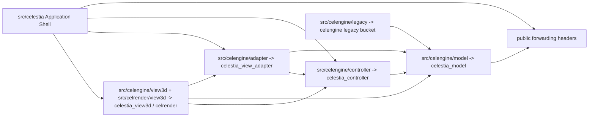

# Celestia MVC Step4 Source Directory Reorganization Implementation Plan and Evidence

> **For agentic workers:** REQUIRED SUB-SKILL: Use superpowers:subagent-driven-development (recommended) or superpowers:executing-plans to implement this plan task-by-task. Steps use checkbox (`- [ ]`) syntax for tracking.

**Goal:** 在 Step3 CMake target / source bucket 已稳定后，用 `git mv` 将 Celestia 本仓库内混杂的 MVC 源码落入真实目录结构，并保持 baseline / SDL 双构建、全量 `ctest` 和 SDL smoke 通过。

**Architecture:** Step4 不重新定义 MVC 边界，而是把 Step3 已验证的 `CELESTIA_MODEL_SOURCES`、`CELESTIA_CONTROLLER_SOURCES`、`CELESTIA_VIEW_ADAPTER_SOURCES`、`CELESTIA_VIEW3D_SOURCES`、`CELESTIA_LEGACY_ENGINE_SOURCES` 映射到物理目录。为降低破坏面，真实实现头和 `.cpp` 进入分层目录，`src/celengine` 根目录保留兼容 forwarding header，使现有 `<celengine/body.h>`、`<celengine/simulation.h>` 等 include 路径在 Step4 内不被强制改名。进程边界、IPC/RPC、Planet_SIM clean-room 迁移不属于 Step4。

**Tech Stack:** C++17, CMake OBJECT libraries, doctest, `git mv`, Visual Studio BuildTools CMake/CTest, SDL runtime smoke, Typora-compatible Mermaid `graph` diagrams.

---

## 0. Step4 执行结果

执行分支：`codex/celestia-mvc-step3`

执行结论：Step4 已在当前工作区落地。`src/celengine` 的主要 MVC ownership bucket 已物理进入 `model` / `controller` / `adapter` / `view3d` / `legacy` 子目录；`src/celrender` 的 renderer helper 已物理进入 `view3d` 和 `view3d/gl` 子目录。根目录保留 forwarding header 作为 public include 兼容层。

已落地目录：

```text
src/celengine/model/
src/celengine/controller/
src/celengine/adapter/
src/celengine/view3d/
src/celengine/legacy/
src/celrender/view3d/
src/celrender/view3d/gl/
```

已落地兼容策略：

```text
src/celengine/*.h        -> forwarding headers to model/controller/adapter/view3d/legacy
src/celrender/*.h        -> forwarding headers to view3d
src/celrender/gl/*.h     -> forwarding headers to ../view3d/gl
```

验证证据：

```text
Step4 red test before move: failed for missing target directories, directory-qualified CMake paths, and forwarding headers
MVC Step1-Step4 focused tests after move: 21/21 passed
build-mvc-baseline-rel build: passed
build-mvc-baseline-rel ctest: 58/58 passed
build-mvc-sdl-rel build: passed
build-mvc-sdl-rel ctest: 58/58 passed
SDL runtime data: build-mvc-sdl-rel/run-full refreshed by CMake install component core
SDL visual smoke: celestia-sdl.exe launched and rendered the Celestia main window
Screenshot: build-mvc-sdl-rel/celestia-step4-smoke.png
Screenshot pixel check: menu_bar red_dominant=0/12800, hud_text red_dominant=0/96600
```

本机验证注意事项：

```text
Plain PowerShell does not provide the MSVC include/lib environment for this build.
Final build and ctest verification used VsDevCmd.bat with -arch=x64 -host_arch=x64.
```

边界结论：

```text
Step4 is source-directory physical reorganization inside one process.
Step4 is not M / C / V independent OS process decomposition.
Process boundaries, IPC/RPC, and message contracts remain Step5.
```

## 1. 统一口径

从本文件开始，后续统一使用以下阶段名称：

```text
Step1: Celestia 本仓库内 public header 级 MVC 边界收缩。
Step2: Celestia 本仓库内 Model 实现层与具体 View Adapter / 渲染资产解耦。
Step3: Celestia 本仓库内 CMake target / source bucket / 边界测试固化。
Step4: Celestia 本仓库内源码目录物理重组 / git mv 搬迁。
Step5: 如果需要，再设计 M / C / V 独立 OS 进程和 IPC / RPC 协议。
```

Step4 完成后可以说：

```text
Celestia 的主要 MVC 源码已经按 Step3 target ownership 落入物理目录，并由测试约束目录边界。
```

Step4 完成后仍不能说：

```text
M / C / V 已经可以作为三个独立 OS 进程运行。
Celestia 已经完成 Planet_SIM clean-room 迁移。
所有支持库都已经按 MVC 重新分仓。
```

## 2. 搬迁范围

Step4 只搬迁当前混杂 MVC 职责最明显的两个目录：

| 当前目录 | Step4 动作 | 原因 |
| --- | --- | --- |
| `src/celengine` | 拆成 `model` / `controller` / `adapter` / `view3d` / `legacy` 子目录 | 该目录同时承载 Model、Controller、View Adapter、3D View 和少量 legacy mixed sources |
| `src/celrender` | 拆成 `view3d` 子目录，保留 `gl` 低层 OpenGL helper 在 `view3d/gl` | 该目录是 3D View 的 renderer helper，不应继续表现为与 MVC target 无关的平级大桶 |

Step4 不搬迁以下目录：

| 目录 | Step4 决策 | 说明 |
| --- | --- | --- |
| `src/celestia` | 不搬 | Application Shell 和 SDL / Qt / Win32 前端入口，负责编排，不是 Model 目录 |
| `src/celmath` | 不搬 | 数学基础库，被多个层消费，按 MVC 强搬会扩大破坏面 |
| `src/celastro` | 不搬 | 天文计算基础库，属于支撑库 |
| `src/celephem` | 不搬 | 星历 / 轨道支撑库，可被 Model 消费，但不是 Celestia MVC 目录重组对象 |
| `src/celimage` | 不搬 | 图像 I/O 支撑库 |
| `src/celmodel` | 不搬 | 模型资源加载支撑库，后续可单独审查，但不纳入 Step4 |
| `src/cel3ds` | 不搬 | 3DS 模型支撑库 |
| `src/celttf` | 不搬 | 字体支撑库 |
| `src/celutil` | 不搬 | 通用工具库 |
| `src/celcompat` | 不搬 | 兼容性工具 |
| `src/celscript` | 不搬 | 脚本集成层，不作为本次 MVC 源码目录搬迁目标 |
| `src/tools` | 不搬 | 离线工具，不属于运行时 MVC 分层 |

## 3. 目标目录结构

Step4 目标结构如下：

```text
src/celengine/
  model/
  controller/
  adapter/
  view3d/
  legacy/
  CMakeLists.txt
  *.h forwarding headers for existing public include compatibility

src/celrender/
  view3d/
    gl/
  CMakeLists.txt
```

依赖方向保持 Step3 的 target 约束：



## 4. 源码归属清单

### 4.1 `src/celengine/model`

来自 Step3 `CELESTIA_MODEL_SOURCES`：

```text
asterism.cpp/.h
astroobj.h
atmosphere.cpp/.h
body.cpp/.h
boundaries.cpp/.h
category.cpp/.h
completion.cpp/.h
constellation.cpp/.h
deepskyobj.cpp/.h
dsodb.cpp/.h
dsooctree.cpp/.h
frame.cpp/.h
frametree.cpp/.h
location.cpp/.h
location.gperf
name.cpp/.h
nebula.cpp/.h
octree.h
octreebuilder.h
opencluster.cpp/.h
orbitsampler.h
parseobject.cpp/.h
rotationmanager.cpp/.h
shared.h
star.cpp/.h
stardb.cpp/.h
starname.cpp/.h
staroctree.cpp/.h
stellarclass.cpp/.h
surface.h
timeline.cpp/.h
timelinephase.cpp/.h
trajmanager.cpp/.h
univcoord.h
universe.cpp/.h
urlmanager.cpp/.h
```

### 4.2 `src/celengine/controller`

来自 Step3 `CELESTIA_CONTROLLER_SOURCES`：

```text
observer.cpp/.h
selection.cpp/.h
simulation.cpp/.h
```

### 4.3 `src/celengine/adapter`

来自 Step3 `CELESTIA_VIEW_ADAPTER_SOURCES`：

```text
bodylifecycle.cpp/.h
bodylocationgeometryprojector.cpp/.h
bodyrenderassets.cpp/.h
dsodbbuilder.cpp/.h
deepskyobjectpicker.cpp/.h
deepskyobjectrenderpolicy.cpp/.h
nebulalifecycle.cpp/.h
nebularenderassetloader.cpp/.h
nebularenderassets.cpp/.h
sceneviewmodel.cpp/.h
selectiongeometryprovider.h
selectionpicker.cpp/.h
solarsys.cpp/.h
solarsys.gperf
stardetailslifecycle.cpp/.h
starrenderassets.cpp/.h
stardbbuilder.cpp/.h
```

`solarsys.*`、`stardbbuilder.*`、`dsodbbuilder.*` 仍保持 Adapter 归属，因为它们仍承担加载模型数据和绑定渲染资源的混合职责。Step4 只移动物理目录，不把这些文件伪装成纯 Model。

### 4.4 `src/celengine/view3d`

来自 Step3 `CELESTIA_VIEW3D_SOURCES`：

```text
axisarrow.cpp/.h
console.cpp/.h
curveplot.cpp/.h
dsorenderer.cpp/.h
fisheyeprojectionmode.cpp/.h
framebuffer.cpp/.h
geometry.cpp/.h
glmarker.cpp
glshader.cpp/.h
glsupport.cpp/.h
imageoverlay.cpp/.h
lightenv.h
lodspheremesh.cpp/.h
meshmanager.cpp/.h
modelgeometry.cpp/.h
objectrenderer.h
overlay.cpp/.h
perspectiveprojectionmode.cpp/.h
planetgrid.cpp/.h
pointstarrenderer.cpp/.h
pointstarvertexbuffer.cpp/.h
projectionmode.cpp/.h
psfstarvertexbuffer.cpp/.h
rectangle.h
referencemark.h
rendcontext.cpp/.h
render.cpp/.h
rendercolors.cpp/.h
renderflags.h
renderglsl.cpp/.h
renderinfo.h
renderlistentry.h
shadermanager.cpp/.h
skygrid.h
spheremesh.cpp/.h
starcolors.cpp/.h
starpipelineowner.h
texmanager.cpp/.h
textlayout.cpp/.h
texture.cpp/.h
viewporteffect.cpp/.h
virtualtex.cpp/.h
visibleregion.cpp/.h
warpmesh.cpp/.h
videooverlay.cpp/.h when ENABLE_FFMPEG is enabled
```

### 4.5 `src/celengine/legacy`

来自 Step3 `CELESTIA_LEGACY_ENGINE_SOURCES`：

```text
galaxy.cpp/.h
galaxyform.cpp/.h
globular.cpp/.h
marker.cpp/.h
starbrowser.cpp/.h
```

这些文件暂不归入纯 Model 或纯 View3D，因为它们仍存在渲染状态、渲染方法或历史混杂职责。Step4 只把它们从根目录移走，避免继续污染根目录。

### 4.6 `src/celrender/view3d`

来自当前 `src/celrender/CMakeLists.txt` 的 `CELRENDER_SOURCES`：

```text
asterismrenderer.cpp/.h
atmosphererenderer.cpp/.h
boundariesrenderer.cpp/.h
cometrenderer.cpp/.h
eclipticlinerenderer.cpp/.h
galaxyrenderer.cpp/.h
globularrenderer.cpp/.h
largestarrenderer.cpp/.h
legacylargestarrenderer.cpp/.h
linerenderer.cpp/.h
nebularenderer.cpp/.h
openclusterrenderer.cpp/.h
psfglowlargerenderer.cpp/.h
referencemarkrenderer.cpp/.h
rendererfwd.h
ringrenderer.cpp/.h
skygridrenderer.cpp/.h
gl/binder.cpp/.h -> view3d/gl/binder.cpp/.h
gl/buffer.cpp/.h -> view3d/gl/buffer.cpp/.h
gl/vertexobject.cpp/.h -> view3d/gl/vertexobject.cpp/.h
```

## 5. Public Include 兼容策略

Step4 不在第一轮强制把全仓 include 改成 `<celengine/model/body.h>` 这种新路径。原因是当前仓库、脚本层和前端层有大量现有 include：

```text
#include <celengine/body.h>
#include <celengine/simulation.h>
#include <celengine/render.h>
#include <celengine/selectionpicker.h>
```

Step4 的强制策略是：

```text
真实实现头: src/celengine/model/body.h
兼容转发头: src/celengine/body.h -> #include "model/body.h"
真实渲染头: src/celrender/view3d/ringrenderer.h
兼容转发头: src/celrender/ringrenderer.h -> #include "view3d/ringrenderer.h"
真实 OpenGL helper 头: src/celrender/view3d/gl/binder.h
兼容转发头: src/celrender/gl/binder.h -> #include "../view3d/gl/binder.h"
```

示例转发头：

```cpp
#pragma once

#include "model/body.h"
```

这个策略让源码物理归属先稳定下来，避免同一提交同时承担“目录移动”和“全仓 include API 改名”两个风险。根目录允许保留 forwarding header，但不允许继续保留被搬迁 ownership group 的 `.cpp` 实现文件。Step4 后，`src/celengine`、`src/celrender`、`src/celrender/gl` 的根路径 header 都是兼容层；真实实现头以分层目录为准。

## 6. 实施任务

### Task 1: 新增 Step4 目录契约测试

**Files:**
- Create: `test/unit/mvc_step4_directory_contract_test.cpp`
- Modify: `test/unit/CMakeLists.txt`

- [ ] **Step 1: 写入失败测试**

Create `test/unit/mvc_step4_directory_contract_test.cpp` with this content:

```cpp
#include <doctest.h>

#include <filesystem>
#include <fstream>
#include <sstream>
#include <string>
#include <string_view>

namespace
{

std::filesystem::path
sourceRoot()
{
    return std::filesystem::path(__FILE__).parent_path().parent_path().parent_path();
}

std::filesystem::path
repoPath(std::string_view relativePath)
{
    return sourceRoot() / std::filesystem::path(relativePath);
}

std::string
readSourceFile(std::string_view relativePath)
{
    std::ifstream input(repoPath(relativePath));
    REQUIRE(input.good());

    std::ostringstream buffer;
    buffer << input.rdbuf();
    return buffer.str();
}

bool
contains(std::string_view text, std::string_view token)
{
    return text.find(token) != std::string_view::npos;
}

void
checkContains(std::string_view text, std::string_view token)
{
    CAPTURE(token);
    CHECK(contains(text, token));
}

void
checkNoToken(std::string_view text, std::string_view token)
{
    CAPTURE(token);
    CHECK_FALSE(contains(text, token));
}

void
checkPathExists(std::string_view relativePath)
{
    CAPTURE(relativePath);
    CHECK(std::filesystem::exists(repoPath(relativePath)));
}

void
checkDirectoryExists(std::string_view relativePath)
{
    CAPTURE(relativePath);
    CHECK(std::filesystem::is_directory(repoPath(relativePath)));
}

void
checkPathMissing(std::string_view relativePath)
{
    CAPTURE(relativePath);
    CHECK_FALSE(std::filesystem::exists(repoPath(relativePath)));
}

} // end unnamed namespace

TEST_SUITE_BEGIN("MVC Step4 directory contract");

TEST_CASE("celengine ownership directories exist")
{
    checkDirectoryExists("src/celengine/model");
    checkDirectoryExists("src/celengine/controller");
    checkDirectoryExists("src/celengine/adapter");
    checkDirectoryExists("src/celengine/view3d");
    checkDirectoryExists("src/celengine/legacy");
}

TEST_CASE("representative celengine sources moved out of the root")
{
    checkPathExists("src/celengine/model/body.cpp");
    checkPathExists("src/celengine/model/body.h");
    checkPathExists("src/celengine/model/location.gperf");
    checkPathExists("src/celengine/controller/simulation.cpp");
    checkPathExists("src/celengine/controller/simulation.h");
    checkPathExists("src/celengine/adapter/selectionpicker.cpp");
    checkPathExists("src/celengine/adapter/selectionpicker.h");
    checkPathExists("src/celengine/adapter/solarsys.gperf");
    checkPathExists("src/celengine/view3d/render.cpp");
    checkPathExists("src/celengine/view3d/render.h");
    checkPathExists("src/celengine/legacy/galaxy.cpp");
    checkPathExists("src/celengine/legacy/galaxy.h");

    checkPathMissing("src/celengine/body.cpp");
    checkPathMissing("src/celengine/simulation.cpp");
    checkPathMissing("src/celengine/selectionpicker.cpp");
    checkPathMissing("src/celengine/render.cpp");
    checkPathMissing("src/celengine/galaxy.cpp");
}

TEST_CASE("celengine CMake buckets use directory-qualified paths")
{
    const auto cmake = readSourceFile("src/celengine/CMakeLists.txt");

    checkContains(cmake, "model/body.cpp");
    checkContains(cmake, "controller/simulation.cpp");
    checkContains(cmake, "adapter/selectionpicker.cpp");
    checkContains(cmake, "view3d/render.cpp");
    checkContains(cmake, "legacy/galaxy.cpp");
    checkContains(cmake, "gperf_add_table(celestia_model model/location.gperf model/location.cpp 4)");
    checkContains(cmake, "gperf_add_table(celestia_view_adapter adapter/solarsys.gperf adapter/solarsys.cpp 4)");

    checkNoToken(cmake, "\n  body.cpp");
    checkNoToken(cmake, "\n  simulation.cpp");
    checkNoToken(cmake, "\n  selectionpicker.cpp");
    checkNoToken(cmake, "\n  render.cpp");
    checkNoToken(cmake, "\n  galaxy.cpp");
}

TEST_CASE("public celengine include compatibility is preserved by forwarding headers")
{
    checkContains(readSourceFile("src/celengine/body.h"), "#include \"model/body.h\"");
    checkContains(readSourceFile("src/celengine/simulation.h"), "#include \"controller/simulation.h\"");
    checkContains(readSourceFile("src/celengine/selectionpicker.h"), "#include \"adapter/selectionpicker.h\"");
    checkContains(readSourceFile("src/celengine/render.h"), "#include \"view3d/render.h\"");
    checkContains(readSourceFile("src/celengine/galaxy.h"), "#include \"legacy/galaxy.h\"");
}

TEST_CASE("celrender renderer helpers live under view3d")
{
    checkDirectoryExists("src/celrender/view3d");
    checkDirectoryExists("src/celrender/view3d/gl");
    checkPathExists("src/celrender/view3d/ringrenderer.cpp");
    checkPathExists("src/celrender/view3d/ringrenderer.h");
    checkPathExists("src/celrender/view3d/gl/binder.cpp");
    checkPathExists("src/celrender/view3d/gl/binder.h");

    checkPathMissing("src/celrender/ringrenderer.cpp");
    checkPathMissing("src/celrender/gl/binder.cpp");

    const auto cmake = readSourceFile("src/celrender/CMakeLists.txt");
    checkContains(cmake, "view3d/ringrenderer.cpp");
    checkContains(cmake, "view3d/gl/binder.cpp");
}

TEST_SUITE_END();
```

- [ ] **Step 2: 注册测试源**

Modify `test/unit/CMakeLists.txt` so `UNIT_TEST_SOURCES` includes the new test next to the other MVC tests:

```cmake
  mvc_boundary_test.cpp
  mvc_step2_contract_test.cpp
  mvc_step3_contract_test.cpp
  mvc_step4_directory_contract_test.cpp
```

- [ ] **Step 3: 运行测试并确认失败原因正确**

Run:

```powershell
& 'C:\Program Files (x86)\Microsoft Visual Studio\18\BuildTools\Common7\IDE\CommonExtensions\Microsoft\CMake\CMake\bin\cmake.exe' --build build-mvc-baseline-rel --config Release
& 'C:\Program Files (x86)\Microsoft Visual Studio\18\BuildTools\Common7\IDE\CommonExtensions\Microsoft\CMake\CMake\bin\ctest.exe' --test-dir build-mvc-baseline-rel --output-on-failure -R unit
```

Expected before moving sources:

```text
unit test fails because src/celengine/model, controller, adapter, view3d, legacy, and src/celrender/view3d do not exist yet.
```

- [ ] **Step 4: Commit 测试**

```powershell
git add test/unit/CMakeLists.txt test/unit/mvc_step4_directory_contract_test.cpp
git commit -m "test: add MVC Step4 directory contract"
```

### Task 2: 搬迁 Model 源码

**Files:**
- Move under: `src/celengine/model/`
- Modify: `src/celengine/CMakeLists.txt`
- Replace with forwarding headers under: `src/celengine/*.h`

- [ ] **Step 1: 创建目录并移动 Model 文件**

Run:

```powershell
New-Item -ItemType Directory -Force src\celengine\model
git mv src\celengine\asterism.cpp src\celengine\asterism.h src\celengine\astroobj.h src\celengine\atmosphere.cpp src\celengine\atmosphere.h src\celengine\model\
git mv src\celengine\body.cpp src\celengine\body.h src\celengine\boundaries.cpp src\celengine\boundaries.h src\celengine\category.cpp src\celengine\category.h src\celengine\model\
git mv src\celengine\completion.cpp src\celengine\completion.h src\celengine\constellation.cpp src\celengine\constellation.h src\celengine\deepskyobj.cpp src\celengine\deepskyobj.h src\celengine\model\
git mv src\celengine\dsodb.cpp src\celengine\dsodb.h src\celengine\dsooctree.cpp src\celengine\dsooctree.h src\celengine\frame.cpp src\celengine\frame.h src\celengine\model\
git mv src\celengine\frametree.cpp src\celengine\frametree.h src\celengine\location.cpp src\celengine\location.h src\celengine\location.gperf src\celengine\name.cpp src\celengine\name.h src\celengine\model\
git mv src\celengine\nebula.cpp src\celengine\nebula.h src\celengine\octree.h src\celengine\octreebuilder.h src\celengine\opencluster.cpp src\celengine\opencluster.h src\celengine\model\
git mv src\celengine\orbitsampler.h src\celengine\parseobject.cpp src\celengine\parseobject.h src\celengine\rotationmanager.cpp src\celengine\rotationmanager.h src\celengine\shared.h src\celengine\model\
git mv src\celengine\star.cpp src\celengine\star.h src\celengine\stardb.cpp src\celengine\stardb.h src\celengine\starname.cpp src\celengine\starname.h src\celengine\model\
git mv src\celengine\staroctree.cpp src\celengine\staroctree.h src\celengine\stellarclass.cpp src\celengine\stellarclass.h src\celengine\surface.h src\celengine\model\
git mv src\celengine\timeline.cpp src\celengine\timeline.h src\celengine\timelinephase.cpp src\celengine\timelinephase.h src\celengine\trajmanager.cpp src\celengine\trajmanager.h src\celengine\model\
git mv src\celengine\univcoord.h src\celengine\universe.cpp src\celengine\universe.h src\celengine\urlmanager.cpp src\celengine\urlmanager.h src\celengine\model\
```

- [ ] **Step 2: 保留兼容 forwarding headers**

For every moved public header that is included as `<celengine/name.h>` or `"name.h"` from outside `src/celengine/model`, recreate `src/celengine/name.h` with this exact form:

```cpp
#pragma once

#include "model/name.h"
```

Concrete examples:

```cpp
// src/celengine/body.h
#pragma once

#include "model/body.h"
```

```cpp
// src/celengine/universe.h
#pragma once

#include "model/universe.h"
```

- [ ] **Step 3: Update CMake paths**

In `src/celengine/CMakeLists.txt`, prefix every `CELESTIA_MODEL_SOURCES` entry with `model/` and update gperf:

```cmake
gperf_add_table(celestia_model model/location.gperf model/location.cpp 4)
```

- [ ] **Step 4: Update boundary tests that read moved concrete files**

In `test/unit/mvc_boundary_test.cpp`, `test/unit/mvc_step2_contract_test.cpp`, and `test/unit/mvc_step3_contract_test.cpp`, update concrete implementation paths from root paths to `src/celengine/model/...` where the test intends to read the real implementation.

Examples:

```cpp
readSourceFile("src/celengine/model/body.h");
readSourceFile("src/celengine/model/body.cpp");
readSourceFile("src/celengine/model/star.h");
readSourceFile("src/celengine/model/star.cpp");
readSourceFile("src/celengine/model/universe.h");
readSourceFile("src/celengine/model/universe.cpp");
```

- [ ] **Step 5: Verify Model move**

```powershell
& 'C:\Program Files (x86)\Microsoft Visual Studio\18\BuildTools\Common7\IDE\CommonExtensions\Microsoft\CMake\CMake\bin\cmake.exe' --build build-mvc-baseline-rel --config Release
& 'C:\Program Files (x86)\Microsoft Visual Studio\18\BuildTools\Common7\IDE\CommonExtensions\Microsoft\CMake\CMake\bin\ctest.exe' --test-dir build-mvc-baseline-rel --output-on-failure -R "unit|mvc"
```

Expected:

```text
build passes
unit / mvc tests pass except Step4 checks for controller / adapter / view3d / celrender directories that have not moved yet
```

- [ ] **Step 6: Commit Model move**

```powershell
git add src/celengine test/unit
git commit -m "refactor: move model sources into celengine model folder"
```

### Task 3: 搬迁 Controller 源码

**Files:**
- Move under: `src/celengine/controller/`
- Modify: `src/celengine/CMakeLists.txt`
- Replace with forwarding headers under: `src/celengine/*.h`

- [ ] **Step 1: 移动 Controller 文件**

```powershell
New-Item -ItemType Directory -Force src\celengine\controller
git mv src\celengine\observer.cpp src\celengine\observer.h src\celengine\selection.cpp src\celengine\selection.h src\celengine\simulation.cpp src\celengine\simulation.h src\celengine\controller\
```

- [ ] **Step 2: 保留 forwarding headers**

```cpp
// src/celengine/simulation.h
#pragma once

#include "controller/simulation.h"
```

```cpp
// src/celengine/selection.h
#pragma once

#include "controller/selection.h"
```

```cpp
// src/celengine/observer.h
#pragma once

#include "controller/observer.h"
```

- [ ] **Step 3: Update CMake paths**

In `src/celengine/CMakeLists.txt`, `CELESTIA_CONTROLLER_SOURCES` must use:

```cmake
  controller/observer.cpp
  controller/observer.h
  controller/selection.cpp
  controller/selection.h
  controller/simulation.cpp
  controller/simulation.h
```

- [ ] **Step 4: Update boundary tests that read concrete Controller files**

Use these concrete paths:

```cpp
readSourceFile("src/celengine/controller/simulation.cpp");
readSourceFile("src/celengine/controller/simulation.h");
readSourceFile("src/celengine/controller/observer.cpp");
readSourceFile("src/celengine/controller/observer.h");
readSourceFile("src/celengine/controller/selection.cpp");
readSourceFile("src/celengine/controller/selection.h");
```

- [ ] **Step 5: Build and test**

```powershell
& 'C:\Program Files (x86)\Microsoft Visual Studio\18\BuildTools\Common7\IDE\CommonExtensions\Microsoft\CMake\CMake\bin\cmake.exe' --build build-mvc-baseline-rel --config Release
& 'C:\Program Files (x86)\Microsoft Visual Studio\18\BuildTools\Common7\IDE\CommonExtensions\Microsoft\CMake\CMake\bin\ctest.exe' --test-dir build-mvc-baseline-rel --output-on-failure -R "unit|mvc"
```

- [ ] **Step 6: Commit Controller move**

```powershell
git add src/celengine test/unit
git commit -m "refactor: move controller sources into celengine controller folder"
```

### Task 4: 搬迁 View Adapter 源码

**Files:**
- Move under: `src/celengine/adapter/`
- Modify: `src/celengine/CMakeLists.txt`
- Replace with forwarding headers under: `src/celengine/*.h`

- [ ] **Step 1: 移动 Adapter 文件**

```powershell
New-Item -ItemType Directory -Force src\celengine\adapter
git mv src\celengine\bodylifecycle.cpp src\celengine\bodylifecycle.h src\celengine\bodylocationgeometryprojector.cpp src\celengine\bodylocationgeometryprojector.h src\celengine\bodyrenderassets.cpp src\celengine\bodyrenderassets.h src\celengine\adapter\
git mv src\celengine\dsodbbuilder.cpp src\celengine\dsodbbuilder.h src\celengine\deepskyobjectpicker.cpp src\celengine\deepskyobjectpicker.h src\celengine\deepskyobjectrenderpolicy.cpp src\celengine\deepskyobjectrenderpolicy.h src\celengine\adapter\
git mv src\celengine\nebulalifecycle.cpp src\celengine\nebulalifecycle.h src\celengine\nebularenderassetloader.cpp src\celengine\nebularenderassetloader.h src\celengine\nebularenderassets.cpp src\celengine\nebularenderassets.h src\celengine\adapter\
git mv src\celengine\sceneviewmodel.cpp src\celengine\sceneviewmodel.h src\celengine\selectiongeometryprovider.h src\celengine\selectionpicker.cpp src\celengine\selectionpicker.h src\celengine\adapter\
git mv src\celengine\solarsys.cpp src\celengine\solarsys.h src\celengine\solarsys.gperf src\celengine\stardetailslifecycle.cpp src\celengine\stardetailslifecycle.h src\celengine\adapter\
git mv src\celengine\starrenderassets.cpp src\celengine\starrenderassets.h src\celengine\stardbbuilder.cpp src\celengine\stardbbuilder.h src\celengine\adapter\
```

- [ ] **Step 2: 保留 forwarding headers**

Use this form for each moved Adapter header:

```cpp
#pragma once

#include "adapter/selectionpicker.h"
```

Concrete forwarding headers required by current frontend call sites include:

```text
src/celengine/bodyrenderassets.h
src/celengine/selectiongeometryprovider.h
src/celengine/selectionpicker.h
src/celengine/sceneviewmodel.h
src/celengine/starrenderassets.h
src/celengine/nebularenderassets.h
```

- [ ] **Step 3: Update CMake paths and gperf**

In `src/celengine/CMakeLists.txt`, prefix every `CELESTIA_VIEW_ADAPTER_SOURCES` entry with `adapter/` and update:

```cmake
gperf_add_table(celestia_view_adapter adapter/solarsys.gperf adapter/solarsys.cpp 4)
```

- [ ] **Step 4: Build and test**

```powershell
& 'C:\Program Files (x86)\Microsoft Visual Studio\18\BuildTools\Common7\IDE\CommonExtensions\Microsoft\CMake\CMake\bin\cmake.exe' --build build-mvc-baseline-rel --config Release
& 'C:\Program Files (x86)\Microsoft Visual Studio\18\BuildTools\Common7\IDE\CommonExtensions\Microsoft\CMake\CMake\bin\ctest.exe' --test-dir build-mvc-baseline-rel --output-on-failure -R "unit|mvc"
```

- [ ] **Step 5: Commit Adapter move**

```powershell
git add src/celengine test/unit
git commit -m "refactor: move view adapter sources into celengine adapter folder"
```

### Task 5: 搬迁 `celengine` 内 3D View 源码

**Files:**
- Move under: `src/celengine/view3d/`
- Modify: `src/celengine/CMakeLists.txt`
- Replace with forwarding headers under: `src/celengine/*.h`

- [ ] **Step 1: 移动 3D View 文件**

Move every current `CELESTIA_VIEW3D_SOURCES` file to `src/celengine/view3d/`. Include `videooverlay.cpp/.h` in the move even though it is appended only when `ENABLE_FFMPEG` is enabled.

Required command pattern:

```powershell
New-Item -ItemType Directory -Force src\celengine\view3d
git mv src\celengine\axisarrow.cpp src\celengine\axisarrow.h src\celengine\console.cpp src\celengine\console.h src\celengine\curveplot.cpp src\celengine\curveplot.h src\celengine\view3d\
git mv src\celengine\dsorenderer.cpp src\celengine\dsorenderer.h src\celengine\fisheyeprojectionmode.cpp src\celengine\fisheyeprojectionmode.h src\celengine\framebuffer.cpp src\celengine\framebuffer.h src\celengine\view3d\
git mv src\celengine\geometry.cpp src\celengine\geometry.h src\celengine\glmarker.cpp src\celengine\glshader.cpp src\celengine\glshader.h src\celengine\glsupport.cpp src\celengine\glsupport.h src\celengine\view3d\
git mv src\celengine\imageoverlay.cpp src\celengine\imageoverlay.h src\celengine\lightenv.h src\celengine\lodspheremesh.cpp src\celengine\lodspheremesh.h src\celengine\meshmanager.cpp src\celengine\meshmanager.h src\celengine\view3d\
git mv src\celengine\modelgeometry.cpp src\celengine\modelgeometry.h src\celengine\objectrenderer.h src\celengine\overlay.cpp src\celengine\overlay.h src\celengine\view3d\
git mv src\celengine\perspectiveprojectionmode.cpp src\celengine\perspectiveprojectionmode.h src\celengine\planetgrid.cpp src\celengine\planetgrid.h src\celengine\pointstarrenderer.cpp src\celengine\pointstarrenderer.h src\celengine\view3d\
git mv src\celengine\pointstarvertexbuffer.cpp src\celengine\pointstarvertexbuffer.h src\celengine\projectionmode.cpp src\celengine\projectionmode.h src\celengine\psfstarvertexbuffer.cpp src\celengine\psfstarvertexbuffer.h src\celengine\view3d\
git mv src\celengine\rectangle.h src\celengine\referencemark.h src\celengine\rendcontext.cpp src\celengine\rendcontext.h src\celengine\render.cpp src\celengine\render.h src\celengine\view3d\
git mv src\celengine\rendercolors.cpp src\celengine\rendercolors.h src\celengine\renderflags.h src\celengine\renderglsl.cpp src\celengine\renderglsl.h src\celengine\renderinfo.h src\celengine\renderlistentry.h src\celengine\view3d\
git mv src\celengine\shadermanager.cpp src\celengine\shadermanager.h src\celengine\skygrid.h src\celengine\spheremesh.cpp src\celengine\spheremesh.h src\celengine\starcolors.cpp src\celengine\starcolors.h src\celengine\view3d\
git mv src\celengine\starpipelineowner.h src\celengine\texmanager.cpp src\celengine\texmanager.h src\celengine\textlayout.cpp src\celengine\textlayout.h src\celengine\texture.cpp src\celengine\texture.h src\celengine\view3d\
git mv src\celengine\viewporteffect.cpp src\celengine\viewporteffect.h src\celengine\virtualtex.cpp src\celengine\virtualtex.h src\celengine\visibleregion.cpp src\celengine\visibleregion.h src\celengine\warpmesh.cpp src\celengine\warpmesh.h src\celengine\view3d\
git mv src\celengine\videooverlay.cpp src\celengine\videooverlay.h src\celengine\view3d\
```

- [ ] **Step 2: 保留 forwarding headers**

At minimum, current public include users require forwarding headers for:

```text
src/celengine/render.h
src/celengine/renderflags.h
src/celengine/meshmanager.h
src/celengine/texmanager.h
src/celengine/shadermanager.h
src/celengine/rendcontext.h
src/celengine/texture.h
```

Forwarding header form:

```cpp
#pragma once

#include "view3d/render.h"
```

- [ ] **Step 3: Update CMake paths**

In `src/celengine/CMakeLists.txt`, prefix every `CELESTIA_VIEW3D_SOURCES` entry with `view3d/`, including the `ENABLE_FFMPEG` append:

```cmake
if(ENABLE_FFMPEG)
  list(APPEND CELESTIA_VIEW3D_SOURCES
    view3d/videooverlay.cpp
    view3d/videooverlay.h
  )
endif()
```

- [ ] **Step 4: Build and test**

```powershell
& 'C:\Program Files (x86)\Microsoft Visual Studio\18\BuildTools\Common7\IDE\CommonExtensions\Microsoft\CMake\CMake\bin\cmake.exe' --build build-mvc-baseline-rel --config Release
& 'C:\Program Files (x86)\Microsoft Visual Studio\18\BuildTools\Common7\IDE\CommonExtensions\Microsoft\CMake\CMake\bin\ctest.exe' --test-dir build-mvc-baseline-rel --output-on-failure -R "unit|mvc"
```

- [ ] **Step 5: Commit View3D move**

```powershell
git add src/celengine test/unit
git commit -m "refactor: move 3D view sources into celengine view3d folder"
```

### Task 6: 搬迁 legacy mixed engine 源码

**Files:**
- Move under: `src/celengine/legacy/`
- Modify: `src/celengine/CMakeLists.txt`
- Replace with forwarding headers under: `src/celengine/*.h`

- [ ] **Step 1: 移动 legacy 文件**

```powershell
New-Item -ItemType Directory -Force src\celengine\legacy
git mv src\celengine\galaxy.cpp src\celengine\galaxy.h src\celengine\galaxyform.cpp src\celengine\galaxyform.h src\celengine\globular.cpp src\celengine\globular.h src\celengine\marker.cpp src\celengine\marker.h src\celengine\starbrowser.cpp src\celengine\starbrowser.h src\celengine\legacy\
```

- [ ] **Step 2: 保留 forwarding headers**

Example:

```cpp
// src/celengine/galaxy.h
#pragma once

#include "legacy/galaxy.h"
```

- [ ] **Step 3: Update CMake paths**

In `src/celengine/CMakeLists.txt`, `CELESTIA_LEGACY_ENGINE_SOURCES` must use:

```cmake
  legacy/galaxy.cpp
  legacy/galaxy.h
  legacy/galaxyform.cpp
  legacy/galaxyform.h
  legacy/globular.cpp
  legacy/globular.h
  legacy/marker.cpp
  legacy/marker.h
  legacy/starbrowser.cpp
  legacy/starbrowser.h
```

- [ ] **Step 4: Build and test**

```powershell
& 'C:\Program Files (x86)\Microsoft Visual Studio\18\BuildTools\Common7\IDE\CommonExtensions\Microsoft\CMake\CMake\bin\cmake.exe' --build build-mvc-baseline-rel --config Release
& 'C:\Program Files (x86)\Microsoft Visual Studio\18\BuildTools\Common7\IDE\CommonExtensions\Microsoft\CMake\CMake\bin\ctest.exe' --test-dir build-mvc-baseline-rel --output-on-failure -R "unit|mvc"
```

- [ ] **Step 5: Commit legacy move**

```powershell
git add src/celengine test/unit
git commit -m "refactor: move mixed legacy engine sources into legacy folder"
```

### Task 7: 搬迁 `celrender` 3D renderer helpers

**Files:**
- Move under: `src/celrender/view3d/`
- Move under: `src/celrender/view3d/gl/`
- Modify: `src/celrender/CMakeLists.txt`

- [ ] **Step 1: 移动 renderer helper 文件**

```powershell
New-Item -ItemType Directory -Force src\celrender\view3d
New-Item -ItemType Directory -Force src\celrender\view3d\gl
git mv src\celrender\asterismrenderer.cpp src\celrender\asterismrenderer.h src\celrender\atmosphererenderer.cpp src\celrender\atmosphererenderer.h src\celrender\boundariesrenderer.cpp src\celrender\boundariesrenderer.h src\celrender\view3d\
git mv src\celrender\cometrenderer.cpp src\celrender\cometrenderer.h src\celrender\eclipticlinerenderer.cpp src\celrender\eclipticlinerenderer.h src\celrender\galaxyrenderer.cpp src\celrender\galaxyrenderer.h src\celrender\view3d\
git mv src\celrender\globularrenderer.cpp src\celrender\globularrenderer.h src\celrender\largestarrenderer.cpp src\celrender\largestarrenderer.h src\celrender\legacylargestarrenderer.cpp src\celrender\legacylargestarrenderer.h src\celrender\view3d\
git mv src\celrender\linerenderer.cpp src\celrender\linerenderer.h src\celrender\nebularenderer.cpp src\celrender\nebularenderer.h src\celrender\openclusterrenderer.cpp src\celrender\openclusterrenderer.h src\celrender\view3d\
git mv src\celrender\psfglowlargerenderer.cpp src\celrender\psfglowlargerenderer.h src\celrender\referencemarkrenderer.cpp src\celrender\referencemarkrenderer.h src\celrender\rendererfwd.h src\celrender\view3d\
git mv src\celrender\ringrenderer.cpp src\celrender\ringrenderer.h src\celrender\skygridrenderer.cpp src\celrender\skygridrenderer.h src\celrender\view3d\
git mv src\celrender\gl\binder.cpp src\celrender\gl\binder.h src\celrender\gl\buffer.cpp src\celrender\gl\buffer.h src\celrender\gl\vertexobject.cpp src\celrender\gl\vertexobject.h src\celrender\view3d\gl\
```

- [ ] **Step 2: Update CMake paths**

In `src/celrender/CMakeLists.txt`, every source path must be prefixed with `view3d/`, and OpenGL helper paths must be prefixed with `view3d/gl/`.

Required entries include:

```cmake
  view3d/ringrenderer.cpp
  view3d/ringrenderer.h
  view3d/skygridrenderer.cpp
  view3d/skygridrenderer.h
  view3d/gl/binder.cpp
  view3d/gl/binder.h
  view3d/gl/buffer.cpp
  view3d/gl/buffer.h
  view3d/gl/vertexobject.cpp
  view3d/gl/vertexobject.h
```

- [ ] **Step 3: Build and test**

```powershell
& 'C:\Program Files (x86)\Microsoft Visual Studio\18\BuildTools\Common7\IDE\CommonExtensions\Microsoft\CMake\CMake\bin\cmake.exe' --build build-mvc-baseline-rel --config Release
& 'C:\Program Files (x86)\Microsoft Visual Studio\18\BuildTools\Common7\IDE\CommonExtensions\Microsoft\CMake\CMake\bin\ctest.exe' --test-dir build-mvc-baseline-rel --output-on-failure -R "unit|mvc"
```

- [ ] **Step 4: Commit celrender move**

```powershell
git add src/celrender test/unit
git commit -m "refactor: move celrender helpers into view3d folder"
```

### Task 8: 全量验证

**Files:**
- No source changes unless verification exposes a real defect.

- [ ] **Step 1: 检查根目录 `.cpp` 已清空**

Run:

```powershell
Get-ChildItem src\celengine -File -Include *.cpp
Get-ChildItem src\celrender -File -Include *.cpp
```

Expected:

```text
No root-level .cpp files in src/celengine or src/celrender.
```

- [ ] **Step 2: 检查 Step4 关键路径**

Run:

```powershell
Test-Path src\celengine\model\body.cpp
Test-Path src\celengine\controller\simulation.cpp
Test-Path src\celengine\adapter\selectionpicker.cpp
Test-Path src\celengine\view3d\render.cpp
Test-Path src\celengine\legacy\galaxy.cpp
Test-Path src\celrender\view3d\ringrenderer.cpp
Test-Path src\celrender\view3d\gl\binder.cpp
```

Expected:

```text
All commands print True.
```

- [ ] **Step 3: baseline build and full ctest**

```powershell
& 'C:\Program Files (x86)\Microsoft Visual Studio\18\BuildTools\Common7\IDE\CommonExtensions\Microsoft\CMake\CMake\bin\cmake.exe' --build build-mvc-baseline-rel --config Release
& 'C:\Program Files (x86)\Microsoft Visual Studio\18\BuildTools\Common7\IDE\CommonExtensions\Microsoft\CMake\CMake\bin\ctest.exe' --test-dir build-mvc-baseline-rel --output-on-failure
```

Expected:

```text
build-mvc-baseline-rel build passed
all baseline tests passed
```

- [ ] **Step 4: SDL build and full ctest**

```powershell
& 'C:\Program Files (x86)\Microsoft Visual Studio\18\BuildTools\Common7\IDE\CommonExtensions\Microsoft\CMake\CMake\bin\cmake.exe' --build build-mvc-sdl-rel --config Release
& 'C:\Program Files (x86)\Microsoft Visual Studio\18\BuildTools\Common7\IDE\CommonExtensions\Microsoft\CMake\CMake\bin\ctest.exe' --test-dir build-mvc-sdl-rel --output-on-failure
```

Expected:

```text
build-mvc-sdl-rel build passed
all SDL-configured tests passed
```

- [ ] **Step 5: SDL runtime smoke**

Use `run-full`, not an ad hoc empty runtime directory:

```powershell
$cmake = 'C:\Program Files (x86)\Microsoft Visual Studio\18\BuildTools\Common7\IDE\CommonExtensions\Microsoft\CMake\CMake\bin\cmake.exe'
& $cmake --install build-mvc-sdl-rel --prefix (Resolve-Path 'build-mvc-sdl-rel\run-full').Path --component core
$env:CELESTIA_DATA_DIR=(Resolve-Path 'build-mvc-sdl-rel\run-full').Path
$exe=(Resolve-Path 'build-mvc-sdl-rel\src\celestia\sdl\celestia-sdl.exe').Path
$p=Start-Process -FilePath $exe -WindowStyle Hidden -PassThru
Start-Sleep -Seconds 6
$alive=Get-Process -Id $p.Id -ErrorAction SilentlyContinue
if ($alive) {
  Stop-Process -Id $p.Id -Force
  Write-Output "SDL smoke: process entered run loop for 6s and was stopped; pid=$($p.Id)"
  exit 0
}
Write-Output "SDL smoke failed: process exited early; pid=$($p.Id) exit=$($p.ExitCode)"
exit 1
```

Expected:

```text
SDL smoke: process entered run loop for 6s and was stopped
```

- [ ] **Step 6: Git hygiene**

```powershell
git diff --check
git status --short --branch
```

Expected:

```text
git diff --check exits 0
status contains only expected Step4 source, test, CMake, and doc changes before the final commit
```

- [ ] **Step 7: Final commit**

```powershell
git add src/celengine src/celrender test/unit DOC/CODEX_DOC CODEX_START_HERE.md
git commit -m "refactor: reorganize MVC sources into physical folders"
```

## 7. 文档闭环

Step4 当前已同步更新：

```text
CODEX_START_HERE.md
DOC/CODEX_DOC/02_设计说明/02-05-Celestia标准MVC解耦与迁移映射说明.md
DOC/CODEX_DOC/04_研制计划/16-WBS-0.16-Celestia标准MVC解耦-Step4源码目录物理重组方案.md
```

更新内容：

```text
Step4 status: complete
directory move evidence: moved paths and CMake buckets
verification evidence: baseline build / baseline ctest / SDL build / SDL ctest / SDL visual smoke
boundary statement: still in-process MVC, not process-boundary MVC
```

## 8. 风险与控制

| 风险 | 影响 | 控制方式 |
| --- | --- | --- |
| 同时移动文件并改全仓 include API | 编译错误面过大，难以判断是目录移动还是 API 改名导致 | Step4 保留 root forwarding headers |
| `gperf_add_table` 仍指向旧路径 | `location.inc` / `solarsys.inc` 生成依赖失效 | `location.gperf` 跟随 Model，`solarsys.gperf` 跟随 Adapter，并更新 gperf source path |
| Step3 测试仍读取旧路径 | 测试误报文件不存在 | Step4 每个搬迁任务同步更新测试读取真实实现路径 |
| `src/celrender` 被误认为独立 View 层全部完成 | `celengine/view3d` 仍承载主 3D View 逻辑 | 文档明确 3D View 横跨 `celengine/view3d` 与 `celrender/view3d` |
| 把支撑库也强搬进 MVC 目录 | 破坏面扩大，收益不明确 | Step4 只移动 `src/celengine` 和 `src/celrender` |
| SDL smoke 使用不完整运行目录 | 出现缺 DLL、缺 shader、红色色块等环境问题 | 使用 CMake install 刷新 `run-full` 后再启动 |

## 9. 完成判定

Step4 只有同时满足以下条件才算完成：

```text
1. `test/unit/mvc_step4_directory_contract_test.cpp` 存在并通过。
2. `src/celengine` 下 Model / Controller / Adapter / View3D / Legacy `.cpp` 已移入对应子目录。
3. `src/celrender` renderer helper 已移入 `src/celrender/view3d`。
4. `src/celengine` 根目录只允许保留 `CMakeLists.txt` 和必要 forwarding headers；`location.gperf` 随 Model 移入 `model`，`solarsys.gperf` 随 Adapter 移入 `adapter`，不允许保留已归属分层的 `.cpp`。
5. Step1 / Step2 / Step3 / Step4 边界测试均通过。
6. baseline build、baseline ctest、SDL build、SDL ctest、SDL runtime smoke 全部通过。
7. 文档明确 Step4 不是 M / C / V 独立进程拆分，进程边界统一保留为 Step5。
```
