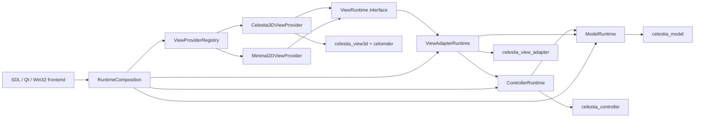
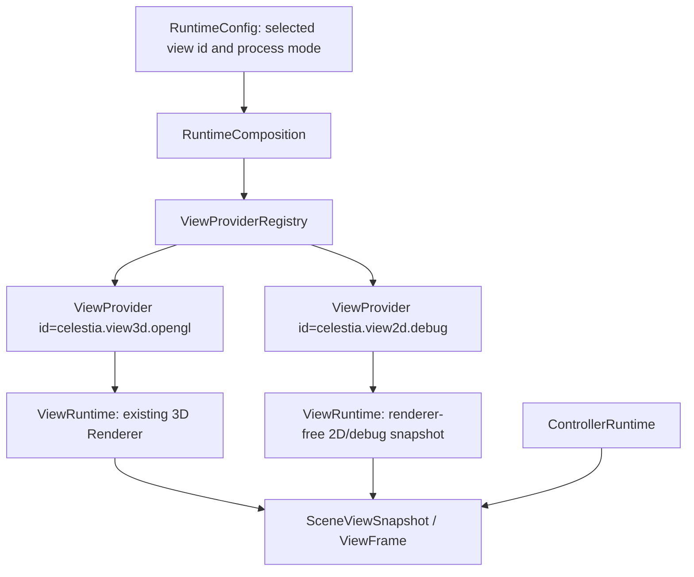
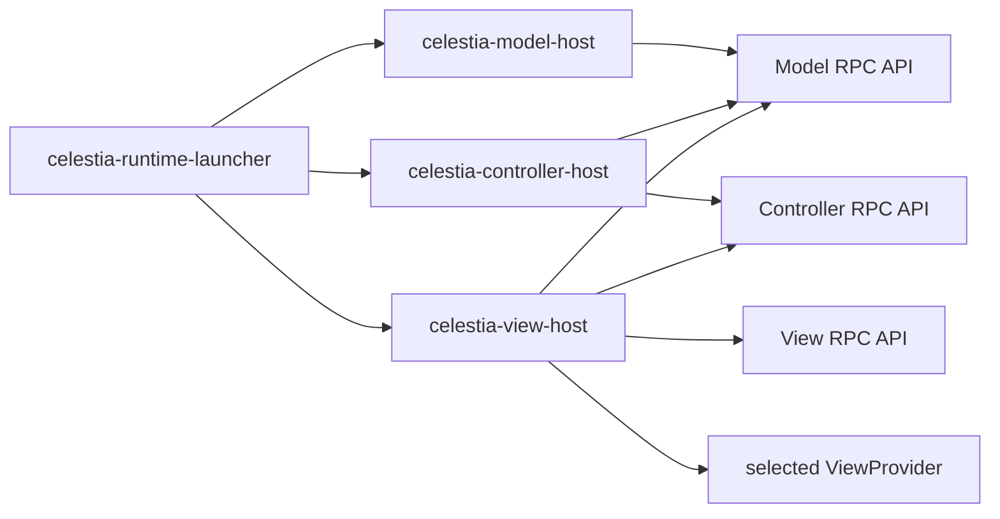

# Celestia MVC Step5 Runtime Decoupling and Plugin Composition Implementation Plan

> **For agentic workers:** REQUIRED SUB-SKILL: Use superpowers:subagent-driven-development (recommended) or superpowers:executing-plans to implement this plan task-by-task. Steps use checkbox (`- [ ]`) syntax for tracking.

**Goal:** 在 Step1-Step4 已完成进程内 MVC 边界收缩、CMake target 固化和源码目录物理重组之后，继续把 Celestia 推进到运行时 MVC 解耦：统一 Runtime 装配接口、View 插件化可替换、M / C / V 可选独立进程运行，并最终移除 Step4 保留的 forwarding header 兼容层。

**Architecture:** Step5 不能作为一个原子提交完成。先把现有 3D View 包装成第一个 `ViewProvider`，让 SDL / Qt / Win32 前端通过 `RuntimeComposition` 装配 Model、Controller、View Adapter 和 View；再引入最小 2D / headless View 证明同一套 runtime contract 可消费不同 View；之后在稳定的 DTO / command / event contract 上增加 IPC channel 和独立进程 host；最后全仓迁移 include 到真实分层路径并删除 forwarding headers。

**Tech Stack:** C++17, CMake OBJECT / STATIC libraries, doctest, existing SDL / Qt / Win32 frontends, JSON or line-delimited message transport for first IPC proof, Visual Studio BuildTools CMake/CTest, SDL runtime smoke, Typora-compatible Mermaid `graph` diagrams.

---

## 0. Step5 结论先行

Step5 要交付的四项能力是：

```text
1. M / V / C 可以分别作为独立 OS 进程运行。
2. View 可以通过统一接口插件化注册、选择和替换。
3. Step4 保留的历史 forwarding headers 被全仓替换并删除。
4. 任意 2D / 3D View 可以通过统一 runtime 装配机制接入。
```

这四项不能合并成一个普通开发步骤。正确落地方式是：

```text
Step5.1 Runtime contract and composition
Step5.2 In-process ViewProvider plugin registry
Step5.3 Second View proof: 2D / headless View through the same contract
Step5.4 IPC message contract and local channel
Step5.5 Optional multi-process hosts for Model / Controller / View
Step5.6 Include API migration and forwarding header removal
Step5.7 Full verification, runtime smoke, and documentation closeout
```

只有 Step5.1-Step5.7 全部完成后，才可以说“Celestia 已经具备运行时 MVC 解耦与插件化装配能力”。

## 1. 当前事实基础

Step4 之后，当前事实是：

```text
src/celengine/model       -> celestia_model
src/celengine/controller  -> celestia_controller
src/celengine/adapter     -> celestia_view_adapter
src/celengine/view3d      -> celestia_view3d
src/celengine/legacy      -> celengine legacy bucket
src/celrender/view3d      -> celrender 3D renderer helpers
src/celestia              -> application shell and SDL / Qt / Win32 frontends
```

CMake 事实是：

```text
src/celengine/CMakeLists.txt:
  add_library(celestia_model OBJECT ...)
  add_library(celestia_controller OBJECT ...)
  add_library(celestia_view_adapter OBJECT ...)
  add_library(celestia_view3d OBJECT ...)

src/celestia/CMakeLists.txt:
  celestia shared library aggregates:
    $<TARGET_OBJECTS:celestia_model>
    $<TARGET_OBJECTS:celestia_controller>
    $<TARGET_OBJECTS:celestia_view_adapter>
    $<TARGET_OBJECTS:celestia_view3d>
```

Step5 不能绕过以下现实约束：

```text
1. CelestiaCore 仍是主要 application shell，并直接持有 Renderer。
2. SDL / Qt / Win32 前端仍有大量 appCore->getRenderer() 直接访问。
3. SceneViewModel 已经提供 renderer-free snapshot proof，但还不是统一 runtime contract。
4. Step4 forwarding headers 仍保护现有 include API，删除前必须先迁移全仓 include。
5. 现有 3D Renderer 依赖 OpenGL / TextureManager / GeometryManager / ShaderManager，不能直接跨进程移动。
```

因此 Step5 的顺序必须是先统一进程内 runtime contract，再做插件化，再做进程边界，最后删除兼容头。

## 2. Step5 非目标

Step5 不做以下事情：

```text
1. 不把 Celestia 变成网络分布式服务。
2. 不承诺第一轮 IPC 就支持远程机器连接。
3. 不把 OpenGL Renderer 立即改造成无状态渲染服务。
4. 不在 ViewProvider 稳定前删除 forwarding headers。
5. 不把 Planet_SIM clean-room 迁移混入 Celestia 本仓库 Step5。
6. 不要求 Qt / Win32 / SDL 三套前端在第一轮同时完成全部插件 UI。
```

Step5 的目标是运行时架构边界和可验证装配能力，不是改写所有 UI 功能。

## 3. 目标架构

### 3.1 运行时依赖方向



约束：

```text
ModelRuntime 不依赖 ViewRuntime。
ControllerRuntime 不依赖 ViewRuntime。
ViewRuntime 可以消费 ControllerRuntime 输出和 ViewAdapterRuntime DTO。
Application frontend 只能通过 RuntimeComposition 获取 ViewProvider，不再直接 new Renderer。
```

### 3.2 插件化装配路径



第一轮插件化只要求进程内选择和替换，不要求动态加载 DLL。动态加载 DLL 可以作为 Step6 或 Step5 后续扩展。

### 3.3 独立进程目标拓扑



第一轮独立进程建议使用本机进程和简单 framed message channel。验收目标是功能闭环，不是吞吐性能。

## 4. 目标文件结构

### 4.1 新增 runtime contract 目录

```text
src/celruntime/
  CMakeLists.txt
  runtimeconfig.h
  runtimeconfig.cpp
  runtimecomposition.h
  runtimecomposition.cpp
  modelruntime.h
  modelruntime.cpp
  controllerruntime.h
  controllerruntime.cpp
  viewadapterruntime.h
  viewadapterruntime.cpp
  viewruntime.h
  viewprovider.h
  viewproviderregistry.h
  viewproviderregistry.cpp
  viewframe.h
  runtimecommand.h
  runtimeevent.h
```

职责：

```text
runtimeconfig.*          解析 selected view id、process mode、data path 等运行时装配选项。
runtimecomposition.*     创建并持有 ModelRuntime / ControllerRuntime / ViewAdapterRuntime / selected ViewRuntime。
modelruntime.*           包装 Universe / catalog / database 初始化入口，不暴露 Renderer。
controllerruntime.*      包装 Simulation / Observer / Selection 推进入口，不暴露 Renderer。
viewadapterruntime.*     包装 SceneViewModel / SelectionPicker / asset adapter 能力。
viewruntime.h            定义 View 的生命周期接口。
viewprovider.h           定义 ViewProvider 元信息和 factory。
viewproviderregistry.*   注册、枚举、选择 ViewProvider。
viewframe.h              定义 View 消费的稳定 DTO，第一轮可从 SceneViewSnapshot 演进。
runtimecommand.h         定义 Controller 输入命令 DTO。
runtimeevent.h           定义 Model / Controller 输出事件 DTO。
```

### 4.2 新增 View provider 目录

```text
src/celestia/viewproviders/
  CMakeLists.txt
  view3dprovider.h
  view3dprovider.cpp
  debug2dprovider.h
  debug2dprovider.cpp
```

职责：

```text
view3dprovider.*    包装现有 Renderer / TextureManager / GeometryManager 初始化路径，成为第一个 ViewProvider。
debug2dprovider.*   使用 ViewFrame / SceneViewSnapshot 输出最小 2D 或 headless debug View，证明不是只有 3D Renderer 能消费 runtime contract。
```

第一轮可以不做完整 UI，只要 `debug2dprovider` 能在测试中消费同一套 ViewFrame 并输出可断言结果。

### 4.3 新增 IPC 和 process host 目录

```text
src/celruntime/ipc/
  message.h
  message.cpp
  channel.h
  localchannel.h
  localchannel.cpp
  processchannel.h
  processchannel.cpp

src/celruntime/process/
  modelhostmain.cpp
  controllerhostmain.cpp
  viewhostmain.cpp
  runtimehostcommon.h
  runtimehostcommon.cpp
```

职责：

```text
message.*          定义 versioned message envelope、command、event、snapshot serialization。
channel.h          抽象 send / receive / close。
localchannel.*     进程内 fake channel，用于先跑通 IPC 语义测试。
processchannel.*   Windows named pipe 或 stdio framed transport 的第一轮实现。
modelhostmain.cpp  独立 Model host 进程入口。
controllerhostmain.cpp 独立 Controller host 进程入口。
viewhostmain.cpp   独立 View host 进程入口，加载 selected ViewProvider。
```

第一轮推荐 `stdio framed transport`，因为 CTest 更容易启动和收集日志。Windows named pipe 可作为后续优化。

### 4.4 修改现有文件

```text
src/CMakeLists.txt
src/celengine/CMakeLists.txt
src/celestia/CMakeLists.txt
src/celestia/sdl/CMakeLists.txt
src/celestia/qt/CMakeLists.txt
src/celestia/win32/CMakeLists.txt
src/celestia/celestiacore.h
src/celestia/celestiacore.cpp
src/celestia/sdl/appwindow.h
src/celestia/sdl/appwindow.cpp
src/celestia/sdl/sdlmain.cpp
src/celestia/qt/qtappwin.cpp
src/celestia/qt/qtglwidget.cpp
src/celestia/win32/winmain.cpp
src/celestia/win32/winmainwindow.cpp
src/celengine/adapter/sceneviewmodel.h
src/celengine/adapter/sceneviewmodel.cpp
test/unit/CMakeLists.txt
```

修改原则：

```text
1. 不在同一任务里同时迁移 include、改运行时装配、做 IPC。
2. 每次只让一个 frontend 改走 RuntimeComposition，优先 SDL，因为它是当前 smoke 验证路径。
3. Qt / Win32 保持兼容路径，等 SDL 跑通后再逐个收敛。
4. 兼容 API 删除只在 Step5.6 执行。
```

## 5. Step5.1 Runtime Contract and Composition

目标：创建 `src/celruntime`，让进程内 runtime 装配有统一入口。此阶段不改变现有启动行为。

### Task 1: 新增 runtime contract target

**Files:**

```text
Create: src/celruntime/CMakeLists.txt
Create: src/celruntime/runtimeconfig.h
Create: src/celruntime/runtimeconfig.cpp
Create: src/celruntime/viewruntime.h
Create: src/celruntime/viewprovider.h
Create: src/celruntime/viewproviderregistry.h
Create: src/celruntime/viewproviderregistry.cpp
Modify: src/CMakeLists.txt
Modify: src/celestia/CMakeLists.txt
Test: test/unit/mvc_step5_runtime_contract_test.cpp
Modify: test/unit/CMakeLists.txt
```

- [ ] **Step 1: 写失败测试**

新增 `test/unit/mvc_step5_runtime_contract_test.cpp`，检查：

```text
src/celruntime/CMakeLists.txt exists
add_library(celestia_runtime appears
runtime target does not include view3d/render.h
ViewProviderRegistry can register two providers and select by id
```

- [ ] **Step 2: 运行失败测试**

```powershell
$ctest = 'C:\Program Files (x86)\Microsoft Visual Studio\18\BuildTools\Common7\IDE\CommonExtensions\Microsoft\CMake\CMake\bin\ctest.exe'
& $ctest --test-dir build-mvc-baseline-rel -R "Step5" --output-on-failure
```

Expected: fail because `mvc_step5_runtime_contract_test.cpp` or `src/celruntime` does not exist.

- [ ] **Step 3: 新增最小 runtime target**

`src/celruntime/CMakeLists.txt` 必须先只包含无 Renderer 的 contract 文件：

```cmake
set(CELESTIA_RUNTIME_SOURCES
  runtimeconfig.cpp
  runtimeconfig.h
  viewprovider.h
  viewproviderregistry.cpp
  viewproviderregistry.h
  viewruntime.h
)

add_library(celestia_runtime OBJECT ${CELESTIA_RUNTIME_SOURCES})
```

- [ ] **Step 4: 接入顶层构建**

`src/CMakeLists.txt` 增加：

```cmake
add_subdirectory(celruntime)
```

`src/celestia/CMakeLists.txt` 在 `CELESTIA_CORE_LIBS` 中加入：

```cmake
$<TARGET_OBJECTS:celestia_runtime>
```

- [ ] **Step 5: 通过测试并提交**

```powershell
$vsdev = 'C:\Program Files (x86)\Microsoft Visual Studio\18\BuildTools\Common7\Tools\VsDevCmd.bat'
$cmake = 'C:\Program Files (x86)\Microsoft Visual Studio\18\BuildTools\Common7\IDE\CommonExtensions\Microsoft\CMake\CMake\bin\cmake.exe'
$ctest = 'C:\Program Files (x86)\Microsoft Visual Studio\18\BuildTools\Common7\IDE\CommonExtensions\Microsoft\CMake\CMake\bin\ctest.exe'
cmd.exe /c "call `"$vsdev`" -arch=x64 -host_arch=x64 >nul && `"$cmake`" --build build-mvc-baseline-rel --config Release && `"$ctest`" --test-dir build-mvc-baseline-rel -R Step5 --output-on-failure"
```

Commit:

```powershell
git add src/CMakeLists.txt src/celruntime src/celestia/CMakeLists.txt test/unit/CMakeLists.txt test/unit/mvc_step5_runtime_contract_test.cpp
git commit -m "feat: add MVC Step5 runtime contract target"
```

### Task 2: RuntimeComposition 包装现有初始化

**Files:**

```text
Create: src/celruntime/runtimecomposition.h
Create: src/celruntime/runtimecomposition.cpp
Create: src/celruntime/modelruntime.h
Create: src/celruntime/modelruntime.cpp
Create: src/celruntime/controllerruntime.h
Create: src/celruntime/controllerruntime.cpp
Create: src/celruntime/viewadapterruntime.h
Create: src/celruntime/viewadapterruntime.cpp
Modify: src/celruntime/CMakeLists.txt
Modify: test/unit/mvc_step5_runtime_contract_test.cpp
```

- [ ] **Step 1: 写 composition 失败测试**

测试必须断言：

```text
RuntimeComposition header does not include render.h
ModelRuntime header does not include render.h
ControllerRuntime header does not include render.h
ViewAdapterRuntime header may include sceneviewmodel.h but not Renderer
```

- [ ] **Step 2: 增加 RuntimeComposition 最小实现**

第一轮只包装对象关系，不迁移 CelestiaCore 行为：

```text
RuntimeComposition owns RuntimeConfig.
RuntimeComposition exposes selectedViewId().
RuntimeComposition exposes ViewProviderRegistry&.
RuntimeComposition can create in-process runtime shells without constructing Renderer.
```

- [ ] **Step 3: 验证不引入 View3D 依赖**

运行：

```powershell
& $ctest --test-dir build-mvc-baseline-rel -R "runtime|Step5" --output-on-failure
```

Expected: Step5 tests pass.

- [ ] **Step 4: 提交**

```powershell
git add src/celruntime test/unit/mvc_step5_runtime_contract_test.cpp
git commit -m "feat: introduce MVC runtime composition shells"
```

## 6. Step5.2 In-Process ViewProvider Plugin Registry

目标：把现有 3D View 改造成第一个可注册 ViewProvider。此阶段仍然是同进程运行，不做 IPC。

### Task 3: 包装现有 3D Renderer 为 ViewProvider

**Files:**

```text
Create: src/celestia/viewproviders/CMakeLists.txt
Create: src/celestia/viewproviders/view3dprovider.h
Create: src/celestia/viewproviders/view3dprovider.cpp
Modify: src/celestia/CMakeLists.txt
Modify: src/celestia/celestiacore.h
Modify: src/celestia/celestiacore.cpp
Test: test/unit/mvc_step5_view_provider_test.cpp
Modify: test/unit/CMakeLists.txt
```

- [ ] **Step 1: 写 ViewProvider registry 失败测试**

测试断言：

```text
ViewProvider id "celestia.view3d.opengl" can be registered.
ViewProvider metadata reports dimension "3d".
ViewProvider factory returns a ViewRuntime pointer in test fake mode.
CelestiaCore header no longer forces callers to include render.h through the new provider API.
```

- [ ] **Step 2: 新增 view3dprovider**

`view3dprovider` 包装现有 Renderer 生命周期，短期允许内部继续使用：

```text
Renderer
TextureManager
GeometryManager
SelectionPicker
BodyRenderAssets
StarRenderAssets
NebulaRenderAssets
```

但这些类型只能出现在 provider `.cpp` 或 provider-private header 中，不能污染 `viewprovider.h` / `viewruntime.h`。

- [ ] **Step 3: CelestiaCore 增加 provider 装配入口**

新增接口建议：

```cpp
bool initRuntimeView(const celestia::runtime::RuntimeConfig&);
celestia::runtime::ViewRuntime* getActiveViewRuntime() const;
```

保留 `getRenderer()` 作为 legacy bridge，不在本任务删除。

- [ ] **Step 4: SDL 仍按旧路径启动**

此任务的验收不是改 SDL，而是证明旧路径未破坏：

```powershell
cmd.exe /c "call `"$vsdev`" -arch=x64 -host_arch=x64 >nul && `"$cmake`" --build build-mvc-sdl-rel --config Release && `"$ctest`" --test-dir build-mvc-sdl-rel -R Step5 --output-on-failure"
```

- [ ] **Step 5: 提交**

```powershell
git add src/celestia/viewproviders src/celestia/CMakeLists.txt src/celestia/celestiacore.* test/unit/CMakeLists.txt test/unit/mvc_step5_view_provider_test.cpp
git commit -m "feat: wrap 3D renderer as MVC view provider"
```

### Task 4: SDL 前端改走 RuntimeComposition

**Files:**

```text
Modify: src/celestia/sdl/appwindow.h
Modify: src/celestia/sdl/appwindow.cpp
Modify: src/celestia/sdl/sdlmain.cpp
Modify: src/celestia/sdl/CMakeLists.txt
Test: test/unit/mvc_step5_frontend_contract_test.cpp
```

- [ ] **Step 1: 写 SDL 依赖收敛测试**

测试扫描 SDL 文件：

```text
sdlmain.cpp may parse RuntimeConfig.
appwindow.cpp may call initRuntimeView.
new direct getRenderer() calls are forbidden outside documented legacy bridge blocks.
```

- [ ] **Step 2: SDL 增加 view 选择参数**

第一轮参数：

```text
--view=celestia.view3d.opengl
```

默认值：

```text
celestia.view3d.opengl
```

- [ ] **Step 3: SDL 通过 RuntimeComposition 启动 3D View**

保留视觉行为不变：

```text
SDL window creates CelestiaCore.
SDL parses RuntimeConfig.
CelestiaCore registers built-in ViewProviders.
CelestiaCore initializes selected ViewProvider.
Existing 3D Renderer still renders same scene.
```

- [ ] **Step 4: SDL smoke**

刷新数据并启动：

```powershell
& $cmake --install build-mvc-sdl-rel --prefix (Resolve-Path 'build-mvc-sdl-rel\run-full').Path --component core
Start-Process -FilePath (Resolve-Path 'build-mvc-sdl-rel\src\celestia\sdl\celestia-sdl.exe').Path -ArgumentList @('--dir', (Resolve-Path 'build-mvc-sdl-rel\run-full').Path, '--view=celestia.view3d.opengl') -WindowStyle Normal
```

验收：

```text
No missing DLL dialog.
No red text shader blocks.
Main Celestia window renders with the selected ViewProvider.
```

- [ ] **Step 5: 提交**

```powershell
git add src/celestia/sdl test/unit/mvc_step5_frontend_contract_test.cpp
git commit -m "feat: route SDL startup through MVC runtime composition"
```

## 7. Step5.3 Second View Proof

目标：证明“只做一个 2D View 就能接入”的前提成立，即新 View 不需要改 Model / Controller。

### Task 5: 抽出稳定 ViewFrame DTO

**Files:**

```text
Create: src/celruntime/viewframe.h
Modify: src/celengine/adapter/sceneviewmodel.h
Modify: src/celengine/adapter/sceneviewmodel.cpp
Modify: src/celruntime/CMakeLists.txt
Test: test/unit/mvc_step5_view_frame_test.cpp
```

- [ ] **Step 1: 写 DTO 边界测试**

测试断言：

```text
viewframe.h does not include render.h, meshmanager.h, texmanager.h, shadermanager.h.
SceneViewModel builds data compatible with ViewFrame.
ViewFrame can be consumed without linking celestia_view3d.
```

- [ ] **Step 2: 从 SceneViewSnapshot 演进到 ViewFrame**

第一轮字段只包含现有测试可证明的内容：

```text
time
selection id / type
positionKm
visible
clickable
```

不要在第一轮加入 Renderer-only 字段。

- [ ] **Step 3: 更新 SceneViewModel**

`SceneViewModel` 继续属于 View Adapter，但输出类型迁移到 `celruntime/viewframe.h`。

- [ ] **Step 4: 提交**

```powershell
git add src/celruntime/viewframe.h src/celengine/adapter/sceneviewmodel.* src/celruntime/CMakeLists.txt test/unit/mvc_step5_view_frame_test.cpp
git commit -m "feat: define renderer-free MVC view frame"
```

### Task 6: 新增 debug2d ViewProvider

**Files:**

```text
Create: src/celestia/viewproviders/debug2dprovider.h
Create: src/celestia/viewproviders/debug2dprovider.cpp
Modify: src/celestia/viewproviders/CMakeLists.txt
Test: test/unit/mvc_step5_debug2d_view_test.cpp
```

- [ ] **Step 1: 写第二 View 失败测试**

测试断言：

```text
ViewProviderRegistry can register "celestia.view2d.debug".
debug2d provider consumes ViewFrame.
debug2d provider does not include render.h or link celestia_view3d.
same RuntimeComposition can select view3d or debug2d by id.
```

- [ ] **Step 2: 实现 debug2d provider**

第一轮可以是 headless / textual / ImGui-free provider。输出示例：

```text
time=2451545.0 selections=1 selected=Earth visible=true clickable=true
```

这足以证明 2D / 非 3D View 可消费同一 runtime contract。

- [ ] **Step 3: SDL 支持选择 debug2d**

命令：

```powershell
build-mvc-sdl-rel\src\celestia\sdl\celestia-sdl.exe --dir build-mvc-sdl-rel\run-full --view=celestia.view2d.debug
```

第一轮可以只在 console / log 中输出 ViewFrame，不要求完整 2D GUI。

- [ ] **Step 4: 提交**

```powershell
git add src/celestia/viewproviders src/celestia/sdl test/unit/mvc_step5_debug2d_view_test.cpp
git commit -m "feat: add debug 2D MVC view provider"
```

## 8. Step5.4 IPC Message Contract and Local Channel

目标：在不启动多进程前，先让 command / event / snapshot 走统一 channel，避免进程化时再发明协议。

### Task 7: 定义 versioned IPC message

**Files:**

```text
Create: src/celruntime/ipc/message.h
Create: src/celruntime/ipc/message.cpp
Create: src/celruntime/ipc/channel.h
Create: src/celruntime/ipc/localchannel.h
Create: src/celruntime/ipc/localchannel.cpp
Modify: src/celruntime/CMakeLists.txt
Test: test/unit/mvc_step5_ipc_contract_test.cpp
```

- [ ] **Step 1: 写消息协议失败测试**

测试断言：

```text
message envelope has protocolVersion.
message envelope has kind: command, event, viewFrame, error.
unknown protocolVersion is rejected.
localchannel preserves message order.
message serialization roundtrips ViewFrame.
```

- [ ] **Step 2: 实现本地 channel**

`localchannel` 使用内存队列，不启动进程，先证明协议语义。

- [ ] **Step 3: 连接 RuntimeComposition**

`RuntimeComposition` 支持两种 mode：

```text
in_process_direct
in_process_channel
```

`in_process_channel` 仍在一个进程中运行，但 command / event / ViewFrame 通过 `Channel` 传递。

- [ ] **Step 4: 提交**

```powershell
git add src/celruntime test/unit/mvc_step5_ipc_contract_test.cpp
git commit -m "feat: add MVC runtime IPC message contract"
```

## 9. Step5.5 Optional Multi-Process Hosts

目标：让 M / C / V 可以分别起进程。第一轮只要求本机启动、握手、推进一帧、退出，不要求完整 UI 功能全量等价。

### Task 8: 新增 host executables

**Files:**

```text
Create: src/celruntime/process/modelhostmain.cpp
Create: src/celruntime/process/controllerhostmain.cpp
Create: src/celruntime/process/viewhostmain.cpp
Create: src/celruntime/process/runtimehostcommon.h
Create: src/celruntime/process/runtimehostcommon.cpp
Modify: src/celruntime/CMakeLists.txt
Test: test/unit/mvc_step5_process_contract_test.cpp
```

- [ ] **Step 1: 写 host target 失败测试**

测试扫描 CMake：

```text
add_executable(celestia-model-host ...)
add_executable(celestia-controller-host ...)
add_executable(celestia-view-host ...)
```

- [ ] **Step 2: 实现 host 最小入口**

每个 host 必须支持：

```text
--stdio
--protocol-version=1
--view=celestia.view2d.debug
--once
```

`--once` 模式用于 CTest：握手、处理一条消息、输出结果、退出。

- [ ] **Step 3: CTest 启动 host smoke**

测试策略：

```text
Start model host with --once.
Start controller host with --once.
Start view host with --once --view=celestia.view2d.debug.
Send handshake message.
Expect protocol ack.
Expect clean exit code 0.
```

- [ ] **Step 4: 提交**

```powershell
git add src/celruntime test/unit/mvc_step5_process_contract_test.cpp
git commit -m "feat: add optional MVC process hosts"
```

### Task 9: SDL launcher 支持 process mode

**Files:**

```text
Modify: src/celestia/sdl/sdlmain.cpp
Modify: src/celestia/sdl/appwindow.cpp
Modify: src/celruntime/runtimeconfig.*
Test: test/unit/mvc_step5_process_mode_test.cpp
```

- [ ] **Step 1: 写 process mode 配置测试**

支持参数：

```text
--mvc-mode=in-process
--mvc-mode=multi-process
--view=celestia.view3d.opengl
--view=celestia.view2d.debug
```

- [ ] **Step 2: in-process 保持默认**

默认值必须保持：

```text
--mvc-mode=in-process
--view=celestia.view3d.opengl
```

这样不破坏普通用户启动路径。

- [ ] **Step 3: multi-process 第一轮只支持 debug2d**

第一轮建议只允许：

```text
--mvc-mode=multi-process --view=celestia.view2d.debug
```

现有 OpenGL 3D View 跨进程需要窗口上下文、资源句柄和 GPU 生命周期设计，不应作为第一轮验收。

- [ ] **Step 4: 提交**

```powershell
git add src/celestia/sdl src/celruntime test/unit/mvc_step5_process_mode_test.cpp
git commit -m "feat: add MVC runtime process mode selection"
```

## 10. Step5.6 Include API Migration and Forwarding Header Removal

目标：删除 Step4 兼容 forwarding headers，使源码 include 与物理目录一致。

### Task 10: 全仓 include 迁移

**Files:**

```text
Modify: src/**/*.h
Modify: src/**/*.cpp
Modify: test/**/*.cpp
Test: test/unit/mvc_step5_forwarding_header_removal_test.cpp
```

- [ ] **Step 1: 写 forwarding header 失败测试**

测试断言第一阶段：

```text
root forwarding headers still exist before migration.
all new Step5 files must include real ownership paths, not root forwarding headers.
```

测试断言第二阶段：

```text
src/celengine/body.h does not exist.
src/celengine/simulation.h does not exist.
src/celengine/render.h does not exist.
src/celrender/ringrenderer.h does not exist.
src/celrender/gl/binder.h does not exist.
No source file includes <celengine/body.h> or "body.h" when real path should be model/body.h.
```

- [ ] **Step 2: 分批替换 include**

替换规则：

```text
celengine/body.h              -> celengine/model/body.h
celengine/simulation.h        -> celengine/controller/simulation.h
celengine/selectionpicker.h   -> celengine/adapter/selectionpicker.h
celengine/render.h            -> celengine/view3d/render.h
celengine/galaxy.h            -> celengine/legacy/galaxy.h
celrender/ringrenderer.h      -> celrender/view3d/ringrenderer.h
celrender/gl/binder.h         -> celrender/view3d/gl/binder.h
```

不要用一次性盲替换提交。按目录顺序提交：

```text
src/celengine
src/celrender
src/celestia
src/celscript and support libraries
test
```

- [ ] **Step 3: 删除 forwarding headers**

用 `git rm` 删除：

```text
src/celengine/*.h forwarding headers
src/celrender/*.h forwarding headers
src/celrender/gl/*.h forwarding headers
```

只删除确认为 forwarding header 的文件，不删除真实实现头。

- [ ] **Step 4: 全量验证**

```powershell
cmd.exe /c "call `"$vsdev`" -arch=x64 -host_arch=x64 >nul && `"$cmake`" --build build-mvc-baseline-rel --config Release && `"$ctest`" --test-dir build-mvc-baseline-rel --output-on-failure"
cmd.exe /c "call `"$vsdev`" -arch=x64 -host_arch=x64 >nul && `"$cmake`" --build build-mvc-sdl-rel --config Release && `"$ctest`" --test-dir build-mvc-sdl-rel --output-on-failure"
```

- [ ] **Step 5: 提交**

```powershell
git add src test
git commit -m "refactor: remove MVC forwarding headers"
```

## 11. Step5.7 Verification and Closeout

Step5 完成前必须通过：

```text
1. git diff --check
2. build-mvc-baseline-rel build
3. build-mvc-baseline-rel full ctest
4. build-mvc-sdl-rel build
5. build-mvc-sdl-rel full ctest
6. SDL smoke with --view=celestia.view3d.opengl
7. SDL or host smoke with --view=celestia.view2d.debug
8. process host smoke for model / controller / view --once mode
9. include removal test proves forwarding headers are gone
10. docs updated with final evidence
```

推荐命令：

```powershell
git diff --check

$vsdev = 'C:\Program Files (x86)\Microsoft Visual Studio\18\BuildTools\Common7\Tools\VsDevCmd.bat'
$cmake = 'C:\Program Files (x86)\Microsoft Visual Studio\18\BuildTools\Common7\IDE\CommonExtensions\Microsoft\CMake\CMake\bin\cmake.exe'
$ctest = 'C:\Program Files (x86)\Microsoft Visual Studio\18\BuildTools\Common7\IDE\CommonExtensions\Microsoft\CMake\CMake\bin\ctest.exe'

cmd.exe /c "call `"$vsdev`" -arch=x64 -host_arch=x64 >nul && `"$cmake`" --build build-mvc-baseline-rel --config Release && `"$ctest`" --test-dir build-mvc-baseline-rel --output-on-failure"
cmd.exe /c "call `"$vsdev`" -arch=x64 -host_arch=x64 >nul && `"$cmake`" --build build-mvc-sdl-rel --config Release && `"$ctest`" --test-dir build-mvc-sdl-rel --output-on-failure"
& $cmake --install build-mvc-sdl-rel --prefix (Resolve-Path 'build-mvc-sdl-rel\run-full').Path --component core
```

SDL 3D smoke：

```powershell
Start-Process -FilePath (Resolve-Path 'build-mvc-sdl-rel\src\celestia\sdl\celestia-sdl.exe').Path -ArgumentList @('--dir', (Resolve-Path 'build-mvc-sdl-rel\run-full').Path, '--mvc-mode=in-process', '--view=celestia.view3d.opengl') -WindowStyle Normal
```

Debug 2D / process smoke：

```powershell
& build-mvc-sdl-rel\src\celestia\sdl\celestia-sdl.exe --dir build-mvc-sdl-rel\run-full --mvc-mode=in-process --view=celestia.view2d.debug --once
& build-mvc-sdl-rel\src\celruntime\process\celestia-model-host.exe --stdio --protocol-version=1 --once
& build-mvc-sdl-rel\src\celruntime\process\celestia-controller-host.exe --stdio --protocol-version=1 --once
& build-mvc-sdl-rel\src\celruntime\process\celestia-view-host.exe --stdio --protocol-version=1 --view=celestia.view2d.debug --once
```

## 12. 验收口径

Step5 完成后可以说：

```text
Celestia 已经具备统一 RuntimeComposition 装配机制。
现有 3D View 已经作为 ViewProvider 接入统一装配接口。
至少一个非 3D / debug 2D View 已经通过同一 ViewRuntime contract 消费 Model / Controller 输出。
Model / Controller / View 已经具备本机独立进程 host 和 IPC message contract 的最小可运行闭环。
Step4 forwarding headers 已经删除，include API 与物理目录一致。
```

Step5 完成后仍不能自动说：

```text
Celestia 已经是高性能分布式系统。
OpenGL 3D View 已经完整跨进程渲染。
所有第三方插件都可以二进制热加载。
Planet_SIM 已经完成 clean-room 迁移。
```

如果需要“3D View 跨进程渲染”和“二进制 DLL 插件热加载”，建议定义为 Step6，而不是塞入 Step5 第一轮。

## 13. 风险和缓解

| 风险 | 表现 | 缓解 |
| --- | --- | --- |
| 直接从多进程开始 | Renderer、窗口、GPU 上下文、资源路径和 catalog 初始化同时出错 | 先完成进程内 ViewProvider，再做 IPC |
| ViewProvider 接口过大 | 2D View 被迫实现 3D Renderer 专属能力 | 第一轮 ViewRuntime 只接受 ViewFrame、RuntimeCommand、RuntimeEvent |
| 删除 forwarding headers 过早 | 大量 include 编译错误掩盖 runtime 设计问题 | include 迁移放到 Step5.6 |
| Qt / Win32 / SDL 同时改 | 失败面过大，无法定位 | 先 SDL，再 Qt / Win32 |
| IPC 协议直接绑定 C++ 指针 | 进程边界不可用 | 所有跨边界数据必须是 versioned DTO |
| Debug 2D View 做成玩具 | 无法证明任意 View 可接入 | Debug 2D 必须通过同一 RuntimeComposition 和 ViewProviderRegistry 选择 |

## 14. 推荐提交节奏

```text
1. feat: add MVC Step5 runtime contract target
2. feat: introduce MVC runtime composition shells
3. feat: wrap 3D renderer as MVC view provider
4. feat: route SDL startup through MVC runtime composition
5. feat: define renderer-free MVC view frame
6. feat: add debug 2D MVC view provider
7. feat: add MVC runtime IPC message contract
8. feat: add optional MVC process hosts
9. feat: add MVC runtime process mode selection
10. refactor: remove MVC forwarding headers
11. docs: record MVC Step5 runtime decoupling evidence
```

每个提交都必须保持 baseline build 和相关 Step5 focused tests 通过。跨阶段合并到 `master` 前必须跑 baseline / SDL 双构建、全量 `ctest`、SDL 3D smoke、debug 2D smoke 和 process host smoke。

## 15. 2026-06-25 落地验收记录

本轮 Step5 已在 `codex/celestia-mvc-step5` 分支完成第一轮运行时解耦与插件化装配落地。实际提交序列为：

```text
44fcf26 docs: add MVC Step5 implementation plan
34d7842 feat: add MVC Step5 runtime contract target
4d95048 feat: introduce MVC runtime composition shells
9933d44 feat: wrap 3D renderer as MVC view provider
50748d7 feat: add MVC runtime view bridge to CelestiaCore
fe11e58 feat: define renderer-free MVC view frame
ce13ad1 feat: add debug 2D MVC view provider
dbc41fb feat: add MVC runtime IPC message contract
f7db9d1 feat: add MVC runtime process hosts
58a9747 refactor: remove MVC forwarding headers
c6adc5a feat: add MVC runtime process mode selection
```

### 15.1 已落地能力

| 能力项 | 验收结论 | 代码 / 测试抓手 |
| --- | --- | --- |
| 统一 runtime contract target | 已落地 | `src/celruntime`、`runtime contract target is renderer-free` |
| RuntimeComposition / ViewProviderRegistry | 已落地 | `same RuntimeComposition can select 3D or debug 2D providers` |
| 现有 3D ViewProvider 化 | 已落地 | `OpenGL 3D view provider registers without exposing renderer in public API` |
| Debug 2D ViewProvider | 已落地 | `debug 2D provider consumes ViewFrame through ViewRuntime` |
| renderer-free ViewFrame DTO | 已落地 | `view frame DTO is renderer-free and consumable without a renderer` |
| IPC message contract / local channel | 已落地 | `message envelope is versioned and supports all runtime message kinds`、`local channel preserves message order` |
| M / C / V process host | 已落地最小闭环 | `celestia-model-host`、`celestia-controller-host`、`celestia-view-host`、`process hosts support stdio once handshake` |
| SDL runtime mode selection | 已落地 | `--mvc-mode=in-process`、`--mvc-mode=in-process-channel`、`--mvc-mode=multi-process` |
| forwarding headers 删除 | 已落地 | `Step5 removes public celengine forwarding headers after include migration`、`source includes real ownership paths instead of root forwarding headers` |

### 15.2 本轮验证命令和结果

Baseline 构建与全量测试：

```powershell
cmd.exe /c "call `"$vsdev`" -arch=x64 -host_arch=x64 >nul && `"$cmake`" --build build-mvc-baseline-rel --config Release && `"$ctest`" --test-dir build-mvc-baseline-rel --output-on-failure"
```

结果：

```text
ninja: no work to do.
100% tests passed, 0 tests failed out of 86
```

SDL 构建与全量测试：

```powershell
cmd.exe /c "call `"$vsdev`" -arch=x64 -host_arch=x64 >nul && `"$cmake`" --build build-mvc-sdl-rel --config Release && `"$ctest`" --test-dir build-mvc-sdl-rel --output-on-failure"
```

结果：

```text
ninja: no work to do.
100% tests passed, 0 tests failed out of 86
```

运行目录安装：

```powershell
& $cmake --install build-mvc-sdl-rel --prefix (Resolve-Path 'build-mvc-sdl-rel\run-full').Path --component core
```

结果：`run-full` 中已部署 `celestia.dll`、`jpeg62.dll`、`freetype.dll`、字体、shader、texture 链接等运行资源。

Multi-process / Debug 2D once smoke：

```powershell
& build-mvc-sdl-rel\src\celestia\sdl\celestia-sdl.exe --dir build-mvc-sdl-rel\run-full --mvc-mode=multi-process --view=celestia.view2d.debug --once
```

结果：进程退出码 `0`。该路径通过 SDL 入口调起 `celestia-model-host`、`celestia-controller-host`、`celestia-view-host` 并完成 `runtime.handshake` / `runtime.ack` 最小闭环。

3D View smoke：

```powershell
Start-Process -FilePath (Resolve-Path 'build-mvc-sdl-rel\src\celestia\sdl\celestia-sdl.exe').Path -ArgumentList @('--dir', (Resolve-Path 'build-mvc-sdl-rel\run-full').Path, '--mvc-mode=in-process', '--view=celestia.view3d.opengl') -WorkingDirectory (Resolve-Path 'build-mvc-sdl-rel\run-full').Path -WindowStyle Normal
```

结果：

```text
Process: celestia-sdl.exe
Window title: Celestia
Window alive after 8 seconds: yes
Screenshot: build-mvc-sdl-rel\celestia-step5-3d-smoke.png
Sampled pixels: 56994
Non-black samples: 13634
Red-ish samples: 19
Red-ish ratio: 0.0003
```

人工检查截图结果：3D 地球、星空、轨道线和左上角文字均正常渲染，没有缺 DLL 对话框，也没有文字变成红色色块的异常。

### 15.3 本轮边界

Step5 当前可以作为“运行时装配层、ViewProvider 接入、IPC 合约、进程 host 最小闭环、include API 与物理目录一致”的完成点。

Step5 当前仍不应表述为：

```text
OpenGL 3D View 已经跨进程渲染。
View 已经支持任意第三方 DLL 二进制热加载和热替换。
M / V / C 已经具备远程网络分布式部署能力。
所有历史兼容 API 已经从外部生态中清理完成。
```

这些能力建议作为 Step6 定义，前置条件是先确定二进制插件 ABI、进程间渲染策略、runtime lifecycle、跨进程资源所有权和失败恢复机制。
