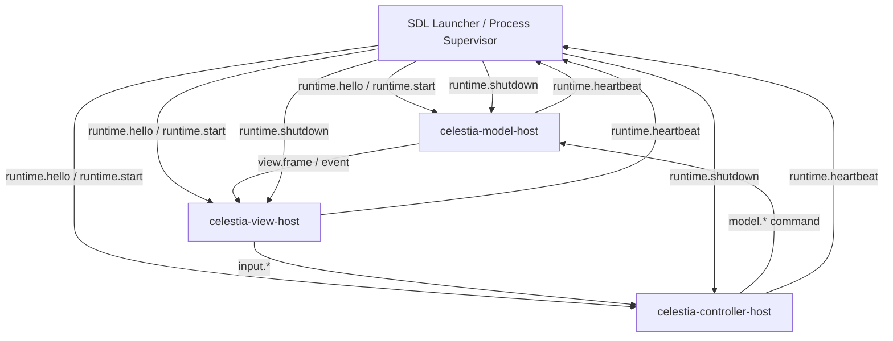

# Celestia MVC Step6 Runtime Protocol and Long-Running Process Implementation Plan

> **For agentic workers:** REQUIRED SUB-SKILL: Use `superpowers:subagent-driven-development` or `superpowers:executing-plans` to implement this plan task-by-task. Steps use checkbox (`- [ ]`) syntax for tracking.

**Goal:** 将 Step5 的一次性 M / C / V host 握手升级为协议清晰、可测试、可长期运行的本机三进程 MVC runtime 最小闭环。

**Architecture:** 先定义 transport-independent 的 `MVC Runtime Protocol v1`，再把 `stdio` 握手升级为 framed persistent transport，最后让 `celestia-model-host`、`celestia-controller-host`、`celestia-view-host` 进入长期 lifecycle。Step6 第一轮以 Debug 2D / headless View 验收三进程常驻闭环，不承诺 OpenGL 3D 跨进程渲染和 DLL 热插拔。

**Tech Stack:** C++17, CMake, doctest, existing `celestia_runtime`, current SDL launcher, current `ViewFrame`, framed IPC messages, Visual Studio BuildTools CMake/CTest, SDL/process smoke tests.

---

## 1. Step6 定位

Step5 已完成：

```text
RuntimeComposition / ViewProviderRegistry
现有 3D ViewProvider 接入
Debug 2D ViewProvider
ViewFrame DTO
RuntimeMessage / LocalChannel
model/controller/view 三个 host exe
stdio + --once + runtime.handshake / runtime.ack 最小闭环
```

Step5 仍未完成：

```text
M / C / V 三进程长期运行
Controller -> Model 持续命令流
Model -> View 持续状态流
View -> Controller 持续输入事件流
Model host 内真实仿真生命周期
OpenGL 3D View 跨进程窗口 / context / GPU 资源所有权
二进制 DLL 插件热插拔
```

Step6 的核心是把“能启动并握手”提升为“能长期在线并持续交换 MVC runtime 消息”。

## 2. Step6 验收口径

Step6 完成后可以说：

```text
Celestia 已具备 MVC Runtime Protocol v1。
M / C / V host 已具备长期运行 lifecycle，不再只依赖 --once。
M / C / V host 可以在本机通过统一 transport 持续交换 command / event / viewFrame / heartbeat / shutdown 消息。
Debug 2D 或 headless View 已能通过三进程路径持续消费 Model 输出。
SDL launcher 已具备 multi-process serve / smoke 入口，用于启动、监控、关闭三类 host。
```

Step6 完成后仍不能自动说：

```text
OpenGL 3D View 已经跨进程实时渲染。
任意第三方 View DLL 已经可以热加载 / 热替换。
M / V / C 已经可以跨机器分布式部署。
共享内存高吞吐数据面已经完成。
```

这些能力建议拆为：

```text
Step7: 3D View 跨进程渲染与 GPU 资源边界
Step8: 二进制插件 ABI / DLL hot reload
Step9: shared memory 数据面与远程 transport
```

## 3. 推荐方案

### 3.1 为什么先协议

M / V / C 一旦拆成独立进程，原来的 C++ 直接调用就失效：

```text
Controller 不能直接调用 Model 方法。
View 不能直接读 Model 对象。
View 不能依赖 Simulation / Renderer 指针穿透进程边界。
```

因此 Step6 必须先定义：

```text
谁向谁发送消息
消息有哪些类型
payload 如何版本化
错误和 shutdown 如何传播
长期连接如何心跳和恢复
ViewFrame / Command / Event 如何序列化
```

### 3.2 Transport 选择

Step6 第一轮推荐：

```text
协议层：RuntimeEnvelope + RuntimePayload
传输层：FramedTransport 接口
第一实现：Persistent stdio transport
第二实现：Loopback TCP 或 Windows named pipe 作为后续扩展点
高吞吐数据面：只预留 shared memory hook，不在 Step6 第一轮实现
```

原因：

```text
stdio 已经在 Step5 跑通，迁移成本低。
framed stdio 可以支持长期进程，不再只是一条握手消息。
transport 抽象能避免未来换 named pipe / TCP / shared memory 时推翻协议。
Debug 2D / headless View 足够证明三进程长期 MVC，不必先处理 OpenGL context。
```

## 4. 目标目录结构

Step6 完成后新增或扩展的核心结构：

```text
src/celruntime/
  protocol/
    envelope.h/.cpp
    lifecycle.h
    command.h
    event.h
    payloadtype.h
  transport/
    framedtransport.h
    framedmessage.h/.cpp
    stdiotransport.h/.cpp
  process/
    runtimehostcommon.h/.cpp
    runtimehostloop.h/.cpp
    modelhostmain.cpp
    controllerhostmain.cpp
    viewhostmain.cpp
  model/
    modelservice.h/.cpp
    modelsnapshot.h
  controller/
    controllerservice.h/.cpp
  view/
    viewservice.h/.cpp
```

测试文件：

```text
test/unit/mvc_step6_protocol_contract_test.cpp
test/unit/mvc_step6_transport_contract_test.cpp
test/unit/mvc_step6_host_lifecycle_test.cpp
test/unit/mvc_step6_multiprocess_runtime_test.cpp
```

## 5. Runtime Protocol v1

### 5.1 Envelope

每条跨进程消息都必须有统一 envelope：

```text
protocolVersion: 1
sessionId: string
sequenceId: uint64
timestampUs: int64
sourceRole: launcher | model | controller | view
targetRole: launcher | model | controller | view | broadcast
kind: lifecycle | command | event | viewFrame | heartbeat | error
name: string
payloadEncoding: text | binary | none
payload: string or bytes
```

### 5.2 Lifecycle 消息

```text
runtime.hello
runtime.ready
runtime.start
runtime.pause
runtime.resume
runtime.shutdown
runtime.stopped
runtime.heartbeat
runtime.error
```

### 5.3 Controller -> Model 命令

第一轮只做能驱动长期闭环的最小命令：

```text
model.setTime
model.setTimeScale
model.step
model.setPaused
model.selectObject
model.setObserver
model.requestSnapshot
```

### 5.4 Model -> View 状态

第一轮以 `ViewFrame` 为边界，不传 C++ 指针：

```text
view.frame
view.selectionChanged
view.timeChanged
view.error
```

`view.frame` payload 先复用 Step5 的 `ViewFrame` 字段：

```text
frameId
simulationTime
observerPosition
selections[]
summary
```

### 5.5 View -> Controller 事件

第一轮只做 Debug 2D / headless 可验证输入：

```text
input.key
input.mouse
input.resize
input.closeRequested
input.selectRequested
```

## 6. 数据流



## 7. 任务拆分

### Task 1: 固化 Protocol v1 合约

**Files:**

- Create: `src/celruntime/protocol/envelope.h`
- Create: `src/celruntime/protocol/envelope.cpp`
- Create: `src/celruntime/protocol/lifecycle.h`
- Create: `src/celruntime/protocol/payloadtype.h`
- Modify: `src/celruntime/CMakeLists.txt`
- Test: `test/unit/mvc_step6_protocol_contract_test.cpp`
- Modify: `test/unit/CMakeLists.txt`

- [x] **Step 1: 写失败测试**

测试必须断言：

```text
RuntimeEnvelope 默认 protocolVersion 为 1。
sequenceId 必须保留。
sourceRole / targetRole / kind / name 必须序列化。
未知 protocolVersion 必须拒绝。
runtime.hello / runtime.ready / runtime.shutdown 工厂函数可用。
```

Run:

```powershell
& $ctest --test-dir build-mvc-baseline-rel -R "MVC Step6 protocol" --output-on-failure
```

Expected:

```text
0 tests passed
The following tests FAILED
MVC Step6 protocol
```

- [x] **Step 2: 实现 `RuntimeEnvelope`**

接口要求：

```cpp
namespace celestia::runtime::protocol
{
enum class RuntimeRole { Launcher, Model, Controller, View, Broadcast };
enum class RuntimeMessageKind { Lifecycle, Command, Event, ViewFrame, Heartbeat, Error };

struct RuntimeEnvelope
{
    int protocolVersion{1};
    std::string sessionId;
    std::uint64_t sequenceId{0};
    std::int64_t timestampUs{0};
    RuntimeRole sourceRole{RuntimeRole::Launcher};
    RuntimeRole targetRole{RuntimeRole::Broadcast};
    RuntimeMessageKind kind{RuntimeMessageKind::Lifecycle};
    std::string name;
    std::string payload;
};

std::string serializeEnvelope(const RuntimeEnvelope&);
std::optional<RuntimeEnvelope> deserializeEnvelope(std::string_view);
RuntimeEnvelope lifecycle(RuntimeRole source, RuntimeRole target, std::string name);
}
```

- [x] **Step 3: 运行测试并提交**

Run:

```powershell
cmd.exe /c "call `"$vsdev`" -arch=x64 -host_arch=x64 >nul && `"$cmake`" --build build-mvc-baseline-rel --config Release && `"$ctest`" --test-dir build-mvc-baseline-rel -R \"MVC Step6 protocol\" --output-on-failure"
```

Expected:

```text
100% tests passed
```

Commit:

```powershell
git add src/celruntime test/unit
git commit -m "feat: define MVC runtime protocol v1 envelope"
```

### Task 2: 实现 framed persistent transport

**Files:**

- Create: `src/celruntime/transport/framedtransport.h`
- Create: `src/celruntime/transport/framedmessage.h`
- Create: `src/celruntime/transport/framedmessage.cpp`
- Create: `src/celruntime/transport/stdiotransport.h`
- Create: `src/celruntime/transport/stdiotransport.cpp`
- Modify: `src/celruntime/CMakeLists.txt`
- Test: `test/unit/mvc_step6_transport_contract_test.cpp`

- [x] **Step 1: 写失败测试**

测试必须覆盖：

```text
一条 envelope 可以被 frame 成 length-prefixed message。
连续两条 frame 可以按顺序读取。
不完整 frame 返回 retry / no message，而不是误解析。
transport 关闭后 receive 返回 closed。
```

推荐 framing：

```text
Content-Length: <bytes>\n
\n
<serialized-envelope-bytes>
```

- [x] **Step 2: 实现 `FramedTransport` 接口**

接口要求：

```cpp
class FramedTransport
{
public:
    virtual ~FramedTransport() = default;
    virtual bool send(const protocol::RuntimeEnvelope&) = 0;
    virtual ReceiveResult receive() = 0;
    virtual void close() = 0;
};
```

`ReceiveResult` 必须区分：

```text
message
closed
malformed
wouldBlock
```

- [x] **Step 3: 实现 `StdioTransport`**

第一轮允许阻塞读取。host loop 的退出依靠 `runtime.shutdown` 或 stdin EOF。

- [x] **Step 4: 运行测试并提交**

Run:

```powershell
cmd.exe /c "call `"$vsdev`" -arch=x64 -host_arch=x64 >nul && `"$cmake`" --build build-mvc-baseline-rel --config Release && `"$ctest`" --test-dir build-mvc-baseline-rel -R \"MVC Step6 transport\" --output-on-failure"
```

Commit:

```powershell
git add src/celruntime test/unit
git commit -m "feat: add persistent framed runtime transport"
```

### Task 3: 将 host 从 once 握手升级为 lifecycle loop

**Files:**

- Modify: `src/celruntime/process/runtimehostcommon.h`
- Modify: `src/celruntime/process/runtimehostcommon.cpp`
- Create: `src/celruntime/process/runtimehostloop.h`
- Create: `src/celruntime/process/runtimehostloop.cpp`
- Modify: `src/celruntime/process/modelhostmain.cpp`
- Modify: `src/celruntime/process/controllerhostmain.cpp`
- Modify: `src/celruntime/process/viewhostmain.cpp`
- Test: `test/unit/mvc_step6_host_lifecycle_test.cpp`

- [x] **Step 1: 写失败测试**

测试必须覆盖：

```text
--once 仍兼容 Step5 smoke。
--serve 启动长期 host loop。
host 收到 runtime.hello 返回 runtime.ready。
host 收到 runtime.heartbeat 返回 runtime.heartbeat。
host 收到 runtime.shutdown 返回 runtime.stopped 并退出 0。
host 收到未知 lifecycle 消息返回 runtime.error。
```

- [x] **Step 2: 增加 CLI**

Host 参数：

```text
--stdio
--protocol-version=1
--view=<view-id>
--once
--serve
--session=<session-id>
--heartbeat-ms=<milliseconds>
```

规则：

```text
--once 和 --serve 互斥。
Step6 新路径必须使用 --serve。
Step5 测试继续使用 --once，不能破坏。
```

- [x] **Step 3: 实现 lifecycle loop**

最小状态机：

```text
Created -> Ready -> Running -> Stopping -> Stopped
Created + runtime.hello -> Ready
Ready + runtime.start -> Running
Running + runtime.shutdown -> Stopped
任意状态 + malformed -> runtime.error
```

- [x] **Step 4: 运行测试并提交**

Run:

```powershell
cmd.exe /c "call `"$vsdev`" -arch=x64 -host_arch=x64 >nul && `"$cmake`" --build build-mvc-baseline-rel --config Release && `"$ctest`" --test-dir build-mvc-baseline-rel -R \"MVC Step6 host lifecycle\" --output-on-failure"
```

Commit:

```powershell
git add src/celruntime test/unit
git commit -m "feat: add long-running MVC host lifecycle loop"
```

### Task 4: 建立 ModelService 长期仿真最小闭环

**Files:**

- Create: `src/celruntime/model/modelservice.h`
- Create: `src/celruntime/model/modelservice.cpp`
- Create: `src/celruntime/model/modelsnapshot.h`
- Modify: `src/celruntime/modelruntime.h`
- Modify: `src/celruntime/modelruntime.cpp`
- Modify: `src/celruntime/process/modelhostmain.cpp`
- Test: `test/unit/mvc_step6_model_service_test.cpp`

- [x] **Step 1: 写失败测试**

测试必须覆盖：

```text
model.start 之后 ModelService 进入 running。
model.step 推进 simulationTime。
model.setPaused(true) 后 model.step 不推进时间。
model.requestSnapshot 返回 view.frame。
view.frame 不包含 Simulation* / Universe* / Renderer* 指针。
```

- [x] **Step 2: 实现第一轮 ModelService**

第一轮不直接迁移完整 `CelestiaCore::initSimulation()`，先实现长期 runtime 语义：

```text
维护 sessionId
维护 simulationTime
维护 paused/timeScale
处理 model.step / model.setTime / model.setTimeScale / model.setPaused
输出 ViewFrame
```

这一步的目标是证明 Model host 能长期运行和持续产出快照。

- [x] **Step 3: 规划真实 Simulation 接入点**

在代码中只增加窄接口，不把 `CelestiaCore` 整体搬进 host：

```cpp
class SimulationBackend
{
public:
    virtual ~SimulationBackend() = default;
    virtual bool load(const RuntimeDataPaths&) = 0;
    virtual void step(double dt) = 0;
    virtual ViewFrame snapshot() const = 0;
};
```

第一实现可以是 `SyntheticSimulationBackend`。真实 Celestia 数据加载放入 Step6 后半段或 Step7 前置，不阻塞三进程 lifecycle 验收。

- [x] **Step 4: 运行测试并提交**

Run:

```powershell
cmd.exe /c "call `"$vsdev`" -arch=x64 -host_arch=x64 >nul && `"$cmake`" --build build-mvc-baseline-rel --config Release && `"$ctest`" --test-dir build-mvc-baseline-rel -R \"MVC Step6 model service\" --output-on-failure"
```

Commit:

```powershell
git add src/celruntime test/unit
git commit -m "feat: add long-running MVC model service"
```

### Task 5: 建立 ControllerService 命令调度

**Files:**

- Create: `src/celruntime/controller/controllerservice.h`
- Create: `src/celruntime/controller/controllerservice.cpp`
- Modify: `src/celruntime/controllerruntime.h`
- Modify: `src/celruntime/controllerruntime.cpp`
- Modify: `src/celruntime/process/controllerhostmain.cpp`
- Test: `test/unit/mvc_step6_controller_service_test.cpp`

- [x] **Step 1: 写失败测试**

测试必须覆盖：

```text
input.key Space 转换为 model.setPaused toggle。
input.closeRequested 转换为 runtime.shutdown。
controller.tick 可以按固定频率向 Model 发送 model.requestSnapshot。
未知 input 返回 runtime.error。
```

- [x] **Step 2: 实现 ControllerService**

Controller 不直接读写 Model 对象，只输出 command envelope：

```text
input.* -> model.* command
runtime.start -> controller.running
runtime.shutdown -> runtime.stopped
```

- [x] **Step 3: 运行测试并提交**

Run:

```powershell
cmd.exe /c "call `"$vsdev`" -arch=x64 -host_arch=x64 >nul && `"$cmake`" --build build-mvc-baseline-rel --config Release && `"$ctest`" --test-dir build-mvc-baseline-rel -R \"MVC Step6 controller service\" --output-on-failure"
```

Commit:

```powershell
git add src/celruntime test/unit
git commit -m "feat: add long-running MVC controller service"
```

### Task 6: 建立 ViewService 长期消费 ViewFrame

**Files:**

- Create: `src/celruntime/view/viewservice.h`
- Create: `src/celruntime/view/viewservice.cpp`
- Modify: `src/celruntime/viewruntime.h`
- Modify: `src/celruntime/process/viewhostmain.cpp`
- Test: `test/unit/mvc_step6_view_service_test.cpp`

- [x] **Step 1: 写失败测试**

测试必须覆盖：

```text
view.start 后进入 running。
view.frame 更新 lastFrameSummary。
input.closeRequested 可以从 ViewService 发出。
ViewService 不包含 celengine/view3d 或 OpenGL include。
```

- [x] **Step 2: 实现 Debug 2D / headless ViewService**

第一轮长期 View 不创建 OpenGL 窗口，只消费 `ViewFrame` 并输出可断言状态：

```text
lastFrameId
lastSimulationTime
lastSelectionSummary
frameCount
```

- [x] **Step 3: 运行测试并提交**

Run:

```powershell
cmd.exe /c "call `"$vsdev`" -arch=x64 -host_arch=x64 >nul && `"$cmake`" --build build-mvc-baseline-rel --config Release && `"$ctest`" --test-dir build-mvc-baseline-rel -R \"MVC Step6 view service\" --output-on-failure"
```

Commit:

```powershell
git add src/celruntime test/unit
git commit -m "feat: add long-running MVC view service"
```

### Task 7: SDL launcher 增加长期 multi-process smoke

**Files:**

- Modify: `src/celestia/sdl/sdlmain.cpp`
- Create: `src/celruntime/process/processsupervisor.h`
- Create: `src/celruntime/process/processsupervisor.cpp`
- Test: `test/unit/mvc_step6_multiprocess_runtime_test.cpp`

- [x] **Step 1: 写失败测试**

测试必须覆盖：

```text
--mvc-mode=multi-process --view=celestia.view2d.debug --duration-ms=500 可以启动三 host。
launcher 能收到三个 runtime.ready。
launcher 能收到至少一个 view.frame。
launcher 发送 runtime.shutdown 后三个 host 都退出 0。
```

- [x] **Step 2: 增加 CLI**

SDL 参数：

```text
--mvc-mode=multi-process
--view=celestia.view2d.debug
--serve
--duration-ms=<milliseconds>
--host-transport=stdio
```

规则：

```text
--once 保留 Step5 smoke。
--serve 启动 Step6 长期 smoke。
3D View 暂不允许 multi-process serve，必须返回明确错误。
```

- [x] **Step 3: 实现 ProcessSupervisor**

第一轮职责：

```text
启动三个 host
为每个 host 建立 transport
发送 runtime.hello / runtime.start
转发 Controller -> Model 命令
转发 Model -> View view.frame
发送 runtime.shutdown
收集退出码
```

- [x] **Step 4: 运行 smoke 并提交**

Run:

```powershell
& build-mvc-sdl-rel\src\celestia\sdl\celestia-sdl.exe --dir build-mvc-sdl-rel\run-full --mvc-mode=multi-process --view=celestia.view2d.debug --serve --duration-ms=500 --host-transport=stdio
```

Expected:

```text
exit code 0
model ready
controller ready
view ready
view.frame count >= 1
all hosts stopped
```

Commit:

```powershell
git add src/celruntime src/celestia/sdl test/unit
git commit -m "feat: run MVC hosts as long-running processes"
```

### Task 8: 文档与边界更新

**Files:**

- Modify: `DOC/CODEX_DOC/04_研制计划/18-WBS-0.18-Celestia标准MVC解耦-Step6运行时协议与长期进程化方案.md`
- Create: `DOC/CODEX_DOC/02_设计说明/02-06-Celestia-MVC-Runtime-Protocol-v1.md`

- [x] **Step 1: 写协议说明**

必须包括：

```text
角色定义
Envelope 字段
消息命名规则
lifecycle 时序
command / event / viewFrame 方向
错误处理
shutdown 语义
transport 替换原则
```

- [x] **Step 2: 写验收记录**

记录：

```text
baseline build / ctest
SDL build / ctest
process serve smoke 命令和退出码
Step6 可以说什么
Step6 不能说什么
下一阶段建议
```

- [x] **Step 3: 提交**

Commit:

```powershell
git add DOC/CODEX_DOC
git commit -m "docs: record MVC Step6 runtime protocol evidence"
```

## 8. 验证矩阵

每个实现提交前至少运行相关 focused tests。阶段收口必须运行：

```powershell
git diff --check

$vsdev = 'C:\Program Files (x86)\Microsoft Visual Studio\18\BuildTools\Common7\Tools\VsDevCmd.bat'
$cmake = 'C:\Program Files (x86)\Microsoft Visual Studio\18\BuildTools\Common7\IDE\CommonExtensions\Microsoft\CMake\CMake\bin\cmake.exe'
$ctest = 'C:\Program Files (x86)\Microsoft Visual Studio\18\BuildTools\Common7\IDE\CommonExtensions\Microsoft\CMake\CMake\bin\ctest.exe'

cmd.exe /c "call `"$vsdev`" -arch=x64 -host_arch=x64 >nul && `"$cmake`" --build build-mvc-baseline-rel --config Release && `"$ctest`" --test-dir build-mvc-baseline-rel --output-on-failure"
cmd.exe /c "call `"$vsdev`" -arch=x64 -host_arch=x64 >nul && `"$cmake`" --build build-mvc-sdl-rel --config Release && `"$ctest`" --test-dir build-mvc-sdl-rel --output-on-failure"
& $cmake --install build-mvc-sdl-rel --prefix (Resolve-Path 'build-mvc-sdl-rel\run-full').Path --component core
& build-mvc-sdl-rel\src\celestia\sdl\celestia-sdl.exe --dir build-mvc-sdl-rel\run-full --mvc-mode=multi-process --view=celestia.view2d.debug --serve --duration-ms=500 --host-transport=stdio
```

3D SDL smoke 仍需保留，证明 Step6 没破坏现有主路径：

```powershell
Start-Process -FilePath (Resolve-Path 'build-mvc-sdl-rel\src\celestia\sdl\celestia-sdl.exe').Path -ArgumentList @('--dir', (Resolve-Path 'build-mvc-sdl-rel\run-full').Path, '--mvc-mode=in-process', '--view=celestia.view3d.opengl') -WorkingDirectory (Resolve-Path 'build-mvc-sdl-rel\run-full').Path -WindowStyle Normal
```

验收截图必须确认：

```text
无缺 DLL 对话框
3D 地球 / 星空正常
左上角文字无红色色块
```

## 9. 风险与缓解

| 风险 | 表现 | 缓解 |
| --- | --- | --- |
| 协议没有先固定 | host 能跑但消息语义混乱 | Task 1 必须先完成并有测试 |
| 一上来做 OpenGL 跨进程 | 窗口、context、GPU 资源和数据同步同时失败 | Step6 只用 Debug 2D / headless View 验收长期三进程 |
| Model host 直接搬 `CelestiaCore` | app、renderer、UI、simulation 边界重新耦合 | 先抽 `SimulationBackend`，真实数据加载逐步接入 |
| stdio 长期阻塞难调试 | host 卡住无输出 | framed protocol、heartbeat、shutdown、timeout 必须有测试 |
| ViewFrame 过大 | IPC 成本快速上升 | Step6 只传轻量 DTO，shared memory 留给后续 |
| 破坏现有 3D 主路径 | SDL 3D 无法启动或渲染异常 | 每次阶段收口必须跑 3D smoke 和截图检查 |

## 10. 推荐提交节奏

```text
1. feat: define MVC runtime protocol v1 envelope
2. feat: add persistent framed runtime transport
3. feat: add long-running MVC host lifecycle loop
4. feat: add long-running MVC model service
5. feat: add long-running MVC controller service
6. feat: add long-running MVC view service
7. feat: run MVC hosts as long-running processes
8. docs: add MVC runtime protocol v1 architecture note
9. docs: record MVC Step6 runtime protocol evidence
```

每个提交都必须保持当前 Step5 tests 通过。跨阶段合并到 `master` 前必须跑 baseline / SDL 双构建、全量 `ctest`、Step6 multi-process serve smoke 和现有 3D SDL smoke。

## 11. 下一阶段衔接

Step6 完成后，下一阶段可以分两条线：

```text
Step7-A: OpenGL 3D View 进程化
  View 进程持有窗口、OpenGL context、renderer、纹理、mesh、shader。
  Model 进程只发送 scene/view state，不发送 GPU 对象或像素大块数据。

Step7-B: Transport 升级
  在不改变 Runtime Protocol v1 的前提下增加 loopback TCP / named pipe。
  对大块高频数据引入 shared memory 数据面。
```

这两条线都必须复用 Step6 的 `RuntimeEnvelope`、lifecycle 和 shutdown 语义，不能重新发明一套消息协议。

## 12. Step6 落地记录（2026-06-25）

### 12.1 已落地提交

```text
63dd682 feat: define MVC runtime protocol v1 envelope
bcfe7f8 feat: add persistent framed runtime transport
6f27569 feat: add long-running MVC host lifecycle loop
55a4744 feat: add long-running MVC model service
663be10 feat: add long-running MVC controller service
610b600 feat: add long-running MVC view service
e72b1e8 feat: run MVC hosts as long-running processes
```

协议说明已补充到：

```text
DOC/CODEX_DOC/02_设计说明/02-06-Celestia-MVC-Runtime-Protocol-v1.md
```

### 12.2 已实现能力

```text
Runtime Protocol v1 已落地为 RuntimeEnvelope + lifecycle / command / event / viewFrame 消息族。
framed stdio transport 已支持长期消息流，不再只依赖 Step5 的一次性 --once 握手。
celestia-model-host / celestia-controller-host / celestia-view-host 均支持 --serve 长期 lifecycle loop。
ModelService 可以长期维护 simulationTime / paused / timeScale，并持续产出 ViewFrame。
ControllerService 可以把输入和 tick 转换为 model command。
ViewService 可以长期消费 ViewFrame 并记录 frameCount / lastFrameSummary。
SDL launcher 已具备 --mvc-mode=multi-process --serve smoke 入口。
ProcessSupervisor 可以启动三个 host、发送 start/shutdown、收集 ready/stopped，并完成本机三进程闭环。
```

### 12.3 运行验证记录

Baseline 全量测试：

```powershell
& $ctest --test-dir build-mvc-baseline-rel -C Release --output-on-failure
```

结果：

```text
100% tests passed, 0 tests failed out of 106
```

SDL 全量构建与测试：

```powershell
cmd.exe /c "call `"$vsdev`" -arch=x64 -host_arch=x64 >nul && `"$cmake`" --build build-mvc-sdl-rel --config Release && `"$ctest`" --test-dir build-mvc-sdl-rel -C Release --output-on-failure"
```

结果：

```text
100% tests passed, 0 tests failed out of 106
```

Step6 三进程长期 serve smoke：

```powershell
& build-mvc-sdl-rel\src\celestia\sdl\celestia-sdl.exe --dir build-mvc-sdl-rel\run-full --mvc-mode=multi-process --view=celestia.view2d.debug --serve --duration-ms=1000 --host-transport=stdio
```

结果：

```text
controller ready
model ready
view.frame count=8
view ready
all hosts stopped
exit=0
```

现有 3D SDL 主路径 smoke：

```powershell
Start-Process -FilePath build-mvc-sdl-rel\src\celestia\sdl\celestia-sdl.exe -ArgumentList @('--dir', 'build-mvc-sdl-rel\run-full', '--mvc-mode=in-process', '--view=celestia.view3d.opengl')
```

截图验收结论：

```text
无 celestia.dll / jpeg62.dll 缺失对话框。
Celestia 主窗口、星空、太阳、轨道和左上角对象文字正常显示。
未复现红色色块文字问题。
本地截图路径：build-mvc-sdl-rel\step6-3d-smoke.png
```

### 12.4 构建修正记录

SDL 运行目录曾出现旧 `celestia.dll` 滞留，导致运行结果落后于最新代码。Step6 已在 `src/celestia/sdl/CMakeLists.txt` 增加 `celestia-sdl-runtime-dependencies`，默认构建会刷新 `celestia.dll` 及运行依赖到 `celestia-sdl.exe` 旁边，避免“构建通过但启动仍加载旧 DLL”的问题。

### 12.5 当前可以说与不能说

当前可以说：

```text
Celestia 已具备 MVC Runtime Protocol v1。
M / C / V host 已具备长期 --serve lifecycle。
本机 Debug 2D / headless View smoke 可以通过 SDL launcher 启动三个独立 host 进程并完成 framed stdio 闭环。
duration-ms 可以驱动持续 tick，1000 ms smoke 已产生 8 个 view.frame。
现有 in-process OpenGL 3D 主路径未被 Step6 破坏。
```

当前不能说：

```text
OpenGL 3D View 已经跨进程实时渲染。
View DLL 已经可以热插拔。
M / C / V 已经可以跨机器部署。
shared memory 高吞吐数据面已经完成。
真实 Celestia SimulationBackend 已完整迁入长期 Model 进程。
```

这些仍应进入后续 Step7 / Step8 / Step9，而不是被并入 Step6 的完成口径。
