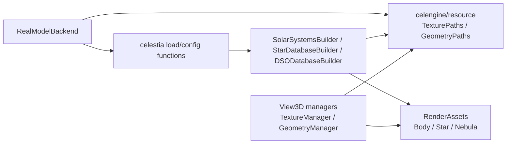

# Celestia 标准 MVC 解耦 Step23 资源引用与资源索引边界实施计划

> **For agentic workers:** REQUIRED SUB-SKILL: Use superpowers:subagent-driven-development or superpowers:executing-plans to implement this plan task-by-task. Steps use checkbox (`- [ ]`) syntax for tracking. 本计划必须先被确认，再进入源码修改。

**Goal:** 将 `TexturePaths` / `GeometryPaths` 这类资源路径索引能力从 View3D 头文件中剥离为中立资源层，解除 `RealModelBackend` 对 View3D 资源路径类型的直接依赖。

**Architecture:** Step23 不拆 `Surface` / `Atmosphere` 字段，不拆 Builder 家族，也不迁移 View3D 模板。它只建立后续拆分所需的资源索引边界：中立资源层负责把资源名解析成稳定句柄和路径信息，View3D 继续负责按句柄加载 GPU/渲染对象，Adapter 仍暂时负责把加载结果写入 RenderAssets。

**Tech Stack:** C++17, CMake object libraries, doctest, PowerShell boundary scan, existing Celestia SDL compatibility regression harness.

---

## 1. 本步骤定位

Step22 已经完成资源边界与 Model 加载链路审计，结论是当前 Model 目录直接 Adapter 依赖已经清理，但真实加载链路、资源路径、RenderAssets 和 Runtime 输出仍然混合。

Step23 不是再次审计，也不是直接大规模搬迁 Builder。Step23 的唯一目标是把 Step22 发现的一个前置问题转成可执行改造：资源路径索引能力不能继续挂在 `src/celengine/view3d` 下面，因为 `RealModelBackend` 和 Builder 复用真实数据加载时需要它，但它本身不等同于 OpenGL 渲染。

### 1.1 Step23 与 Step22 的区别

| 项目 | Step22 | Step23 |
|---|---|---|
| 工作性质 | 源码审计和问题定位 | 文件级实施计划，确认后进入受控代码修改 |
| 源码修改 | 不修改源码 | 本计划阶段不修改；批准执行后修改 |
| 主要问题 | 资源边界、Builder、`Surface` / `Atmosphere`、`RealModelBackend` 的不干净点 | 资源路径索引从 View3D 剥离，先解除 `RealModelBackend -> View3D` 直接路径依赖 |
| 输出粒度 | 类族和链路级结论 | 文件、类型、CMake、测试、回归命令级任务 |
| 完成含义 | 有审计依据 | 有可运行、可验证的最小资源边界改造 |

### 1.2 Step23 不解决的问题

Step23 明确不处理以下内容：

1. 不把 `SolarSystemsBuilder`、`StarDatabaseBuilder`、`DSODatabaseBuilder` 大规模迁出 `adapter`。
2. 不把 `Surface` / `Atmosphere` 中的 `TextureHandle` 字段替换成新的资源引用类型。
3. 不把 `BodyRenderAssets` / `StarRenderAssets` / `NebulaRenderAssets` 改造成最终公共资源服务。
4. 不处理 `RealModelBackend -> celestia/*` 应用层加载入口依赖。
5. 不处理 `ViewFrame` / `SceneFrame` / `SceneExtractor` 的 Runtime 输出分层问题。
6. 不做新的 View3D 效果实现，不改 View3D 模板迁移方向。

这些问题放在 Step24 及以后。Step23 只做资源路径索引边界，因为这是后面拆 Builder 和资源字段的前置条件。

## 2. 当前事实基线

执行本计划前，当前仓库基线应满足：

1. 分支干净，`git status --short --branch` 不显示未提交源码变更。
2. Step21 已完成 `src/celengine/model` 目录内直接 Adapter 依赖清理。
3. Step22 文档已提交并推送，作为 Step23 的依据。
4. `tools/mvc/scan_mvc_boundary_debt.ps1` 当前报告 63 个边界发现，其中与 Step23 直接相关的是：

| 类别 | 当前数量 | Step23 处理范围 |
|---|---:|---|
| `runtime-model->view` | 2 | 必须清理为 0，来源是 `realmodelbackend.cpp` 直接 include `view3d/meshmanager.h` 和 `view3d/texmanager.h` |
| `adapter->view` | 12 | 只清理资源路径索引用途；真实 View/render 依赖保留给后续步骤 |
| `runtime-model->app` | 4 | 不处理，留给加载编排拆分步骤 |
| `runtime-model-projection` | 44 | 不处理，留给 Runtime 输出分层步骤 |
| `adapter->runtime` | 1 | 不处理，留给 Runtime 投影职责步骤 |

当前两条直接 Runtime -> View3D 资源路径依赖是：

```text
src/celruntime/model/realmodelbackend.cpp:28 #include <celengine/view3d/meshmanager.h>
src/celruntime/model/realmodelbackend.cpp:29 #include <celengine/view3d/texmanager.h>
```

这两条是 Step23 的强制验收点。

## 3. 目标架构

Step23 后，资源路径索引的目标关系如下：



关键约束：

1. `celengine/resource` 不 include `celengine/view3d`、`celrender`、OpenGL、SDL、Qt、Win32。
2. `TexturePaths` / `GeometryPaths` 的命名空间保持 `celestia::engine`，降低调用方改动风险。
3. `TextureManager` / `GeometryManager` 仍留在 `src/celengine/view3d`，它们负责真正加载纹理、网格和渲染对象。
4. `TextureHandle` 仍来自 `celutil/texhandle.h`，`GeometryHandle` 在 Step23 中随 `GeometryPaths` 迁到中立资源头文件。
5. RenderAssets 暂时仍保存句柄，这是过渡状态；Step23 只把它们对 `meshmanager.h` 的直接 include 改成中立资源头文件。
6. `Surface` / `Atmosphere` 暂时仍保存 `TextureHandle`，不在 Step23 改字段语义。

## 4. 文件结构规划

### 4.1 新增文件

| 文件 | 责任 |
|---|---|
| `src/celengine/resource/texturepaths.h` | 声明 `TextureResolution`、`TextureFlags`、`TextureInfo`、`TexturePaths` |
| `src/celengine/resource/texturepaths.cpp` | 承载原 `TexturePaths` 路径解析、分辨率回退、通配符解析和句柄分配逻辑 |
| `src/celengine/resource/geometrypaths.h` | 声明 `GeometryHandle`、`GeometryInfo`、`GeometryPaths` |
| `src/celengine/resource/geometrypaths.cpp` | 承载原 `GeometryPaths` 模型路径解析、句柄分配和 `GeometryInfo` 查询逻辑 |
| `test/unit/mvc_step23_resource_boundary_test.cpp` | 固化 Step23 的资源层边界和 `RealModelBackend` include 边界 |

### 4.2 修改文件

| 文件 | 修改目的 |
|---|---|
| `src/celengine/CMakeLists.txt` | 增加 `CELESTIA_RESOURCE_SOURCES` 和 `celestia_resource` object library |
| `src/celestia/CMakeLists.txt` | 将 `$<TARGET_OBJECTS:celestia_resource>` 加入统一 exe 和 headless model backend 所需对象集合 |
| `test/unit/CMakeLists.txt` | 注册 `mvc_step23_resource_boundary_test.cpp` |
| `test/unit/mvc_step3_contract_test.cpp` | 更新物理分层测试，使中立资源层成为正式源码桶和对象库 |
| `src/celengine/view3d/texmanager.h` | 移除 `TexturePaths` 声明，改 include `celengine/resource/texturepaths.h` |
| `src/celengine/view3d/texmanager.cpp` | 移除 `TexturePaths::*` 实现，只保留 `TextureManager` 和真实纹理加载逻辑 |
| `src/celengine/view3d/meshmanager.h` | 移除 `GeometryPaths` / `GeometryHandle` 声明，改 include `celengine/resource/geometrypaths.h` |
| `src/celengine/view3d/meshmanager.cpp` | 移除 `GeometryPaths::*` 实现，只保留 `GeometryManager` / `RenderGeometryManager` 和真实网格加载逻辑 |
| `src/celruntime/model/realmodelbackend.cpp` | 用中立资源头文件替代 `view3d/meshmanager.h` / `view3d/texmanager.h` |
| `src/celengine/adapter/bodyrenderassets.h` | 用中立资源头文件提供 `GeometryHandle` |
| `src/celengine/adapter/starrenderassets.h` | 用中立资源头文件提供 `GeometryHandle` |
| `src/celengine/adapter/nebularenderassets.h` | 用中立资源头文件提供 `GeometryHandle` |
| `src/celengine/adapter/nebularenderassetloader.cpp` | 用中立资源头文件提供 `GeometryPaths` |
| `src/celengine/adapter/solarsys.cpp` | 用中立资源头文件提供 `TexturePaths` / `GeometryPaths` |
| `src/celengine/adapter/stardbbuilder.cpp` | 用中立资源头文件提供 `TexturePaths` / `GeometryPaths` |
| `src/celengine/adapter/selectiongeometryprovider.h` | 改用中立 `GeometryHandle`，对 `Geometry` 做前置声明 |
| `src/celengine/adapter/bodylocationgeometryprojector.cpp` | 去掉仅为 `GeometryHandle` 引入的 `meshmanager.h`，保留对 `geometry.h` 的真实 View3D 几何依赖 |
| `src/celestia/configfile.cpp` | 用中立资源头文件提供 `TexturePaths` / `TextureFlags` |

### 4.3 明确不修改文件

| 文件或目录 | 原因 |
|---|---|
| `src/celengine/model/surface.h` | `TextureHandle` 字段替换属于后续字段级拆分，不进入 Step23 |
| `src/celengine/model/atmosphere.h` | 同上 |
| `src/celengine/adapter/solarsys.h` | 构造函数参数类型已有前置声明；如编译不要求，不主动扩大改动 |
| `src/celengine/adapter/stardbbuilder.h` | 同上 |
| `src/celengine/adapter/dsodbbuilder.h` | 同上 |
| `src/celestia/loadstars.h` / `loaddso.h` / `loadsso.h` | 头文件已有前置声明；如编译不要求，不主动扩大改动 |
| `src/celruntime/model/modelservice.*` | Runtime 输出分层不进入 Step23 |
| `src/celruntime/model/sceneextractor.*` | Runtime 输出分层不进入 Step23 |
| `src/celruntime/view3d/*` | 跨进程 View3D 资源解析不是本轮目标 |

## 5. 分步执行计划

### Task 1: 冻结实施前基线

**Files:**
- Read: `tools/mvc/scan_mvc_boundary_debt.ps1`
- Read: `DOC/CODEX_DOC/02_设计说明/02-13-Celestia-Step22资源边界与Model加载链路审计分析.md`
- Read: `DOC/CODEX_DOC/04_研制计划/40-WBS-0.40-Celestia标准MVC解耦-Step22资源边界与Model加载链路审计计划.md`

- [ ] **Step 1: 确认工作区干净**

Run:

```powershell
git status --short --branch
```

Expected:

```text
## codex/celestia-mvc-step13-real-model-backend...origin/codex/celestia-mvc-step13-real-model-backend
```

允许出现本 Step23 计划文件本身的未提交状态；进入源码执行前不允许存在其他未解释变更。

- [ ] **Step 2: 记录边界扫描基线**

Run:

```powershell
powershell -NoProfile -ExecutionPolicy Bypass -File tools\mvc\scan_mvc_boundary_debt.ps1
```

Expected:

```text
MVC boundary debt scan report: 63 finding(s)
[runtime-model->view] 2 finding(s)
```

强制记录点：`runtime-model->view` 两条来自 `realmodelbackend.cpp` 的 View3D include。

- [ ] **Step 3: 确认 Step23 不复用已回滚的未计划改造**

Run:

```powershell
Test-Path src\celengine\resource
```

Expected before implementation:

```text
False
```

如果已经存在 `src/celengine/resource`，必须先确认它来自本计划批准后的新改造，而不是之前被回滚的 Step23 尝试。

### Task 2: 先写失败测试

**Files:**
- Create: `test/unit/mvc_step23_resource_boundary_test.cpp`
- Modify: `test/unit/CMakeLists.txt`
- Modify: `test/unit/mvc_step3_contract_test.cpp`

- [ ] **Step 1: 新增 Step23 边界测试文件**

Create `test/unit/mvc_step23_resource_boundary_test.cpp` with these assertions:

```cpp
#include <doctest.h>

#include <filesystem>
#include <fstream>
#include <sstream>
#include <string>
#include <string_view>

namespace
{

std::filesystem::path sourceRoot()
{
    return std::filesystem::path(__FILE__).parent_path().parent_path().parent_path();
}

std::string readSourceFile(std::string_view relativePath)
{
    std::ifstream input(sourceRoot() / relativePath);
    REQUIRE(input.good());

    std::ostringstream buffer;
    buffer << input.rdbuf();
    return buffer.str();
}

bool contains(std::string_view text, std::string_view token)
{
    return text.find(token) != std::string_view::npos;
}

} // end unnamed namespace

TEST_SUITE_BEGIN("MVC Step23 resource boundary");

TEST_CASE("resource path indexes are declared outside View3D")
{
    const auto textureHeader = readSourceFile("src/celengine/resource/texturepaths.h");
    const auto geometryHeader = readSourceFile("src/celengine/resource/geometrypaths.h");

    CHECK(contains(textureHeader, "class TexturePaths"));
    CHECK(contains(textureHeader, "enum class TextureFlags"));
    CHECK(contains(textureHeader, "enum class TextureResolution"));
    CHECK(contains(geometryHeader, "class GeometryPaths"));
    CHECK(contains(geometryHeader, "enum class GeometryHandle"));

    CHECK_FALSE(contains(textureHeader, "celengine/view3d"));
    CHECK_FALSE(contains(textureHeader, "celrender"));
    CHECK_FALSE(contains(textureHeader, "OpenGL"));
    CHECK_FALSE(contains(geometryHeader, "celengine/view3d"));
    CHECK_FALSE(contains(geometryHeader, "celrender"));
    CHECK_FALSE(contains(geometryHeader, "OpenGL"));
}

TEST_CASE("View3D managers include resource indexes instead of owning them")
{
    const auto textureManager = readSourceFile("src/celengine/view3d/texmanager.h");
    const auto meshManager = readSourceFile("src/celengine/view3d/meshmanager.h");

    CHECK(contains(textureManager, "<celengine/resource/texturepaths.h>"));
    CHECK(contains(meshManager, "<celengine/resource/geometrypaths.h>"));

    CHECK_FALSE(contains(textureManager, "class TexturePaths"));
    CHECK_FALSE(contains(meshManager, "class GeometryPaths"));
}

TEST_CASE("RealModelBackend does not include View3D resource manager headers")
{
    const auto source = readSourceFile("src/celruntime/model/realmodelbackend.cpp");

    CHECK(contains(source, "<celengine/resource/geometrypaths.h>"));
    CHECK(contains(source, "<celengine/resource/texturepaths.h>"));
    CHECK_FALSE(contains(source, "<celengine/view3d/meshmanager.h>"));
    CHECK_FALSE(contains(source, "<celengine/view3d/texmanager.h>"));
}

TEST_CASE("resource object library is wired into unified and headless builds")
{
    const auto celengine = readSourceFile("src/celengine/CMakeLists.txt");
    const auto celestia = readSourceFile("src/celestia/CMakeLists.txt");

    CHECK(contains(celengine, "CELESTIA_RESOURCE_SOURCES"));
    CHECK(contains(celengine, "add_library(celestia_resource OBJECT"));
    CHECK(contains(celestia, "$<TARGET_OBJECTS:celestia_resource>"));
}

TEST_SUITE_END();
```

- [ ] **Step 2: 注册测试文件**

Modify `test/unit/CMakeLists.txt` and add:

```cmake
  mvc_step23_resource_boundary_test.cpp
```

Placement: immediately after `mvc_step17_dataplane_test.cpp` or next to other MVC step tests.

- [ ] **Step 3: 更新 Step3 物理分层测试**

Modify `test/unit/mvc_step3_contract_test.cpp`.

In `celengine CMake defines MVC source ownership buckets`, add:

```cpp
    checkContains(cmake, "CELESTIA_RESOURCE_SOURCES");
```

In `CMake defines physical MVC targets`, add:

```cpp
    checkContains(celengine, "add_library(celestia_resource OBJECT");
    checkContains(celestia, "$<TARGET_OBJECTS:celestia_resource>");
```

In `CMake declares MVC target dependency direction`, do not make `celestia_model` depend on `celestia_resource` through `target_link_libraries(celestia_model ...)`; keep the existing no-token assertion valid. Resource object inclusion should be explicit through object lists, not by making Model depend upward on View or Adapter.

- [ ] **Step 4: 运行测试确认失败**

Run after configuring/building the `unit` target:

```powershell
& "C:\Program Files (x86)\Microsoft Visual Studio\18\BuildTools\Common7\IDE\CommonExtensions\Microsoft\CMake\CMake\bin\ctest.exe" --test-dir build-mvc-sdl-rel -C Release -R "Step23 resource boundary|MVC Step3 physical" --output-on-failure
```

Expected before implementation:

```text
Failed
```

失败原因应集中在 `src/celengine/resource/texturepaths.h` / `geometrypaths.h` 不存在、CMake 未声明 `celestia_resource`、`RealModelBackend` 仍 include View3D 资源管理头。

### Task 3: 建立中立资源层

**Files:**
- Create: `src/celengine/resource/texturepaths.h`
- Create: `src/celengine/resource/texturepaths.cpp`
- Create: `src/celengine/resource/geometrypaths.h`
- Create: `src/celengine/resource/geometrypaths.cpp`

- [ ] **Step 1: 创建 `texturepaths.h`**

`src/celengine/resource/texturepaths.h` contains the declarations currently owned by `view3d/texmanager.h` for:

```cpp
#pragma once

#include <array>
#include <cstddef>
#include <cstdint>
#include <filesystem>
#include <unordered_map>
#include <vector>

#include <celutil/classops.h>
#include <celutil/flag.h>
#include <celutil/fsutils.h>
#include <celutil/texhandle.h>

namespace celestia::engine
{

enum class TextureResolution : int
{
    lores = 0,
    medres,
    hires,
};

enum class TextureFlags : unsigned int
{
    None             = 0,
    WrapTexture      = 0x1,
    NoMipMaps        = 0x2,
    BorderClamp      = 0x4,
    LinearColorspace = 0x8,
};

ENUM_CLASS_BITWISE_OPS(TextureFlags)

struct TextureInfo
{
    std::filesystem::path path;
    TextureFlags flags;
    float bumpHeight;
};

class TexturePaths : private util::NoCopy
{
public:
    util::TextureHandle getHandle(const std::filesystem::path& filename,
                                  const std::filesystem::path& directory,
                                  TextureFlags flags = TextureFlags::None,
                                  float bumpHeight = 0.0f);
    bool getInfo(util::TextureHandle, TextureResolution, TextureInfo&) const;
    bool samePath(util::TextureHandle, TextureResolution, TextureResolution) const;

private:
    static constexpr inline auto ResolutionCount = 3U;

    enum class PathIndex : std::uint32_t { Invalid = ~UINT32_C(0) };
    enum class PathSetIndex : std::uint32_t { Invalid = ~UINT32_C(0) };

    using PathSet = std::array<PathIndex, ResolutionCount>;

    struct Info
    {
        Info(PathSetIndex, TextureFlags, float);

        PathSetIndex pathSet;
        TextureFlags flags;
        float bumpHeight;
    };

    struct InfoHash
    {
        std::size_t operator()(const Info&) const;
    };

    struct InfoEqual
    {
        bool operator()(const Info&, const Info&) const;
    };

    using DirectoryPaths = std::unordered_map<std::filesystem::path, PathSetIndex, util::PathHasher>;

    PathSetIndex getPathSetIndex(const std::filesystem::path&, const std::filesystem::path&);
    bool checkPath(const std::filesystem::path&, const std::filesystem::path&, PathSetIndex&);

    std::vector<std::filesystem::path> m_paths;
    std::vector<PathSet> m_pathSets;
    std::vector<Info> m_info;

    std::unordered_map<std::filesystem::path, DirectoryPaths, util::PathHasher> m_dirPaths;
    std::unordered_map<Info, util::TextureHandle, InfoHash, InfoEqual> m_handles;
};

} // namespace celestia::engine
```

The header must not include `celengine/view3d/texture.h`.

- [ ] **Step 2: 创建 `texturepaths.cpp`**

Move these implementation blocks from `src/celengine/view3d/texmanager.cpp` into `src/celengine/resource/texturepaths.cpp`:

1. `baseDirectory`
2. `directories`
3. `extensions`
4. `TexturePaths::Info::Info`
5. `TexturePaths::InfoHash::operator()`
6. `TexturePaths::InfoEqual::operator()`
7. `TexturePaths::getHandle`
8. `TexturePaths::getPathSetIndex`
9. `TexturePaths::checkPath`
10. `TexturePaths::getInfo`
11. `TexturePaths::samePath`

`texturepaths.cpp` must include:

```cpp
#include <celengine/resource/texturepaths.h>

#include <array>
#include <cstddef>
#include <string_view>
#include <system_error>
#include <tuple>

#include <boost/container_hash/hash.hpp>

#include <celutil/logger.h>
```

It must not include `celengine/view3d/texture.h`.

- [ ] **Step 3: 创建 `geometrypaths.h`**

`src/celengine/resource/geometrypaths.h` contains the declarations currently owned by `view3d/meshmanager.h` for:

```cpp
#pragma once

#include <cstddef>
#include <cstdint>
#include <filesystem>
#include <unordered_map>
#include <vector>

#include <Eigen/Core>

#include <celutil/classops.h>
#include <celutil/fsutils.h>

namespace celestia::engine
{

enum class GeometryHandle : std::uint32_t
{
    Invalid = ~UINT32_C(0),
    Empty = Invalid - UINT32_C(1),
};

struct GeometryInfo
{
    std::filesystem::path path;
    std::filesystem::path directory;
    Eigen::Vector3f center{ Eigen::Vector3f::Zero() };
    bool isNormalized{ true };
};

class GeometryPaths : private util::NoCopy
{
public:
    GeometryHandle getHandle(const std::filesystem::path& filename,
                             const std::filesystem::path& directory,
                             const Eigen::Vector3f& center = Eigen::Vector3f::Zero(),
                             bool isNormalized = true);
    bool getInfo(GeometryHandle, GeometryInfo&) const;

private:
    enum class PathIndex : std::uint32_t
    {
        Root = 0,
        Invalid = ~UINT32_C(0),
    };

    struct Info
    {
        Info(PathIndex, PathIndex, const Eigen::Vector3f&, bool);

        PathIndex pathIndex;
        PathIndex directoryPathIndex;
        Eigen::Vector3f center;
        bool isNormalized;
    };

    struct Key
    {
        Key(PathIndex, const Eigen::Vector3f&, bool);

        PathIndex pathIndex;
        Eigen::Vector3f center;
        bool isNormalized;
    };

    struct KeyHash
    {
        std::size_t operator()(const Key&) const;
    };

    struct KeyEqual
    {
        bool operator()(const Key&, const Key&) const;
    };

    using DirectoryPaths = std::unordered_map<std::filesystem::path, PathIndex, util::PathHasher>;

    PathIndex getFileIndex(PathIndex&, const std::filesystem::path&);
    bool checkPath(PathIndex, const std::filesystem::path&, PathIndex&);
    PathIndex getPathIndex(const std::filesystem::path&);

    std::vector<std::filesystem::path> m_paths{ std::filesystem::path{} };
    std::vector<Info> m_info;

    std::unordered_map<std::filesystem::path, PathIndex, util::PathHasher> m_pathMap{ { std::filesystem::path{}, PathIndex::Root } };
    std::unordered_map<PathIndex, DirectoryPaths> m_dirPaths;
    std::unordered_map<Key, GeometryHandle, KeyHash, KeyEqual> m_handles;
};

} // namespace celestia::engine
```

The header must not include `celengine/view3d/geometry.h`.

- [ ] **Step 4: 创建 `geometrypaths.cpp`**

Move these implementation blocks from `src/celengine/view3d/meshmanager.cpp` into `src/celengine/resource/geometrypaths.cpp`:

1. `GeometryPaths::Info::Info`
2. `GeometryPaths::Key::Key`
3. `GeometryPaths::KeyHash::operator()`
4. `GeometryPaths::KeyEqual::operator()`
5. `GeometryPaths::getHandle`
6. `GeometryPaths::getFileIndex`
7. `GeometryPaths::checkPath`
8. `GeometryPaths::getPathIndex`
9. `GeometryPaths::getInfo`

`geometrypaths.cpp` must include:

```cpp
#include <celengine/resource/geometrypaths.h>

#include <cstddef>
#include <system_error>
#include <tuple>

#include <boost/container_hash/hash.hpp>

#include <celutil/logger.h>
```

It must not include any View3D geometry or mesh loading headers.

### Task 4: 收窄 View3D manager 头文件

**Files:**
- Modify: `src/celengine/view3d/texmanager.h`
- Modify: `src/celengine/view3d/texmanager.cpp`
- Modify: `src/celengine/view3d/meshmanager.h`
- Modify: `src/celengine/view3d/meshmanager.cpp`

- [ ] **Step 1: 更新 `texmanager.h`**

Remove declarations already moved to `resource/texturepaths.h`:

1. `TextureResolution`
2. `TextureFlags`
3. `TextureInfo`
4. `TexturePaths`

Add:

```cpp
#include <celengine/resource/texturepaths.h>
```

Keep `TextureManager` in this file.

- [ ] **Step 2: 更新 `texmanager.cpp`**

Remove the moved `TexturePaths::*` implementation blocks listed in Task 3.

Keep in `texmanager.cpp`:

1. `LoadTexture`
2. `TextureManager::TextureManager`
3. `TextureManager::find`
4. `TextureManager::findShadow`
5. `TextureManager::resolution`

Keep include:

```cpp
#include <celengine/view3d/texmanager.h>
```

- [ ] **Step 3: 更新 `meshmanager.h`**

Remove declarations already moved to `resource/geometrypaths.h`:

1. `GeometryHandle`
2. `GeometryInfo`
3. `GeometryPaths`

Add:

```cpp
#include <celengine/resource/geometrypaths.h>
```

Keep `GeometryManager` and `RenderGeometryManager` in this file.

- [ ] **Step 4: 更新 `meshmanager.cpp`**

Remove the moved `GeometryPaths::*` implementation blocks listed in Task 3.

Keep in `meshmanager.cpp`:

1. model loading helpers
2. `GeometryManager::GeometryManager`
3. `GeometryManager::find`
4. `RenderGeometryManager::RenderGeometryManager`
5. `RenderGeometryManager::find`

Keep include:

```cpp
#include <celengine/view3d/meshmanager.h>
```

### Task 5: 接入 CMake 对象库

**Files:**
- Modify: `src/celengine/CMakeLists.txt`
- Modify: `src/celestia/CMakeLists.txt`

- [ ] **Step 1: 在 `src/celengine/CMakeLists.txt` 增加资源源码桶**

Add after `CELESTIA_CONTROLLER_SOURCES` or before `CELESTIA_VIEW_ADAPTER_SOURCES`:

```cmake
set(CELESTIA_RESOURCE_SOURCES
  resource/geometrypaths.cpp
  resource/geometrypaths.h
  resource/texturepaths.cpp
  resource/texturepaths.h
)
```

Add object library:

```cmake
add_library(celestia_resource OBJECT ${CELESTIA_RESOURCE_SOURCES})
```

Placement: before `add_library(celestia_view_adapter OBJECT ...)`.

Do not add `target_link_libraries(celestia_model PRIVATE celestia_resource)`.

- [ ] **Step 2: 更新 target 依赖方向**

Update:

```cmake
target_link_libraries(celestia_view_adapter PRIVATE celestia_model celestia_controller)
target_link_libraries(celestia_view3d PRIVATE celestia_model celestia_controller celestia_view_adapter)
```

to:

```cmake
target_link_libraries(celestia_view_adapter PRIVATE celestia_model celestia_controller celestia_resource)
target_link_libraries(celestia_view3d PRIVATE celestia_model celestia_controller celestia_view_adapter celestia_resource)
```

Rationale: Adapter and View3D consume the resource layer; Model remains independent of it in Step23.

- [ ] **Step 3: 将资源对象加入统一 exe 和 headless 后端对象集合**

Modify `src/celestia/CMakeLists.txt`.

In `CELESTIA_CORE_LIBS`, add:

```cmake
                       $<TARGET_OBJECTS:celestia_resource>
```

Place it after `$<TARGET_OBJECTS:celestia_controller>` and before `$<TARGET_OBJECTS:celestia_view_adapter>`.

In `CELESTIA_HEADLESS_MODEL_BACKEND_LIBS`, add:

```cmake
  $<TARGET_OBJECTS:celestia_resource>
```

Place it after `$<TARGET_OBJECTS:celestia_controller>`.

### Task 6: 替换资源路径索引用途的 include

**Files:**
- Modify: `src/celruntime/model/realmodelbackend.cpp`
- Modify: `src/celengine/adapter/bodyrenderassets.h`
- Modify: `src/celengine/adapter/starrenderassets.h`
- Modify: `src/celengine/adapter/nebularenderassets.h`
- Modify: `src/celengine/adapter/nebularenderassetloader.cpp`
- Modify: `src/celengine/adapter/solarsys.cpp`
- Modify: `src/celengine/adapter/stardbbuilder.cpp`
- Modify: `src/celengine/adapter/selectiongeometryprovider.h`
- Modify: `src/celengine/adapter/bodylocationgeometryprojector.cpp`
- Modify: `src/celestia/configfile.cpp`

- [ ] **Step 1: 修改 `RealModelBackend` include**

Replace:

```cpp
#include <celengine/view3d/meshmanager.h>
#include <celengine/view3d/texmanager.h>
```

with:

```cpp
#include <celengine/resource/geometrypaths.h>
#include <celengine/resource/texturepaths.h>
```

Expected result: `RealModelBackend` still constructs `engine::TexturePaths` and `engine::GeometryPaths`, but no longer directly includes View3D managers.

- [ ] **Step 2: 修改 RenderAssets 头文件中的 handle include**

For these files:

```text
src/celengine/adapter/bodyrenderassets.h
src/celengine/adapter/starrenderassets.h
src/celengine/adapter/nebularenderassets.h
```

Replace:

```cpp
#include <celengine/view3d/meshmanager.h>
```

with:

```cpp
#include <celengine/resource/geometrypaths.h>
```

Do not move RenderAssets out of Adapter in Step23.

- [ ] **Step 3: 修改 Builder 和 loader 的资源路径 include**

For `src/celengine/adapter/nebularenderassetloader.cpp`, replace:

```cpp
#include <celengine/view3d/meshmanager.h>
```

with:

```cpp
#include <celengine/resource/geometrypaths.h>
```

For `src/celengine/adapter/stardbbuilder.cpp`, replace:

```cpp
#include <celengine/view3d/meshmanager.h>
```

with:

```cpp
#include <celengine/resource/geometrypaths.h>
#include <celengine/resource/texturepaths.h>
```

For `src/celengine/adapter/solarsys.cpp`, replace:

```cpp
#include <celengine/view3d/meshmanager.h>
#include <celengine/view3d/texmanager.h>
```

with:

```cpp
#include <celengine/resource/geometrypaths.h>
#include <celengine/resource/texturepaths.h>
```

- [ ] **Step 4: 修改 selection geometry provider**

In `src/celengine/adapter/selectiongeometryprovider.h`, replace:

```cpp
#include <celengine/view3d/meshmanager.h>
```

with:

```cpp
#include <celengine/resource/geometrypaths.h>
```

Add forward declaration for `Geometry` if needed:

```cpp
namespace celestia::engine
{
class Geometry;
}
```

This file may still expose a View3D geometry concept semantically. Step23 only removes the resource-manager header dependency; semantic geometry boundary remains for later View3D adapter cleanup.

- [ ] **Step 5: 修改 body location projector**

In `src/celengine/adapter/bodylocationgeometryprojector.cpp`, remove:

```cpp
#include <celengine/view3d/meshmanager.h>
```

Add:

```cpp
#include <celengine/resource/geometrypaths.h>
```

Keep:

```cpp
#include <celengine/view3d/geometry.h>
```

because this file actually calls geometry APIs. This remaining View3D dependency is outside Step23.

- [ ] **Step 6: 修改 configfile**

In `src/celestia/configfile.cpp`, replace:

```cpp
#include <celengine/view3d/texmanager.h>
```

with:

```cpp
#include <celengine/resource/texturepaths.h>
```

Do not change config file parsing semantics.

### Task 7: 编译与单元测试

**Files:**
- Build outputs only

- [ ] **Step 1: 构建核心目标**

Run:

```powershell
& "C:\Program Files (x86)\Microsoft Visual Studio\18\BuildTools\Common7\IDE\CommonExtensions\Microsoft\CMake\CMake\bin\cmake.exe" --build build-mvc-sdl-rel --config Release --target unit celestia-model-host celestia-sdl
```

Expected:

```text
Build succeeded.
```

If the exact wording differs, acceptance is zero compile/link errors and generated `unit.exe`, `celestia-model-host.exe`, and `celestia-sdl.exe`.

- [ ] **Step 2: 运行 Step23 和相关单元测试**

Run:

```powershell
& "C:\Program Files (x86)\Microsoft Visual Studio\18\BuildTools\Common7\IDE\CommonExtensions\Microsoft\CMake\CMake\bin\ctest.exe" --test-dir build-mvc-sdl-rel -C Release -R "Step23 resource boundary|Step13 real backend|Step17 ResourceRef|MVC boundary|MVC Step3 physical" --output-on-failure
```

Expected:

```text
100% tests passed
```

- [ ] **Step 3: 运行 Model Adapter 边界脚本**

Run:

```powershell
powershell -NoProfile -ExecutionPolicy Bypass -File test\scripts\test_mvc_model_adapter_boundary_clean.ps1
```

Expected:

```text
MVC model adapter boundary is clean
```

### Task 8: 边界扫描验收

**Files:**
- Read: `tools/mvc/scan_mvc_boundary_debt.ps1`

- [ ] **Step 1: 运行边界扫描**

Run:

```powershell
powershell -NoProfile -ExecutionPolicy Bypass -File tools\mvc\scan_mvc_boundary_debt.ps1
```

Expected mandatory result:

```text
[runtime-model->view] 0 finding(s)
```

If script output does not print zero-count categories, acceptance is that no `[runtime-model->view]` section appears.

- [ ] **Step 2: 核对剩余发现的归属**

Expected after Step23:

1. `runtime-model->app` 仍存在，原因是 `RealModelBackend` 仍复用 `celestia/configfile.h`、`loadstars.h`、`loaddso.h`、`loadsso.h`。
2. `runtime-model-projection` 仍存在，原因是 Runtime 输出分层未进入 Step23。
3. `adapter->runtime` 仍存在，原因是 `SceneViewModel` 仍输出 `ViewFrame`。
4. `adapter->view` 应减少资源路径索引造成的直接 include；剩余项应主要是 `renderflags.h`、`geometry.h` 和真实 View/Render 概念。

Step23 不以边界扫描清零作为完成条件。Step23 的硬门槛是 `runtime-model->view` 清零，并且资源路径索引不再位于 View3D 头文件。

### Task 9: 运行统一 exe 兼容回归

**Files:**
- Generated: `.regression-artifacts/Celestia/runs/<timestamp>-<commit>-quick/`
- Generated: `DOC/CODEX_DOC/06_测试文档/03_机测记录/<timestamp>-Celestia-Step23-resource-boundary-machine-report.md`

- [ ] **Step 1: 运行 Quick 回归**

Run:

```powershell
powershell -NoProfile -ExecutionPolicy Bypass -File tools\regression\run_celestia_compat_regression.ps1 -Mode Quick
```

Expected:

```text
Compatibility regression completed
```

Acceptance:

1. `celestia-sdl.exe` 可以启动并生成截图矩阵。
2. 关键截图没有黑屏、空场景或明显资源丢失。
3. `test_mvc_model_adapter_boundary_clean.ps1` 仍通过。
4. 机器报告复制到 `DOC/CODEX_DOC/06_测试文档/03_机测记录/`。

- [ ] **Step 2: 必要时运行 Full 回归**

Run Full only when Quick shows suspicious visual drift or before合并到主线:

```powershell
powershell -NoProfile -ExecutionPolicy Bypass -File tools\regression\run_celestia_compat_regression.ps1 -Mode Full
```

Acceptance:

1. 当前构建与固定基线的截图差异在已有阈值内。
2. 接触图和机器报告能说明没有因资源路径迁移造成纹理或网格缺失。

### Task 10: 文档和提交

**Files:**
- Modify: `DOC/CODEX_DOC/02_设计说明/02-13-Celestia-Step22资源边界与Model加载链路审计分析.md`
- Create: `DOC/CODEX_DOC/06_测试文档/03_机测记录/<timestamp>-Celestia-Step23-resource-boundary-machine-report.md`

- [ ] **Step 1: 更新 Step22 分析文档的后续状态**

Add a short section near the Step23 candidate route:

```markdown
### Step23 执行结果回填

Step23 已将 `TexturePaths` / `GeometryPaths` 从 View3D manager 头文件剥离到 `src/celengine/resource` 中立资源层。`RealModelBackend` 不再直接 include `celengine/view3d/meshmanager.h` 或 `celengine/view3d/texmanager.h`。

这不代表 Model 层完全解耦。`runtime-model->app`、Runtime 输出分层、Builder 与 RenderAssets 的语义拆分仍保留给后续步骤。
```

- [ ] **Step 2: 检查禁用称呼**

全文不得出现用户明确禁用的旧称呼。执行者应在提交前用本地搜索命令对本计划和 Step22 回填文档做全文扫描，扫描结果必须为空。

- [ ] **Step 3: 检查 diff**

Run:

```powershell
git diff --name-only
```

Expected changed files belong only to the Step23 planned scope:

```text
DOC/CODEX_DOC/02_设计说明/02-13-Celestia-Step22资源边界与Model加载链路审计分析.md
DOC/CODEX_DOC/04_研制计划/41-WBS-0.41-Celestia标准MVC解耦-Step23资源引用与资源索引边界实施计划.md
DOC/CODEX_DOC/06_测试文档/03_机测记录/<actual Step23 machine report>
src/celengine/CMakeLists.txt
src/celengine/resource/geometrypaths.cpp
src/celengine/resource/geometrypaths.h
src/celengine/resource/texturepaths.cpp
src/celengine/resource/texturepaths.h
src/celengine/view3d/meshmanager.cpp
src/celengine/view3d/meshmanager.h
src/celengine/view3d/texmanager.cpp
src/celengine/view3d/texmanager.h
src/celengine/adapter/bodylocationgeometryprojector.cpp
src/celengine/adapter/bodyrenderassets.h
src/celengine/adapter/nebularenderassetloader.cpp
src/celengine/adapter/nebularenderassets.h
src/celengine/adapter/selectiongeometryprovider.h
src/celengine/adapter/solarsys.cpp
src/celengine/adapter/stardbbuilder.cpp
src/celengine/adapter/starrenderassets.h
src/celestia/CMakeLists.txt
src/celestia/configfile.cpp
src/celruntime/model/realmodelbackend.cpp
test/unit/CMakeLists.txt
test/unit/mvc_step23_resource_boundary_test.cpp
test/unit/mvc_step3_contract_test.cpp
```

If additional files appear, each must have a clear reason tied to this plan. Otherwise revert the extra changes before commit.

- [ ] **Step 4: 提交**

Run:

```powershell
git add DOC/CODEX_DOC/02_设计说明/02-13-Celestia-Step22资源边界与Model加载链路审计分析.md `
        DOC/CODEX_DOC/04_研制计划/41-WBS-0.41-Celestia标准MVC解耦-Step23资源引用与资源索引边界实施计划.md `
        DOC/CODEX_DOC/06_测试文档/03_机测记录/<actual Step23 machine report> `
        src/celengine/CMakeLists.txt `
        src/celengine/resource/geometrypaths.cpp `
        src/celengine/resource/geometrypaths.h `
        src/celengine/resource/texturepaths.cpp `
        src/celengine/resource/texturepaths.h `
        src/celengine/view3d/meshmanager.cpp `
        src/celengine/view3d/meshmanager.h `
        src/celengine/view3d/texmanager.cpp `
        src/celengine/view3d/texmanager.h `
        src/celengine/adapter/bodylocationgeometryprojector.cpp `
        src/celengine/adapter/bodyrenderassets.h `
        src/celengine/adapter/nebularenderassetloader.cpp `
        src/celengine/adapter/nebularenderassets.h `
        src/celengine/adapter/selectiongeometryprovider.h `
        src/celengine/adapter/solarsys.cpp `
        src/celengine/adapter/stardbbuilder.cpp `
        src/celengine/adapter/starrenderassets.h `
        src/celestia/CMakeLists.txt `
        src/celestia/configfile.cpp `
        src/celruntime/model/realmodelbackend.cpp `
        test/unit/CMakeLists.txt `
        test/unit/mvc_step23_resource_boundary_test.cpp `
        test/unit/mvc_step3_contract_test.cpp
git diff --cached --check
git commit -m "refactor: separate resource path indexes from View3D"
```

Expected:

```text
no whitespace errors
[codex/celestia-mvc-step13-real-model-backend <hash>] refactor: separate resource path indexes from View3D
```

## 6. 验收标准

Step23 完成必须同时满足：

1. `src/celengine/resource/texturepaths.*` 和 `geometrypaths.*` 存在，并且不 include View3D/render/OpenGL。
2. `src/celruntime/model/realmodelbackend.cpp` 不再 include `celengine/view3d/meshmanager.h` 或 `celengine/view3d/texmanager.h`。
3. `runtime-model->view` 边界扫描项清零。
4. `unit`、Step13、Step17、Step23、MVC boundary 相关测试通过。
5. SDL Quick 回归通过并生成截图报告。
6. 没有修改 `Surface` / `Atmosphere` 字段，没有移动 Builder 家族，没有做 View3D 效果改造。
7. 文档没有使用用户明确禁用的旧称呼。

Step23 完成后，只能说“资源路径索引边界已从 View3D 直接依赖中拆出”。不能说“Model 层完全解耦”。

## 7. 后续步骤建议

Step23 完成后，后续顺序建议为：

| 步骤 | 主题 | 依赖 Step23 的原因 |
|---|---|---|
| Step24 | `Surface` / `Atmosphere` 纹理字段资源引用化方案 | 需要先有中立资源索引和句柄边界 |
| Step25 | RenderAssets 从 View3D 句柄缓存拆成资源外挂和 View3D 缓存两层 | 需要先区分资源事实和渲染对象 |
| Step26 | Builder 家族数据构建与资源绑定拆分 | Builder 需要知道资源字段写到资源层还是 View3D 缓存层 |
| Step27 | `RealModelBackend` 加载编排从应用层入口中收窄 | 资源路径依赖清理后再处理应用加载依赖 |
| Step28 | Runtime 输出从 `ViewFrame` 过渡到更清晰的 ModelSnapshot / SceneProjection / SceneFrame | 资源和加载边界稳定后再处理输出语义 |

## 8. 风险控制

| 风险 | 表现 | 控制方式 |
|---|---|---|
| 把资源路径索引误当成 View 私有代码删除 | 真实数据加载缺纹理或缺网格 | 只移动路径索引逻辑，不删除解析逻辑和句柄分配逻辑 |
| 把 Step23 扩大成 Builder 大迁移 | 代码范围失控，回归难定位 | 本计划明确不移动 Builder 家族 |
| 把 `Surface` / `Atmosphere` 一次性重写 | 单 exe 渲染大面积退化 | 本计划不改字段，只建立前置资源边界 |
| 新 object library 未进入 headless 后端 | `celestia-model-host` 链接失败 | `CELESTIA_HEADLESS_MODEL_BACKEND_LIBS` 必须加入 `celestia_resource` |
| 只看编译不看截图 | 资源路径迁移后视觉资源缺失未发现 | Step23 代码执行后必须跑 Quick 回归并检查截图报告 |
| 过程再次跳过计划 | 用户无法确认边界，产生回滚风险 | 本文档确认前不得进入源码修改 |

## 9. 本计划阶段交付物

本轮只交付：

1. `DOC/CODEX_DOC/04_研制计划/41-WBS-0.41-Celestia标准MVC解耦-Step23资源引用与资源索引边界实施计划.md`

本轮不交付源码修改。源码修改必须在用户确认本计划后再开始。

## 10. 执行落地记录

用户确认本计划后，Step23 已进入源码实施阶段并完成首轮落地。实际交付物见：

1. `DOC/CODEX_DOC/02_设计说明/02-13-Celestia-Step22资源边界与Model加载链路审计分析.md`
2. `DOC/CODEX_DOC/06_测试文档/03_机测记录/2026-07-08-103404-Celestia-Step23-resource-boundary-machine-report.md`
3. `src/celengine/resource/texturepaths.*`
4. `src/celengine/resource/geometrypaths.*`
5. Step23 相关 CMake、include 和单测改造。

实际验证结论：

1. `runtime-model->view` 扫描项已从 2 清为 0。
2. Step23 专用 4 个 CTest 用例通过。
3. Step13、Step17、Step23、MVC 装配和 runtime session 相关 32 个 CTest 用例通过。
4. Quick 兼容回归通过，并生成 10 个统一 SDL exe 截图场景。

本记录不改变第 9 节的含义：第 9 节描述的是“计划文档提交阶段”的交付边界；第 10 节描述的是用户确认计划后的源码实施结果。
