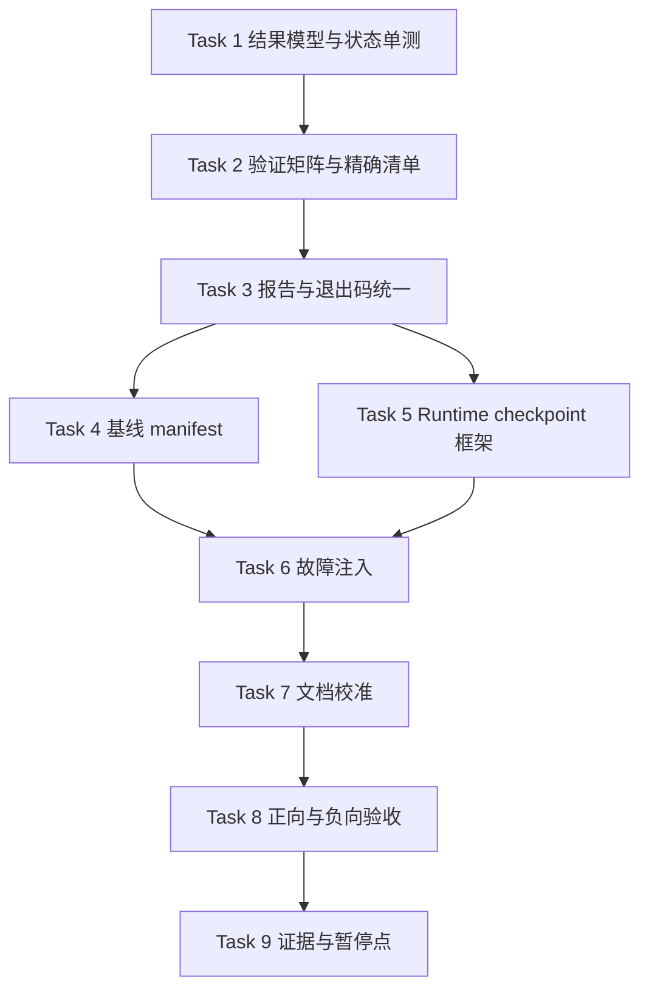

# Celestia 标准 MVC 解耦 Step25 验证机制加固实施计划

> **执行要求：** 本计划经人工评审通过后，实施会话必须使用 `subagent-driven-development` 或 `executing-plans` 按任务逐项执行；每个任务完成后都要核对实际差异和验证证据，不得跳过失败用例，也不得把后补计划与代码实施合并。

**Goal:** 把现有 Celestia 兼容回归从“能够生成截图和报告”加固为“场景身份明确、结果汇总唯一、报告与退出码一致、已知故障能够可靠阻断、可继续承载跨进程多场景多检查点验证”的可信验证基础设施。

**Architecture:** 使用一份结构化验证矩阵统一登记 10 个统一 exe 场景和 6 个 Runtime 场景；把结果归一、状态聚合、报告生成、退出码映射和检查点执行提取为可单测的 PowerShell 模块。现有统一 exe、固定旧提交基线和 Runtime 启动路径继续保留，但不再各自计算一套互相矛盾的 pass/fail。

**Tech Stack:** PowerShell 5.1、JSON、Python 3、Pillow、现有 `image_metrics.py`、SDL 统一 exe、现有 Runtime YAML、Git worktree、Markdown/JSON 机器报告。

---

## 0. 计划状态与人工确认点

- WBS：`0.43`
- 阶段编号：`Step25`
- 路线切片：`V-01`
- 编制日期：`2026-07-15`
- 当前代码事实基线：`0f733ef603b8db5ffc02b735c153d8302bfad3ed`
- 固定旧版能力基线：`44ec265659d2aa666cbf7546e36e4dde471d54ba`
- 设计输入：`DOC/CODEX_DOC/02_设计说明/02-16-Celestia原业务链与MVC责任归属基线.md`
- 当前状态：**Task 1-9 已实施并通过正向、负向和人工图像验收；待人工复核与提交决定**

实施证据：

```text
DOC/CODEX_DOC/06_测试文档/03_机测记录/2026-07-15-201136-Celestia-Step25验证机制加固-机测记录.md
DOC/CODEX_DOC/07_过程文档/01_会话交接/2026-07-15-201136-Celestia-Step25验证机制加固-handoff.md
```

实际完成状态：

| 任务 | 状态 | 核心证据 |
|---|---|---|
| Task 1 | complete | 统一结果对象、状态聚合和 `0/1/2/3` 退出码自测通过 |
| Task 2 | complete | 精确 `10+6` 验证矩阵及重复/越界/集合校验通过 |
| Task 3 | complete | JSON/Markdown 同源报告和真实子进程退出码 probe 通过 |
| Task 4 | complete | 10 图 manifest、commit、精确集合和 SHA256 校验通过；Full 不自动修复损坏基线 |
| Task 5 | complete | 6 个 Runtime 场景、28 个检查点和两图 fixture 通过 |
| Task 6 | complete | `FI-00..FI-11` 共 12 项 expected/actual 全部匹配 |
| Task 7 | complete | README、验收大纲、入口和 synthetic 边界完成校准 |
| Task 8 | complete | Quick `60/60`、Full `96/96`、Step18 `60/60`，均 `pass/0`；20 项接触图已人工检查 |
| Task 9 | complete | 机测记录、交接和 `CODEX_START_HERE.md` 已更新 |

当前成果尚未提交、尚未推送。下文任务清单保留实施前设计时序；实际完成情况以本状态表和机测记录中的可复验数据为准。

人工评审本计划时，首先确认以下四项，而不是只看任务数量：

| 决策项 | 本计划采用的方案 | 原因 |
|---|---|---|
| `warn` 是否阻断自动通过 | `warn` 映射为退出码 `2`，表示“需要人工复核”，不得被 CI 或后续会话当成通过 | 图片差异或指标不可用时，现有机制不能证明没有退化 |
| Full 能否自动重建基线 | 不允许。Full 发现基线缺失、不一致或损坏时直接失败，必须显式运行 `InitBaseline` | 防止一次完整回归在不知情时改写对照依据 |
| 场景 09/10 如何处理 | 保留现有文件和图片身份，在验证矩阵中准确登记已覆盖内容与未覆盖内容 | V-01 不用改名或说明文字冒充持续 follow、真实资源缺失验证 |
| 跨进程画面做到什么程度 | 交付可执行的多场景、多检查点、含 image 检查点的框架，并用隔离测试夹具证明；当前真实 Runtime 仍只登记其确实产生的日志/trace 证据 | 当前 sample View3D 没有原业务画面，V-01 不伪造 View3D 能力 |

只有这四项和后文任务边界经人工确认后，才能开始 Task 1。计划批准不等于批准自动提交或推送；提交和推送仍按用户后续指令执行。

## 1. 为什么是 Step25

Step24 已完成“原业务链与 MVC 责任归属基线”分析，并把验证加固确定为任何 C++ 所有权迁移之前的第一项代码工作。因此下一编号使用 `Step25`，对应总体路线中的 `V-01`。

`41-WBS-0.41` 的 Step23 旧计划曾预想“Step25 RenderAssets 拆分”。该表形成于 Step24 架构检查和新路线之前，已被以下两份较新的决策材料取代：

1. `02-15-Celestia-MVC总体决策与路线图.md`；
2. `02-16-Celestia原业务链与MVC责任归属基线.md`。

本计划不会删除旧文档，也不会篡改历史记录；它只明确当前生效含义：

```text
Step24 = 原业务链与 MVC 责任归属分析
Step25 = V-01 验证机制加固
后续代码阶段 = C-01..C-04、D-01..D-03，均另立计划
```

## 2. 当前事实基线

### 2.1 已经具备的能力

| 能力 | 当前实现 | 可继续保留的原因 |
|---|---|---|
| 固定旧提交 | `BaselineCommit=44ec265...`，独立 detached worktree | 对照对象明确，不需要主工作区来回切换 |
| 统一 exe 场景 | `tools/regression/scenarios/01-10*.cel` | 已覆盖 10 个有价值的最终画面 |
| 场景隔离 | 每个场景创建临时数据根、写入临时配置并设置 `CELESTIA_DATA_DIR` | 不需要为验证修改 Celestia 程序入口 |
| 图片指标 | `image_metrics.py` 计算尺寸、非黑比例、dHash、平均色和彩色/边缘指标 | 能排除缺图、黑图和明显结构漂移 |
| 图片汇总 | Full 生成 baseline/current contact sheet | 适合人工并排检查关键画面 |
| 非视觉验证 | build、CTest、三项 MVC 扫描、进程超时和残留进程检查 | 已经具有硬失败基础 |
| Runtime 启停 | 2D/3D、stdio/local-socket、2D/3D 切换共 6 个配置 | 可以继续作为跨进程基础运行证据 |
| 报告 | 每次运行生成 Markdown 机器报告，Full/Step18 可复制进文档目录 | 已有证据存放习惯 |

2026-07-14 的现有产物还证明：

1. 固定基线目录中当前实际有 `10` 张 PNG，不是 `8` 张；
2. 两个 3D Runtime 日志能够输出正数 `view.frameRendered count`；
3. 当前 synthetic payload 中可观察到 `bodyCount=1`、`starCount=1`、`selectionId=Earth`、`observerReferenceBodyId=Sol`、`resourceCount=3`；
4. 所有 6 个 Runtime 配置能够输出 `all hosts stopped`。

这些是 V-01 可直接校验的当前 Runtime 事实，但不代表真实 Celestia Model 或原 View3D 业务画面已经进入跨进程链路。

### 2.2 已确认的缺口

| ID | 当前代码事实 | 风险 |
|---|---|---|
| `V-GAP-01` | `Invoke-Quick` 调用 `Write-Report` 时没有聚合 screenshot/runtime status | 子项已经是 fail，报告仍可能默认写 pass |
| `V-GAP-02` | `Invoke-Full` 聚合了状态，但只把状态写进报告 | 报告 fail 后 PowerShell 仍可能返回 0 |
| `V-GAP-03` | `Invoke-Step18` 同样没有让最终状态决定进程退出码 | Step18 机器报告不能可靠阻断自动流程 |
| `V-GAP-04` | `Get-Scenarios` 要求至少 10 个，`Ensure-BaselineScreenshots` 却只接受恰好 8 张 | 十场景基线会被误判，后两场身份也没有被严格核对 |
| `V-GAP-05` | 场景清单来自目录扫描，没有结构化身份、能力声明和 checkpoint 清单 | 文件数正确不等于场景身份和证据集合正确 |
| `V-GAP-06` | Runtime smoke 使用固定数组和字符串存在性检查 | 无法登记多个场景、检查 count 数值、业务身份或未来图片检查点 |
| `V-GAP-07` | 09 在 `synchronous` 后又执行 `gotoloc/center`，只截最终一张图 | 不能证明持续 follow 或完整 journey |
| `V-GAP-08` | 10 没有删除、损坏或替换任何资源 | 不能证明真实 missing/fallback |
| `V-GAP-09` | Markdown 报告本身充当机器状态源 | 后续脚本只能再次解析文本，容易形成第二套判断逻辑 |
| `V-GAP-10` | 现有 SelfTest 主要搜索脚本文字和检查场景数量 | 没有证明错误状态、缺失 token、缺图和非零子进程会让顶层命令失败 |

### 2.3 V-01 能关闭与不能关闭的缺口

V-01 必须关闭 `V-GAP-01..06`、`V-GAP-09..10`，并对 `V-GAP-07..08` 做准确声明和后续索引。

V-01 **不直接关闭**以下业务缺口：

1. 持续 follow、chase、phase lock 和非零时长 journey；
2. 真实纹理/mesh 缺失和 fallback 业务行为；
3. 跨进程真实 Celestia 场景画面；
4. Simulation/Observer/Selection 状态回读；
5. 原 View3D 与 `view3d_legacy` 的 1:1 能力对照。

上述项目分别由后续 `C-01..C-04`、`D-01..D-03`、`E-01` 和 `F/G` 阶段提供业务实现与证据。V-01 负责让它们有可复用且不会假通过的验证入口。

### 2.4 Step24 输入追踪

| Step24 输入 | 本计划承接位置 | 关闭方式 |
|---|---|---|
| 第 11.4 节 `V-01` | 第 3、6、8 节，Task 1-8 | 统一状态、退出码、10 场景、Runtime checkpoint 和故障注入 |
| 第 11.8 节后续计划输入边界 | 第 4、5 节 | 只改验证基础设施和测试文档，不改业务所有权 |
| 第 12.2 节现有回归能力审计 | 第 2.1、2.2 节 | 逐项保留已有能力并关闭 `V-GAP-01..06/09..10` |
| 第 12.3 节 10 场景实测范围 | 第 6.2 节 | 矩阵准确登记每场 CAP 和 known gaps |
| 第 12.4/12.5 节能力缺口和 `VG-*` | 第 2.3、6.8、6.9 节 | 只提供后续 checkpoint 入口，不伪造未实现业务证据 |
| 第 12.6 节双轨验证矩阵 | 第 3.2、6.2、6.3、Task 8 | 统一 exe 与 Runtime 共用结果语义和证据追踪 |
| 第 13 节未决项 | 第 4.2、10 节 | 涉及业务语义、真实资源或程序接口时暂停并另行评审 |
| 第 14.3 节下一阶段顺序 | 第 0、13、14 节 | Step25 评审后才能实施，完成后只解锁 C-01 计划 |

## 3. Step25 目标与完成定义

### 3.1 目标

| Goal ID | 目标 | 可观察结果 |
|---|---|---|
| `V25-G1` | 建立唯一验证矩阵 | 10 个统一 exe 场景和 6 个 Runtime 场景不再散落在脚本数组、文件数和文档表格中 |
| `V25-G2` | 建立唯一结果模型 | 所有检查输出同一种 `CheckResult`，所有模式使用同一状态聚合函数 |
| `V25-G3` | 让报告与退出码一致 | Markdown、JSON、控制台结论和进程退出码都从同一个 `RunSummary` 生成 |
| `V25-G4` | 让基线身份可验证 | Full 对场景/checkpoint 文件集合、固定提交和 SHA-256 逐项校验 |
| `V25-G5` | 证明验证工具会失败 | 故障注入覆盖场景缺失、基线缺图/损坏、黑图、Runtime token 缺失、子进程失败和 warn |
| `V25-G6` | 建立跨进程场景框架 | Runtime 场景可登记多个 text/trace/file/image checkpoint；隔离夹具证明两个 image checkpoint 都会执行 |
| `V25-G7` | 保持现有业务基线 | 正向 SelfTest、Quick、Full、Step18 通过，Full 仍生成 10 组 baseline/current 对照 |

### 3.2 完成定义

Step25 只有同时满足以下条件才算完成：

1. 验证矩阵列出的统一 exe 场景与仓库中的 `.cel` 文件集合完全一致，当前为 10/10；
2. 基线 manifest 列出的 image checkpoint 与磁盘 PNG 集合完全一致，当前为 10/10；
3. 任意 `fail` 检查最终退出码为 `1`，任意 `error` 为 `3`；
4. 任意 `warn` 或 required skipped 最终退出码为 `2`，不能被称作通过；
5. `pass` 的 SelfTest、Quick、Full、Step18 最终退出码均为 `0`；
6. Markdown 和 JSON 的 run id、mode、status、exitCode、检查数量完全一致；
7. 故障注入清单的每一项都得到预期非零退出码，恢复后正向用例回到 0；
8. Runtime 验证不再只判断 token 名称存在，而是至少校验正数 frame count 和当前 synthetic 业务身份；
9. 多 image checkpoint 隔离夹具能产生、登记并检查两张不同图片，删除任一张时可靠失败；
10. 没有修改 `src/`、`test/unit/`、CMake、Model、Controller、View、Runtime 协议或现有 `.cel` 场景业务命令；
11. 人工检查 Full contact sheet，确认 10 组基线/当前画面没有未登记的明显退化；
12. 形成 Step25 机测记录和会话交接，明确该阶段只能证明验证基础设施可靠性，不能证明 MVC 已解耦。

## 4. 范围边界

### 4.1 允许修改

1. `tools/regression/` 下的验证矩阵、PowerShell runner/helper 和说明；
2. `image_metrics.py` 的测试夹具入口，仅当多图片隔离测试确实需要；
3. `DOC/CODEX_DOC/06_测试文档/` 下的验收大纲、入口和机测记录；
4. `DOC/CODEX_DOC/07_过程文档/01_会话交接/` 下的 Step25 交接；
5. `CODEX_START_HERE.md` 的当前阶段说明。

### 4.2 明确禁止

1. 不修改 `src/` 下任何程序源码；
2. 不修改 CMake target 和依赖；
3. 不修改 SceneFrame、ViewFrame、ResourceRef 等协议字段；
4. 不修改 Model、Controller、View 的职责；
5. 不实现新的 3D 场景、3D 球体或 Renderer；
6. 不把 synthetic Runtime 日志称作原 Celestia 业务保真；
7. 不通过改名把场景 09/10 描述成它们没有执行的能力；
8. 不在 Full 中静默创建或刷新固定基线；
9. 不把 `-SkipRuntimeSmoke` 的结果记为完整 pass；
10. 不删除旧机器报告或历史计划；
11. 不在本计划未评审时开始脚本实施；
12. 不在用户未要求时提交或推送。

## 5. 目标文件结构

### 5.1 新建文件

| 文件 | 单一责任 |
|---|---|
| `tools/regression/verification-matrix.json` | 唯一登记统一 exe 和 Runtime 场景、checkpoint、能力声明和已知缺口 |
| `tools/regression/helpers/CelestiaCompatRegression.psm1` | 解析矩阵、构造检查结果、聚合状态、校验 artifact 集合、执行 checkpoint、生成 RunSummary 和报告 |
| `tools/regression/helpers/Invoke-CelestiaCompatGateProbe.ps1` | 在子 PowerShell 进程中把给定检查结果转换为报告和真实退出码，供 SelfTest/故障注入验证 |
| `tools/regression/helpers/Run-CelestiaCompatFaultInjection.ps1` | 在临时目录执行正向控制和故障注入，不修改仓库场景或正式基线 |
| `DOC/CODEX_DOC/06_测试文档/01_验收大纲/03-Celestia-Step25验证机制加固验收大纲.md` | 固化 Step25 的检查项、退出码规则、证据要求和能力边界 |

### 5.2 修改文件

| 文件 | 修改目的 |
|---|---|
| `tools/regression/run_celestia_compat_regression.ps1` | 改为读取验证矩阵、统一收集 CheckResult、先写报告再按 RunSummary 退出 |
| `tools/regression/helpers/Run-CelestiaCompatSelfTest.ps1` | 从文字存在性检查升级为模块、矩阵、结果聚合、报告一致性和多检查点执行测试 |
| `tools/regression/helpers/image_metrics.py` | 仅在需要时增加隔离测试图片生成入口；不改变正式图片指标算法和阈值 |
| `tools/regression/README.md` | 说明矩阵、显式基线初始化、退出码和故障注入入口 |
| `DOC/CODEX_DOC/06_测试文档/01_验收大纲/01-Celestia原能力兼容回归验收大纲.md` | 把旧“至少 8 场景”等描述校准为矩阵驱动的 10 场景，并引用 Step25 规则 |
| `DOC/CODEX_DOC/06_测试文档/02_验收入口/01-Celestia原能力兼容回归入口.md` | 增加 SelfTest、故障注入和退出码读取方式 |
| `CODEX_START_HERE.md` | Step25 完成后记录当前阶段、最近证据和下一人工决策点 |

### 5.3 实施结束时生成

| 产物 | 内容 |
|---|---|
| `.regression-artifacts/Celestia/runs/${RUN_ID}/machine-report.json` | 唯一机器可读 RunSummary；`${RUN_ID}` 由 `New-RunContext` 生成 |
| `.regression-artifacts/Celestia/runs/${RUN_ID}/machine-report.md` | 从同一 RunSummary 生成的人工可读报告 |
| `.regression-artifacts/Celestia/baselines/44ec265/baseline-manifest.json` | 固定提交、预期 checkpoint、文件名和 SHA-256 |
| `DOC/CODEX_DOC/06_测试文档/03_机测记录/YYYY-MM-DD-HHMMSS-Celestia-Step25验证机制加固-机测记录.md` | 最终正向/负向执行证据、截图目录和人工检查结论 |
| `DOC/CODEX_DOC/07_过程文档/01_会话交接/YYYY-MM-DD-HHMMSS-Celestia-Step25验证机制加固-handoff.md` | 实际修改、命令、结果、未关闭项和下一阶段入口 |

## 6. 技术设计

### 6.1 验证矩阵

`verification-matrix.json` 使用以下顶层结构：

```json
{
  "schemaVersion": 1,
  "unifiedExeScenarios": [],
  "runtimeScenarios": []
}
```

统一 exe 场景条目必须包含：

```json
{
  "id": "01-earth-default",
  "script": "scenarios/01-earth-default.cel",
  "capabilities": ["CAP-TIME", "CAP-SEL", "CAP-NAV", "CAP-BODY", "CAP-SURFACE", "CAP-POLICY", "CAP-VIS"],
  "checkpoints": [
    {
      "id": "final",
      "kind": "image",
      "placeholder": "$CAPTURE_FILE$",
      "artifact": "01-earth-default.png",
      "required": true
    }
  ],
  "knownGaps": [
    "No state readback is produced.",
    "The final image does not prove persistent follow state."
  ]
}
```

Runtime 场景条目必须包含：

```json
{
  "id": "runtime-3d-stdio",
  "config": "../../DOC/CODEX_DOC/examples/runtime-3d-stdio.yaml",
  "required": true,
  "checkpoints": [
    {
      "id": "clean-shutdown",
      "kind": "stdoutRegex",
      "pattern": "all hosts stopped",
      "minimumMatches": 1,
      "required": true
    },
    {
      "id": "positive-frame-count",
      "kind": "stdoutRegex",
      "pattern": "view\\.frameRendered count=[1-9][0-9]*",
      "minimumMatches": 1,
      "required": true
    },
    {
      "id": "synthetic-earth-identity",
      "kind": "stdoutRegex",
      "pattern": "view\\.frameRendered payload=.*observerReferenceBodyId=Sol.*selectionType=body.*selectionId=Earth",
      "minimumMatches": 1,
      "required": true
    },
    {
      "id": "trace-created",
      "kind": "fileExists",
      "path": "${TRACE_FILE}",
      "required": true
    }
  ],
  "imageCheckpoints": []
}
```

允许的 checkpoint kind 固定为：

| kind | 输入 | 判定 |
|---|---|---|
| `image` | artifact 路径、图片指标阈值 | 文件存在、Pillow 可读、尺寸和非黑比例达标；Full 还要求基线对应项存在 |
| `stdoutRegex` | stdout 文件和 regex | 匹配次数达到 `minimumMatches` |
| `stderrRegex` | stderr 文件和 regex | 仅用于明确期望的诊断；默认 stderr 非空不自动失败 |
| `traceRegex` | trace 文件和 regex | trace 存在且匹配次数达标 |
| `fileExists` | artifact 路径 | 文件存在且是普通文件 |

矩阵加载时必须拒绝：

1. 未知 `schemaVersion`；
2. 重复 scenario id；
3. 重复 checkpoint id；
4. 空脚本/config 路径；
5. 跳出仓库或运行 artifact 根的相对路径；
6. 未知 checkpoint kind；
7. required checkpoint 没有必要字段；
8. 矩阵中的 `.cel` 集合与目录实际 `.cel` 集合不一致；
9. 两个 checkpoint 写入相同 artifact 名；
10. 场景没有任何 checkpoint。

### 6.2 当前 10 个统一 exe 场景的准确登记

| 场景 ID | 当前必须登记的主要能力 | 必须登记的已知缺口 |
|---|---|---|
| `01-earth-default` | `CAP-TIME`、`CAP-SEL`、`CAP-NAV`、`CAP-BODY`、`CAP-SURFACE`、`CAP-POLICY`、`CAP-VIS` | 不回读状态；不能证明持续 synchronous |
| `02-earth-clouds-orbits-labels` | 场景 01 的能力，加 `CAP-ATM`、`CAP-ORBIT`、`CAP-ANNOT` | 只看最终合成画面，不能分别证明每个开关状态 |
| `03-moon-close` | `CAP-TIME`、`CAP-SEL`、`CAP-NAV`、`CAP-BODY`、`CAP-SURFACE`、`CAP-VIS` | 不证明复杂 journey 或 tracking 状态 |
| `04-saturn-rings` | `CAP-TIME`、`CAP-SEL`、`CAP-NAV`、`CAP-BODY`、`CAP-ATM`、`CAP-SURFACE`、`CAP-RESOURCE` | 不证明环资源缺失和多时刻运动 |
| `05-asteroid-or-spacecraft` | `CAP-SEL`、`CAP-NAV`、`CAP-BODY`、`CAP-SURFACE`、`CAP-ANNOT`、`CAP-RESOURCE` | 只选择 Eros；不证明 spacecraft、CPU pick、Location projector 或 GPU cache 边界 |
| `06-starfield-constellations` | `CAP-STAR`、`CAP-CATALOG`、`CAP-ANNOT`、`CAP-POLICY`、`CAP-VIS` | 不证明近星/远星两条内部链路分别正确 |
| `07-galaxy-deepsky` | `CAP-DSO`、`CAP-CATALOG`、`CAP-SEL`、`CAP-NAV`、`CAP-VIS`、`CAP-RESOURCE` | 只覆盖 Milky Way；不证明四类 DSO 各自资源和画法 |
| `08-script-overlay-hud` | `CAP-SCRIPT`、`CAP-FEEDBACK`、`CAP-POLICY`，并间接触发 Earth 能力 | 不证明 image/video Overlay，也不证明脚本对真实 Session 与目标 View 的写入归属 |
| `09-selection-follow-goto` | `CAP-SEL`、`CAP-NAV`、`CAP-SCRIPT`、`CAP-FEEDBACK`、`CAP-ORBIT`、`CAP-ANNOT` | 不得声明已证明持续 follow 或完整 goto journey |
| `10-resource-fallback-missing` | `CAP-BODY`、`CAP-SURFACE`、`CAP-RESOURCE`、`CAP-ORBIT`、`CAP-FEEDBACK` | 没有制造资源缺失；不得声明已证明 missing/fallback |

场景 ID 暂时保留历史文件名，是为了保留基线 artifact 身份。矩阵中的 `knownGaps` 是当前有效能力声明；未来真正补上 `VG-10` 或 `VG-16` 时，应新增明确 checkpoint/场景，而不是悄悄扩大旧图片含义。

### 6.3 当前 6 个 Runtime 场景的准确登记

| Runtime ID | 当前 required checkpoint |
|---|---|
| `runtime-2d-stdio` | config 存在、进程退出 0、trace 存在、stdout 包含 `all hosts stopped` |
| `runtime-2d-local-socket` | config 存在、进程退出 0、trace 存在、stdout 包含 `all hosts stopped` |
| `runtime-3d-stdio` | 上述基础项、正数 frame count、synthetic Earth/Sol 身份、`bodyCount=1`、`starCount=1`、`resourceCount=3`、`missingRequiredResourceCount=0` |
| `runtime-3d-local-socket` | 与 3D stdio 相同，但保留独立 scenario id 和证据路径 |
| `runtime-switch-2d-to-3d-local-socket` | clean shutdown、trace、切换后至少一个 3D frame、synthetic Earth/Sol 身份 |
| `runtime-switch-3d-to-2d-local-socket` | clean shutdown、trace、切换前至少一个 3D frame、synthetic Earth/Sol 身份 |

这里的 `synthetic` 必须进入报告 detail，避免以后把它误读成 `RealModelBackend` 已经输出真实 Catalog。

### 6.4 统一检查结果模型

所有 build、test、scan、process、image、comparison、runtime checkpoint 和 baseline 检查统一产生：

```powershell
[pscustomobject]@{
    Id       = "runtime-3d-stdio/positive-frame-count"
    Group    = "runtime"
    Status   = "pass" # pass | warn | fail | error | skipped
    Required = $true
    Detail   = "view.frameRendered count=24"
    Evidence = @("D:\...\runtime-3d-stdio.yaml.stdout.log")
}
```

实现模块提供的核心入口固定为：

```powershell
New-RegressionCheck
Invoke-RegressionStage
Get-RegressionAggregateStatus
Get-RegressionExitCode
Read-VerificationMatrix
Test-VerificationMatrix
Test-ArtifactSet
Test-RegressionCheckpoint
New-BaselineManifest
Test-BaselineManifest
New-RegressionRunSummary
Write-RegressionReports
```

每个 Task 新增函数后同步扩展模块末尾的 `Export-ModuleMember`；最终导出清单必须与上表一致，SelfTest 不得通过 dot-source 或访问模块私有变量绕过公开入口。

状态优先级固定为：

```text
error > fail > warn > pass
```

`skipped` 的规则：

1. optional 检查被跳过，不改变总状态，但必须出现在报告中；
2. required 检查被跳过，总状态至少为 `warn`；
3. Quick/Full/Step18 使用 `-SkipRuntimeSmoke` 时，Runtime 项属于 required skipped，因此退出码为 2；
4. 报告不得把 required skipped 写成 pass。

### 6.5 退出码

| RunSummary status | 退出码 | 自动化含义 |
|---|---:|---|
| `pass` | `0` | 已覆盖检查全部通过 |
| `fail` | `1` | 已知验证项失败，必须停止后续迁移 |
| `warn` | `2` | 证据不足或需要人工复核，不得自动继续 |
| `error` | `3` | 验证工具、配置或运行环境自身错误，结果不可用 |

#### 6.5.1 被测失败与工具错误的分类

退出码 `1` 和 `3` 不能只靠最外层 catch 区分。每个可预期执行阶段必须通过统一 stage wrapper 运行：

```powershell
function Invoke-RegressionStage {
    [CmdletBinding()]
    param(
        [Parameter(Mandatory = $true)][string] $Id,
        [Parameter(Mandatory = $true)][string] $Group,
        [Parameter(Mandatory = $true)][scriptblock] $Action,
        [ValidateSet("fail", "error")][string] $FailureStatus = "fail"
    )

    try {
        $value = & $Action
        return [pscustomobject]@{
            Value = $value
            Check = New-RegressionCheck -Id $Id -Group $Group -Status pass -Required $true -Detail "completed"
        }
    } catch {
        return [pscustomobject]@{
            Value = $null
            Check = New-RegressionCheck -Id $Id -Group $Group -Status $FailureStatus -Required $true -Detail $_.Exception.Message
        }
    }
}
```

分类规则固定为：

| 情况 | 分类 |
|---|---|
| 编译器、CTest、MVC scan 已启动并返回非零 | `fail` |
| Celestia/Host 子进程已启动但返回非零、超时、缺图或缺 token | `fail` |
| baseline 缺图、多图、hash mismatch | `fail` |
| 用户显式跳过 required 检查 | `warn` |
| PowerShell/Python/Visual Studio 必要工具不存在 | `error` |
| 验证矩阵 JSON 无法解析、schema 不支持、模块函数异常 | `error` |
| runner 计划外未捕获异常 | `error` |

`Invoke-CMakeAndCTest`、MVC scan、每个 unified scenario、每个 Runtime process 和每个 comparison 都要在自己的 stage/checkpoint 边界转换为 CheckResult。依赖阶段失败后，后续 required 检查登记为 skipped；不能继续执行危险操作，也不能让最外层 catch 把正常的被测失败改写成 error。

顶层 runner 必须遵循以下顺序：

```text
执行检查 -> 构造 RunSummary -> 写 JSON -> 从同一对象写 Markdown -> 输出报告路径 -> exit RunSummary.exitCode
```

禁止先 `throw` 导致无报告，也禁止写完 fail 报告后自然返回 0。对于无法构造普通检查结果的异常，catch 块必须构造 `harness/unhandled-exception` error 检查，再写报告并返回 3。

### 6.6 报告

JSON 是机器状态源，Markdown 只负责展示。RunSummary 至少包含：

```json
{
  "schemaVersion": 1,
  "runId": "2026-07-15-120000-0f733ef-full",
  "mode": "Full",
  "currentCommit": "0f733ef...",
  "baselineCommit": "44ec265...",
  "status": "pass",
  "exitCode": 0,
  "verificationMatrix": "tools/regression/verification-matrix.json",
  "artifactRoot": "D:/.../runs/...",
  "checks": []
}
```

Markdown 顶部的 `runId/mode/status/exitCode/check count` 必须逐项来自该对象。SelfTest 需要重新读取 JSON 和 Markdown，验证两者头部一致，而不是只检查某几个单词出现。

### 6.7 基线 manifest

`InitBaseline` 成功后写：

```json
{
  "schemaVersion": 1,
  "baselineCommit": "44ec265659d2aa666cbf7546e36e4dde471d54ba",
  "createdAt": "2026-07-15T12:00:00+08:00",
  "images": [
    {
      "scenarioId": "01-earth-default",
      "checkpointId": "final",
      "relativePath": "screenshots/baseline/01-earth-default.png",
      "sha256": "0123456789abcdef0123456789abcdef0123456789abcdef0123456789abcdef"
    }
  ]
}
```

完整性判断不是“数量等于 10”这么简单，而是同时满足：

1. manifest 的 `baselineCommit` 等于命令参数；
2. 矩阵期望的 `(scenarioId, checkpointId, artifact)` 集合与 manifest 完全相等；
3. manifest 与磁盘 PNG 相对路径集合完全相等；
4. 每个文件 SHA-256 与 manifest 一致；
5. 不存在缺图、额外旧图、重复键或未知场景；
6. 图片仍可由 `image_metrics.py` 读取。

Full 发现任一不一致时生成 fail 报告并提示显式运行 `InitBaseline`。它不能自动调用 `Invoke-InitBaseline`。

### 6.8 多场景多检查点框架

统一 exe 当前仍是每场一个 `final` 图片 checkpoint，但 runner 不再假设只有一个占位符。它按矩阵逐项替换 checkpoint placeholder，并按 `artifact` 收集结果。

Runtime 场景按矩阵执行多个 checkpoint。`imageCheckpoints` 当前真实 6 个 Runtime 场景为空，原因是 sample View3D 不输出原业务画面；框架测试使用隔离临时目录和两张由 Pillow 生成的 160x120 非黑 PNG，验证：

1. 两个 checkpoint 均存在时 pass；
2. 删除第一张时 fail；
3. 删除第二张时 fail；
4. 把其中一张换成全黑图时 fail；
5. 两张 artifact 名称重复时矩阵校验 fail。

因此 Step25 可以证明“跨进程场景已经有可执行的多图片登记和检查能力”，但不能证明“跨进程 View3D 已经产生原 Celestia 场景”。

### 6.9 故障注入矩阵

故障注入只能操作临时矩阵、临时 artifact 和 gate probe；不得删除正式场景、正式基线或修改程序源码。

| ID | 注入方式 | 预期 status | 预期退出码 | 必须核对的证据 |
|---|---|---|---:|---|
| `FI-00` | 全部正向 fixture | pass | 0 | JSON/Markdown 都为 pass |
| `FI-01` | 临时矩阵删除 `10-resource-fallback-missing` | fail | 1 | 报告列出 missing scenario id |
| `FI-02` | 临时场景目录增加未登记 `.cel` | fail | 1 | 报告列出 unexpected script |
| `FI-03` | 临时基线删除一张 PNG | fail | 1 | 报告给出 scenario/checkpoint key |
| `FI-04` | 临时基线图片内容改变导致 SHA-256 不同 | fail | 1 | 报告同时给出 expected/actual hash |
| `FI-05` | 当前图片替换为 160x120 全黑 PNG | fail | 1 | image checkpoint 报告 nonBlackRatio 不达标 |
| `FI-06` | Runtime stdout 删除 `all hosts stopped` | fail | 1 | 报告定位 clean-shutdown checkpoint |
| `FI-07` | Runtime stdout 把 frame count 改为 0 | fail | 1 | 报告定位 positive-frame-count checkpoint |
| `FI-08` | 模拟被测子进程退出 17 | fail | 1 | 报告保存原始 child exit code=17 |
| `FI-09` | 图片差异只达到 warn 阈值 | warn | 2 | 报告 warn，顶层不得返回 0 |
| `FI-10` | gate probe 内部读取损坏 JSON | error | 3 | 报告包含 harness error 或 stderr 明确说明不可用 |
| `FI-11` | Runtime fixture 登记两张图后删除任一张 | fail | 1 | 报告定位具体 image checkpoint id |

故障注入脚本最终输出汇总：

```text
Celestia compatibility harness fault injection passed: 12/12 cases matched expected status and exit code
```

只有看到每项的实际子进程退出码后，才能写这句；不能仅根据 PowerShell 函数返回对象推断。

## 7. 实施依赖顺序



Task 4 与 Task 5 在逻辑上可以并行，但都会修改 runner、模块和 SelfTest。当前单会话策略下串行执行，避免在同一 PowerShell 结果模型上产生两套实现。

## 8. 详细实施任务

### Task 1：建立统一结果模型和状态单测

**Files:**

- Create: `tools/regression/helpers/CelestiaCompatRegression.psm1`
- Modify: `tools/regression/helpers/Run-CelestiaCompatSelfTest.ps1`

- [ ] **Step 1：先写状态聚合失败测试**

SelfTest 增加以下明确用例：

```powershell
function Assert-Equal {
    param(
        [Parameter(Mandatory = $true)] $Actual,
        [Parameter(Mandatory = $true)] $Expected,
        [Parameter(Mandatory = $true)][string] $Message
    )
    if ($Actual -ne $Expected) {
        throw "$Message expected=[$Expected] actual=[$Actual]"
    }
}

$pass = New-RegressionCheck -Id "pass" -Group "self" -Status pass -Required $true -Detail "ok"
$warn = New-RegressionCheck -Id "warn" -Group "self" -Status warn -Required $true -Detail "review"
$fail = New-RegressionCheck -Id "fail" -Group "self" -Status fail -Required $true -Detail "broken"
$error = New-RegressionCheck -Id "error" -Group "self" -Status error -Required $true -Detail "harness"
$skippedRequired = New-RegressionCheck -Id "skip" -Group "self" -Status skipped -Required $true -Detail "skipped"

Assert-Equal -Actual (Get-RegressionAggregateStatus -Checks @()) -Expected "error" -Message "empty aggregate"
Assert-Equal -Actual (Get-RegressionAggregateStatus -Checks @($pass)) -Expected "pass" -Message "pass aggregate"
Assert-Equal -Actual (Get-RegressionAggregateStatus -Checks @($pass, $warn)) -Expected "warn" -Message "warn aggregate"
Assert-Equal -Actual (Get-RegressionAggregateStatus -Checks @($pass, $fail)) -Expected "fail" -Message "fail aggregate"
Assert-Equal -Actual (Get-RegressionAggregateStatus -Checks @($fail, $error)) -Expected "error" -Message "error aggregate"
Assert-Equal -Actual (Get-RegressionAggregateStatus -Checks @($pass, $skippedRequired)) -Expected "warn" -Message "required skipped aggregate"
Assert-Equal -Actual (Get-RegressionExitCode -Status pass) -Expected 0 -Message "pass exit"
Assert-Equal -Actual (Get-RegressionExitCode -Status fail) -Expected 1 -Message "fail exit"
Assert-Equal -Actual (Get-RegressionExitCode -Status warn) -Expected 2 -Message "warn exit"
Assert-Equal -Actual (Get-RegressionExitCode -Status error) -Expected 3 -Message "error exit"
```

- [ ] **Step 2：运行 SelfTest，确认先失败**

Run:

```powershell
powershell -NoProfile -ExecutionPolicy Bypass -File tools\regression\helpers\Run-CelestiaCompatSelfTest.ps1
```

Expected: nonzero，错误明确指出 `CelestiaCompatRegression.psm1` 或 `New-RegressionCheck` 尚不存在。

- [ ] **Step 3：实现最小结果模型**

模块必须实现并导出：

```powershell
function New-RegressionCheck {
    [CmdletBinding()]
    param(
        [Parameter(Mandatory = $true)][string] $Id,
        [Parameter(Mandatory = $true)][string] $Group,
        [Parameter(Mandatory = $true)]
        [ValidateSet("pass", "warn", "fail", "error", "skipped")]
        [string] $Status,
        [Parameter(Mandatory = $true)][bool] $Required,
        [Parameter(Mandatory = $true)][string] $Detail,
        [string[]] $Evidence = @()
    )

    [pscustomobject]@{
        Id = $Id
        Group = $Group
        Status = $Status
        Required = $Required
        Detail = $Detail
        Evidence = @($Evidence)
    }
}

function Get-RegressionAggregateStatus {
    param(
        [Parameter(Mandatory = $true)]
        [AllowEmptyCollection()]
        [object[]] $Checks
    )

    if ($Checks.Count -eq 0) { return "error" }
    if (@($Checks | Where-Object Status -eq "error").Count -gt 0) { return "error" }
    if (@($Checks | Where-Object Status -eq "fail").Count -gt 0) { return "fail" }
    if (@($Checks | Where-Object Status -eq "warn").Count -gt 0) { return "warn" }
    if (@($Checks | Where-Object { $_.Required -and $_.Status -eq "skipped" }).Count -gt 0) { return "warn" }
    return "pass"
}

function Get-RegressionExitCode {
    param([ValidateSet("pass", "warn", "fail", "error")][string] $Status)
    switch ($Status) {
        "pass" { return 0 }
        "fail" { return 1 }
        "warn" { return 2 }
        "error" { return 3 }
    }
}

Export-ModuleMember -Function New-RegressionCheck, Get-RegressionAggregateStatus, Get-RegressionExitCode
```

- [ ] **Step 4：运行 SelfTest，确认状态用例通过**

Expected: 状态聚合和退出码用例 pass；现有 image metrics self-test 继续 pass。

- [ ] **Step 5：检查 PowerShell 语法和格式**

Run:

```powershell
$errors = $null
[void][System.Management.Automation.Language.Parser]::ParseFile(
    (Resolve-Path 'tools\regression\helpers\CelestiaCompatRegression.psm1'),
    [ref]$null,
    [ref]$errors)
if ($errors.Count -gt 0) { $errors | Format-List; exit 1 }
```

Expected: exit code 0。

- [ ] **Step 6：形成提交边界 1，但不自动推送**

```powershell
git add tools/regression/helpers/CelestiaCompatRegression.psm1 tools/regression/helpers/Run-CelestiaCompatSelfTest.ps1
git commit -m "test: add regression result model"
```

### Task 2：建立验证矩阵和精确场景清单

**Files:**

- Create: `tools/regression/verification-matrix.json`
- Modify: `tools/regression/helpers/CelestiaCompatRegression.psm1`
- Modify: `tools/regression/helpers/Run-CelestiaCompatSelfTest.ps1`
- Modify: `tools/regression/run_celestia_compat_regression.ps1`

- [ ] **Step 1：写矩阵校验失败用例**

SelfTest 必须使用临时目录逐项构造并验证：重复 scenario、重复 checkpoint、缺少脚本、额外脚本、未知 kind、重复 artifact、零 checkpoint 和路径逃逸。

Expected messages 固定包含：

```text
duplicate scenario id
duplicate checkpoint id
missing scenario script
unexpected scenario script
unsupported checkpoint kind
duplicate checkpoint artifact
scenario has no checkpoints
path escapes allowed root
```

- [ ] **Step 2：运行 SelfTest，确认矩阵功能尚未实现**

Expected: nonzero，失败点在 `Read-VerificationMatrix` 或 `Test-VerificationMatrix`。

- [ ] **Step 3：创建完整矩阵**

写入本计划第 6.2 节全部 10 个 unified scenario 和第 6.3 节全部 6 个 Runtime scenario。不得省略任何条目；每一项都要有唯一 ID、实际路径、required checkpoint、能力和 known gaps。

- [ ] **Step 4：实现矩阵读取与文件集合比较**

模块实现：

```powershell
function Read-VerificationMatrix {
    param([Parameter(Mandatory = $true)][string] $Path)
    if (-not (Test-Path -LiteralPath $Path -PathType Leaf)) {
        throw "verification matrix is missing: $Path"
    }
    $matrix = Get-Content -LiteralPath $Path -Raw -Encoding UTF8 | ConvertFrom-Json
    if ($matrix.schemaVersion -ne 1) {
        throw "unsupported verification matrix schemaVersion: $($matrix.schemaVersion)"
    }
    return $matrix
}
```

`Test-ArtifactSet` 必须比较规范化后的集合差，而不是只比较 Count：

```powershell
$missing = @($Expected | Where-Object { $_ -notin $Actual })
$unexpected = @($Actual | Where-Object { $_ -notin $Expected })
```

- [ ] **Step 5：改造 `Get-Scenarios`**

`Get-Scenarios` 不再使用 `Count -lt 10`。它必须读取矩阵、校验实际 `.cel` 集合，并按矩阵顺序返回 scenario 条目。

- [ ] **Step 6：运行 SelfTest 和场景清单检查**

Run:

```powershell
powershell -NoProfile -ExecutionPolicy Bypass -File tools\regression\run_celestia_compat_regression.ps1 -Mode SelfTest
```

Expected:

```text
verification matrix: 10 unified exe scenarios, 6 runtime scenarios
Celestia compatibility regression self-test passed
```

- [ ] **Step 7：确认没有硬编码 8/10 数量逻辑**

Run:

```powershell
rg -n "Count -eq 8|Count -lt 10|Expected at least 10" tools\regression
```

Expected: no matches。数字 10 可以出现在文档输出或测试期望中，但运行逻辑必须以矩阵集合为准。

- [ ] **Step 8：形成提交边界 2，但不自动推送**

```powershell
git add tools/regression/verification-matrix.json tools/regression/helpers/CelestiaCompatRegression.psm1 tools/regression/helpers/Run-CelestiaCompatSelfTest.ps1 tools/regression/run_celestia_compat_regression.ps1
git commit -m "test: define Celestia verification matrix"
```

### Task 3：统一报告、总状态和顶层退出码

**Files:**

- Create: `tools/regression/helpers/Invoke-CelestiaCompatGateProbe.ps1`
- Modify: `tools/regression/helpers/CelestiaCompatRegression.psm1`
- Modify: `tools/regression/helpers/Run-CelestiaCompatSelfTest.ps1`
- Modify: `tools/regression/run_celestia_compat_regression.ps1`

- [ ] **Step 1：先写真实子进程退出码测试**

SelfTest 通过 `Start-Process -Wait -PassThru` 分别调用 gate probe：

```powershell
$cases = @(
    @{ Status = "pass"; ExpectedExitCode = 0 },
    @{ Status = "fail"; ExpectedExitCode = 1 },
    @{ Status = "warn"; ExpectedExitCode = 2 },
    @{ Status = "error"; ExpectedExitCode = 3 }
)
```

每个 case 必须使用独立临时输出目录，并重新读取 `machine-report.json` 和 `machine-report.md`。测试不能只调用 `Get-RegressionExitCode` 后推断顶层结果。

- [ ] **Step 2：运行 SelfTest，确认 gate probe 尚不存在**

Expected: nonzero，明确指出 `Invoke-CelestiaCompatGateProbe.ps1` 缺失。

- [ ] **Step 3：实现 RunSummary 和双报告生成**

模块增加：

```powershell
function New-RegressionRunSummary {
    param(
        [Parameter(Mandatory = $true)][string] $RunId,
        [Parameter(Mandatory = $true)][string] $Mode,
        [Parameter(Mandatory = $true)][string] $CurrentCommit,
        [Parameter(Mandatory = $true)][string] $BaselineCommit,
        [Parameter(Mandatory = $true)][string] $VerificationMatrix,
        [Parameter(Mandatory = $true)][string] $ArtifactRoot,
        [Parameter(Mandatory = $true)]
        [AllowEmptyCollection()]
        [object[]] $Checks
    )

    $status = Get-RegressionAggregateStatus -Checks $Checks
    [pscustomobject]@{
        schemaVersion = 1
        runId = $RunId
        mode = $Mode
        currentCommit = $CurrentCommit
        baselineCommit = $BaselineCommit
        status = $status
        exitCode = Get-RegressionExitCode -Status $status
        verificationMatrix = $VerificationMatrix
        artifactRoot = $ArtifactRoot
        checks = @($Checks)
    }
}
```

`Write-RegressionReports` 必须：

1. 先把完整 Summary 用 `ConvertTo-Json -Depth 12` 写入 `machine-report.json`；
2. 再从同一个 Summary 写 Markdown；
3. 返回两个绝对路径；
4. 不接收第二个独立 `ExtraStatus` 参数；
5. 不在函数中重新聚合状态。

- [ ] **Step 4：实现 gate probe**

```powershell
param(
    [Parameter(Mandatory = $true)]
    [ValidateSet("pass", "warn", "fail", "error")]
    [string] $Status,
    [Parameter(Mandatory = $true)][string] $OutputRoot
)

$ErrorActionPreference = "Stop"
Import-Module (Join-Path $PSScriptRoot "CelestiaCompatRegression.psm1") -Force

try {
    New-Item -ItemType Directory -Force -Path $OutputRoot | Out-Null
    $check = New-RegressionCheck -Id "probe/$Status" -Group "probe" -Status $Status -Required $true -Detail "gate probe"
    $summary = New-RegressionRunSummary -RunId "probe-$Status" -Mode "Probe" -CurrentCommit "probe" -BaselineCommit "probe" -VerificationMatrix "probe" -ArtifactRoot $OutputRoot -Checks @($check)
    Write-RegressionReports -Summary $summary -OutputRoot $OutputRoot | Out-Null
    exit $summary.exitCode
} catch {
    Write-Error $_
    exit 3
}
```

- [ ] **Step 5：让所有正式模式返回检查集合**

`Invoke-InitBaseline`、`Invoke-Quick`、`Invoke-Full`、`Invoke-Step18` 不再各自决定最终 status 或自然结束。每个函数返回：

```powershell
[pscustomobject]@{
    Context = $context
    Checks = @($checks)
    CurrentScreens = @($screens)
    BaselineScreens = @($baselineScreens)
    Comparisons = @($comparisons)
    RuntimeScenarios = @($runtimeScenarios)
}
```

现有 `Get-RuntimeSmokeStatus` 和 Full 内部重复的 status 汇总在新路径通过 SelfTest 后删除，避免双重事实源。

所有现有会抛错的被测阶段都必须使用第 6.5.1 节的 `Invoke-RegressionStage` 转换：

1. `Invoke-CMakeAndCTest` 中的 configure、build、CTest 分别产生检查项；
2. 三项 MVC scan 分别产生检查项；
3. 每个 unified scenario 的 process、image artifact、image metric 分别产生检查项；
4. 每个 Runtime scenario 的 process 和 checkpoint 分别产生检查项；
5. 每个 Full comparison 分别产生检查项；
6. 前置 stage fail 后，其依赖项登记 required skipped，不执行依赖动作。

- [ ] **Step 6：实现顶层统一完成路径**

`New-RunContext` 增加稳定 `RunId`：

```powershell
$runId = "{0}-{1}-{2}" -f $timestamp, $commit, $RunMode.ToLowerInvariant()
$runRoot = Join-Path $ArtifactsRoot ("runs\" + $runId)
return [pscustomobject]@{
    RunId = $runId
    Timestamp = $timestamp
    Commit = $commit
    RunRoot = $runRoot
    LogRoot = (Join-Path $runRoot "logs")
}
```

增加唯一模式分发函数：

```powershell
function Invoke-SelectedMode {
    param([string] $SelectedMode, [object] $Context)
    switch ($SelectedMode) {
        "InitBaseline" { return Invoke-InitBaseline -Context $Context }
        "Quick"        { return Invoke-Quick -Context $Context }
        "Full"         { return Invoke-Full -Context $Context }
        "Step18"       { return Invoke-Step18 -Context $Context }
        default         { throw "Unsupported run mode in formal gate: $SelectedMode" }
    }
}
```

runner 顶层在 `Resolve-RegressionDefaults` 后创建 context，并使用一个 try/catch。SelfTest 保持独立分支；四个正式模式走统一分发：

```powershell
$context = New-RunContext -RunMode $Mode
$result = $null
try {
    $result = Invoke-SelectedMode -SelectedMode $Mode -Context $context
    $checks = @($result.Checks)
} catch {
    $checks = @(
        New-RegressionCheck `
            -Id "harness/unhandled-exception" `
            -Group "harness" `
            -Status error `
            -Required $true `
            -Detail $_.Exception.Message
    )
}

$summary = New-RegressionRunSummary `
    -RunId $context.RunId `
    -Mode $Mode `
    -CurrentCommit (Get-GitText $repoRoot @("rev-parse", "HEAD")) `
    -BaselineCommit $BaselineCommit `
    -VerificationMatrix $verificationMatrixPath `
    -ArtifactRoot $context.RunRoot `
    -Checks $checks

$reports = Write-RegressionReports -Summary $summary -OutputRoot $context.RunRoot
Write-Step "json report: $($reports.Json)"
Write-Step "markdown report: $($reports.Markdown)"
exit $summary.exitCode
```

`SelfTest` 模式可以继续由 runner 调用 helper，但 runner 仍要把 helper 的非零退出转换为自己的非零退出，不能吞掉 `$LASTEXITCODE`。

- [ ] **Step 7：运行 probe 和 SelfTest**

Run:

```powershell
$root = Join-Path $env:TEMP 'celestia-gate-probe-manual'
foreach ($status in 'pass','fail','warn','error') {
    powershell -NoProfile -ExecutionPolicy Bypass -File tools\regression\helpers\Invoke-CelestiaCompatGateProbe.ps1 -Status $status -OutputRoot (Join-Path $root $status)
    Write-Host "$status=$LASTEXITCODE"
}
```

Expected:

```text
pass=0
fail=1
warn=2
error=3
```

Then:

```powershell
powershell -NoProfile -ExecutionPolicy Bypass -File tools\regression\run_celestia_compat_regression.ps1 -Mode SelfTest
```

Expected: exit code 0。

- [ ] **Step 8：确认报告中不存在第二套状态参数**

Run:

```powershell
rg -n "ExtraStatus|Get-RuntimeSmokeStatus|\$status = \"pass\"" tools\regression\run_celestia_compat_regression.ps1
```

Expected: no matches in final implementation。

- [ ] **Step 9：形成提交边界 3，但不自动推送**

```powershell
git add tools/regression/helpers/Invoke-CelestiaCompatGateProbe.ps1 tools/regression/helpers/CelestiaCompatRegression.psm1 tools/regression/helpers/Run-CelestiaCompatSelfTest.ps1 tools/regression/run_celestia_compat_regression.ps1
git commit -m "fix: make regression status drive process exit"
```

### Task 4：建立精确基线 manifest

**Files:**

- Modify: `tools/regression/helpers/CelestiaCompatRegression.psm1`
- Modify: `tools/regression/helpers/Run-CelestiaCompatSelfTest.ps1`
- Modify: `tools/regression/run_celestia_compat_regression.ps1`

- [ ] **Step 1：写基线集合和 hash 失败测试**

在临时目录建立三个 checkpoint：

```text
scene-a/final -> a.png
scene-b/final -> b.png
scene-c/t1    -> c-t1.png
```

依次验证：完整集合 pass、缺 `b.png` fail、额外 `old.png` fail、修改 `a.png` 后 hash mismatch fail、manifest baseline commit 不同 fail。

- [ ] **Step 2：运行 SelfTest，确认基线 manifest 功能尚未实现**

Expected: nonzero，失败点在 `New-BaselineManifest` 或 `Test-BaselineManifest`。

- [ ] **Step 3：实现 manifest 创建和校验**

实现入口：

```powershell
New-BaselineManifest
Test-BaselineManifest
```

每张图片的 hash 使用：

```powershell
(Get-FileHash -LiteralPath $imagePath -Algorithm SHA256).Hash.ToLowerInvariant()
```

`Test-BaselineManifest` 返回 `CheckResult[]`，不能直接 `throw` 普通缺图/多图/hash mismatch；只有 JSON 无法解析等工具错误才返回 `error`。

- [ ] **Step 4：改造 `Invoke-InitBaseline`**

流程固定为：

```text
验证固定 worktree -> 构建旧版 exe -> 按矩阵捕获全部 baseline image checkpoint
-> 每张图片指标通过 -> 写 baseline-manifest.json -> 重新读取并自校验 -> 写报告
```

任一图片 fail/warn 时不写“有效 manifest”。可以写临时 `baseline-manifest.failed.json` 留证，但 Full 不得接受。

- [ ] **Step 5：改造 Full 基线检查**

删除：

```powershell
if ($screens.Count -eq 8) { return }
Invoke-InitBaseline
```

替换为显式检查结果。缺失或不一致时，Full 写 fail 报告并返回 1，detail 固定包含：

```text
Baseline is not valid for the current verification matrix. Run -Mode InitBaseline explicitly.
```

- [ ] **Step 6：在正式基线目录显式执行 InitBaseline**

Run:

```powershell
powershell -NoProfile -ExecutionPolicy Bypass -File tools\regression\run_celestia_compat_regression.ps1 -Mode InitBaseline
```

Expected:

1. exit code 0；
2. baseline manifest 包含固定提交；
3. image entries 为 10；
4. 实际 PNG 集合为 10；
5. 每项 SHA-256 为 64 位小写十六进制；
6. 不存在额外旧图。

- [ ] **Step 7：验证 Full 不会静默修复坏基线**

只在临时基线副本中删除一张图，并用 `-ArtifactsRoot` 指向临时根运行 Full。Expected: exit 1；临时目录中的缺图不会被重新创建；报告提示显式 InitBaseline。

- [ ] **Step 8：形成提交边界 4，但不自动推送**

```powershell
git add tools/regression/helpers/CelestiaCompatRegression.psm1 tools/regression/helpers/Run-CelestiaCompatSelfTest.ps1 tools/regression/run_celestia_compat_regression.ps1
git commit -m "fix: validate exact screenshot baseline"
```

注意：仓库外的 `baseline-manifest.json` 不进入 Git 提交，它属于可再生成的运行 artifact。

### Task 5：建立 Runtime 多场景多检查点执行框架

**Files:**

- Modify: `tools/regression/verification-matrix.json`
- Modify: `tools/regression/helpers/CelestiaCompatRegression.psm1`
- Modify: `tools/regression/helpers/Run-CelestiaCompatSelfTest.ps1`
- Modify: `tools/regression/run_celestia_compat_regression.ps1`
- Modify only if required: `tools/regression/helpers/image_metrics.py`

- [ ] **Step 1：先写 checkpoint 执行失败测试**

SelfTest 在临时目录构造：

1. stdout 包含 clean shutdown、正数 count 和 synthetic Earth identity；
2. trace 文件存在；
3. 两张 160x120 非黑 PNG；
4. 一个含上述 5 个 checkpoint 的临时 Runtime scenario。

先验证全部 pass，再分别删除 token、把 count 改成 0、删除 trace、删除第一张图、删除第二张图、制造重复 artifact。

- [ ] **Step 2：运行 SelfTest，确认通用 checkpoint 执行器尚未完成**

Expected: nonzero，失败点在 `Test-RegressionCheckpoint`。

- [ ] **Step 3：实现 checkpoint 执行器**

执行器必须返回一个 CheckResult，不得只返回 bool：

```powershell
function Test-RegressionCheckpoint {
    param(
        [Parameter(Mandatory = $true)][object] $Checkpoint,
        [Parameter(Mandatory = $true)][hashtable] $Artifacts
    )

    switch ($Checkpoint.kind) {
        "stdoutRegex" { return Test-TextCheckpoint -Checkpoint $Checkpoint -Path $Artifacts.Stdout }
        "stderrRegex" { return Test-TextCheckpoint -Checkpoint $Checkpoint -Path $Artifacts.Stderr }
        "traceRegex"  { return Test-TextCheckpoint -Checkpoint $Checkpoint -Path $Artifacts.Trace }
        "fileExists"  { return Test-FileCheckpoint -Checkpoint $Checkpoint -Artifacts $Artifacts }
        "image"       { return Test-ImageCheckpoint -Checkpoint $Checkpoint -Artifacts $Artifacts }
        default        { return New-RegressionCheck -Id $Checkpoint.id -Group "checkpoint" -Status error -Required $true -Detail "unsupported checkpoint kind: $($Checkpoint.kind)" }
    }
}
```

regex 必须使用 `[regex]::Matches(...).Count` 校验 `minimumMatches`；不能退回字符串 Contains。

- [ ] **Step 4：为 SelfTest 生成两张真实 PNG**

优先复用 Pillow：

```powershell
& python -c "from PIL import Image; import sys; Image.new('RGB',(160,120),(40,80,160)).save(sys.argv[1]); Image.new('RGB',(160,120),(160,80,40)).save(sys.argv[2])" $firstImage $secondImage
if ($LASTEXITCODE -ne 0) { throw "Pillow fixture creation failed" }
```

如果当前 `image_metrics.py` 的 CLI 不便复用，可增加专门的 `--fixture-image PATH --fixture-color R,G,B` 测试入口；禁止改变正式 `image_metrics()`、`compare_images()` 和阈值算法。

- [ ] **Step 5：改造 `Invoke-RuntimeSmoke`**

固定 `$configs=@(...)` 数组改为遍历 `verification-matrix.json` 的 `runtimeScenarios`。每个场景：

1. 复制并改写自己的 Runtime config；
2. 启动进程并记录原始 exit code；
3. 建立 stdout/stderr/trace/image artifact map；
4. 逐个执行 checkpoint；
5. 把 process exit 也作为 required CheckResult；
6. 保留每个 checkpoint 的独立 evidence 路径；
7. 在报告中明确 `synthetic` 身份。

- [ ] **Step 6：删除 `RequireRuntimeDetails` 分叉**

Quick、Full、Step18 使用同一 Runtime checkpoint 清单。Step18 可以保留自己的 claim boundary 文本，但不能拥有比 Quick/Full 另一套更严格、又不共享的 token 逻辑。

- [ ] **Step 7：运行 SelfTest**

Expected:

```text
runtime checkpoint fixture: pass
runtime two-image fixture: pass
Celestia compatibility regression self-test passed
```

- [ ] **Step 8：用当前构建运行 Runtime 场景**

在后续 Quick 中实际核对：

1. 6/6 Runtime scenario 被执行；
2. 2D 场景不要求 3D payload；
3. 两个纯 3D 场景出现正数 frame count；
4. 两个 switch 场景在其 3D 时段至少出现一个 frame；
5. synthetic Earth/Sol 身份符合矩阵；
6. 6/6 clean shutdown；
7. 无残留进程。

- [ ] **Step 9：形成提交边界 5，但不自动推送**

```powershell
git add tools/regression/verification-matrix.json tools/regression/helpers/CelestiaCompatRegression.psm1 tools/regression/helpers/Run-CelestiaCompatSelfTest.ps1 tools/regression/run_celestia_compat_regression.ps1 tools/regression/helpers/image_metrics.py
git commit -m "test: add runtime checkpoint matrix"
```

如果 `image_metrics.py` 实际未修改，不得把它加入 staged changes。

### Task 6：实现隔离故障注入套件

**Files:**

- Create: `tools/regression/helpers/Run-CelestiaCompatFaultInjection.ps1`
- Modify: `tools/regression/helpers/Run-CelestiaCompatSelfTest.ps1`
- Modify: `tools/regression/helpers/CelestiaCompatRegression.psm1`

- [ ] **Step 1：先写故障注入 case runner 的失败测试**

case runner 接收：

```powershell
@{
    Id = "FI-06"
    ExpectedStatus = "fail"
    ExpectedExitCode = 1
    Prepare = { param($fixtureRoot) ... }
}
```

它必须启动 gate probe 子进程、读取 JSON、核对实际 status/exit code，并在不匹配时让故障注入脚本自身失败。

- [ ] **Step 2：实现本计划第 6.9 节 FI-00..FI-11 全部用例**

所有 fixture 位于：

```text
$env:TEMP\CelestiaCompatFaultInjection\$caseId\
```

正式 `.cel`、正式 baseline 和正式 Runtime YAML 只能读取或复制，不能原地修改。

- [ ] **Step 3：确保每个失败 case 都有正向恢复控制**

例如 FI-03 删除临时基线图片后，先确认 exit 1；再从 fixture source 恢复该图片并确认同一 case 的 clean variant exit 0。其他会修改 artifact 的 case 使用同样模式。

- [ ] **Step 4：运行故障注入套件**

Run:

```powershell
powershell -NoProfile -ExecutionPolicy Bypass -File tools\regression\helpers\Run-CelestiaCompatFaultInjection.ps1
```

Expected:

```text
Celestia compatibility harness fault injection passed: 12/12 cases matched expected status and exit code
```

Expected process exit code: 0。这里的 0 只表示“所有注入用例都正确产生了预期非零/零结果”，不是说注入故障本身通过业务验证。

- [ ] **Step 5：反向验证故障套件自身不会吞错**

在临时副本中把 FI-06 的 ExpectedExitCode 从 1 改成 0，运行该临时副本。Expected: fault injection runner nonzero，并指出 FI-06 expected/actual mismatch。不得修改仓库正式脚本完成这项测试。

- [ ] **Step 6：形成提交边界 6，但不自动推送**

```powershell
git add tools/regression/helpers/Run-CelestiaCompatFaultInjection.ps1 tools/regression/helpers/Run-CelestiaCompatSelfTest.ps1 tools/regression/helpers/CelestiaCompatRegression.psm1
git commit -m "test: prove regression gate failure handling"
```

### Task 7：校准验收文档和入口说明

**Files:**

- Create: `DOC/CODEX_DOC/06_测试文档/01_验收大纲/03-Celestia-Step25验证机制加固验收大纲.md`
- Modify: `DOC/CODEX_DOC/06_测试文档/01_验收大纲/01-Celestia原能力兼容回归验收大纲.md`
- Modify: `DOC/CODEX_DOC/06_测试文档/02_验收入口/01-Celestia原能力兼容回归入口.md`
- Modify: `tools/regression/README.md`

- [ ] **Step 1：写 Step25 验收大纲**

验收大纲必须逐项列出：

1. 10 个 unified scenario id 和真实 claim boundary；
2. 6 个 Runtime scenario id 和 synthetic 边界；
3. pass/warn/fail/error 与 0/2/1/3 映射；
4. baseline manifest 的精确集合与 hash 规则；
5. FI-00..FI-11；
6. 多图片 fixture 与真实 Runtime 当前无业务图片的边界；
7. 人工 contact sheet 检查表；
8. Step25 完成不能说明 Model 已解耦或 View3D 已迁移。

- [ ] **Step 2：校准旧验收大纲**

删除或修正“至少 8 场景”“Full 至少 16 张原始截图”等过时表述，改为：

```text
场景和 checkpoint 数量由 verification-matrix.json 决定；当前统一 exe 组为 10 个场景、每场 1 个 final image checkpoint，因此 Full 当前产生 10 张 baseline、10 张 current 和 1 张 contact sheet。
```

- [ ] **Step 3：更新入口文档和 README**

必须给出可直接运行的命令：

```powershell
powershell -NoProfile -ExecutionPolicy Bypass -File tools\regression\run_celestia_compat_regression.ps1 -Mode SelfTest
powershell -NoProfile -ExecutionPolicy Bypass -File tools\regression\helpers\Run-CelestiaCompatFaultInjection.ps1
powershell -NoProfile -ExecutionPolicy Bypass -File tools\regression\run_celestia_compat_regression.ps1 -Mode InitBaseline
powershell -NoProfile -ExecutionPolicy Bypass -File tools\regression\run_celestia_compat_regression.ps1 -Mode Quick
powershell -NoProfile -ExecutionPolicy Bypass -File tools\regression\run_celestia_compat_regression.ps1 -Mode Full
powershell -NoProfile -ExecutionPolicy Bypass -File tools\regression\run_celestia_compat_regression.ps1 -Mode Step18
```

并明确 PowerShell 调用方必须读取 `$LASTEXITCODE`，不能只判断报告文件是否存在。

- [ ] **Step 4：检查术语和边界**

Run:

```powershell
rg -n "至少 8|8/8|resource fallback coverage|persistent follow|完整跨进程 View3D" tools\regression DOC\CODEX_DOC\06_测试文档
```

逐条检查命中：历史机测记录可以保留原文字；当前 README、入口和验收大纲不得继续扩大声明。

- [ ] **Step 5：形成提交边界 7，但不自动推送**

```powershell
git add tools/regression/README.md DOC/CODEX_DOC/06_测试文档/01_验收大纲/01-Celestia原能力兼容回归验收大纲.md DOC/CODEX_DOC/06_测试文档/01_验收大纲/03-Celestia-Step25验证机制加固验收大纲.md DOC/CODEX_DOC/06_测试文档/02_验收入口/01-Celestia原能力兼容回归入口.md
git commit -m "docs: define Step25 regression gate"
```

### Task 8：执行完整正向与负向验收

**Files:**

- No product source changes
- Generate artifacts under `.regression-artifacts/Celestia/`

- [ ] **Step 1：运行 PowerShell/Python 静态自检**

```powershell
powershell -NoProfile -ExecutionPolicy Bypass -File tools\regression\run_celestia_compat_regression.ps1 -Mode SelfTest
python tools\regression\helpers\image_metrics.py --self-test
git diff --check
```

Expected: all exit 0。

- [ ] **Step 2：运行故障注入**

```powershell
powershell -NoProfile -ExecutionPolicy Bypass -File tools\regression\helpers\Run-CelestiaCompatFaultInjection.ps1
```

Expected: 12/12 matched，runner exit 0；单项报告中存在预期的 1/2/3。

- [ ] **Step 3：显式初始化固定基线**

只有 baseline manifest 缺失或旧格式时运行：

```powershell
powershell -NoProfile -ExecutionPolicy Bypass -File tools\regression\run_celestia_compat_regression.ps1 -Mode InitBaseline
```

Expected: exit 0，10/10 baseline images and hash entries。

- [ ] **Step 4：运行 Quick**

```powershell
powershell -NoProfile -ExecutionPolicy Bypass -File tools\regression\run_celestia_compat_regression.ps1 -Mode Quick
```

Expected:

1. build/CTest/scan 全部 pass；
2. 10/10 current image checkpoint pass；
3. 6/6 Runtime scenario pass；
4. no residual processes；
5. JSON/Markdown status pass；
6. exit code 0。

- [ ] **Step 5：运行 Full**

```powershell
powershell -NoProfile -ExecutionPolicy Bypass -File tools\regression\run_celestia_compat_regression.ps1 -Mode Full
```

Expected:

1. baseline manifest pass；
2. 10/10 current images pass；
3. 10/10 baseline comparisons 为 pass，或明确 warn 并以 exit 2 停止人工复核；
4. 6/6 Runtime pass；
5. contact sheet 包含 20 个 entry；
6. 无 fail/warn 时 exit 0。

- [ ] **Step 6：运行 Step18 兼容入口**

```powershell
powershell -NoProfile -ExecutionPolicy Bypass -File tools\regression\run_celestia_compat_regression.ps1 -Mode Step18
```

Expected: 使用与 Quick/Full 相同的 Runtime checkpoint 规则，10/10 images、6/6 Runtime、exit 0。

- [ ] **Step 7：人工查看 Full contact sheet**

人工逐组确认：

| 场景 | 必看内容 |
|---|---|
| 01 | Earth、星空、基本表面和画面构图 |
| 02 | cloudmaps、orbit、label 同时存在 |
| 03 | Moon 近景表面 |
| 04 | Saturn 本体和 rings |
| 05 | irregular object/spacecraft geometry |
| 06 | starfield、constellation lines/labels |
| 07 | galaxy/deep-sky 画面 |
| 08 | script overlay/HUD 文本 |
| 09 | 只确认当前最终 selection/gotoloc/center 画面，不签署持续 follow |
| 10 | 只确认当前 Mars 最终画面，不签署真实 fallback |

任何肉眼明显差异即使自动指标为 pass，也必须登记为 fail 或人工未决，不得直接完成 Step25。

- [ ] **Step 8：检查修改边界**

```powershell
$unexpected = git diff --name-only 0f733ef -- src test/unit CMakeLists.txt
if ($unexpected) { $unexpected; exit 1 }
```

Expected: no output。允许变更仅限本计划第 5 节列出的验证和文档文件。

### Task 9：形成证据、更新入口并停在人工复核点

**Files:**

- Create: `DOC/CODEX_DOC/06_测试文档/03_机测记录/YYYY-MM-DD-HHMMSS-Celestia-Step25验证机制加固-机测记录.md`
- Create: `DOC/CODEX_DOC/07_过程文档/01_会话交接/YYYY-MM-DD-HHMMSS-Celestia-Step25验证机制加固-handoff.md`
- Modify: `CODEX_START_HERE.md`

- [ ] **Step 1：写机测记录**

记录必须包含实际值，不能只写“通过”：

1. 分支、HEAD、dirty state；
2. SelfTest exit code；
3. FI-00..FI-11 expected/actual status 和 exit code；
4. baseline manifest 路径、commit、image count、hash 校验结论；
5. Quick/Full/Step18 run id、JSON/Markdown 报告绝对路径和 exit code；
6. 10 个 current/baseline/comparison 状态；
7. 6 个 Runtime 场景及关键 count/identity；
8. contact sheet 绝对路径和人工逐项结论；
9. 残留进程检查；
10. 声明边界和仍未关闭的 `VG-*`。

- [ ] **Step 2：写交接文档**

交接文档必须说明：

```text
Step25 证明验证门槛能够可靠通过和可靠失败。
Step25 不证明 Model 已经达到 M-L1，不证明真实命令闭环，不证明真实跨进程 View3D 画面，也不授权直接开始 View3D 迁移。
下一候选是单独制定 C-01 时间/暂停权威状态实施计划。
```

- [ ] **Step 3：更新 `CODEX_START_HERE.md`**

只记录已实际完成和有证据的状态。如果任一验收项仍为 warn/fail，写“Step25 未完成”，不能写“已完成”。

- [ ] **Step 4：最终自检**

```powershell
git status --short
git diff --check
$redFlags = @(("T" + "BD"), ("T" + "ODO"), ("待" + "补"), ("稍后" + "实现"))
$scanFiles = @(
    'DOC\CODEX_DOC\04_研制计划\43-WBS-0.43-Celestia标准MVC解耦-Step25验证机制加固实施计划.md',
    'DOC\CODEX_DOC\06_测试文档\01_验收大纲\03-Celestia-Step25验证机制加固验收大纲.md'
)
$redFlagHits = Select-String -LiteralPath $scanFiles -Pattern $redFlags
if ($redFlagHits) { $redFlagHits; exit 1 }
```

Expected: 无占位内容；`git diff --check` exit 0。

- [ ] **Step 5：形成提交边界 8，但不自动推送**

```powershell
$machineRecord = Get-ChildItem -LiteralPath 'DOC\CODEX_DOC\06_测试文档\03_机测记录' -File -Filter '*-Celestia-Step25验证机制加固-机测记录.md' |
    Sort-Object LastWriteTime -Descending |
    Select-Object -First 1
$handoff = Get-ChildItem -LiteralPath 'DOC\CODEX_DOC\07_过程文档\01_会话交接' -File -Filter '*-Celestia-Step25验证机制加固-handoff.md' |
    Sort-Object LastWriteTime -Descending |
    Select-Object -First 1
foreach ($file in @($machineRecord, $handoff)) {
    if ($null -eq $file) { throw 'Missing Step25 evidence file' }
}
git add -- CODEX_START_HERE.md $machineRecord.FullName $handoff.FullName
git commit -m "docs: record Step25 verification hardening"
```

- [ ] **Step 6：暂停并提交人工复核**

实施会话报告：实际 commit 列表、所有命令 exit code、报告/截图路径、故障注入表和未决项。未经用户确认，不开始 `C-01`，不合并，不推送。

## 9. 分阶段提交策略

建议提交顺序如下。若用户要求在实施完成后统一提交，可以减少提交数量，但每个逻辑边界的 diff 和验证证据仍必须单独记录。

| 顺序 | 建议提交 | 内容边界 |
|---:|---|---|
| 1 | `test: add regression result model` | CheckResult、聚合和基础 SelfTest |
| 2 | `test: define Celestia verification matrix` | 10+6 唯一矩阵和精确集合校验 |
| 3 | `fix: make regression status drive process exit` | RunSummary、双报告、probe、0/1/2/3 |
| 4 | `fix: validate exact screenshot baseline` | baseline manifest、hash、禁止 Full 自动重建 |
| 5 | `test: add runtime checkpoint matrix` | Runtime 多 checkpoint 和 synthetic identity |
| 6 | `test: prove regression gate failure handling` | FI-00..FI-11 |
| 7 | `docs: define Step25 regression gate` | 验收大纲、入口和 README |
| 8 | `docs: record Step25 verification hardening` | 最终机测、交接和入口状态 |

任何一个提交只要测试失败，就停在该提交边界修复；不得把多个失败任务堆到最后统一处理。

## 10. 暂停条件

出现以下任一情况必须暂停，不得自行降低门槛：

1. 任一 FI case 预期非零却实际返回 0；
2. clean probe、SelfTest 或正向 fixture 返回非零；
3. JSON、Markdown 和实际退出码不一致；
4. Full 仍会自动创建或修改 baseline；
5. baseline 只按数量判断，未校验 exact set 和 hash；
6. required skipped 被写成 pass；
7. Pillow 不可用，导致图片指标无法执行；
8. Runtime 当前真实日志不再符合 synthetic identity，且原因未分析；
9. 为让测试通过而修改 `src/`、CMake 或现有 `.cel` 业务命令；
10. 为让场景 09/10 名称成立而扩大报告声明；
11. 故障注入会修改正式场景、正式基线或历史报告；
12. contact sheet 有明显退化而自动指标未报警；
13. worktree 中出现影响本计划文件的未知并行修改；
14. 固定 baseline commit 需要改变；
15. 计划外需要新增程序侧测试接口。

暂停后只报告事实、证据和影响范围。新增程序接口、改变固定基线或改变退出码语义，必须先回到计划评审。

## 11. 回滚策略

1. 验证代码按第 9 节独立提交，优先按提交逆序回滚；
2. 不使用 `git reset --hard` 或覆盖用户已有修改；
3. 仓库外新 baseline 先保留旧目录副本，只有新 manifest/图片全部自校验通过后才切换为有效基线；
4. 故障注入临时目录由脚本在确认路径位于系统 temp 后清理；
5. 如果新 runner 无法达到正向 0、负向非零，则回滚到 Step25 前脚本，Step25 状态记为未完成；
6. 回滚验证脚本不影响 `0f733ef` 上的程序源码和统一 exe 构建结果；
7. 历史机器报告、Step24 文档和旧计划不因 Step25 回滚而删除。

## 12. 风险与控制

| 风险 | 表现 | 控制 |
|---|---|---|
| 结果模型过度抽象 | 小脚本被拆成难理解框架 | 模块只保留矩阵、结果、artifact、checkpoint、报告五类函数，不引入通用测试平台 |
| warn 造成日常流程频繁停止 | 图片轻微漂移返回 2 | 保持现有阈值，人工复核后通过新的明确基线流程处理；不把 warn 静默降为 pass |
| baseline manifest 因元数据变化频繁失效 | 只改 capability 文本也要求重建图片 | manifest 比较 image checkpoint identity，不对整份验证矩阵做 hash |
| synthetic Runtime 断言被误读 | 报告看起来像真实 Model 场景 | scenario id、detail、验收大纲持续标注 synthetic |
| 多图片框架成为未用代码 | 当前 Runtime 没有真实截图 | SelfTest 用两张真实 PNG 执行完整 checkpoint；后续 E/F 阶段直接登记真实产物 |
| 故障注入污染正式证据 | 删除正式图片或改正式 YAML | 全部注入在临时副本，路径校验后才允许写入 |
| PowerShell `exit` 中断调用会话 | dot-source runner 时退出宿主 | runner 只按 `-File` 使用；可复用逻辑全部在 module，不 dot-source 主脚本 |
| 旧 Step18 入口形成第二套规则 | Quick/Full/Step18 再次漂移 | 三种模式共享矩阵和聚合，Step18 只保留报告声明差异 |
| 计划执行中顺手扩大业务场景 | V-01 变成 C/D/F 混合工作 | 禁止修改 `.cel` 业务命令和 `src/`；新增业务验证必须另立对应切片计划 |

## 13. Step25 结束后解锁什么

Step25 完成后，只解锁以下工作：

1. 单独编写 `C-01 时间、暂停、倍速与同步权威状态` 实施计划；
2. 在 C-01 计划中直接引用统一结果模型、场景矩阵、故障注入和 Runtime checkpoint 入口；
3. 为 C-01 新增真实 STATE/PROCESS 检查时，不再改写顶层 pass/fail 机制；
4. 后续 D、E、F 阶段按同一矩阵增加场景/checkpoint，而不是另建一套脚本。

Step25 完成后仍然**不能**直接宣布或执行：

1. Model 达到 M-L1；
2. Model 层完全锁定；
3. SceneProjection 字段冻结；
4. Model Host 物理隔离完成；
5. 原 View3D 开始迁移；
6. 新 View3D 已达到原画面能力；
7. 场景 09/10 的已知业务缺口已经关闭。

## 14. 人工评审清单

请在实施授权前逐项确认：

- [ ] 接受 Step25/WBS 0.43 对应 `V-01`，旧 Step23 中的候选编号不再作为当前路线；
- [ ] 接受 `warn -> exit 2`，warn 不自动通过；
- [ ] 接受 Full 不自动重建 baseline；
- [ ] 接受 10 个 `.cel` 场景本轮不改业务命令，只校准真实声明；
- [ ] 接受真实资源 missing/fallback 留到 D 阶段，V-01 只证明验证工具的缺失 artifact 故障检测；
- [ ] 接受 Runtime 当前断言明确标注 synthetic；
- [ ] 接受多 image checkpoint 用隔离 fixture 证明框架，当前不伪造原 View3D 画面；
- [ ] 接受 JSON 为机器状态源、Markdown 为同源展示；
- [ ] 接受 baseline exact set + SHA-256；
- [ ] 接受 FI-00..FI-11 作为 Step25 必做负向证据；
- [ ] 接受 Step25 不修改 `src/`、CMake、协议和现有场景业务；
- [ ] 接受 Step25 完成后先单独制定 C-01 计划，不自动开始代码拆分。

## 15. 本计划的完成判定

本计划文档本身完成，只说明：

```text
V-01 的实施范围、文件边界、结果语义、故障注入、验收命令、暂停条件和后续解锁条件已经可供人工评审。
```

它不说明：

```text
Step25 已获实施授权。
验证脚本已经修改。
故障注入已经执行。
当前回归已经成为可信阻断门槛。
后续 C-01 可以跳过计划直接实施。
```
